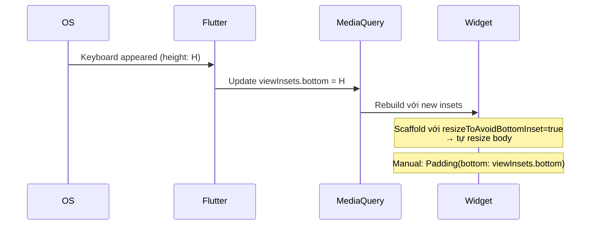

# Bài 9.4 — Keyboard Insets & Custom Input

## Phần 1 — Khái Niệm & Mục Tiêu Bài Học

### Tại sao bài này quan trọng?

Keyboard che khuất input fields là một trong những UX bugs phổ biến nhất trên mobile. Ngoài ra, nhiều ứng dụng cần custom input controls (date picker, star rating, dropdown) integrate với Form validation.

```dart
// Keyboard xuất hiện → viewInsets.bottom tăng
// Phải pad content để không bị che
MediaQuery.of(context).viewInsets.bottom
```

### Bạn sẽ hiểu được sau bài này:
- `MediaQuery.viewInsets.bottom`: tránh keyboard overlap
- `resizeToAvoidBottomInset`: cài đặt Scaffold
- Custom `FormField<T>` cho date picker, dropdown, rating widget

---

## Phần 2 — Cơ Chế Hoạt Động (Under the Hood)

### Keyboard Insets Flow



---

## Phần 3 — Code Mẫu Chuẩn Google

### 3.1 — Scaffold resizeToAvoidBottomInset

```dart
// Cách 1: resizeToAvoidBottomInset (mặc định: true)
// Scaffold tự động resize body khi keyboard xuất hiện
Scaffold(
  resizeToAvoidBottomInset: true, // DEFAULT: true
  body: Column(
    children: [
      Expanded(child: ContentWidget()),
      TextField(...), // TextField ở cuối → scroll lên khi keyboard xuất hiện
    ],
  ),
)

// Cách 2: Manual padding với viewInsets
// Dùng khi resizeToAvoidBottomInset không đủ (e.g., BottomSheet, overlay)
class ManualKeyboardAwareWidget extends StatelessWidget {
  @override
  Widget build(BuildContext context) {
    final bottomInset = MediaQuery.of(context).viewInsets.bottom;

    return Padding(
      // Pad bottom bằng keyboard height để content không bị che
      padding: EdgeInsets.only(bottom: bottomInset),
      child: Column(
        children: [
          const Expanded(child: ContentWidget()),
          TextField(/* ... */),
        ],
      ),
    );
  }
}
```

### 3.2 — Bottom Sheet với keyboard handling

```dart
class CommentBottomSheet extends StatefulWidget {
  const CommentBottomSheet({super.key});
  @override State<CommentBottomSheet> createState() => _CommentBottomSheetState();
}

class _CommentBottomSheetState extends State<CommentBottomSheet> {
  final _controller = TextEditingController();
  final _focusNode = FocusNode();

  @override
  void initState() {
    super.initState();
    // Auto-focus khi bottom sheet mở → keyboard tự hiện
    WidgetsBinding.instance.addPostFrameCallback((_) {
      _focusNode.requestFocus();
    });
  }

  @override
  void dispose() {
    _controller.dispose();
    _focusNode.dispose();
    super.dispose();
  }

  @override
  Widget build(BuildContext context) {
    // viewInsets.bottom = keyboard height (0 khi keyboard ẩn)
    final keyboardHeight = MediaQuery.of(context).viewInsets.bottom;

    return Container(
      padding: EdgeInsets.fromLTRB(
        16,
        16,
        16,
        16 + keyboardHeight, // Đẩy content lên trên keyboard
      ),
      decoration: const BoxDecoration(
        color: Colors.white,
        borderRadius: BorderRadius.vertical(top: Radius.circular(16)),
      ),
      child: Row(
        children: [
          Expanded(
            child: TextField(
              controller: _controller,
              focusNode: _focusNode,
              decoration: InputDecoration(
                hintText: 'Nhập bình luận...',
                border: OutlineInputBorder(
                  borderRadius: BorderRadius.circular(24),
                ),
                contentPadding: const EdgeInsets.symmetric(
                  horizontal: 16,
                  vertical: 8,
                ),
              ),
              maxLines: null, // Multi-line tự động expand
              textInputAction: TextInputAction.send,
              onSubmitted: (_) => _submit(),
            ),
          ),
          const SizedBox(width: 8),
          IconButton.filled(
            icon: const Icon(Icons.send),
            onPressed: _submit,
          ),
        ],
      ),
    );
  }

  void _submit() {
    if (_controller.text.trim().isEmpty) return;
    Navigator.pop(context, _controller.text.trim());
  }
}
```

### 3.3 — Custom FormField — Star Rating

```dart
// Custom FormField: integrate với Form validation
class StarRatingFormField extends FormField<int> {
  StarRatingFormField({
    super.key,
    super.initialValue = 0,
    super.validator,
    super.onSaved,
    int maxStars = 5,
    String? label,
  }) : super(
          builder: (FormFieldState<int> state) {
            return Column(
              crossAxisAlignment: CrossAxisAlignment.start,
              children: [
                if (label != null)
                  Padding(
                    padding: const EdgeInsets.only(bottom: 8),
                    child: Text(label),
                  ),
                // Rating widget
                Row(
                  mainAxisSize: MainAxisSize.min,
                  children: List.generate(maxStars, (i) {
                    final starValue = i + 1;
                    return GestureDetector(
                      onTap: () => state.didChange(starValue),
                      child: Icon(
                        (state.value ?? 0) >= starValue
                            ? Icons.star
                            : Icons.star_border,
                        color: (state.value ?? 0) >= starValue
                            ? Colors.amber
                            : Colors.grey,
                        size: 36,
                      ),
                    );
                  }),
                ),
                // Error message (giống TextFormField)
                if (state.hasError)
                  Padding(
                    padding: const EdgeInsets.only(top: 4, left: 4),
                    child: Text(
                      state.errorText!,
                      style: TextStyle(
                        color: Theme.of(state.context).colorScheme.error,
                        fontSize: 12,
                      ),
                    ),
                  ),
              ],
            );
          },
        );
}

// Sử dụng trong Form:
StarRatingFormField(
  label: 'Đánh giá sản phẩm',
  validator: (value) {
    if (value == null || value == 0) return 'Vui lòng đánh giá';
    return null;
  },
  onSaved: (value) => _savedRating = value,
),
```

### 3.4 — Custom FormField — Date Picker

```dart
class DatePickerFormField extends FormField<DateTime> {
  final String label;

  DatePickerFormField({
    super.key,
    required this.label,
    super.initialValue,
    super.validator,
    super.onSaved,
    DateTime? firstDate,
    DateTime? lastDate,
  }) : super(
          builder: (FormFieldState<DateTime> state) {
            return InkWell(
              onTap: () async {
                final picked = await showDatePicker(
                  context: state.context,
                  initialDate: state.value ?? DateTime.now(),
                  firstDate: firstDate ?? DateTime(1900),
                  lastDate: lastDate ?? DateTime(2100),
                );
                if (picked != null) state.didChange(picked);
              },
              child: InputDecorator(
                decoration: InputDecoration(
                  labelText: label,
                  border: const OutlineInputBorder(),
                  errorText: state.errorText,
                  suffixIcon: const Icon(Icons.calendar_today),
                ),
                child: Text(
                  state.value != null
                      ? '${state.value!.day}/${state.value!.month}/${state.value!.year}'
                      : 'Chọn ngày',
                  style: state.value == null
                      ? const TextStyle(color: Colors.grey)
                      : null,
                ),
              ),
            );
          },
        );
}

// Sử dụng:
DatePickerFormField(
  label: 'Ngày sinh',
  lastDate: DateTime.now(),
  validator: (value) => value == null ? 'Vui lòng chọn ngày sinh' : null,
  onSaved: (value) => _savedBirthDate = value,
),
```

---

## Phần 4 — Lỗi Sai Phổ Biến & Best Practices

### ❌ Anti-pattern 1: Hardcode bottom padding

```dart
// ❌ Không adaptive: keyboard height thay đổi theo device/keyboard type
Padding(padding: const EdgeInsets.only(bottom: 300), child: ...)

// ✅ Dynamic padding từ MediaQuery
Padding(
  padding: EdgeInsets.only(bottom: MediaQuery.of(context).viewInsets.bottom),
  child: ...,
)
```

### ❌ Anti-pattern 2: resizeToAvoidBottomInset=false mà không handle manual

```dart
// ❌ Content bị che khi keyboard xuất hiện
Scaffold(
  resizeToAvoidBottomInset: false, // Tắt auto-resize
  body: TextField(...), // Keyboard che TextField!
)

// ✅ Nếu cần tắt: phải handle manual
Scaffold(
  resizeToAvoidBottomInset: false,
  body: AnimatedPadding(
    duration: const Duration(milliseconds: 200),
    padding: EdgeInsets.only(
      bottom: MediaQuery.of(context).viewInsets.bottom,
    ),
    child: TextField(...),
  ),
)
```

---

## Phần 5 — Bài Tập Củng Cố Tư Duy

### Challenge: Product Review Form

**Yêu cầu:**
1. `StarRatingFormField` (1-5 sao, required)
2. `TextFormField` title (required, max 50 chars, còn lại character count)
3. `TextFormField` description (optional, max 500 chars, multiline)
4. `DatePickerFormField` purchase date (required, không được là tương lai)
5. Submit với tất cả validation
6. Khi keyboard mở: form scroll lên, không bị che

**Gợi ý:**
- `SingleChildScrollView` + `resizeToAvoidBottomInset: true`
- Character count bằng `controller.addListener`
- `DatePickerFormField.lastDate: DateTime.now()`

### Câu hỏi phỏng vấn liên quan:

1. **"MediaQuery.viewInsets vs viewPadding vs padding?"**
   - `viewInsets`: phần bị che bởi system UI (keyboard, notification bar)
   - `viewPadding`: safe area padding (notch, status bar)
   - `padding`: phần không bị che (viewPadding - viewInsets)

2. **"Khi nào dùng resizeToAvoidBottomInset=false?"**
   - Khi Scaffold body tự handle keyboard (e.g., custom scroll + padding)
   - Khi không muốn layout shift khi keyboard xuất hiện

3. **"FormField<T>.didChange() dùng để làm gì?"**
   - Notify Form rằng value đã thay đổi
   - Trigger revalidation nếu autovalidateMode bật
   - Update `FormFieldState.value`
