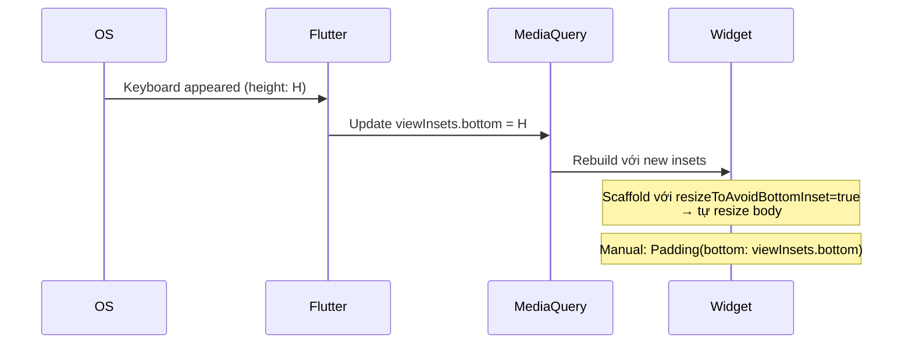

# Bài 9.4 — Keyboard Insets & Custom Input

## Phần 1 — Khái Niệm & Mục Tiêu Bài Học

### Tại sao bài này quan trọng?

Keyboard che khuất input fields là một trong những UX bugs phổ biến nhất trên mobile. Ngoài ra, nhiều ứng dụng cần custom input controls (date picker, star rating, dropdown) integrate với Form validation.

```dart
// Keyboard xuất hiện → viewInsets.bottom tăng
// Phải pad content để không bị che
MediaQuery.of(context).viewInsets.bottom
```

### Bạn sẽ hiểu được sau bài này:
- `MediaQuery.viewInsets.bottom`: tránh keyboard overlap
- `resizeToAvoidBottomInset`: cài đặt Scaffold
- Custom `FormField<T>` cho date picker, dropdown, rating widget

---

## Phần 2 — Cơ Chế Hoạt Động (Under the Hood)

### Keyboard Insets Flow



---

## Phần 3 — Code Mẫu Chuẩn Google

### 3.1 — Scaffold resizeToAvoidBottomInset

```dart
// Cách 1: resizeToAvoidBottomInset (mặc định: true)
// Scaffold tự động resize body khi keyboard xuất hiện
Scaffold(
  resizeToAvoidBottomInset: true, // DEFAULT: true
  body: Column(
    children: [
      Expanded(child: ContentWidget()),
      TextField(...), // TextField ở cuối → scroll lên khi keyboard xuất hiện
    ],
  ),
)

// Cách 2: Manual padding với viewInsets
// Dùng khi resizeToAvoidBottomInset không đủ (e.g., BottomSheet, overlay)
class ManualKeyboardAwareWidget extends StatelessWidget {
  @override
  Widget build(BuildContext context) {
    final bottomInset = MediaQuery.of(context).viewInsets.bottom;

    return Padding(
      // Pad bottom bằng keyboard height để content không bị che
      padding: EdgeInsets.only(bottom: bottomInset),
      child: Column(
        children: [
          const Expanded(child: ContentWidget()),
          TextField(/* ... */),
        ],
      ),
    );
  }
}
```

### 3.2 — Bottom Sheet với keyboard handling

```dart
class CommentBottomSheet extends StatefulWidget {
  const CommentBottomSheet({super.key});
  @override State<CommentBottomSheet> createState() => _CommentBottomSheetState();
}

class _CommentBottomSheetState extends State<CommentBottomSheet> {
  final _controller = TextEditingController();
  final _focusNode = FocusNode();

  @override
  void initState() {
    super.initState();
    // Auto-focus khi bottom sheet mở → keyboard tự hiện
    WidgetsBinding.instance.addPostFrameCallback((_) {
      _focusNode.requestFocus();
    });
  }

  @override
  void dispose() {
    _controller.dispose();
    _focusNode.dispose();
    super.dispose();
  }

  @override
  Widget build(BuildContext context) {
    // viewInsets.bottom = keyboard height (0 khi keyboard ẩn)
    final keyboardHeight = MediaQuery.of(context).viewInsets.bottom;

    return Container(
      padding: EdgeInsets.fromLTRB(
        16,
        16,
        16,
        16 + keyboardHeight, // Đẩy content lên trên keyboard
      ),
      decoration: const BoxDecoration(
        color: Colors.white,
        borderRadius: BorderRadius.vertical(top: Radius.circular(16)),
      ),
      child: Row(
        children: [
          Expanded(
            child: TextField(
              controller: _controller,
              focusNode: _focusNode,
              decoration: InputDecoration(
                hintText: 'Nhập bình luận...',
                border: OutlineInputBorder(
                  borderRadius: BorderRadius.circular(24),
                ),
                contentPadding: const EdgeInsets.symmetric(
                  horizontal: 16,
                  vertical: 8,
                ),
              ),
              maxLines: null, // Multi-line tự động expand
              textInputAction: TextInputAction.send,
              onSubmitted: (_) => _submit(),
            ),
          ),
          const SizedBox(width: 8),
          IconButton.filled(
            icon: const Icon(Icons.send),
            onPressed: _submit,
          ),
        ],
      ),
    );
  }

  void _submit() {
    if (_controller.text.trim().isEmpty) return;
    Navigator.pop(context, _controller.text.trim());
  }
}
```

### 3.3 — Custom FormField — Star Rating

```dart
// Custom FormField: integrate với Form validation
class StarRatingFormField extends FormField<int> {
  StarRatingFormField({
    super.key,
    super.initialValue = 0,
    super.validator,
    super.onSaved,
    int maxStars = 5,
    String? label,
  }) : super(
          builder: (FormFieldState<int> state) {
            return Column(
              crossAxisAlignment: CrossAxisAlignment.start,
              children: [
                if (label != null)
                  Padding(
                    padding: const EdgeInsets.only(bottom: 8),
                    child: Text(label),
                  ),
                // Rating widget
                Row(
                  mainAxisSize: MainAxisSize.min,
                  children: List.generate(maxStars, (i) {
                    final starValue = i + 1;
                    return GestureDetector(
                      onTap: () => state.didChange(starValue),
                      child: Icon(
                        (state.value ?? 0) >= starValue
                            ? Icons.star
                            : Icons.star_border,
                        color: (state.value ?? 0) >= starValue
                            ? Colors.amber
                            : Colors.grey,
                        size: 36,
                      ),
                    );
                  }),
                ),
                // Error message (giống TextFormField)
                if (state.hasError)
                  Padding(
                    padding: const EdgeInsets.only(top: 4, left: 4),
                    child: Text(
                      state.errorText!,
                      style: TextStyle(
                        color: Theme.of(state.context).colorScheme.error,
                        fontSize: 12,
                      ),
                    ),
                  ),
              ],
            );
          },
        );
}

// Sử dụng trong Form:
StarRatingFormField(
  label: 'Đánh giá sản phẩm',
  validator: (value) {
    if (value == null || value == 0) return 'Vui lòng đánh giá';
    return null;
  },
  onSaved: (value) => _savedRating = value,
),
```

### 3.4 — Custom FormField — Date Picker

```dart
class DatePickerFormField extends FormField<DateTime> {
  final String label;

  DatePickerFormField({
    super.key,
    required this.label,
    super.initialValue,
    super.validator,
    super.onSaved,
    DateTime? firstDate,
    DateTime? lastDate,
  }) : super(
          builder: (FormFieldState<DateTime> state) {
            return InkWell(
              onTap: () async {
                final picked = await showDatePicker(
                  context: state.context,
                  initialDate: state.value ?? DateTime.now(),
                  firstDate: firstDate ?? DateTime(1900),
                  lastDate: lastDate ?? DateTime(2100),
                );
                if (picked != null) state.didChange(picked);
              },
              child: InputDecorator(
                decoration: InputDecoration(
                  labelText: label,
                  border: const OutlineInputBorder(),
                  errorText: state.errorText,
                  suffixIcon: const Icon(Icons.calendar_today),
                ),
                child: Text(
                  state.value != null
                      ? '${state.value!.day}/${state.value!.month}/${state.value!.year}'
                      : 'Chọn ngày',
                  style: state.value == null
                      ? const TextStyle(color: Colors.grey)
                      : null,
                ),
              ),
            );
          },
        );
}

// Sử dụng:
DatePickerFormField(
  label: 'Ngày sinh',
  lastDate: DateTime.now(),
  validator: (value) => value == null ? 'Vui lòng chọn ngày sinh' : null,
  onSaved: (value) => _savedBirthDate = value,
),
```

---

## Phần 4 — Lỗi Sai Phổ Biến & Best Practices

### ❌ Anti-pattern 1: Hardcode bottom padding

```dart
// ❌ Không adaptive: keyboard height thay đổi theo device/keyboard type
Padding(padding: const EdgeInsets.only(bottom: 300), child: ...)

// ✅ Dynamic padding từ MediaQuery
Padding(
  padding: EdgeInsets.only(bottom: MediaQuery.of(context).viewInsets.bottom),
  child: ...,
)
```

### ❌ Anti-pattern 2: resizeToAvoidBottomInset=false mà không handle manual

```dart
// ❌ Content bị che khi keyboard xuất hiện
Scaffold(
  resizeToAvoidBottomInset: false, // Tắt auto-resize
  body: TextField(...), // Keyboard che TextField!
)

// ✅ Nếu cần tắt: phải handle manual
Scaffold(
  resizeToAvoidBottomInset: false,
  body: AnimatedPadding(
    duration: const Duration(milliseconds: 200),
    padding: EdgeInsets.only(
      bottom: MediaQuery.of(context).viewInsets.bottom,
    ),
    child: TextField(...),
  ),
)
```

---

## Phần 5 — Bài Tập Củng Cố Tư Duy

### Challenge: Product Review Form

**Yêu cầu:**
1. `StarRatingFormField` (1-5 sao, required)
2. `TextFormField` title (required, max 50 chars, còn lại character count)
3. `TextFormField` description (optional, max 500 chars, multiline)
4. `DatePickerFormField` purchase date (required, không được là tương lai)
5. Submit với tất cả validation
6. Khi keyboard mở: form scroll lên, không bị che

**Gợi ý:**
- `SingleChildScrollView` + `resizeToAvoidBottomInset: true`
- Character count bằng `controller.addListener`
- `DatePickerFormField.lastDate: DateTime.now()`

### Thử Thách Tư Duy & Thẩm Định Chuyên Sâu (Conceptual & Deep-Dive Check)

> **[Junior]** — nắm khái niệm | **[Middle]** — hiểu cơ chế | **[Senior]** — hiểu Flutter internals | **[Trace Code]** — đọc code và dự đoán output

---

#### Q1 [Junior] — "`MediaQuery.viewInsets` vs `viewPadding` vs `padding`?"

**Trả lời chuẩn:**

Ba giá trị này đo **vùng bị che** bởi system UI:

| Property | Bị che bởi | Ví dụ |
|---|---|---|
| `viewInsets` | System UI che và chiếm space | Keyboard, bottom navigation bar |
| `viewPadding` | System UI phần cứng (không thể vẽ qua) | Notch, rounded corners, status bar |
| `padding` | Intersection = viewPadding - viewInsets | Safe area thực sự |

```dart
// Keyboard height
final keyboardHeight = MediaQuery.of(context).viewInsets.bottom;

// Notch + status bar height
final statusBarHeight = MediaQuery.of(context).viewPadding.top;

// Safe area không bị keyboard che (khi keyboard hiện)
final safeBottom = MediaQuery.of(context).padding.bottom;
// = max(viewPadding.bottom - viewInsets.bottom, 0)

// Example khi keyboard xuất hiện (height=300px):
// viewInsets.bottom = 300 (keyboard)
// viewPadding.bottom = 34 (home indicator on iPhone)
// padding.bottom = max(34 - 300, 0) = 0 (keyboard che cả home indicator)
```

---

#### Q2 [Junior] — "Khi nào dùng `resizeToAvoidBottomInset=false`? Hậu quả?"

**Trả lời chuẩn:**

`Scaffold.resizeToAvoidBottomInset` (mặc định `true`) làm Scaffold shrink body khi keyboard xuất hiện — tạo space cho keyboard.

**Khi dùng `false`:**
```dart
// Keyboard overlay lên content — không resize Scaffold
Scaffold(
  resizeToAvoidBottomInset: false,
  body: Stack(children: [
    // Background map/image không bị resize
    const MapView(),
    // Input ở bottom, tự handle keyboard offset
    Positioned(
      bottom: 0,
      left: 0, right: 0,
      child: Builder(builder: (ctx) {
        final keyboardHeight = MediaQuery.viewInsetsOf(ctx).bottom;
        return AnimatedPadding(
          duration: const Duration(milliseconds: 200),
          padding: EdgeInsets.only(bottom: keyboardHeight),
          child: const SearchBar(),
        );
      }),
    ),
  ]),
)
```

**Dùng `false` khi:**
- Background không nên bị resize (full-screen map, camera preview)
- Bạn tự handle keyboard offset với Padding/AnimatedPadding
- Bottom sheet tự xử lý keyboard insets

**Không dùng `false` cho normal forms** — content sẽ bị keyboard che.

---

#### Q3 [Middle] — "`FormField<T>.didChange()` dùng để làm gì? Khác `setState()` thế nào?"

**Trả lời chuẩn:**

`FormFieldState.didChange(T? value)` là method để **notify Form** rằng value đã thay đổi trong custom FormField:

```dart
// Trong custom FormField builder:
builder: (FormFieldState<DateTime> state) {
  return InkWell(
    onTap: () async {
      final picked = await showDatePicker(...);
      if (picked != null) {
        state.didChange(picked); // ← notify Form
        // didChange() làm:
        // 1. state._value = picked (update internal value)
        // 2. setState() để rebuild builder
        // 3. Nếu autovalidateMode on → trigger revalidation
        // 4. Form được notified via InheritedWidget
      }
    },
    child: Text(state.value?.toString() ?? 'Select'),
  );
}
```

**Khác với `setState()` thông thường:**
- `setState()` chỉ rebuild widget — không notify Form về value change
- `didChange()` update value + rebuild + notify Form + trigger validation

```dart
// ❌ Chỉ setState → Form.save() không có giá trị mới
onTap: () async {
  final picked = await showDatePicker(...);
  setState(() { _localDate = picked; }); // Form không biết!
}

// ✅ didChange → Form được notify
onTap: () async {
  final picked = await showDatePicker(...);
  if (picked != null) state.didChange(picked); // Form biết!
}
```

---

#### Q4 [Senior] — "Keyboard inset flow: từ `FocusNode.requestFocus()` đến `Scaffold` resize, các step là gì?"

**Trả lời chuẩn:**

```
FocusNode.requestFocus()
  ↓
FocusManager: focus node receives focus
  ↓
TextInputConnection.attach() — platform channel
  ↓
SystemChannels.textInput.invokeMethod('TextInput.show')
  ↓
Platform (iOS/Android) shows keyboard
  ↓
Platform sends WindowInsets update → Flutter engine
  ↓
FlutterView.metrics.viewInsets updated
  ↓
MediaQueryData.viewInsets.bottom = keyboardHeight (e.g., 320px)
  ↓
MediaQuery InheritedWidget: updateShouldNotify() = true
  ↓
All widgets using MediaQuery.of(context).viewInsets rebuild
  ↓ (if resizeToAvoidBottomInset=true)
Scaffold._ScaffoldLayout receives new MediaQuery
  ↓
Scaffold resizes body: height = screen_height - keyboard_height
  ↓
SingleChildScrollView / ListView: scrolls active field into view
```

**Animation:** Keyboard slide up không phải 1 frame — platform gửi series of inset updates trong ~300ms animation. Flutter nhận mỗi update → rebuild → animated resize (appears smooth even without explicit animation).

---

#### Q5 [Middle] — "`SingleChildScrollView` + `viewInsets` pattern: tại sao đây là cách chuẩn cho keyboard avoidance?"

**Trả lời chuẩn:**

Pattern chuẩn cho form tránh keyboard:

```dart
Scaffold(
  // resizeToAvoidBottomInset: true (default) — Scaffold shrink body
  body: SingleChildScrollView(
    child: Padding(
      // Thêm padding ở bottom = keyboard height
      // Khi keyboard không hiện: padding.bottom = 0
      // Khi keyboard hiện: padding.bottom = keyboard height
      padding: EdgeInsets.only(
        bottom: MediaQuery.of(context).viewInsets.bottom,
      ),
      child: Column(
        children: [
          // Form fields...
          const TextField(),
          const TextField(),
          const TextField(),
          // Content bên dưới keyboard sẽ scroll được
        ],
      ),
    ),
  ),
)
```

**Tại sao hoạt động:**
1. `resizeToAvoidBottomInset: true` → Scaffold body shrinks khi keyboard hiện
2. `SingleChildScrollView` → cho phép scroll nội dung
3. `padding.bottom = viewInsets.bottom` → tạo space ở bottom để field cuối cùng scroll vào view được
4. Khi focus vào TextField ở bottom → Flutter tự scroll để TextField visible

**Tại sao không dùng `resizeToAvoidBottomInset: true` một mình:** Nếu form dài hơn remaining space (sau keyboard) → content bị clip. `SingleChildScrollView` làm content scrollable.

---

#### Q6 [Middle] — "Tại sao cần `SafeArea` wrap content? Khi nào không cần?"

**Trả lời chuẩn:**

`SafeArea` thêm padding để tránh system UI:

```dart
// SafeArea — tự động add padding tương ứng với notch/home indicator
SafeArea(
  child: Column(children: [
    const Text('Content'),
  ]),
)
// Equivalent to:
Padding(
  padding: MediaQuery.of(context).padding, // safe area insets
  child: Column(children: [...]),
)
```

**Khi cần SafeArea:**
- Content trực tiếp trong Scaffold body (không có AppBar)
- Bottom content bị che bởi home indicator (iPhone)
- Bên trong drawer, bottom sheet nếu content gần edge

**Khi KHÔNG cần SafeArea:**
- Scaffold với AppBar — AppBar tự handle top safe area
- Scaffold với `bottomNavigationBar` — BottomNavigationBar tự handle bottom
- Content không gần physical edges (content trong card, dialog)

```dart
// ✅ Không cần SafeArea — Scaffold handles it
Scaffold(
  appBar: AppBar(title: const Text('Title')), // tự handle top
  bottomNavigationBar: BottomNavigationBar(...), // tự handle bottom
  body: const Center(child: Text('Content')), // content ở giữa, không gần edge
)

// ✅ Cần SafeArea — custom full-screen widget
Scaffold(
  body: SafeArea( // cần khi không có AppBar
    child: const CustomContent(),
  ),
)
```

---

#### Q7 [Trace Code] — "`MediaQuery.viewInsets.bottom` trước và sau khi keyboard xuất hiện: rebuild nào xảy ra?"

```dart
class KeyboardPage extends StatelessWidget {
  const KeyboardPage({super.key});
  
  @override
  Widget build(BuildContext context) {
    final insets = MediaQuery.of(context).viewInsets; // (A) full MediaQueryData
    print('Page rebuild: insets.bottom=${insets.bottom}');
    
    return Scaffold(
      body: Column(
        children: [
          Builder(builder: (ctx) {
            final insets2 = MediaQuery.viewInsetsOf(ctx); // (B) fine-grained
            print('Builder rebuild: insets.bottom=${insets2.bottom}');
            return Padding(
              padding: EdgeInsets.only(bottom: insets2.bottom),
              child: const Text('Content'),
            );
          }),
          const TextField(), // focus → keyboard appears
        ],
      ),
    );
  }
}
```

**Khi TextField được focus → keyboard xuất hiện (height=300px):**

**`(A)` dùng `MediaQuery.of(context)`:**
```
// Page rebuild (full MediaQueryData thay đổi):
Page rebuild: insets.bottom=300
Builder rebuild: insets.bottom=300
```
→ **Toàn bộ `KeyboardPage.build()` được gọi lại** vì `MediaQuery.of(context)` register dependency vào toàn bộ `MediaQueryData`. Bất kỳ field nào thay đổi (viewInsets, size, orientation) → rebuild.

**`(B)` nếu thay `(A)` bằng `MediaQuery.viewInsetsOf(context)`:**
```
// Chỉ nếu viewInsets thay đổi → rebuild (fine-grained)
Page rebuild: insets.bottom=300
Builder rebuild: insets.bottom=300
```
Khi chỉ orientation thay đổi (không phải keyboard) và code dùng `MediaQuery.viewInsetsOf`:
- `(A)` thuần: cả Page rebuild (viewInsets không đổi nhưng size thay đổi → full MediaQueryData thay đổi)
- `(B)` viewInsetsOf: Builder **KHÔNG rebuild** (viewInsets không thay đổi khi chỉ xoay màn hình)

**Lesson:** Dùng fine-grained `MediaQuery.*Of()` (Flutter 3.10+) để giảm unnecessary rebuilds.
