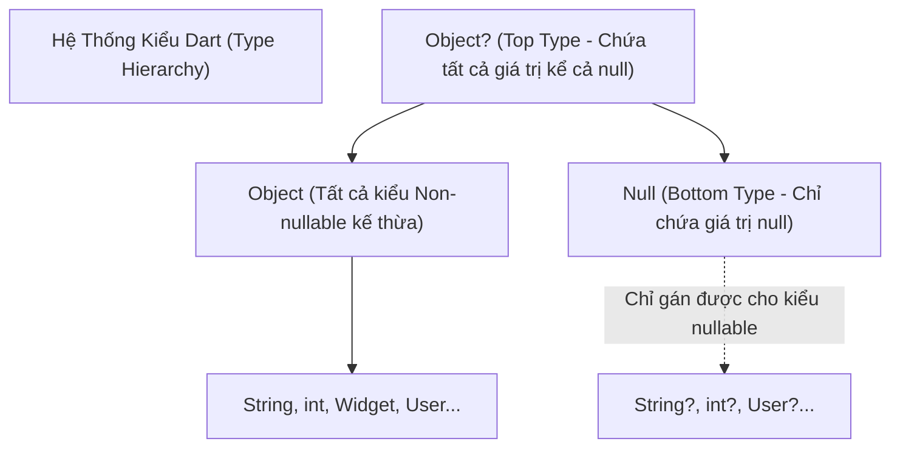

# Chuyên Đề 01 - Bài 01: Sound Null Safety & Hệ Thống Kiểu Trong Dart 3

> **Trọng tâm**: Cơ chế Sound Null Safety, Flow Analysis, Type Promotion, Cạm bẫy toán tử bang (`!`), Late Initialization (`late`), Kỹ thuật phòng thủ lỗi Null runtime, và bộ câu hỏi thẩm định năng lực kỹ thuật chuyên sâu.

---

## 1. Bản Chất Của Sound Null Safety (Hệ Thống Null Safety Tuyệt Đối)

Trước Dart 2.12, biến số có thể mang giá trị `null` bất kỳ lúc nào, dẫn đến lỗi kinh điển `NoSuchMethodError: The method '...' was called on null` khiến ứng dụng Flutter văng (crash) ngay lập tức tại runtime.

Kể từ Dart 3, Dart áp dụng **Sound Null Safety 100%**:
- **Soundness (Tính tuyệt đối)**: Nếu một biến được khai báo không cho phép null (`String name`), Dart compiler và runtime **đảm bảo 100%** biến đó không bao giờ có thể là `null`.
- **Tối ưu hóa hiệu năng**: Trình biên dịch AOT không cần sinh thêm các lệnh kiểm tra `null check` ngầm trong mã máy, giúp kích thước file APK/IPA nhỏ hơn và ứng dụng chạy nhanh hơn.



### So Sánh: `Object?` vs `dynamic` vs `void`

| Kiểu Dữ Liệu | Type Safety (Kiểm tra tĩnh) | Chấp nhận `null`? | Khi Nào Sử Dụng? |
| :--- | :--- | :--- | :--- |
| **`Object?`** | **Có (An toàn 100%)**. Muốn gọi hàm phải ép kiểu hoặc kiểm tra type (`is`). | Có | Khi hàm chấp nhận bất kỳ kiểu dữ liệu nào nhưng muốn an toàn (ví dụ: `Map<String, Object?>`). |
| **`dynamic`** | **Không (Tắt kiểm tra tĩnh)**. Cho phép gọi bất kỳ hàm nào, lỗi xảy ra ở runtime nếu không tồn tại. | Có | Chỉ dùng ở ranh giới ngoài cùng: parse JSON thô (`Map<String, dynamic>`), hoặc tương tác Platform Channel. |
| **`void`** | Có | Có | Chỉ dùng để khai báo kiểu trả về của hàm không cần kết quả (hàm thủ tục). |

---

## 2. Bảng Ký Hiệu & Toán Tử Xử Lý Null Trong Thực Tế

| Toán Tử | Tên Gọi | Ý Nghĩa Thực Tế | Khi Nào Sử Dụng? | Cạm Bẫy |
| :--- | :--- | :--- | :--- | :--- |
| `Type?` | **Nullable Type** | Khai báo biến có thể nhận giá trị `null`. | Khi dữ liệu từ API hoặc State có thể rỗng. | Cần kiểm tra trước khi gọi hàm. |
| `?.` | **Null-aware Operator** | Chỉ gọi thuộc tính/phương thức nếu đối tượng khác `null`. | `user?.profile?.avatarUrl` | Trả về `null` nếu chuỗi bị đứt đoạn. |
| `?..` | **Null-aware Cascade** | Chỉ thực thi chuỗi cascade nếu đối tượng khác `null`. | `user?..setName('A')..save();` | Ít dùng, cần hiểu để đọc code SDK. |
| `?[]` | **Null-aware Index** | Chỉ truy cập phần tử mảng/map nếu collection khác `null`. | `items?[0]`, `data?['key']` | Trả về `null` nếu mảng là null. |
| `??` | **If-null (Coalescing)** | Trả về vế phải nếu vế trái là `null`. | Cung cấp giá trị mặc định: `username ?? 'Khách'` | Không bắt được chuỗi rỗng `""`. |
| `??=` | **Null-aware Assignment** | Chỉ gán giá trị nếu biến hiện tại đang là `null`. | Lazy loading cache: `_cache ??= loadData()` | Biến phải là mutable (không dùng được với `final`). |
| `!` | **Null Assertion (Bang)** | Ép kiểu ép buộc: "Tôi cam đoan biến này KHÔNG null". | Hạn chế tối đa; chỉ dùng khi compiler không suy luận được. | **Nguy cơ crash app 100%** nếu biến thực sự là `null`. |
| `late` | **Late Initialization** | Trì hoãn gán giá trị, kiểm tra khởi tạo tại runtime. | Biến phụ thuộc vào `initState()` hoặc Controller. | Quên khởi tạo sẽ gây `LateInitializationError`. |

---

## 3. Phân Tích Dòng Chảy (Flow Analysis) & Type Promotion

Dart có trình phân tích tĩnh thông minh gọi là **Flow Analysis**. Khi bạn kiểm tra `!= null`, Dart tự động thăng hạng (**promote**) biến từ `Type?` thành `Type` bên trong khối lệnh đó:

```dart
class UserBadge extends StatelessWidget {
  final String? userName;

  const UserBadge({super.key, this.userName});

  @override
  Widget build(BuildContext context) {
    // userName ở đây có kiểu String?
    if (userName != null) {
      // Bên trong khối IF: Dart tự động thăng hạng userName thành String (Non-nullable)
      return Text('Xin chào, ${userName.toUpperCase()}'); 
    }

    return const Text('Xin chào, Quý khách');
  }
}
```

### ⚠️ Tại Sao Field Của Class Không Được Tự Động Promote?

```dart
class _ProfileScreenState extends State<ProfileScreen> {
  String? _avatarUrl;

  void _loadData() {
    if (_avatarUrl != null) {
      // ❌ LỖI COMPILER nếu _avatarUrl là getter hoặc field có thể bị override:
      // Dart lo sợ một thread khác hoặc getter động có thể trả về null ngay sau đó!
      print(_avatarUrl.length); // Lỗi: The property 'length' can't be unconditionally accessed
    }
  }
}
```

### ✅ Giải Pháp Chuẩn Google: Kỹ Thuật Shadowing Biến Cục Bộ
Chỉ cần gán field vào một biến cục bộ (`local variable`), Dart có thể đảm bảo biến cục bộ đó không bị thay đổi ngầm:

```dart
void _loadData() {
  final avatar = _avatarUrl; // Tạo biến cục bộ (Local Shadow)
  if (avatar != null) {
    // avatar được promote thành String tuyệt đối an toàn 100%
    print(avatar.length);
  }
}
```

---

## 4. `late` vs Nullable: Sử Dụng Đúng Hoàn Cảnh

```dart
class OrderController {
  // ❌ NGUY HIỂM: Nếu gọi placeOrder() trước khi fetchData() hoàn tất,
  // ứng dụng sẽ crash với LateInitializationError.
  late String _orderId;

  Future<void> fetchData() async {
    _orderId = await api.getOrderId();
  }

  void placeOrder() {
    print('Processing order: $_orderId');
  }
}
```

### Khi nào NÊN dùng `late`?
1. **Khởi tạo Controller trong `initState()`**:
   ```dart
   class _SearchScreenState extends State<SearchScreen> {
     late final TextEditingController _controller;
     late final FocusNode _focusNode;

     @override
     void initState() {
       super.initState();
       _controller = TextEditingController();
       _focusNode = FocusNode();
     }

     @override
     void dispose() {
       _controller.dispose();
       _focusNode.dispose();
       super.dispose();
     }
   }
   ```
2. **Khởi tạo trễ tài nguyên nặng (Lazy Initialization)**:
   ```dart
   // _expensiveDatabase chỉ khởi tạo khi có hàm thực sự gọi đến nó lần đầu
   late final DatabaseHelper _db = DatabaseHelper._initHeavyConnection();
   ```

---

## 5. Tham Số Named Constructor: `required` vs Nullable

Trong Flutter, constructor thường nhận các tham số có tên (Named parameters). Hãy phân biệt 3 cách viết sau:

```dart
class CustomCard extends StatelessWidget {
  final String title;
  final String? subtitle;
  final VoidCallback? onTap;

  const CustomCard({
    super.key,
    // 1. BẮT BUỘC TRUYỀN & KHÔNG ĐƯỢC NULL
    required this.title,
    
    // 2. KHÔNG BẮT BUỘC TRUYỀN, NẾU KHÔNG TRUYỀN THÌ LÀ NULL
    this.subtitle,
    
    // 3. BẮT BUỘC TRUYỀN NHƯNG CHO PHÉP TRUYỀN GIÁ TRỊ NULL
    required this.onTap, 
  });
  ...
}
```

> [!NOTE]
> `required String? param` có nghĩa là: Người gọi **bắt buộc phải ghi tên tham số** `onTap: ...`, nhưng giá trị truyền vào có thể là `null` (thường dùng để thể hiện nút bấm bị vô hiệu hóa có chủ đích).

---

## 🎯 6. Thẩm Định Năng Lực & Phân Tích Chuyên Sâu (Technical Competency & Deep Dive)

### Câu hỏi 1: Sự khác nhau bản chất giữa `Object?` và `dynamic` trong hệ thống kiểu của Dart? Khi nào bắt buộc phải dùng `dynamic`?
**Trả lời chuẩn 10/10**:
- **`Object?`** là đỉnh cao nhất của hệ thống phân cấp kiểu trong Dart (Top Type). Nó đại diện cho mọi giá trị có thể tồn tại (kể cả `null`). Trình biên dịch Dart vẫn thực hiện **kiểm tra tĩnh (Static Type Checking)** nghiêm ngặt. Nếu bạn gán `Object? x = "hello";`, bạn **không thể** gọi `x.toUpperCase()` ngay được mà bắt buộc phải kiểm tra kiểu trước (`if (x is String)`).
- **`dynamic`** là một cơ chế báo cho trình biên dịch **tắt hoàn toàn việc kiểm tra kiểu tĩnh**. Trình biên dịch tin tưởng bạn và cho phép gọi bất kỳ hàm/thuộc tính nào trên đối tượng đó (`x.anyMethod()`). Nếu lúc chạy (runtime) đối tượng không có phương thức đó, ứng dụng sẽ crash với `NoSuchMethodError`.
- **Khi nào bắt buộc dùng `dynamic`**: Chỉ nên dùng khi làm việc với dữ liệu không rõ cấu trúc tại thời điểm biên dịch, điển hình là parse JSON (`Map<String, dynamic>`) hoặc nhận dữ liệu qua `MethodChannel` từ mã Native Android/iOS. Mọi trường hợp còn lại nên dùng `Object?` hoặc Generic để đảm bảo an toàn.

---

### Câu hỏi 2: Tại sao toán tử `!` (Null assertion operator) bị coi là "Code Smell" trong các dự án Production? Nếu bắt buộc phải dùng thì quy tắc an toàn là gì?
**Trả lời chuẩn 10/10**:
- Toán tử `!` là một lời tuyên bố mang tính ép buộc của lập trình viên: *"Tôi cam đoan biến này tại thời điểm này không bao giờ là null"*. Tuy nhiên, nếu giả định này sai ở môi trường thực tế (ví dụ: API trả về thiếu trường hoặc mạng chậm), ứng dụng sẽ bị **văng ngay lập tức tại runtime** mà không có bất kỳ cơ chế fallback nào.
- **Quy tắc an toàn**:
  1. Tuyệt đối không dùng `!` trên dữ liệu nhận từ Remote API, Database hoặc User Input.
  2. Chỉ dùng `!` khi có sự đảm bảo về mặt logic toán học mà compiler không đủ thông minh để suy luận (ví dụ: đã kiểm tra `list.isNotEmpty` rồi truy cập `list.first!`).
  3. Trong code UI, luôn thay thế `!` bằng toán tử null-aware `?.` kết hợp giá trị mặc định `??` (ví dụ: `user?.name ?? 'Khách'`).

---

### Câu hỏi 3: Tại sao Dart Flow Analysis không thể tự động thăng hạng (Type Promote) cho một Public/Getter Property của Class?
**Trả lời chuẩn 10/10**:
- Hãy xem xét đoạn code:
  ```dart
  class Box {
    String? name;
  }
  void test(Box box) {
    if (box.name != null) {
      // Dart KHÔNG thể promote box.name thành String!
    }
  }
  ```
- **Lý do kỹ thuật**:
  1. `name` có thể là một **Getter ảo** (getter function) được tính toán động mỗi lần gọi, lần 1 trả về chuỗi, lần 2 trả về `null`.
  2. Trong môi trường kế thừa, một class con có thể override getter `name` để trả về dữ liệu khác.
  3. Không đảm bảo tính bất biến đa luồng hoặc giữa các hàm gọi.
- **Giải pháp**: Gán vào một biến cục bộ (`final name = box.name; if (name != null)`). Vì biến cục bộ là bất biến và không thể bị override, Flow Analysis có thể đảm bảo 100% nó giữ nguyên giá trị không null.
