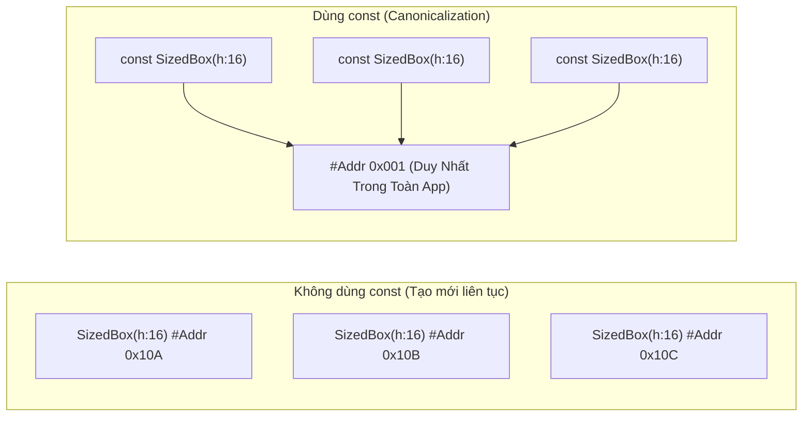

# Chuyên Đề 01 - Bài 02: Classes, Constructors, Mixins & Callable Classes

> **Trọng tâm**: Bản chất của `const constructor` (Canonicalization), Named & Factory Constructors, Initializer List, Mixins trong Flutter, Callable Classes (`call()`), Typedefs, Class Modifiers mới trong Dart 3, và bộ câu hỏi thẩm định năng lực kỹ thuật chuyên sâu.

---

## 1. Tại Sao Flutter Luôn Khuyên Dùng `const Constructor`?

Trong Flutter, hầu hết mọi Widget bạn thấy đều có từ khóa `const`:
```dart
const Text('Xin chào');
const SizedBox(height: 16);
const Padding(padding: EdgeInsets.all(8));
```

### Cơ chế Canonicalization (Hợp nhất đối tượng duy nhất)
Khi bạn khai báo `const`, Dart compiler thực hiện một phép màu gọi là **Canonicalization**:
- Mọi instance `const` có cùng tham số truyền vào đều được lưu trữ tại **duy nhất một ô nhớ (memory location)** trong toàn bộ vòng đời ứng dụng.
- **Bỏ qua Rebuild**: Khi một Widget cha rebuild, nếu Widget con được đánh dấu `const`, Flutter Engine sẽ so sánh địa chỉ bộ nhớ (`identical(oldWidget, newWidget)`). Vì cùng một ô nhớ, Flutter sẽ **bỏ qua hoàn toàn việc build lại widget đó và toàn bộ cây con bên dưới nó**!



### Điều kiện để một Class có `const constructor`:
1. Tất cả các trường dữ liệu (fields) của class **bắt buộc phải là `final`**.
2. Class không được có body trong constructor (không có `{ ... }`).

```dart
class AppButton extends StatelessWidget {
  final String label;
  final VoidCallback? onPressed;
  final Color backgroundColor;

  // ✅ Const constructor hợp lệ
  const AppButton({
    super.key,
    required this.label,
    this.onPressed,
    this.backgroundColor = Colors.blue,
  });

  @override
  Widget build(BuildContext context) {
    return ElevatedButton(
      style: ElevatedButton.styleFrom(backgroundColor: backgroundColor),
      onPressed: onPressed,
      child: Text(label),
    );
  }
}
```

---

## 2. Các Loại Constructor Thực Tế Trong Flutter

### 2.1. Initializer List (Danh sách khởi tạo)
Initializer list chạy **trước khi** body của constructor được thực thi. Đây là nơi bạn validate dữ liệu bằng `assert` hoặc tính toán giá trị cho biến `final`:

```dart
class CircleAvatarWidget extends StatelessWidget {
  final double radius;
  final double diameter;

  // Khởi tạo diameter từ radius trước khi constructor hoàn tất
  CircleAvatarWidget({super.key, required this.radius})
      : assert(radius > 0, 'Bán kính phải lớn hơn 0'),
        diameter = radius * 2;

  @override
  Widget build(BuildContext context) {
    return Container(
      width: diameter,
      height: diameter,
      decoration: const BoxDecoration(shape: BoxShape.circle),
    );
  }
}
```

### 2.2. Named Constructors & Constructor Chaining
Dùng để tạo nhiều cách khởi tạo trực quan cho một Widget, hoặc chuyển hướng đến constructor nội bộ:

```dart
class AppCard extends StatelessWidget {
  final Widget child;
  final Color color;
  final double elevation;

  // Constructor chính
  const AppCard({
    super.key,
    required this.child,
    this.color = Colors.white,
    this.elevation = 2.0,
  });

  // Named Constructor 1: Dạng thông báo lỗi (Chaining về constructor chính)
  const AppCard.error({
    super.key,
    required this.child,
  }) : this(key: key, child: child, color: const Color(0xFFFFEBEE), elevation: 0.0);

  // Named Constructor 2: Dạng phẳng (Flat)
  const AppCard.flat({
    super.key,
    required this.child,
  }) : this(key: key, child: child, color: Colors.transparent, elevation: 0.0);

  @override
  Widget build(BuildContext context) {
    return Card(color: color, elevation: elevation, child: child);
  }
}
```

### 2.3. Factory Constructors (`factory`)
Khác với generative constructor (luôn tạo ra một instance mới của chính class đó), `factory constructor`:
- Có thể **trả về một instance đã có sẵn từ cache** (Singleton Pattern).
- Có thể **trả về một instance của class con** (Subclass Polymorphism).
- Thường dùng trong phương thức parse JSON: `factory User.fromJson(Map<String, dynamic> json)`.

```dart
class ApiClient {
  final String baseUrl;
  static ApiClient? _instance;

  // Private constructor ngăn cản việc new tùy tiện từ bên ngoài
  ApiClient._internal({required this.baseUrl});

  // Factory constructor đảm bảo chỉ tạo duy nhất 1 instance (Singleton)
  factory ApiClient({String baseUrl = 'https://api.example.com'}) {
    _instance ??= ApiClient._internal(baseUrl: baseUrl);
    return _instance!;
  }
}
```

---

## 3. Callable Classes (`call()`) & Typedefs

### 3.1. Callable Class: Biến Object Thành Một Hàm
Bằng cách định nghĩa phương thức `call()`, một đối tượng của class có thể được gọi như một hàm. Đây là mẫu thiết kế kinh điển cho **Use Cases** trong kiến trúc Clean Architecture:

```dart
class GetUserProfileUseCase {
  final UserRepository _repository;
  const GetUserProfileUseCase(this._repository);

  // Định nghĩa hàm call()
  Future<UserProfile> call(String userId) async {
    return await _repository.fetchProfile(userId);
  }
}

// Cách gọi trực tiếp cực kỳ tự nhiên:
void execute(GetUserProfileUseCase getUserProfile) async {
  // Đối tượng được gọi như một hàm!
  final profile = await getUserProfile('user_123');
}
```

### 3.2. `typedef`: Đặt Tên Cho Kiểu Hàm (Function Signatures)
Giúp code dễ đọc khi truyền các callback phức tạp:

```dart
typedef ItemWidgetBuilder<T> = Widget Function(BuildContext context, T item, int index);

class GenericListView<T> extends StatelessWidget {
  final List<T> items;
  final ItemWidgetBuilder<T> builder;

  const GenericListView({super.key, required this.items, required this.builder});

  @override
  Widget build(BuildContext context) {
    return ListView.builder(
      itemCount: items.length,
      itemBuilder: (context, i) => builder(context, items[i], i),
    );
  }
}
```

---

## 4. Mixins & Class Modifiers

### 4.1. Mixins & Từ Khóa `on`
Mixin chia sẻ logic mà không cần kế thừa đơn. Khi dùng từ khóa `on`, mixin chỉ cho phép các class kế thừa một kiểu cụ thể mới được nhúng nó vào:

```dart
// Chỉ cho phép mixin vào các class là State của StatefulWidget:
mixin LifecycleLoggerMixin<T extends StatefulWidget> on State<T> {
  @override
  void initState() {
    super.initState();
    debugPrint('🟢 [Lifecycle] ${widget.runtimeType} -> initState');
  }

  @override
  void dispose() {
    debugPrint('🔴 [Lifecycle] ${widget.runtimeType} -> dispose');
    super.dispose();
  }
}
```

### 4.2. Bảng Class Modifiers Trong Dart 3

| Modifier | Hành vi kế thừa (`extends`) | Thực thi interface (`implements`) | Ứng dụng trong Flutter |
| :--- | :--- | :--- | :--- |
| `abstract class` | Cho phép | Cho phép | Tạo Base Widget hoặc Abstract Repository. |
| `base class` | Cho phép (Chỉ cùng package) | Không cho phép ngoài file | Bảo vệ tính toàn vẹn của implementation. |
| `interface class` | Không cho phép | Cho phép | Tạo hợp đồng thuần túy (Contracts). |
| `sealed class` | Cho phép (Chỉ cùng file) | Cho phép (Chỉ cùng file) | Quản lý UI State chuẩn Exhaustive Pattern Matching. |

---

## 🎯 5. Thẩm Định Năng Lực & Phân Tích Chuyên Sâu (Technical Competency & Deep Dive)

### Câu hỏi 1: Cơ chế Canonicalization của `const constructor` hoạt động như thế nào? Tại sao nó giúp tăng FPS của ứng dụng Flutter?
**Trả lời chuẩn 10/10**:
- **Bản chất**: Trong quá trình biên dịch (Compile-time), Dart thu gom tất cả các đối tượng được khởi tạo với từ khóa `const` có cùng giá trị tham số và lưu vào một bảng định danh duy nhất (Canonical Objects Table) trong bộ nhớ.
- **Tại sao tăng FPS**:
  1. **Giảm áp lực Garbage Collection**: Không tạo ra hàng nghìn object rác khi người dùng cuộn danh sách hoặc rebuild màn hình.
  2. **Tối ưu cây Render**: Khi Widget cha rebuild, Flutter so sánh Widget con cũ và mới. Với `const`, phép kiểm tra `identical(oldWidget, newWidget)` trả về `true` ngay lập tức ở mức con trỏ bộ nhớ (pointer comparison $O(1)$). Flutter sẽ **bỏ qua hoàn toàn việc gọi hàm `build()` của toàn bộ cây con phía dưới**, tiết kiệm chu kỳ CPU quý giá để render 60/120 FPS mượt mà.

---

### Câu hỏi 2: Phân biệt `factory constructor` và Generative constructor. Nêu 2 trường hợp thực tế bắt buộc phải dùng `factory`.
**Trả lời chuẩn 10/10**:
- **Generative Constructor**: Luôn luôn tự động cấp phát và trả về một instance mới tinh của chính class đó.
- **Factory Constructor**: Không tự cấp phát instance mới. Nó có thể chứa logic để quyết định: trả về một instance đã tồn tại sẵn trong cache, trả về instance của một class con (subclass), hoặc thực hiện tính toán tiền xử lý trước khi khởi tạo.
- **2 Trường hợp bắt buộc trong thực tế**:
  1. **Singleton Pattern**: Quản lý một đối tượng duy nhất toàn app (như `ApiClient`, `DatabaseHelper`) bằng cách kiểm tra biến `_instance ??= ...` và trả về instance cũ.
  2. **JSON Deserialization (Polymorphism)**: Khi parse dữ liệu từ API dựa trên trường `type` (ví dụ: `type: "image"` trả về `ImageMessage`, `type: "text"` trả về `TextMessage`). Generative constructor không thể trả về lớp con, chỉ có `factory` mới làm được điều này!

---

### Câu hỏi 3: Phân biệt `mixin`, `abstract class` và `implements`. Khi nào dùng từ khóa `on` trong Mixin?
**Trả lời chuẩn 10/10**:
- **`abstract class`**: Định nghĩa một lớp trừu tượng mà các lớp con kế thừa qua `extends` (chỉ đơn kế thừa - Single Inheritance).
- **`implements`**: Chỉ lấy chữ ký giao diện (Contract/Interface) của class khác mà không tái sử dụng mã nguồn (bắt buộc phải viết lại toàn bộ implementation của mọi hàm).
- **`mixin`**: Cho phép tái sử dụng phần thân thực thi (code implementation) trên nhiều nhánh kế thừa khác nhau (Đa kế thừa hành vi).
- **Từ khóa `on` trong Mixin**: Được dùng để **giới hạn phạm vi áp dụng** của mixin. Nó quy định rằng chỉ những class nào đã kế thừa class chỉ định thì mới được `with` mixin này. Điều này cho phép bên trong mixin có thể truy cập hợp lệ các thuộc tính/hàm của class cơ sở đó (ví dụ: `on State<T>` cho phép mixin gọi được `setState`, `mounted`, `context`).
