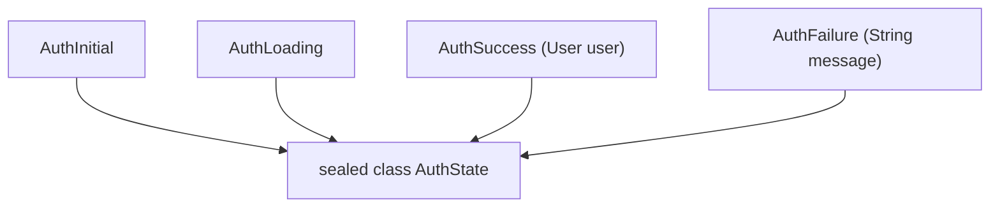

# Chuyên Đề 01 - Bài 03: Modern Dart 3 Records, Patterns & Sealed Classes

> **Trọng tâm**: Sử dụng Records để trả về nhiều giá trị ẩn danh, Pattern Matching trong câu lệnh `switch` expression, Guard clauses (`when`), Quản lý trạng thái giao diện an toàn 100% (Type-Safe UI State) với `sealed class`, và Bộ câu hỏi phỏng vấn chuẩn Google.

---

## 1. Records: Cặp Dữ Liệu Ẩn Danh Thay Thế Class Tạm Thời

Trước Dart 3, nếu một hàm cần trả về cả hai giá trị (ví dụ: `width` và `height`, hoặc `result` và `errorMessage`), lập trình viên phải tạo một class mới hoặc dùng `Map<String, dynamic>` (không có type safety).

Kể từ Dart 3, **Records** cung cấp giải pháp nhẹ, bất biến (immutable), an toàn kiểu dữ liệu 100%:

```dart
// 1. Trả về Record dạng Positional (thứ tự)
(double, double) getScreenDimensions(BuildContext context) {
  final size = MediaQuery.sizeOf(context);
  return (size.width, size.height);
}

// 2. Trả về Record dạng Named (có tên trường)
({bool isSuccess, String? error}) validateInput(String text) {
  if (text.isEmpty) {
    return (isSuccess: false, error: 'Không được để trống');
  }
  return (isSuccess: true, error: null);
}

// Sử dụng Destructuring (Phân rã biến ngay lập tức):
void handleButtonPress(BuildContext context) {
  // Rút trích trực tiếp ra 2 biến riêng biệt
  final (width, height) = getScreenDimensions(context);
  print('Width: $width, Height: $height');

  final (:isSuccess, :error) = validateInput('');
  if (!isSuccess) print('Lỗi: $error');
}
```

---

## 2. Sealed Classes & Exhaustiveness Checking (Kiểm Tra Toàn Diện)

Khi khai báo một class là `sealed`:
1. Mọi class con của nó **bắt buộc phải nằm trong cùng một file**.
2. Trình biên dịch Dart biết chính xác **tổng số lớp con có thể tồn tại**.
3. Khi bạn dùng `switch`, Dart sẽ thực hiện **Exhaustiveness Checking**: Bắt buộc bạn phải xử lý hết mọi trường hợp con, nếu thiếu dù chỉ một trạng thái, mã nguồn sẽ **báo đỏ ngay tại lúc gõ code** (compile-time error), triệt tiêu hoàn toàn lỗi sót case dẫn đến màn hình trắng!



### Triển Khai Thực Tế Trong Quản Lý Trạng Thái Flutter:

```dart
// auth_state.dart
sealed class AuthState {
  const AuthState();
}

class AuthInitial extends AuthState {
  const AuthInitial();
}

class AuthLoading extends AuthState {
  const AuthLoading();
}

class AuthSuccess extends AuthState {
  final String userName;
  final String avatarUrl;
  final int points;
  const AuthSuccess({required this.userName, required this.avatarUrl, this.points = 0});
}

class AuthFailure extends AuthState {
  final String errorMessage;
  const AuthFailure(this.errorMessage);
}
```

---

## 3. Switch Expressions, Destructuring & Guard Clauses (`when`)

Trong Dart 3, `switch` không chỉ là câu lệnh điều khiển mà đã trở thành **biểu thức trả về giá trị (Expression)**. Kết hợp với mệnh đề bảo vệ (`when`), code UI trở nên cực kỳ súc tích:

```dart
class AuthView extends StatelessWidget {
  final AuthState state;

  const AuthView({super.key, required this.state});

  @override
  Widget build(BuildContext context) {
    return Center(
      // Switch expression trực tiếp trong Widget tree
      child: switch (state) {
        AuthInitial() => const Text('Vui lòng đăng nhập'),
        AuthLoading() => const CircularProgressIndicator(),
        
        // Guard Clause (when): Xử lý riêng cho khách hàng VIP có trên 1000 điểm
        AuthSuccess(:final userName, :final points) when points >= 1000 => Column(
            mainAxisSize: MainAxisSize.min,
            children: [
              const Icon(Icons.stars, color: Colors.amber, size: 40),
              Text('Chào mừng Hội Viên VIP: $userName ($points pts)'),
            ],
          ),

        // AuthSuccess thông thường
        AuthSuccess(:final userName) => Text('Xin chào, $userName'),
          
        AuthFailure(:final errorMessage) => Column(
            mainAxisSize: MainAxisSize.min,
            children: [
              const Icon(Icons.error, color: Colors.red, size: 48),
              Text('Lỗi: $errorMessage', style: const TextStyle(color: Colors.red)),
              ElevatedButton(onPressed: () {}, child: const Text('Thử lại')),
            ],
          ),
      },
    );
  }
}
```

---

## 4. Pattern Matching Nâng Cao Với Dữ Liệu JSON / API

Dart 3 cho phép sử dụng các toán tử quan hệ (`>=`, `<`) và toán tử logic (`||`) trong pattern:

```dart
String handleHttpResponse(int statusCode, dynamic data) {
  return switch (statusCode) {
    >= 200 && < 300 => 'Thành công: ${data ?? "OK"}',
    401 || 403 => 'Lỗi bảo mật: Không có quyền truy cập hoặc hết hạn token',
    404 => 'Không tìm thấy tài nguyên',
    >= 500 && < 600 => 'Lỗi máy chủ nội bộ. Vui lòng thử lại sau',
    _ => 'Mã lỗi không xác định: $statusCode',
  };
}
```

---

## 🎯 5. Góc Phỏng Vấn Tuyển Dụng (Google & Top Tech Interview Q&A)

### Câu hỏi 1: So sánh Dart 3 `Records` với class `Tuple` (từ package thứ 3) hoặc `Map` về mặt quản lý bộ nhớ, hiệu năng và Type-safety.
**Trả lời chuẩn 10/10**:
- **So với `Map`**: `Map` lưu trữ cặp Key-Value động trong heap với bảng băm, không có kiểm tra kiểu tĩnh (dễ gõ sai chính tả key), và tốn chi phí băm (hashing overhead). Ngược lại, `Records` được Dart compiler kiểm tra kiểu tĩnh 100% tại compile-time, hỗ trợ autocomplete, và không mất chi phí tra cứu bảng băm.
- **So với class `Tuple` cũ**: `Tuple` là đối tượng class thông thường (Class instance allocation). Trong khi đó, `Records` là kiểu dữ liệu nguyên thủy cốt lõi của Dart VM:
  1. Tự động hỗ trợ so sánh bằng giá trị (`operator ==` và `hashCode` structural equality).
  2. Bất biến (Immutable) tuyệt đối.
  3. Dart compiler có thể tối ưu hóa và trải phẳng (flatten/inlining) Record trong thanh ghi CPU mà không cần cấp phát thêm vùng nhớ trên Heap.

---

### Câu hỏi 2: Tại sao sự kết hợp giữa `sealed class` và `switch expression` lại triệt tiêu hoàn toàn lỗi "Màn hình trắng" (White Screen) khi thêm State mới vào dự án?
**Trả lời chuẩn 10/10**:
- **Bản chất**: `sealed class` giới hạn toàn bộ cây kế thừa con phải nằm trong cùng một thư viện (file). Nhờ đó, trình biên dịch Dart có khả năng **Exhaustiveness Checking** (Kiểm tra toàn vẹn danh sách).
- **Giải quyết vấn đề**: Trước đây, nếu dùng `if-else if` hoặc `switch` có `default: return SizedBox()`, khi một developer trong team thêm một state mới (ví dụ: `AuthRequires2FA`), các màn hình cũ không được cập nhật sẽ rơi vào nhánh `else` hoặc `default`, dẫn đến việc màn hình trống trơn không hiển thị gì (White screen bug).
- Với `switch (state)` không dùng `default`, nếu ai đó thêm `AuthRequires2FA` vào file state, **ngay lập tức toàn bộ dự án sẽ báo lỗi đỏ (Compile Error)** tại tất cả những nơi đang switch trên state đó, ép buộc lập trình viên phải viết UI xử lý cho state mới trước khi mã nguồn có thể build release!

---

### Câu hỏi 3: Hãy viết một hàm bằng Pattern Matching để bóc tách JSON lồng nhau phức tạp mà không cần dùng bất kỳ câu lệnh `if` nào.
**Trả lời chuẩn 10/10**:
```dart
String extractUserCity(Map<String, dynamic> json) {
  // Sử dụng Object/Map pattern matching destructuring:
  return switch (json) {
    {'user': {'address': {'city': String cityName}}} => cityName,
    {'user': {'address': null}} => 'Người dùng chưa cập nhật địa chỉ',
    _ => 'Cấu trúc JSON không hợp lệ',
  };
}
```
*Đoạn code trên kiểm tra đồng thời cả sự tồn tại của các key lồng nhau, kiểm tra kiểu dữ liệu `String` và rút trích trực tiếp biến `cityName` chỉ trong 1 dòng lệnh duy nhất!*
