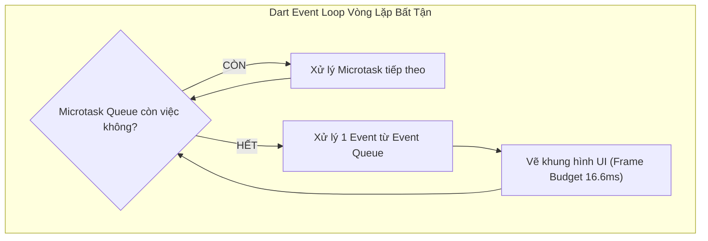

# Chuyên Đề 01 - Bài 05: Lập Trình Bất Đồng Bộ Trong Dart (Futures, Streams, Isolates & UI Safety)

> **Trọng tâm**: Cơ chế Event Loop & Microtask Queue từ góc nhìn Flutter UI, Tối ưu hóa đa luồng với `Isolate.run()` / `compute()`, Chạy song song với `Future.wait()`, Cầu nối callback với `Completer<T>`, Cạm bẫy sống còn `mounted check`, và Bộ câu hỏi phỏng vấn chuẩn Google.

---

## 1. Event Loop: Microtask Queue vs Event Queue

Flutter chạy mã Dart trên **Main UI Isolate** (Đơn luồng). Luồng này liên tục vẽ lại màn hình ở tốc độ **60 FPS (16.6ms)** hoặc **120 FPS (8.33ms)**.

Event Loop có 2 hàng đợi ưu tiên:
1. **Microtask Queue (Hàng đợi ưu tiên cao nhất)**: Các tác vụ nội bộ ngắn cần chạy ngay lập tức trước khi nhường quyền cho bất kỳ sự kiện nào khác.
2. **Event Queue (Hàng đợi sự kiện thông thường)**: I/O đĩa, bấm nút màn hình, gói tin HTTP từ mạng, Ticker vẽ khung hình.



> [!WARNING]
> **Nguyên Tắc Sống Còn**:  
> Nếu bạn liên tục thêm việc vào `Microtask Queue` (hoặc chạy một hàm đồng bộ nặng), **Event Queue sẽ bị bỏ đói hoàn toàn (Starvation)**. Flutter sẽ không thể vẽ khung hình tiếp theo và không nhận thao tác chạm của người dùng $\rightarrow$ Ứng dụng bị đơ cứng (Frozen UI)!

---

## 2. Phân Biệt `async/await` Thông Thường vs Đa Luồng Thật Sự (`Isolate.run`)

Rất nhiều lập trình viên hiểu lầm: *"Cứ thêm từ khóa `async` là code sẽ chạy trên luồng khác và không làm lag UI"*. **ĐÂY LÀ QUAN NIỆM HOÀN TOÀN SAI!**

- `async/await` chỉ giúp hàm **không chặn Event Loop khi chờ đợi I/O** (như chờ Server phản hồi mạng).
- Nhưng nếu bạn thực hiện **phép tính CPU nặng** (như parse chuỗi JSON 10MB, nén ảnh, giải mã file lớn), mã nguồn vẫn chạy trên chính Main UI Isolate và **vẫn làm giật lag màn hình như thường**!

### ✅ Giải Pháp: Đẩy Tác Vụ Sang Luồng Riêng Với `Isolate.run()` (Dart 2.19+) Hoặc `compute()`

```dart
// 1. Hàm tính toán nặng (Top-level function hoặc Static method)
List<Product> parseLargeJsonInBackground(String jsonString) {
  final List decodedList = jsonDecode(jsonString);
  return decodedList.map((item) => Product.fromJson(item)).toList();
}

// 2. Chạy trên Background Isolate độc lập không bao giờ làm rớt FPS của UI:
Future<List<Product>> loadHeavyProducts(String rawJson) async {
  // Isolate.run tự động tạo luồng phụ, tính toán xong tự dọn dẹp và trả kết quả về!
  final products = await Isolate.run(() => parseLargeJsonInBackground(rawJson));
  return products;
}
```

---

## 3. Chạy Song Song Nhiều Tác Vụ Với `Future.wait()`

Thay vì chờ từng API một mất 3 giây + 3 giây = 6 giây:

```dart
// ❌ CHẬM: Chạy tuần tự mất tổng cộng 6 giây
final profile = await api.getProfile();
final orders = await api.getOrders();

// ✅ NHANH: Chạy đồng thời cả 2 request cùng lúc (chỉ mất tối đa 3 giây)
final results = await Future.wait([
  api.getProfile(),
  api.getOrders(),
]);

final profile = results[0] as Profile;
final orders = results[1] as List<Order>;
```

---

## 4. `Completer<T>`: Chuyển Đổi Callback Cổ Điển Sang Future

Khi làm việc với các thư viện cũ sử dụng callback `onSuccess` và `onError`, làm sao để biến nó thành một hàm có thể dùng `await` mượt mà?  
👉 **`Completer<T>`** là chiếc cầu nối:

```dart
Future<LocationData> getCurrentLocation() {
  final completer = Completer<LocationData>();

  legacyGpsSensor.startListening(
    onSuccess: (data) {
      completer.complete(data); // Đánh dấu Future hoàn thành thành công!
    },
    onError: (error) {
      completer.completeError(error); // Báo lỗi cho Future
    },
  );

  return completer.future; // Trả về Future để người gọi có thể await!
}
```

---

## 5. Cạm Bẫy Tử Thần: `setState()` Sau `await` & Kiểm Tra `mounted`

```dart
void _handleLogin() async {
  setState(() => _isLoading = true);

  try {
    await authService.login('user', 'pass');
  } finally {
    // ✅ BẮT BUỘC kiểm tra mounted trước khi đụng vào setState hoặc context!
    if (!mounted) return;
    setState(() => _isLoading = false);
  }
}
```

---

## 🎯 6. Góc Phỏng Vấn Tuyển Dụng (Google & Top Tech Interview Q&A)

### Câu hỏi 1: Microtask Queue khác gì với Event Queue? Nếu vô tình tạo một đệ quy vô hạn trong Microtask (`scheduleMicrotask`), điều gì sẽ xảy ra với ứng dụng Flutter?
**Trả lời chuẩn 10/10**:
- **Khác biệt**:
  - `Microtask Queue` có mức độ ưu tiên cao nhất. Event Loop cam kết sẽ vét sạch 100% các task trong Microtask Queue trước khi quay lại lấy dù chỉ 1 event trong `Event Queue`.
  - `Event Queue` chứa các sự kiện từ thế giới bên ngoài (cú chạm màn hình, I/O mạng, Timer, và quan trọng nhất là sự kiện VSync kích hoạt vẽ khung hình của Flutter Engine).
- **Hậu quả của đệ quy Microtask**: Nếu tạo vòng lặp vô hạn đẩy task vào Microtask Queue, Event Loop sẽ bị kẹt vĩnh viễn trong việc xử lý microtask. Nó **không bao giờ quay lại Event Queue**, dẫn đến việc Flutter Engine không thể nhận được nhịp VSync để render khung hình mới và không nhận được bất kỳ cử chỉ chạm nào. Màn hình ứng dụng sẽ bị đơ cứng (Frozen/ANR) 100% mặc dù không ném ra exception nào!

---

### Câu hỏi 2: Phân biệt chạy `Future.wait()` song song và chạy tuần tự từng lệnh `await`. Khi một Future trong `Future.wait()` bị lỗi (Exception), các Future còn lại có tiếp tục chạy không?
**Trả lời chuẩn 10/10**:
- **Khác biệt**: Chạy tuần tự (`await A; await B;`) sẽ đợi A hoàn tất xong mới bắt đầu gửi B đi (Tổng thời gian = $T_A + T_B$). Trong khi đó, `Future.wait([A, B])` bắn đồng thời cả hai request vào Event Loop (Tổng thời gian = $\max(T_A, T_B)$).
- **Khi một Future bị lỗi**:
  - Theo mặc định, `Future.wait` có thuộc tính `eagerError: true`. Ngay khi bất kỳ một Future nào fail, `Future.wait` sẽ **ném ra Exception ngay lập tức** mà không chờ các Future còn lại.
  - **Tuy nhiên, các Future còn lại VẪN TIẾP TỤC CHẠY ngầm** trên hệ thống cho đến khi hoàn thành, chúng không tự động bị hủy bỏ (vì Future trong Dart không có cơ chế tự cancel giữa chừng). Nếu muốn đợi tất cả kết thúc rồi mới tổng hợp lỗi, ta truyền `eagerError: false`.

---

### Câu hỏi 3: Từ khóa `async` có biến một hàm thành đa luồng (Multi-threading) không? Khi nào một Flutter developer bắt buộc phải dùng `Isolate.run()` / `compute()`?
**Trả lời chuẩn 10/10**:
- **Khẳng định**: **KHÔNG**. Từ khóa `async` trong Dart **hoàn toàn không tạo ra thread mới**. Toàn bộ mã nguồn Dart mặc định vẫn chạy trên một luồng duy nhất là Main UI Isolate. `async` chỉ là cú pháp giúp tổ chức code bất đồng bộ mà không cần lồng ghép các hàm callback `then()`.
- **Khi nào BẮT BUỘC dùng `Isolate.run()` / `compute()`**:
  - Khi bạn thực hiện một **tác vụ nặng về tính toán (CPU-bound tasks)** kéo dài hơn ngân sách 16.6 mili-giây của một khung hình:
    1. Phân tích chuỗi JSON kích thước lớn (> 1 MB).
    2. Nén/Giải mã hình ảnh hoặc video.
    3. Mã hóa dữ liệu phức tạp (AES, RSA, tính toán băm cryptographic).
    4. Sắp xếp hoặc lọc cơ sở dữ liệu gồm hàng chục nghìn bản ghi.
  - Bằng cách đẩy sang Isolate riêng, CPU sẽ sử dụng một nhân khác của vi xử lý điện thoại, đảm bảo Main UI Isolate hoàn toàn rảnh rỗi để duy trì 60/120 FPS không giật lag.
