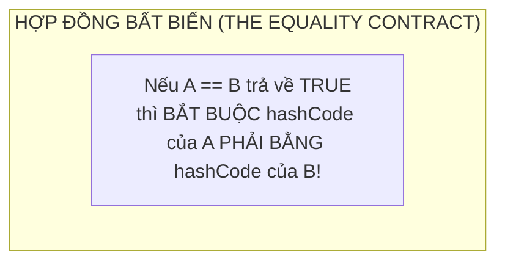

# Chuyên Đề 01 - Bài 06: Extension Methods, Hợp Đồng Bình Đẳng (Equality Contract) & Generics

> **Trọng tâm**: Phương thức mở rộng (Extension Methods) trong Flutter UI, Dart 3.3 Extension Types (Trừu tượng hóa chi phí 0 đồng - Zero-cost abstractions), Hợp đồng bất biến giữa `operator ==` và `hashCode`, Hệ thống Generics Reified của Dart, và Bộ câu hỏi phỏng vấn chuẩn Google.

---

## 1. Extension Methods Trong Flutter: Vũ Khí Làm Sạch UI Code

Trước Dart 2.7, để thêm hàm tiện ích cho các class có sẵn trong SDK (như `BuildContext` hay `String`), bạn phải tạo các lớp Helper tĩnh kiểu Java: `UiUtils.getColorScheme(context)` rất xấu xí.

Với **Extension Methods**, bạn có thể "bổ sung" thêm thuộc tính và phương thức trực tiếp vào bất kỳ class nào mà không cần sửa mã nguồn của class đó:

```dart
// 1. Mở rộng cho BuildContext: Cực kỳ phổ biến trong các dự án Flutter chuyên nghiệp
extension BuildContextThemeX on BuildContext {
  // Đọc nhanh ColorScheme
  ColorScheme get colorScheme => Theme.of(this).colorScheme;

  // Đọc nhanh TextTheme
  TextTheme get textTheme => Theme.of(this).textTheme;

  // Đọc nhanh kích thước màn hình
  Size get screenSize => MediaQuery.sizeOf(this);

  // Hiển thị SnackBar nhanh chóng
  void showSnackBar(String message, {bool isError = false}) {
    ScaffoldMessenger.of(this).showSnackBar(
      SnackBar(
        content: Text(message),
        backgroundColor: isError ? Colors.red : null,
      ),
    );
  }
}

// 2. Mở rộng cho String: Format & Validate
extension StringValidationX on String {
  bool get isValidEmail => RegExp(r'^[\w-\.]+@([\w-]+\.)+[\w-]{2,4}$').hasMatch(this);
  
  String get capitalizeFirst => isEmpty ? '' : '${this[0].toUpperCase()}${substring(1)}';
}
```

### Sử Dụng Trong Widget Tree Siêu Gọn Gàng:

```dart
@override
Widget build(BuildContext context) {
  return Container(
    // Thay vì: Theme.of(context).colorScheme.primaryContainer
    color: context.colorScheme.primaryContainer,
    child: Text(
      'họ và tên'.capitalizeFirst, // 'Họ và tên'
      // Thay vì: Theme.of(context).textTheme.titleMedium
      style: context.textTheme.titleMedium,
    ),
  );
}
```

---

## 2. Dart 3.3 Extension Types: Trừu Tượng Hóa Chi Phí 0 Đồng (Zero-Cost Abstraction)

Kể từ Dart 3.3, Google giới thiệu **Extension Type**. Đây là một tính năng cực mạnh giúp bạn tạo ra một **kiểu dữ liệu an toàn (Type-safe wrapper)** tại thời điểm biên dịch, nhưng tại runtime nó được biên dịch thành kiểu dữ liệu nguyên thủy ban đầu mà **không tốn một byte RAM nào để cấp phát object mới**!

```dart
// Định nghĩa 2 kiểu ID riêng biệt từ kiểu int nguyên thủy:
extension type const UserId(int id) {}
extension type const ProductId(int id) {}

void processOrder(UserId user, ProductId product) {
  print('Xử lý đơn hàng cho user $user và sản phẩm $product');
}

void main() {
  const user = UserId(101);
  const product = ProductId(999);

  processOrder(user, product); // ✅ Hợp lệ

  // ❌ LỖI BIÊN DỊCH NGAY LẬP TỨC: 
  // processOrder(product, user);
  // The argument type 'ProductId' can't be assigned to the parameter type 'UserId'.
}
```
*(Tại runtime trong mã máy AOT, cả `user` và `product` chỉ là 2 số nguyên `101` và `999`, không có overhead của một Wrapper class!)*

---

## 3. Hợp Đồng Bình Đẳng Trong Dart: `operator ==` & `hashCode`

Trong Dart, mọi class đều kế thừa phương thức `operator ==` và getter `hashCode` từ `Object`.



### 💥 Thảm Họa Khi Quên Override `hashCode`:
Hãy xem điều gì xảy ra nếu bạn chỉ override `operator ==` mà quên override `hashCode`:

```dart
class Student {
  final int id;
  final String name;

  Student(this.id, this.name);

  // Chỉ override operator ==
  @override
  bool operator ==(Object other) =>
      identical(this, other) ||
      other is Student && runtimeType == other.runtimeType && id == other.id;

  // ❌ QUÊN KHÔNG OVERRIDE HASHCODE!
}

void main() {
  final s1 = Student(1, 'Nam');
  final s2 = Student(1, 'Nam');

  print(s1 == s2); // true (Đúng kỳ vọng)

  // Đưa vào Set (Tập hợp không trùng lặp):
  final set = <Student>{};
  set.add(s1);
  set.add(s2);

  print(set.length); // 💥 KẾT QUẢ BẤT NGỜ: 2! (Tập hợp bị nhân đôi phần tử trùng lặp!)
  print(set.contains(s2)); // Có thể trả về false!
}
```

### Tại Sao Lại Như Vậy?
`Set` và `Map` sử dụng bảng băm (Hash Table) để nhóm các phần tử vào các thùng chứa (Buckets):
1. Khi bạn tìm `s2`, Dart tính `s2.hashCode` để tìm đến đúng bucket.
2. Vì bạn không override `hashCode`, `s1` và `s2` nhận 2 mã băm ngẫu nhiên khác nhau từ vùng nhớ của `Object`.
3. Dart tìm vào một bucket khác và kết luận: *"Không có phần tử này trong Set!"*.

### ✅ Cách Làm Chuẩn: Luôn Đi Cặp Bằng `Object.hash()`
```dart
@override
int get hashCode => Object.hash(id, name);
```

---

## 4. Reified Generics Trong Dart (Tính Toàn Vẹn Của Kiểu Generic)

Không giống như Java (nơi Generics bị xóa bỏ tại runtime - Type Erasure), **Dart có Reified Generics**:
- Kiểu dữ liệu generic được **giữ nguyên vẹn 100% khi ứng dụng chạy**.
- Bạn hoàn toàn có thể kiểm tra kiểu generic tại runtime:

```dart
void checkListType(List items) {
  if (items is List<String>) {
    print('Đây là mảng chứa các chuỗi String');
  } else if (items is List<int>) {
    print('Đây là mảng chứa các số nguyên');
  }
}

// Giới hạn ràng buộc kiểu (Generic Bounds) trong Flutter:
class BaseWidgetContainer<T extends Widget> {
  final T child;
  const BaseWidgetContainer(this.child);
}
```

---

## 🎯 5. Góc Phỏng Vấn Tuyển Dụng (Google & Top Tech Interview Q&A)

### Câu hỏi 1: Tại sao việc override `operator ==` mà quên override `hashCode` lại phá hỏng hoàn toàn hành vi của `Set` và `Map`?
**Trả lời chuẩn 10/10**:
- **Cơ chế tra cứu bảng băm (Hash Table)**: Cả `Set` và `Map` đều vận hành theo thuật toán 2 bước:
  1. **Bước 1 (Băm)**: Lấy `object.hashCode` chia lấy dư để xác định chỉ số thùng chứa (Bucket index) trong mảng bộ nhớ.
  2. **Bước 2 (So sánh)**: Khi đã vào đúng Bucket, nó mới dùng toán tử `==` để so sánh chính xác phần tử đó với các phần tử khác trong cùng bucket.
- Nếu hai đối tượng có cùng giá trị logic (`A == B` là `true`) nhưng `hashCode` khác nhau (do dùng `Object.hashCode` mặc định dựa trên địa chỉ RAM), chúng sẽ bị rơi vào hai thùng chứa (buckets) hoàn toàn khác nhau. Kết quả là hàm `set.contains(B)` sẽ tìm kiếm ở sai bucket và trả về `false`, và `set.add(B)` sẽ thêm phần tử bị trùng lặp vào tập hợp!

---

### Câu hỏi 2: Extension Methods trong Dart có hỗ trợ Đa hình động (Dynamic Polymorphism / Virtual Dispatch) không? Chuyện gì xảy ra nếu gọi một Extension Method thông qua một biến có kiểu `dynamic`?
**Trả lời chuẩn 10/10**:
- **Khẳng định**: **KHÔNG**. Extension Methods trong Dart được giải quyết hoàn toàn bằng cơ chế **Static Dispatch (Ràng buộc tĩnh tại thời điểm biên dịch)**, chứ không phải Dynamic Dispatch như các phương thức của Class thông thường.
- **Hành vi với `dynamic`**: Nếu bạn viết:
  ```dart
  dynamic text = "hello";
  text.capitalizeFirst; // 💥 CRASH RUNTIME: NoSuchMethodError!
  ```
  Trình biên dịch Dart không biết `text` có kiểu tĩnh là `String` tại thời điểm biên dịch, nên nó không thể giải quyết và gắn lời gọi hàm extension tương ứng. Lời gọi sẽ được chuyển tiếp thẳng vào đối tượng lúc runtime, và vì class `String` gốc không có hàm `capitalizeFirst`, ứng dụng sẽ văng ngay lập tức!

---

### Câu hỏi 3: Phân biệt `Extension Type` (Dart 3.3) và một Wrapper Class thông thường về mặt chi phí bộ nhớ và hiệu năng AOT.
**Trả lời chuẩn 10/10**:
- **Wrapper Class thông thường** (`class UserId { final int value; const UserId(this.value); }`):
  - Luôn luôn là một đối tượng đầy đủ (Full Object) trên bộ nhớ Heap.
  - Tốn thêm chi phí tiêu đề đối tượng (Object Header - thường mất 8 - 16 bytes), chi phí Garbage Collection, và chi phí con trỏ tham chiếu (Pointer Indirection).
- **Extension Type** (`extension type const UserId(int value) {}`):
  - Là một **tính năng chỉ tồn tại ở mức trình biên dịch (Compile-time abstraction)**.
  - Trình biên dịch AOT của Dart sẽ loại bỏ hoàn toàn lớp bọc `UserId` trong quá trình sinh mã máy. Trong bộ nhớ và thanh ghi CPU, nó là số nguyên `int` nguyên thủy 100%.
  - Cung cấp tính an toàn tuyệt đối về kiểu dữ liệu (không thể truyền nhầm `ProductId` vào nơi cần `UserId`) mà **không tốn thêm dù chỉ 1 byte RAM** và không làm chậm tốc độ CPU!
