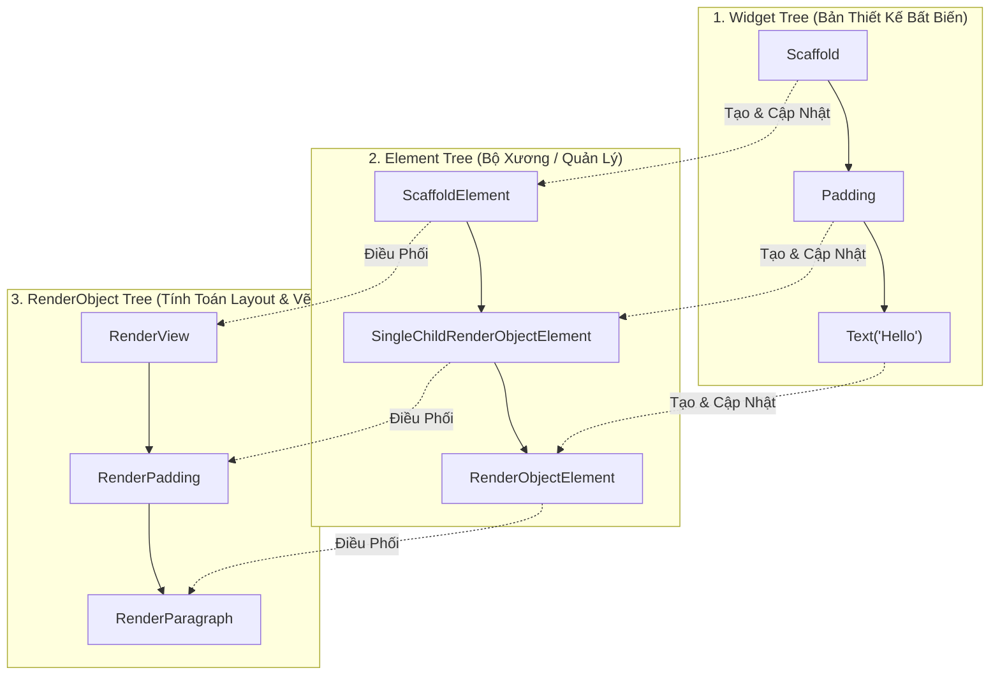

# Chuyên Đề 02 - Bài 01: Tính Bất Biến Của Widget & Bản Chất Cây Widget

> **Trọng tâm**: Tại sao Widget trong Flutter bắt buộc phải là bất biến (`@immutable`), Bản chất kiến trúc 3 cây (Widget Tree, Element Tree, RenderObject Tree), Cơ chế so sánh Diffing `Widget.canUpdate()`, Chi phí bộ nhớ thực tế, và Bộ câu hỏi phỏng vấn chuẩn Google.

---

## 1. Tại Sao Mọi Widget Đều Bắt Buộc Phải Là Bất Biến (`@immutable`)?

Nếu bạn nhìn vào mã nguồn của `Widget` trong Flutter SDK, bạn sẽ thấy annotation:
```dart
@immutable
abstract class Widget extends DiagnosticableTree {
  const Widget({this.key});
  final Key? key;
  ...
}
```

### Bản Chất Của Widget: "Bản Thiết Kế Bản Vẽ" (Blueprint)
Nhiều người lầm tưởng một `Widget` là thứ trực tiếp được vẽ lên màn hình điện thoại (như `View` trong Android hay `UIView` trong iOS). **Đây là quan niệm hoàn toàn sai lầm!**

- **Widget KHÔNG PHẢI là Pixel trên màn hình**. Widget chỉ là một **bản thông số cấu hình siêu nhẹ (configuration blueprint)**.
- Khi bạn viết `Container(color: Colors.red, width: 100)`, bạn chỉ đang tạo một đối tượng Dart chứa 2 biến số: một mã màu và một số thực `100.0`. Chi phí tạo mới một Widget trong bộ nhớ Dart rẻ ngang với việc tạo một con số `int` hay một chuỗi `String`!
- Vì nó chỉ là cấu hình tĩnh, việc làm cho nó **bất biến (`immutable`)** giúp Flutter:
  1. Tránh được các lỗi đa luồng (thread-safety) và race condition.
  2. Tự do vứt bỏ và tạo lại hàng nghìn widget mỗi giây khi màn hình có thay đổi mà không tốn nhiều CPU.

---

## 2. Bí Mật Đằng Sau: 3 Cây Trong Flutter (Dưới Góc Nhìn Thực Chiến)

Để biến bản thiết kế (Widget) thành hình ảnh hiển thị trên màn hình, Flutter vận hành **3 cây song song**:



### Vai Trò Của Từng Cây Trong Dự Án:

| Loại Cây | Tần Suất Thay Đổi | Trọng Lượng Bộ Nhớ (RAM) | Nhiệm Vụ Cốt Lõi |
| :--- | :--- | :--- | :--- |
| **1. Widget Tree** | Bị tạo mới liên tục mỗi khi có frame hoặc `build()` chạy lại. | **Siêu nhẹ (Lightweight)**: Chỉ chứa các biến cấu hình Dart thuần túy. | Đóng vai trò là bản vẽ UI tĩnh (Declarative Configuration). |
| **2. Element Tree** | Tồn tại lâu dài suốt phiên hiển thị của màn hình. | **Trung bình**: Giữ liên kết giữa Widget và RenderObject. | Đóng vai trò là bộ não điều phối (`BuildContext`), quản trị vòng đời và quyết định tái sử dụng. |
| **3. RenderObject Tree** | Rất hiếm khi bị tạo mới, chủ yếu là cập nhật thuộc tính. | **Rất nặng (Heavyweight)**: Giữ Canvas, Shader, Render Layer và tính toán tọa độ. | Tính toán hình học (Layout: đo đạc Size & Constraints) và tô màu Pixel lên màn hình (Paint). |

---

## 3. Thuật Toán Diffing: Khi Nào Flutter Tái Sử Dụng Element?

Khi Widget cha gọi `setState()` hoặc rebuild, Flutter duyệt qua các Widget con và kiểm tra phương thức tĩnh `Widget.canUpdate`:

```dart
static bool canUpdate(Widget oldWidget, Widget newWidget) {
  return oldWidget.runtimeType == newWidget.runtimeType
      && oldWidget.key == newWidget.key;
}
```

```mermaid
flowchart TD
    Check{"oldWidget.runtimeType == newWidget.runtimeType<br/>&& oldWidget.key == newWidget.key?"}
    
    Check -->|ĐÚNG (Cùng loại & cùng Key)| Reuse["TÁI SỬ DỤNG Element cũ!<br/>Chỉ cập nhật thuộc tính mới (Update Properties)"]
    Check -->|SAI (Khác loại hoặc khác Key)| Replace["HỦY Element cũ cùng RenderObject!<br/>Khởi tạo Element mới hoàn toàn (Recreate)"]
```

### Ví Dụ Minh Họa:
```dart
// Khung hình 1:
Container(color: Colors.blue, child: const Text('A'))

// Khung hình 2: Trạng thái đổi màu
Container(color: Colors.red, child: const Text('A'))
```
- Ở khung hình 2, Widget mới là `Container` màu đỏ.
- Flutter so sánh: `oldWidget.runtimeType == newWidget.runtimeType` (Đều là `Container`), `key` đều bằng `null`.
- Kết quả: **`Element` cũ được giữ nguyên 100%**. Flutter chỉ ra lệnh cho `RenderDecoratedBox` bên dưới: *"Đổi màu sơn sang đỏ"*. Không có RenderObject mới nào bị tạo lại!

---

## 4. Bài Học Thực Chiến Cho Lập Trình Viên

1. **Đừng sợ gọi hàm `build()`**: Hàm `build()` sinh ra là để được gọi thường xuyên. Hãy giữ cho hàm `build()` thật trong sạch (pure function): không thực hiện phép tính nặng, không gọi API, không đọc database bên trong `build()`.
2. **Tách nhỏ Widget**: Khi một widget con thay đổi, chỉ có nhánh con đó cần rebuild nếu bạn tách nó thành một Widget class riêng biệt.
3. **Tận dụng `const`**: Giúp Flutter bỏ qua cả bước so sánh `canUpdate` vì địa chỉ bộ nhớ đã giống hệt nhau từ trước (`identical(oldWidget, newWidget)`).

---

## 🎯 5. Góc Phỏng Vấn Tuyển Dụng (Google & Top Tech Interview Q&A)

### Câu hỏi 1: Tại sao Flutter lại phân tách thành 3 cây (Widget Tree, Element Tree, RenderObject Tree) thay vì chỉ dùng 1 cây duy nhất như hệ thống DOM trên Web?
**Trả lời chuẩn 10/10**:
- **Nguyên nhân cốt lõi là sự cân bằng giữa Tính Tiện Lợi (Declarative UI) và Hiệu Năng Render (Performance)**:
  1. **Tách biệt cấu hình và đồ họa**: Lập trình viên cần một cú pháp khai báo UI đơn giản, nhẹ nhàng (`Widget`) mà họ có thể vứt bỏ và viết lại bất kỳ lúc nào mà không cần tự tay viết lệnh DOM manipulation phức tạp (`element.appendChild()`).
  2. **Bảo vệ chi phí phần cứng**: `RenderObject` chứa dữ liệu đắt đỏ liên quan đến GPU, texture, và tính toán tọa độ layout. Nếu chỉ có 1 cây, mỗi lần rebuild ta sẽ phải tạo lại RenderObject $\rightarrow$ ứng dụng sẽ bị rớt FPS nghiêm trọng.
  3. **Element Tree đóng vai trò "Bộ đệm hòa giải" (Reconciler)**: Nó đứng ở giữa để so sánh Widget mới và cũ (`canUpdate`). Nếu chỉ là thay đổi màu sắc hay chữ, nó giữ nguyên RenderObject cũ và chỉ cập nhật lại thuộc tính (mutation), giúp việc render đạt tốc độ 60/120 FPS ổn định.

---

### Câu hỏi 2: Trình bày chi tiết thuật toán `canUpdate()` trong Flutter SDK. Khi nào một Element và RenderObject bị tiêu hủy hoàn toàn?
**Trả lời chuẩn 10/10**:
- Phương thức `Widget.canUpdate(oldWidget, newWidget)` chỉ kiểm tra 2 điều kiện đồng thời:
  1. `oldWidget.runtimeType == newWidget.runtimeType` (Cùng kiểu class Widget).
  2. `oldWidget.key == newWidget.key` (Cùng Key định danh).
- **Trường hợp thỏa mãn**: Element cũ được giữ lại, gọi hàm `element.update(newWidget)`. Thuộc tính mới được đồng bộ xuống RenderObject tương ứng.
- **Trường hợp bị tiêu hủy**: Khi một trong hai điều kiện sai (ví dụ đổi từ `Text` sang `Image`, hoặc hai Widget có `ValueKey` khác nhau):
  - Element cũ sẽ bị đưa vào danh sách `deactivate`.
  - Toàn bộ cây con của Element đó và các `RenderObject` liên kết sẽ bị tháo gỡ (unmount) và giải phóng khỏi bộ nhớ GPU/RAM vào cuối khung hình hiện tại.

---

### Câu hỏi 3: Chi phí bộ nhớ và hiệu năng khi khởi tạo 1,000 Widget so với 1,000 RenderObject chênh lệch như thế nào?
**Trả lời chuẩn 10/10**:
- **1,000 Widget**: Chỉ tốn vài chục Kilobytes RAM. Widget trong Dart là các đối tượng Dart thông thường rất nhỏ (thường chỉ chứa vài con số `double`, `Color` và các hàm callback). Chúng được cấp phát trong `New Generation Space` của Dart Heap và được Garbage Collector dọn dẹp trong vòng vài micro-giây.
- **1,000 RenderObject**: Tốn hàng chục Megabytes RAM. Mỗi `RenderObject` phải duy trì các ma trận biến đổi tọa độ (Transform Matrix), quản lý lớp vẽ (Render Layers), tính toán kích thước hộp (`BoxConstraints`), và giữ các tham chiếu kết nối với Engine Skia/Impeller. Việc tạo mới RenderObject đòi hỏi nhiều chu kỳ tính toán CPU/GPU và tiêu tốn bộ nhớ gấp hàng trăm lần so với Widget.
