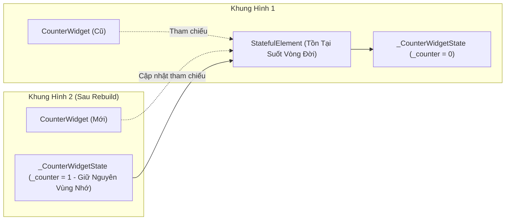
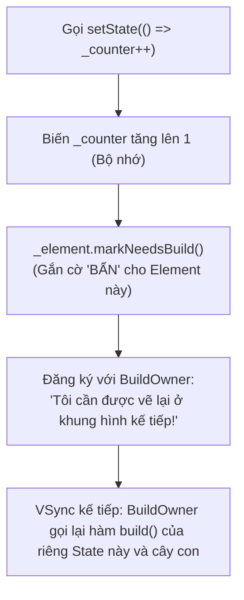

# Chuyên Đề 02 - Bài 02: StatelessWidget vs StatefulWidget & Nơi Lưu Trữ State

> **Trọng tâm**: Phân biệt bản chất `StatelessWidget` và `StatefulWidget`, Giải mã câu hỏi lớn: "Nếu Widget liên tục bị tạo mới thì đối tượng State được lưu ở đâu?", Cơ chế đánh dấu cờ bẩn (`markNeedsBuild`), và Bộ câu hỏi phỏng vấn chuẩn Google.

---

## 1. Bản Chất StatelessWidget vs StatefulWidget

| Đặc Điểm | StatelessWidget | StatefulWidget |
| :--- | :--- | :--- |
| **Bản chất dữ liệu** | Chỉ hiển thị dữ liệu tĩnh được truyền vào từ bên ngoài (`final fields`). Không tự thay đổi theo thời gian. | Có dữ liệu nội tại có thể thay đổi (`State`) trong suốt thời gian người dùng tương tác trên màn hình. |
| **Khả năng tự Rebuild** | **Không thể**. Chỉ rebuild khi Widget cha bên trên nó rebuild và truyền props mới xuống. | **Có thể**. Có thể tự yêu cầu Flutter vẽ lại chính nó bất kỳ lúc nào thông qua hàm `setState()`. |
| **Cặp đối tượng** | Chỉ có 1 class duy nhất: Kế thừa `StatelessWidget`. | Gồm **2 class riêng biệt**: 1 class kế thừa `StatefulWidget` (bất biến) và 1 class kế thừa `State<T>` (biến thiên). |
| **Ví dụ thực tế** | Icon, Label Text, AppHeader, Avatar tĩnh. | Ô nhập văn bản (TextField), Checkbox, Đồng hồ đếm ngược, TabView. |

---

## 2. Câu Hỏi Lớn: State Được Lưu Trữ Ở Đâu?

Hãy nhìn vào cách chúng ta khai báo một `StatefulWidget`:

```dart
// Class 1: Bất biến (Immutable Widget Configuration)
class CounterWidget extends StatefulWidget {
  final String title;
  const CounterWidget({super.key, required this.title});

  @override
  State<CounterWidget> createState() => _CounterWidgetState();
}

// Class 2: Biến thiên (Mutable State Object)
class _CounterWidgetState extends State<CounterWidget> {
  int _counter = 0; // Biến này thay đổi liên tục!

  void _increment() {
    setState(() => _counter++);
  }

  @override
  Widget build(BuildContext context) {
    return Text('${widget.title}: $_counter');
  }
}
```

### Bí mật: Widget bị hủy, nhưng `State` gắn chặt vào `Element`!
Như ta đã học ở bài trước, khi màn hình rebuild:
1. Đối tượng `CounterWidget` cũ **bị vứt bỏ**, và một `CounterWidget` mới được tạo ra.
2. Tuy nhiên, đối tượng `StatefulElement` trên **Element Tree KHÔNG HỀ BỊ HỦY**!
3. Đối tượng `_CounterWidgetState` được lưu giữ an toàn bên trong chính `StatefulElement` đó.
4. Khi Widget mới được sinh ra, `StatefulElement` gọi phương thức:  
   `state._widget = newWidget;`  
   và kích hoạt `state.didUpdateWidget(oldWidget)`.



> [!NOTE]
> **Từ khóa `widget.` trong State đến từ đâu?**  
> Chính vì `State` tồn tại lâu dài hơn `Widget`, nên khi bạn muốn đọc thuộc tính mà Widget cha truyền vào (ví dụ `title`), bạn phải truy cập qua biến `widget.title`. Biến `widget` này luôn tự động trỏ tới bản thể Widget mới nhất nhờ `StatefulElement` cập nhật con trỏ liên tục!

---

## 3. Cơ Chế Hoạt Động Của `setState()`: Đánh Dấu Cờ "Bẩn" (Dirty)

Hàm `setState()` thực chất làm những gì đằng sau cánh gà? Hãy xem trích đoạn mã nguồn thực tế của `State` trong Flutter SDK:

```dart
void setState(VoidCallback fn) {
  // 1. Thực thi hàm callback bạn truyền vào ngay lập tức (Đồng bộ)
  fn();

  // 2. Đánh dấu Element này là "bẩn" (Dirty) và đưa vào hàng đợi BuildOwner
  _element!.markNeedsBuild();
}
```



### ⚠️ Những Cạm Bẫy Sống Còn Về `setState()`:
1. **Không truyền hàm `async` vào `setState`**:
   ```dart
   // ❌ SAI HOÀN TOÀN:
   setState(() async {
     final data = await api.getData(); // Callback của setState KHÔNG THỂ là async!
   });

   // ✅ ĐÚNG:
   final data = await api.getData();
   if (mounted) {
     setState(() => _data = data);
   }
   ```
2. **Không gọi `setState()` trong hàm `build()`**: Sẽ gây ra lỗi lặp vô tận: `setState() or markNeedsBuild() called during build`.
3. **Không lạm dụng `setState()` ở cấp màn hình gốc**: Khi chỉ cần đổi một con số trong một icon, hãy dùng `ValueNotifier` hoặc tách thành Widget con độc lập.

---

## 🎯 4. Góc Phỏng Vấn Tuyển Dụng (Google & Top Tech Interview Q&A)

### Câu hỏi 1: Giải thích tại sao `StatefulWidget` là một class bất biến (`@immutable`) nhưng lại có thể chứa được dữ liệu biến đổi (mutable state)? Đối tượng `State` thực sự nằm ở đâu trong bộ nhớ?
**Trả lời chuẩn 10/10**:
- **Bản chất**: Bản thân `StatefulWidget` **hoàn toàn bất biến**. Mọi trường (fields) của nó bắt buộc phải là `final`. Khi tham số truyền vào thay đổi, instance `StatefulWidget` cũ bị vứt bỏ và một instance mới được tạo ra.
- **Nơi lưu trữ State**: Đối tượng `State<T>` không nằm bên trong `StatefulWidget`. Khi Flutter đưa `StatefulWidget` vào cây, nó khởi tạo một **`StatefulElement`**. Chính đối tượng `StatefulElement` này mới là nơi lưu giữ và quản lý vòng đời của đối tượng `State`.
- Vì `StatefulElement` tồn tại xuyên suốt trên Element Tree, nó giữ cho đối tượng `State` không bị Garbage Collector thu hồi. Khi `StatefulWidget` mới được tạo ra ở khung hình tiếp theo, `StatefulElement` chỉ đơn thuần cập nhật con trỏ `state._widget` sang Widget mới.

---

### Câu hỏi 2: Hàm `setState()` có thực hiện việc rebuild giao diện ngay lập tức tại dòng lệnh đó không? Tại sao?
**Trả lời chuẩn 10/10**:
- **Khẳng định**: **KHÔNG**. `setState()` là một thao tác bất đồng bộ theo chu kỳ khung hình (Frame-synced).
- **Cơ chế**:
  1. Khi bạn gọi `setState(fn)`, hàm `fn()` thực thi đồng bộ ngay lập tức để cập nhật biến nội bộ.
  2. Sau đó, nó gọi `_element.markNeedsBuild()`, chỉ đơn giản là gắn một lá cờ `_dirty = true` lên Element hiện tại và đăng ký Element đó vào danh sách `_dirtyElements` của đối tượng `BuildOwner`.
  3. Flutter Engine sẽ đợi tín hiệu **VSync** tiếp theo từ phần cứng màn hình (khoảng 16.6ms với màn 60Hz). Lúc này, `BuildOwner` mới duyệt qua danh sách các Element bị bẩn và gọi hàm `build()` một lượt duy nhất.
- **Mục đích thiết kế**: Giúp gom cụm (batching) nhiều cập nhật state lại với nhau trong cùng một khung hình, ngăn chặn việc vẽ lại màn hình nhiều lần vô ích làm sụt giảm FPS.

---

### Câu hỏi 3: Trong trường hợp nào thì một `StatefulWidget` bị hủy nhưng đối tượng `State` của nó lại KHÔNG bị hủy mà được tái sử dụng ở một vị trí khác?
**Trả lời chuẩn 10/10**:
- Đó là trường hợp **Reparenting (Chuyển đổi cha) sử dụng `GlobalKey`**.
- Khi một Widget có gắn `GlobalKey` bị gỡ khỏi vị trí A trên cây và được gắn vào vị trí B trên cây trong cùng một khung hình:
  1. Flutter không gọi `dispose()` trên đối tượng `State` mà chỉ tạm thời đưa Element vào danh sách `deactivate`.
  2. Tại vị trí mới B, Flutter phát hiện `GlobalKey` đã có sẵn Element và State trong bảng tra cứu toàn cục.
  3. Flutter "nhấc" nguyên vẹn Element cùng toàn bộ đối tượng `State` đó cắm vào nhánh cây mới.
  4. Hàm `deactivate()` được kích hoạt rồi ngay sau đó đến lượt `build()` ở vị trí mới. Toàn bộ dữ liệu nội bộ (text đang nhập, animation controller, scroll position) của `State` được bảo toàn 100%!
