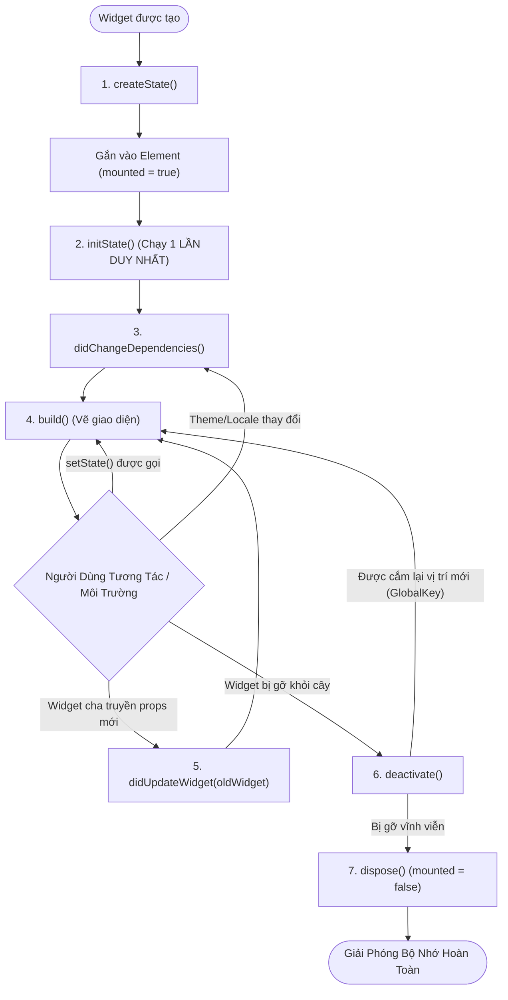

# Chuyên Đề 02 - Bài 03: Vòng Đời Chi Tiết Của State (The State Lifecycle)

> **Trọng tâm**: Trình tự thực thi chuẩn xác của 7 mốc vòng đời State, Trách nhiệm và điều cấm kỵ tại mỗi mốc, Lắng nghe tham số đổi từ cha bằng `didUpdateWidget`, Lắng nghe vòng đời hệ điều hành với `WidgetsBindingObserver`, và bộ câu hỏi thẩm định năng lực kỹ thuật chuyên sâu.

---

## 1. Bản Đồ Vòng Đời Toàn Diện Của Đối Tượng State

Vòng đời của một `State` kéo dài từ khi Widget được đưa vào cây cho đến khi bị gỡ bỏ hoàn toàn khỏi bộ nhớ:



---

## 2. Chi Tiết Từng Mốc Vòng Đời & Điều Cấm Kỵ

### 2.1. `initState()` - Khởi Tạo Ban Đầu
- **Tần suất chạy**: **Chỉ chạy đúng 1 lần duy nhất** khi đối tượng State được sinh ra.
- **Nhiệm vụ**:
  - Bắt buộc gọi `super.initState()`.
  - Khởi tạo `TextEditingController`, `AnimationController`, `ScrollController`.
  - Khởi tạo biến nội bộ, đăng ký lắng nghe Stream hoặc Notification.

> [!CAUTION]
> **Điều Cấm Kỵ Trong `initState()`**:  
> **KHÔNG ĐƯỢC** gọi các phương thức phụ thuộc vào `InheritedWidget` qua `context` (như `Theme.of(context)`, `MediaQuery.of(context)`).  
> *Lý do*: Tại thời điểm `initState()` chạy, Element chưa hoàn tất việc đăng ký liên kết kế thừa (Inherited dependencies) với cây tổ tiên. Gọi lúc này sẽ gây crash:  
> `dependOnInheritedWidgetOfExactType<_LocalizationsScope>() was called before initState() completed`.

---

### 2.2. `didChangeDependencies()` - Lắng Nghe Kế Thừa Thay Đổi
- **Tần suất chạy**: Chạy ngay sau `initState()`, và **chạy lại bất kỳ khi nào một `InheritedWidget` mà nó phụ thuộc thay đổi** (ví dụ: Người dùng đổi ngôn ngữ hệ thống, xoay màn hình đổi `MediaQuery`, hoặc chuyển sang Dark Mode).
- **Thích hợp cho**: Đọc dữ liệu từ `Theme.of(context)`, `MediaQuery.of(context)` để tính toán các thuộc tính nội bộ.

---

### 2.3. `didUpdateWidget(covariant T oldWidget)` - Bắt Kịp Thay Đổi Từ Cha
- **Tần suất chạy**: Mỗi khi Widget cha rebuild và truyền thuộc tính mới vào `Widget` con (trong khi `State` cũ vẫn được giữ lại).
- **Thực tế**: So sánh xem thuộc tính cũ (`oldWidget`) có khác thuộc tính mới (`widget`) hay không để cập nhật animation hoặc reload dữ liệu:

```dart
class UserAvatar extends StatefulWidget {
  final String imageUrl;
  const UserAvatar({super.key, required this.imageUrl});

  @override
  State<UserAvatar> createState() => _UserAvatarState();
}

class _UserAvatarState extends State<UserAvatar> {
  late ImageProvider _imageProvider;

  @override
  void initState() {
    super.initState();
    _imageProvider = NetworkImage(widget.imageUrl);
  }

  @override
  void didUpdateWidget(covariant UserAvatar oldWidget) {
    super.didUpdateWidget(oldWidget);
    // ✅ Kiểm tra xem ảnh truyền vào có bị thay đổi không
    if (oldWidget.imageUrl != widget.imageUrl) {
      // Cập nhật lại ImageProvider với URL mới
      _imageProvider = NetworkImage(widget.imageUrl);
    }
  }

  @override
  Widget build(BuildContext context) {
    return CircleAvatar(backgroundImage: _imageProvider);
  }
}
```

---

### 2.4. `deactivate()` vs `dispose()`

| Tiêu Chí | `deactivate()` | `dispose()` |
| :--- | :--- | :--- |
| **Bản chất** | Tạm thời tháo gỡ Element khỏi vị trí hiện tại trên cây. | Gỡ bỏ vĩnh viễn khỏi bộ nhớ (Unmounted permanently). |
| **Khả năng hồi sinh** | **Có thể**. Nếu widget có `GlobalKey`, nó có thể được cắm vào một nhánh cây khác ngay trong cùng khung hình. | **Không bao giờ**. Đối tượng State này đã chết, `mounted = false`. |
| **Nhiệm vụ** | Hiếm khi cần can thiệp. | **Bắt buộc**: Hủy controller (`_controller.dispose()`), hủy timer, hủy StreamSubscription. |

---

## 3. Lắng Nghe Vòng Đời Ứng Dụng OS Với `WidgetsBindingObserver`

Khi người dùng nhấn nút Home đưa app xuống Background, hoặc mở lại app từ màn hình đa nhiệm, làm sao để dừng phát video hoặc làm mới dữ liệu?  
👉 Sử dụng **`WidgetsBindingObserver`**:

```dart
class VideoPlayerScreen extends StatefulWidget {
  const VideoPlayerScreen({super.key});

  @override
  State<VideoPlayerScreen> createState() => _VideoPlayerScreenState();
}

class _VideoPlayerScreenState extends State<VideoPlayerScreen> 
    with WidgetsBindingObserver {

  @override
  void initState() {
    super.initState();
    // 1. Đăng ký lắng nghe sự kiện của OS
    WidgetsBinding.instance.addObserver(this);
  }

  @override
  void dispose() {
    // ⚠️ 2. Bắt buộc hủy đăng ký khi màn hình đóng
    WidgetsBinding.instance.removeObserver(this);
    super.dispose();
  }

  // 3. Hàm tự động kích hoạt khi trạng thái ứng dụng thay đổi
  @override
  void didChangeAppLifecycleState(AppLifecycleState state) {
    super.didChangeAppLifecycleState(state);

    switch (state) {
      case AppLifecycleState.resumed:
        debugPrint('▶️ App được mở lại trên màn hình: Tiếp tục phát video');
        break;
      case AppLifecycleState.inactive:
      case AppLifecycleState.paused:
        debugPrint('⏸️ App bị ẩn xuống nền: Tạm dừng phát video để tiết kiệm pin');
        break;
      case AppLifecycleState.detached:
      case AppLifecycleState.hidden:
        break;
    }
  }

  @override
  Widget build(BuildContext context) {
    return const Scaffold(body: Center(child: Text('Video Player')));
  }
}
```

---

## 🎯 4. Thẩm Định Năng Lực & Phân Tích Chuyên Sâu (Technical Competency & Deep Dive)

### Câu hỏi 1: Tại sao không được phép gọi `Theme.of(context)` hay `MediaQuery.of(context)` trong `initState()` nhưng lại hoàn toàn an toàn khi gọi trong `didChangeDependencies()`?
**Trả lời chuẩn 10/10**:
- **Bản chất của các hàm `of(context)`**: Khi bạn gọi `Theme.of(context)`, nó gọi ngầm phương thức `context.dependOnInheritedWidgetOfExactType<_InheritedTheme>()`. Phương thức này không chỉ lấy dữ liệu mà còn **đăng ký Element này vào danh sách người nghe (Dependent Elements) của InheritedWidget đó**.
- **Khi `initState()` chạy**: Element mới chỉ vừa được tạo và liên kết với State. Cây Element phía trên chưa hoàn tất việc kết nối các mối quan hệ kế thừa (Ancestry links). Flutter cố tình ném ra Exception để ngăn việc đăng ký phụ thuộc dở dang này.
- **Khi `didChangeDependencies()` chạy**: Cây Element đã kết nối hoàn chỉnh 100%. Đây là mốc vòng đời được Flutter thiết kế riêng cho mục đích thiết lập liên kết phụ thuộc với các `InheritedWidget`.

---

### Câu hỏi 2: Khi nào thì hàm `didUpdateWidget(covariant T oldWidget)` được kích hoạt? Cho một trường hợp thực tế bắt buộc phải xử lý logic trong hàm này.
**Trả lời chuẩn 10/10**:
- **Điều kiện kích hoạt**: Khi Widget cha rebuild và tạo ra một Widget con mới cùng kiểu (`runtimeType`) và cùng `Key` với Widget con cũ, nhưng có **tham số truyền vào bị thay đổi** (ví dụ: `child: ProductItem(price: newPrice)`).
- **Trường hợp thực tế bắt buộc**:
  - Giả sử bạn có widget phát nhạc `AudioPlayerWidget(audioUrl: url)`. State của widget này duy trì một đối tượng `AudioPlayerController` được khởi tạo trong `initState()`.
  - Khi người dùng bấm bài hát tiếp theo trong playlist, Widget cha truyền vào `audioUrl` mới.
  - Vì `State` được tái sử dụng, `initState()` **sẽ không bao giờ chạy lại**!
  - Nếu không có `didUpdateWidget`, máy nghe nhạc sẽ tiếp tục phát bài hát cũ! Bạn **bắt buộc** phải viết trong `didUpdateWidget`:
    ```dart
    if (oldWidget.audioUrl != widget.audioUrl) {
      _controller.loadNewAudio(widget.audioUrl);
    }
    ```

---

### Câu hỏi 3: Phân biệt sự khác nhau giữa `deactivate()` và `dispose()` trong vòng đời của State.
**Trả lời chuẩn 10/10**:
- **`deactivate()`**:
  - Được gọi khi Element bị tạm thời gỡ bỏ khỏi cây Widget hiện tại.
  - Ở mốc này, Element chỉ nằm trong danh sách "chờ xử lý" (inactive list) của khung hình đó. Nếu Widget đó có một `GlobalKey` và được gắn vào một vị trí mới trên cây trước khi khung hình kết thúc (ví dụ: di chuyển một widget từ Tab A sang Tab B hoặc Hero Animation), Element và State đó sẽ được "hồi sinh" và cắm vào nhánh mới mà không bị tiêu hủy.
- **`dispose()`**:
  - Nếu đến cuối khung hình (End of frame), Element đó vẫn nằm trong inactive list và không được tái sử dụng ở bất kỳ đâu, Flutter sẽ coi nó đã chết vĩnh viễn và gọi `dispose()`.
  - Lúc này `mounted = false`, State bị ngắt kết nối hoàn toàn khỏi cây. Mọi thao tác gọi `setState()` sau thời điểm này đều gây crash ứng dụng. Đây là nơi duy nhất để giải phóng tài nguyên phần cứng.
