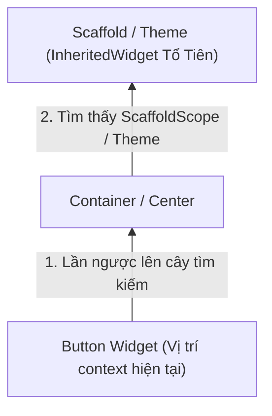

# Chuyên Đề 02 - Bài 04: Bản Chất Của BuildContext & Cách Tra Cứu Trên Cây

> **Trọng tâm**: Bản chất thực sự của `BuildContext` (Chính là `Element`), Cơ chế tra cứu cây ngược lên tổ tiên (`InheritedWidget` vs `AncestorState`), Xử lý khoảng trống bất đồng bộ (Async Gaps) với `context.mounted`, Lỗi kinh điển `Scaffold.of() called with a context that does not include a Scaffold`, và bộ câu hỏi thẩm định năng lực kỹ thuật chuyên sâu.

---

## 1. Bản Chất Thực Sự Của `BuildContext` Là Gì?

Hầu như mọi hàm trong Flutter đều nhận tham số `BuildContext context`. Nhưng thực chất `BuildContext` là gì?

Nếu bạn mở mã nguồn Flutter SDK:
```dart
abstract class BuildContext {
  Widget get widget;
  BuildOwner? get owner;
  bool get mounted;
  T? dependOnInheritedWidgetOfExactType<T extends InheritedWidget>();
  T? findAncestorStateOfType<T extends State>();
  T? findAncestorWidgetOfExactType<T extends Widget>();
  ...
}

abstract class Element extends DiagnosticableTree implements BuildContext {
  // Element CHÍNH LÀ BuildContext!
}
```

> [!IMPORTANT]
> **Khám Phá Cốt Lõi**:  
> `BuildContext` không phải là một đối tượng huyền bí; nó **chính là `Element`** đóng vai trò là một vị trí tọa độ (location/handle) cụ thể của Widget đó trên cây Element!  
> Thông qua `context`, Flutter biết chính xác widget hiện tại đang đứng ở đâu, cha của nó là ai, và làm thế nào để lần ngược lên trên để tìm kiếm dữ liệu.

---

## 2. Các Cơ Chế Tra Cứu Cây Qua Context



Flutter cung cấp các phương thức tra cứu chính:

### 2.1. Tra cứu kèm Đăng ký lắng nghe (`dependOnInheritedWidgetOfExactType`)
- **Ví dụ**: `Theme.of(context)`, `MediaQuery.of(context)`.
- **Hành vi**: Không chỉ lấy dữ liệu từ tổ tiên, mà còn **đăng ký một liên kết phụ thuộc (dependency link)**. Khi dữ liệu của tổ tiên thay đổi (ví dụ: người dùng đổi sang Dark Mode), Widget tại `context` này **sẽ tự động được đánh dấu để rebuild**!

### 2.2. Tra cứu tĩnh không đăng ký rebuild (`findAncestorStateOfType`)
- **Ví dụ**: `Navigator.of(context)`, `ScaffoldMessenger.of(context)`.
- **Hành vi**: Chỉ đơn thuần duyệt ngược lên trên cây để lấy đối tượng State (như `NavigatorState`) để thực hiện một hành động (như `.push()`, `.pop()`, `.showSnackBar()`). Nó **không đăng ký lắng nghe rebuild**.

### 2.3. Lấy Navigator ở tầng gốc cao nhất (`findRootAncestorStateOfType`)
Khi bạn đang ở trong một Tab của `BottomNavigationBar` và muốn mở một màn hình Dialog toàn trang phủ đè lên cả thanh BottomBar, bạn cần tìm Navigator ở tầng gốc cao nhất:
```dart
Navigator.of(context, rootNavigator: true).push(...);
```

---

## 3. An Toàn BuildContext Khi Chạy Bất Đồng Bộ (Async Gaps)

Một lỗi rất phổ biến khiến ứng dụng Flutter văng bất ngờ:

```dart
void _onSaveButtonPressed(BuildContext context) async {
  // 1. Chờ gọi API lưu dữ liệu mất 2 giây...
  await apiService.saveData();

  // 2. ⚠️ NGUY HIỂM: Trong 2 giây đó, người dùng đã bấm Back thoát màn hình!
  // Element đại diện cho context này đã bị unmount vĩnh viễn khỏi cây.
  // Gọi Navigator hoặc ScaffoldMessenger lúc này sẽ ném lỗi:
  // "Looking up a deactivated widget's ancestor is unsafe."
  ScaffoldMessenger.of(context).showSnackBar(const SnackBar(content: Text('Lưu thành công!')));
}
```

### ✅ Giải Pháp Chuẩn Flutter 3.7+: `context.mounted`

Flutter 3.7 bổ sung getter `mounted` trực tiếp trên interface `BuildContext`:

```dart
void _onSaveButtonPressed(BuildContext context) async {
  await apiService.saveData();

  // ✅ Kiểm tra context còn sống trên cây hay không trước khi sử dụng:
  if (!context.mounted) return;

  ScaffoldMessenger.of(context).showSnackBar(
    const SnackBar(content: Text('Lưu thành công!')),
  );
}
```

---

## 4. Lỗi Kinh Điển: "Context Does Not Include A Scaffold"

```dart
class MyScreen extends StatelessWidget {
  const MyScreen({super.key});

  @override
  Widget build(BuildContext context) {
    return Scaffold(
      appBar: AppBar(title: const Text('Demo')),
      body: Center(
        child: ElevatedButton(
          onPressed: () {
            // ❌ CRASH: Scaffold.of() called with a context that does not include a Scaffold.
            Scaffold.of(context).openDrawer();
          },
          child: const Text('Mở Menu Drawer'),
        ),
      ),
      drawer: const Drawer(),
    );
  }
}
```

### Cách Khắc Phục Bằng Widget `Builder`:

```dart
@override
Widget build(BuildContext context) {
  return Scaffold(
    appBar: AppBar(title: const Text('Demo')),
    body: Center(
      // ✅ Bọc trong Builder để sinh ra newContext nằm BÊN DƯỚI Scaffold
      child: Builder(
        builder: (BuildContext newContext) {
          return ElevatedButton(
            onPressed: () {
              // newContext bây giờ tra ngược lên sẽ TÌM THẤY Scaffold ngay lập tức!
              Scaffold.of(newContext).openDrawer();
            },
            child: const Text('Mở Menu Drawer'),
          );
        },
      ),
    ),
    drawer: const Drawer(),
  );
}
```

---

## 🎯 5. Thẩm Định Năng Lực & Phân Tích Chuyên Sâu (Technical Competency & Deep Dive)

### Câu hỏi 1: `BuildContext` thực chất là gì trong mã nguồn lõi của Flutter SDK? Tại sao nó lại là một abstract class thay vì một concrete class?
**Trả lời chuẩn 10/10**:
- **Bản chất**: `BuildContext` chính là đối tượng **`Element`**. Trong mã nguồn Flutter, class `Element` thực thi giao diện `BuildContext` (`abstract class Element implements BuildContext`).
- **Mục đích thiết kế (Encapsulation)**: Đội ngũ kỹ sư Google cố tình tạo ra abstract class `BuildContext` với các hàm có giới hạn an toàn (`dependOnInheritedWidgetOfExactType`, `findAncestorStateOfType`) nhằm mục đích **ẩn giấu toàn bộ các API nguy hiểm của `Element`** (như `markNeedsBuild`, `mount`, `unmount`, `attachRenderObject`). Lập trình viên thông thường chỉ cần tra cứu thông tin vị trí cây mà không được phép trực tiếp can thiệp làm sai lệch cấu trúc Element Tree.

---

### Câu hỏi 2: Phân biệt `dependOnInheritedWidgetOfExactType<T>()` và `findAncestorWidgetOfExactType<T>()` về mặt chi phí và hành vi đăng ký Rebuild.
**Trả lời chuẩn 10/10**:
- **`dependOnInheritedWidgetOfExactType<T>()`**:
  - Chỉ tìm kiếm các widget kế thừa từ `InheritedWidget`.
  - Tốc độ tra cứu đạt **$O(1)$** nhờ bảng băm `_inheritedElements` được Element lưu sẵn.
  - **Có đăng ký Rebuild**: Nó thêm Element hiện tại vào danh sách người nghe của `InheritedWidget`. Khi dữ liệu thay đổi, Element này sẽ bị rebuild tự động.
- **`findAncestorWidgetOfExactType<T>()`**:
  - Có thể tìm kiếm bất kỳ loại Widget nào (kể cả StatelessWidget hay StatefulWidget).
  - Tốc độ tra cứu là **$O(N)$** vì Flutter phải duyệt thủ công từng nốt cha ngược lên gốc cây.
  - **Không đăng ký Rebuild**: Nó chỉ đọc cấu hình tĩnh của widget cha tại thời điểm gọi. Khi widget cha thay đổi, widget con này **sẽ không tự động rebuild**. Google khuyến cáo hạn chế dùng hàm này vì chi phí $O(N)$ lớn khi cây widget sâu.

---

### Câu hỏi 3: Giải thích cảnh báo lint `use_build_context_synchronously` và sự khác nhau giữa `mounted` (của State) và `context.mounted` (của BuildContext).
**Trả lời chuẩn 10/10**:
- **Cảnh báo lint**: Xuất hiện khi bạn sử dụng biến `context` sau một lệnh `await`. Vì tác vụ bất đồng bộ có thể mất vài giây, trong thời gian đó người dùng có thể đã rời khỏi màn hình, khiến Element bị gỡ bỏ (unmounted). Nếu tiếp tục dùng `context` đó, ứng dụng sẽ ném lỗi crash.
- **Sự khác nhau**:
  - **`mounted` (trong class `State`)**: Là getter boolean kiểm tra xem đối tượng State này có còn đang được gắn vào một `StatefulElement` hay không. Chỉ dùng được bên trong `StatefulWidget`.
  - **`context.mounted` (Flutter 3.7+)**: Là getter boolean trực tiếp trên `BuildContext`. Có thể dùng ở bất kỳ đâu có `BuildContext` (kể cả trong `StatelessWidget`, hàm callback rời, hoặc trong các service nhận tham số `context`).
