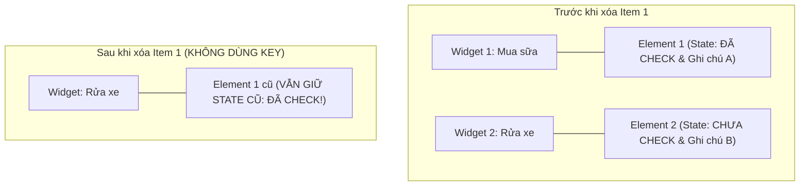
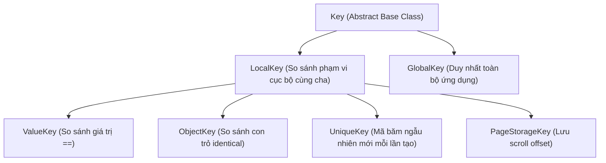

# Chuyên Đề 02 - Bài 05: Cơ Chế Của Keys & Các Trường Hợp Bắt Buộc Sử Dụng

> **Trọng tâm**: Bản chất của `Key` trong thuật toán Diffing, Lỗi mất đồng bộ State kinh điển khi xóa hoặc đổi chỗ phần tử trong danh sách, Phân cấp `LocalKey` vs `GlobalKey`, Kỹ thuật đo tọa độ màn hình với `GlobalKey`, và bộ câu hỏi thẩm định năng lực kỹ thuật chuyên sâu.

---

## 1. Khi Nào Thực Sự Cần Đến `Key`?

Hầu như mọi constructor của Widget đều nhận tham số `Key? key`. Nhưng 90% trường hợp dựng giao diện tĩnh, bạn không cần truyền `key`.

> [!IMPORTANT]
> **Quy Tắc Vàng Khi Dùng Key Của Google**:  
> Bạn **BẮT BUỘC** phải dùng `Key` khi:  
> Có các **StatefulWidget cùng loại (same runtimeType)** nằm chung trong cùng một danh sách con (cùng parent), và danh sách này có thể **thay đổi thứ tự, thêm mới, hoặc xóa bớt phần tử**.

---

## 2. Bug Kinh Điển: Xóa Phần Tử Trong Danh Sách Không Dùng Key

Hãy tưởng tượng bạn có một danh sách các công việc cần làm (`TodoItemWidget`), mỗi item là một `StatefulWidget` có một ô Checkbox đánh dấu hoàn thành và một ô nhập ghi chú.



### Chuyện Gì Đã Xảy Ra?
1. Người dùng bấm nút xóa "Mua sữa" (Item 1).
2. Danh sách Widget mới chỉ còn 1 phần tử duy nhất: "Rửa xe".
3. Flutter so sánh phần tử đầu tiên của cây cũ và cây mới bằng thuật toán:  
   `Widget.canUpdate: oldWidget.runtimeType == newWidget.runtimeType`  
   Cả hai đều là `TodoItemWidget`, và cả hai đều có `key == null`!
4. Kết quả: **Flutter tái sử dụng lại `Element 1` cũ!**
5. Hậu quả: Dòng chữ hiển thị là "Rửa xe", nhưng ô Checkbox lại hiển thị trạng thái **ĐÃ CHECK** và ghi chú của item cũ vừa bị xóa! 💥

---

## 3. Cách Khắc Phục: Sử Dụng `ValueKey`

Chỉ cần gán một `ValueKey` mang mã định danh duy nhất (Unique ID) của dữ liệu:

```dart
ListView(
  children: todos.map((todo) {
    return TodoItemWidget(
      // ✅ BẮT BUỘC: Giúp Flutter map chính xác Widget với đúng Element của nó!
      key: ValueKey(todo.id), 
      todo: todo,
    );
  }).toList(),
)
```

Khi có `ValueKey`, nếu Item 1 bị xóa, Flutter thấy `oldWidget.key != newWidget.key`, nó sẽ hủy bỏ `Element 1` và giữ lại đúng `Element 2` của "Rửa xe".

---

## 4. Bảng Phân Cấp & So Sánh Các Loại Key



| Loại Key | Định Nghĩa & Cách Hoạt Động | Trường Hợp Sử Dụng Thực Tế |
| :--- | :--- | :--- |
| **`ValueKey<T>`** | So sánh dựa trên toán tử bằng (`operator ==`) của giá trị truyền vào (thường là `int` id hoặc `String` uuid). | Các item trong danh sách (List, Grid) có ID duy nhất từ Database hoặc API. |
| **`ObjectKey`** | So sánh dựa trên địa chỉ tham chiếu vùng nhớ (`identical`) của object. | Khi các đối tượng trong list không có ID số duy nhất nhưng bản thân đối tượng là duy nhất. |
| **`UniqueKey`** | Mỗi lần khởi tạo sinh ra một mã băm ngẫu nhiên hoàn toàn mới. | Muốn **ép buộc** Flutter hủy hoàn toàn và tạo lại một Widget/State từ đầu (ví dụ: reset lại video player hoặc reload webview). |
| **`PageStorageKey`** | Lưu trữ vị trí cuộn (Scroll offset) vào bộ nhớ tạm của trang. | Giữ nguyên vị trí cuộn khi người dùng chuyển qua lại giữa các Tabs trong `BottomNavigationBar` hoặc `TabBarView`. |
| **`GlobalKey`** | Duy nhất trong **toàn bộ ứng dụng**. Cho phép truy cập trực tiếp vào đối tượng State con từ bên ngoài. | Validate Form: `GlobalKey<FormState>()` hoặc lấy vị trí tọa độ màn hình của một widget. |

---

## 5. Kỹ Thuật: Đo Tọa Độ Màn Hình Thực Tế Bằng `GlobalKey`

Khi làm hiệu ứng Tooltip chỉ dẫn (Showcase) hoặc menu Popup bay đúng vị trí nút bấm:

```dart
class TargetButtonWithPosition extends StatelessWidget {
  final GlobalKey _buttonKey = GlobalKey();

  void _getButtonCoordinates() {
    // 1. Lấy BuildContext từ GlobalKey
    final currentContext = _buttonKey.currentContext;
    if (currentContext == null) return;

    // 2. Tìm đối tượng RenderBox vẽ giao diện
    final renderBox = currentContext.findRenderObject() as RenderBox?;
    if (renderBox == null) return;

    // 3. Lấy kích thước thực tế
    final size = renderBox.size;
    print('Chiều rộng: ${size.width}, Chiều cao: ${size.height}');

    // 4. Chuyển đổi tọa độ cục bộ sang tọa độ toàn màn hình điện thoại:
    final globalOffset = renderBox.localToGlobal(Offset.zero);
    print('Tọa độ X: ${globalOffset.dx}, Tọa độ Y: ${globalOffset.dy}');
  }

  @override
  Widget build(BuildContext context) {
    return ElevatedButton(
      key: _buttonKey,
      onPressed: _getButtonCoordinates,
      child: const Text('Đo tọa độ của tôi'),
    );
  }
}
```

---

## 🎯 6. Thẩm Định Năng Lực & Phân Tích Chuyên Sâu (Technical Competency & Deep Dive)

### Câu hỏi 1: Tại sao việc xóa một item trong danh sách các StatefulWidget không có `Key` lại dẫn đến việc item còn lại giữ nhầm State của item vừa bị xóa?
**Trả lời chuẩn 10/10**:
- **Bản chất**: Thuật toán Diffing của Flutter khi duyệt qua danh sách con (`children`) vận hành theo **thứ tự chỉ số tuần tự (Sequential Index Matching)**:
  - Nó lấy phần tử con thứ 0 của mảng mới so sánh với phần tử thứ 0 của mảng cũ.
- Khi không có `Key`, phép so sánh `Widget.canUpdate(oldWidget, newWidget)` chỉ kiểm tra `runtimeType`. Vì cả hai item đều cùng loại class, phép kiểm tra trả về `true`.
- Do đó, Flutter **tái sử dụng lại Element thứ 0 cũ** (vốn đang liên kết với đối tượng State thứ 0 của item vừa bị xóa) và gán Widget mới vào. State cũ này không hề bị hủy mà tiếp tục giữ nguyên dữ liệu của nó (checkbox, text input).
- **Khi có `Key`**: Flutter phát hiện `oldWidget.key != newWidget.key`, nó lập tức hủy liên kết tuần tự và thực hiện tra cứu theo bảng ánh xạ Key để tìm đúng Element có cùng Key, giải quyết triệt để lỗi mất đồng bộ state.

---

### Câu hỏi 2: Phân biệt `ValueKey`, `ObjectKey` và `UniqueKey`. Khi nào bắt buộc phải dùng `UniqueKey`?
**Trả lời chuẩn 10/10**:
- **`ValueKey<T>`**: So sánh bằng giá trị (`==`). Dùng khi bạn có một chuỗi hoặc số duy nhất (như `ValueKey(user.id)`).
- **`ObjectKey`**: So sánh bằng địa chỉ ô nhớ (`identical`). Dùng khi object không có trường ID riêng, nhưng bạn muốn phân biệt các instance object khác nhau trong bộ nhớ.
- **`UniqueKey`**: Luôn sinh ra một mã định danh duy nhất không trùng lặp với bất kỳ ai, kể cả với chính nó ở lần khởi tạo sau.
- **Khi nào BẮT BUỘC dùng `UniqueKey`**: Khi bạn muốn **ép buộc Flutter không được phép tái sử dụng Element/State cũ**, mà bắt buộc phải hủy hoàn toàn và sinh lại từ đầu. Ví dụ: Bạn có một Video Player hoặc Camera Preview bị lỗi và muốn khi người dùng bấm nút "Khởi động lại", toàn bộ `StatefulWidget` đó phải được đập đi xây lại từ `initState()` mà không tái sử dụng controller cũ.

---

### Câu hỏi 3: Tại sao Google khuyến cáo hạn chế tối đa việc lạm dụng `GlobalKey` trong các dự án Production?
**Trả lời chuẩn 10/10**:
- **Chi phí bộ nhớ toàn cục (Global Registry)**: Mỗi `GlobalKey` bắt buộc Flutter phải duy trì một mục nhập trong bảng tra cứu toàn cục `_globalKeyRegistry`. Điều này làm tăng áp lực bộ nhớ và làm chậm quá trình duyệt cây.
- **Chi phí Reparenting rất đắt đỏ**: Nếu bạn di chuyển một Widget có `GlobalKey` sang vị trí khác trên cây, Flutter phải tháo gỡ toàn bộ RenderObject tree của nhánh đó và gắn lại vào cây mới, kích hoạt lại các phép tính toán layout và paint phức tạp.
- **Phá vỡ tính đóng gói (Encapsulation)**: `GlobalKey` cho phép bất kỳ class nào ở bất kỳ đâu cũng có thể chọc thẳng vào đối tượng `State` con để thay đổi thuộc tính (`key.currentState`), biến code thành dạng Spaghetti phụ thuộc lẫn nhau, cực kỳ khó viết Unit Test và bảo trì.
