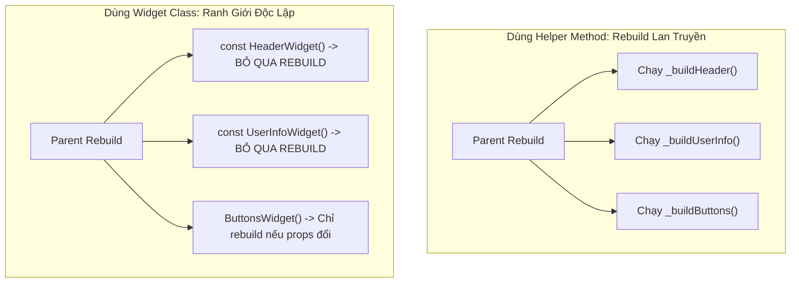
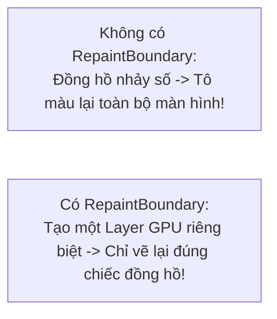

# Chuyên Đề 02 - Bài 06: Tối Ưu Hóa Rebuild & Các Anti-Patterns Thường Gặp

> **Trọng tâm**: Cuộc tranh luận kinh điển: Helper Methods (`Widget _buildItem()`) vs Widget Classes (`class Item extends StatelessWidget`), Duy trì State của Tab bằng `AutomaticKeepAliveClientMixin`, Cách ly vùng vẽ GPU với `RepaintBoundary`, và bộ câu hỏi thẩm định năng lực kỹ thuật chuyên sâu.

---

## 1. Anti-Pattern Số 1: Tách UI Bằng Helper Method (`_buildChild()`)

Rất nhiều lập trình viên khi thấy hàm `build()` dài trên 200 dòng thường có thói quen tách nhỏ code bằng cách viết các hàm phụ trợ nội bộ:

```dart
class BadProfileScreen extends StatelessWidget {
  const BadProfileScreen({super.key});

  @override
  Widget build(BuildContext context) {
    return Column(
      children: [
        _buildHeader(), // ❌ HELPER METHOD
        _buildUserInfo(), // ❌ HELPER METHOD
        _buildActionButtons(), // ❌ HELPER METHOD
      ],
    );
  }

  // ❌ ANTI-PATTERN:
  Widget _buildHeader() {
    return Container(
      height: 100,
      color: Colors.blue,
      child: const Text('Header'),
    );
  }
}
```

---

## 2. Tại Sao Google Khuyên BẮT BUỘC Phải Dùng Widget Class?

| Tiêu Chí | Helper Method (`Widget _buildX()`) | Widget Class (`class X extends StatelessWidget`) |
| :--- | :--- | :--- |
| **Khả năng dùng `const`** | **KHÔNG THỂ**. Mỗi lần hàm `build()` cha chạy, các hàm method đều bị gọi lại từ đầu. | **CÓ THỂ**. Dùng `const XWidget()` giúp Flutter bỏ qua hoàn toàn việc gọi lại hàm build của nó! |
| **Phạm vi Rebuild (Rebuild Scope)** | **Không có ranh giới**. Khi cha rebuild, toàn bộ thân hàm helper bị ép chạy lại 100%. | **Tạo ranh giới độc lập**. Widget con có `Element` riêng, có thể tự rebuild mà không làm phiền cha, hoặc cha rebuild mà con được giữ nguyên. |
| **Sử dụng `BuildContext`** | **Dùng chung context của cha**. Dễ tra cứu nhầm vị trí trên cây Element. | **Có `BuildContext` riêng biệt**. Xác định chính xác vị trí cây con của chính nó. |
| **Flutter DevTools Inspector** | Cây Widget bị phẳng lì, không hiện tên phương thức, cực kỳ khó debug. | Hiện tên Class rõ ràng trên cây Widget (`HeaderWidget`, `UserInfoWidget`), dễ soi layout. |



### ✅ Cách Làm Chuẩn:

```dart
class GoodProfileScreen extends StatelessWidget {
  const GoodProfileScreen({super.key});

  @override
  Widget build(BuildContext context) {
    return const Column(
      children: [
        HeaderWidget(), // ✅ Tách thành Widget class riêng
        UserInfoWidget(),
        ActionButtonsWidget(),
      ],
    );
  }
}

class HeaderWidget extends StatelessWidget {
  const HeaderWidget({super.key});

  @override
  Widget build(BuildContext context) {
    return Container(height: 100, color: Colors.blue, child: const Text('Header'));
  }
}
```

---

## 3. Giữ Trạng Thái Cuộn & Dữ Liệu Của Tab Với `AutomaticKeepAliveClientMixin`

Trong `TabBarView` hoặc `PageView`, mặc định khi người dùng vuốt sang Tab 2, Tab 1 sẽ bị Flutter **gỡ bỏ hoàn toàn (`dispose`)** để tiết kiệm RAM.  
$\rightarrow$ Khi vuốt ngược lại Tab 1, màn hình phải load lại API từ đầu và mất vị trí cuộn!

### Giải Pháp: `AutomaticKeepAliveClientMixin`
Nhúng mixin này vào State của Tab mà bạn muốn giữ sống trong bộ nhớ:

```dart
class NewsTabContent extends StatefulWidget {
  const NewsTabContent({super.key});

  @override
  State<NewsTabContent> createState() => _NewsTabContentState();
}

// 1. Nhúng AutomaticKeepAliveClientMixin
class _NewsTabContentState extends State<NewsTabContent>
    with AutomaticKeepAliveClientMixin {

  // 2. Bắt buộc trả về true để yêu cầu Flutter giữ sống State này
  @override
  bool get wantKeepAlive => true;

  @override
  Widget build(BuildContext context) {
    // 3. BẮT BUỘC gọi super.build(context) ở đầu hàm build!
    super.build(context);

    return ListView.builder(
      itemCount: 100,
      itemBuilder: (context, i) => ListTile(title: Text('Bài báo số #$i')),
    );
  }
}
```

---

## 4. Cách Ly Vùng Vẽ GPU Với `RepaintBoundary`

Khi một widget nhỏ trên màn hình liên tục thay đổi (ví dụ: kim đồng hồ tích tắc mỗi giây, sóng âm thanh dao động), mặc định Flutter có thể vẽ lại (repaint) **toàn bộ cả màn hình** vì chúng nằm chung trong một Render Layer của GPU!



```dart
// Bọc widget có tần suất vẽ liên tục bằng RepaintBoundary:
RepaintBoundary(
  child: ContinuousLiveTickerWidget(),
)
```

> [!TIP]
> **Cách kiểm tra Repaint bằng DevTools**:  
> Bật cờ `debugPaintRepaintRainbowEnabled = true;` trong `main()`. Mỗi khi một vùng màn hình bị vẽ lại, nó sẽ viền một dải màu cầu vồng. Nếu thấy cả màn hình đổi màu liên tục chỉ vì một icon xoay tròn, đó là lúc bạn cần bọc icon đó bằng `RepaintBoundary`!

---

## 🎯 5. Thẩm Định Năng Lực & Phân Tích Chuyên Sâu (Technical Competency & Deep Dive)

### Câu hỏi 1: Tại sao việc chia nhỏ Widget bằng Helper Method (`Widget _buildSomething()`) lại là một Anti-Pattern nghiêm trọng so với việc tách thành một `StatelessWidget` độc lập?
**Trả lời chuẩn 10/10**:
- **Không tận dụng được `const`**: Helper method được thực thi như một hàm thông thường. Nó không thể được gán từ khóa `const`, do đó Flutter Engine không thể thực hiện phép so sánh con trỏ `identical` để bỏ qua việc thực thi thân hàm.
- **Phá vỡ Ranh giới Rebuild (Rebuild Boundary)**: Helper method không có đối tượng `Element` của riêng nó; nó sử dụng chung `BuildContext` và `Element` của widget cha. Khi widget cha gọi `setState()`, mã nguồn trong helper method **bắt buộc phải thực thi lại toàn bộ**, dẫn đến việc sinh ra nhiều đối tượng con thừa thãi không cần thiết. Ngược lại, một `StatelessWidget` độc lập sở hữu một `StatelessElement` riêng, tạo nên một rào cản ngăn chặn sự lan truyền rebuild.
- **Khả năng tối ưu của Framework**: Khi là một class Widget riêng, Flutter có thể tối ưu hóa việc phân nhánh cập nhật, ghi nhớ cache trong Element tree, và cho phép các công cụ như Flutter DevTools Inspector hiển thị chính xác tên cấu trúc component để debug.

---

### Câu hỏi 2: Trình bày cơ chế hoạt động của `AutomaticKeepAliveClientMixin`. Tại sao phải gọi `super.build(context)`?
**Trả lời chuẩn 10/10**:
- **Cơ chế hoạt động**: Mặc định, các danh sách cuộn ảo hóa (`ListView`, `PageView`, `TabBarView`) sẽ tháo gỡ (unmount) các item trôi ra khỏi tầm nhìn (Viewport). Khi một State nhúng `AutomaticKeepAliveClientMixin` và đặt `wantKeepAlive = true`, nó sẽ gửi một thông điệp `KeepAliveNotification` lên widget tổ tiên quản lý (`KeepAliveHandle`).
- Tổ tiên sẽ không tiêu hủy Element của Tab đó khi nó trôi ra ngoài tầm nhìn mà giữ nó lại trong một danh sách lưu trữ ẩn.
- **Tại sao phải gọi `super.build(context)`**: Phương thức `super.build(context)` trong mixin chứa logic lắng nghe và đăng ký handle với `KeepAliveHandle`. Nếu quên gọi dòng này ở đầu hàm `build()`, cờ keep-alive sẽ không được kích hoạt và trạng thái của Tab vẫn bị hủy bỏ như bình thường.

---

### Câu hỏi 3: Phân biệt `Rebuild` (Cây Widget/Element) và `Repaint` (Cây RenderObject/Layer). Khi nào nên dùng `RepaintBoundary`?
**Trả lời chuẩn 10/10**:
- **Rebuild (Cây Widget)**: Là quá trình gọi hàm `build()` để tính toán lại cấu hình Widget. Diễn ra trên CPU.
- **Repaint (Cây RenderObject)**: Là quá trình gọi hàm `paint()` để ra lệnh cho GPU vẽ các điểm ảnh (Pixels) lên màn hình.
- **Mối quan hệ**: Một Widget bị Rebuild **chưa chắc** đã bị Repaint (nếu kết quả layout/visual không đổi). Ngược lại, một Widget có thể bị Repaint mà không cần Rebuild (ví dụ: cuộn danh sách dịch chuyển vị trí pixel).
- **Khi nào dùng `RepaintBoundary`**:
  - Dùng khi bạn có một vùng con trên màn hình **thay đổi hình ảnh liên tục với tần suất cao** (ví dụ: Custom Animation, Canvas vẽ tay, Video Player, Đồng hồ đếm ngược), trong khi các phần còn lại của màn hình là tĩnh.
  - `RepaintBoundary` yêu cầu Flutter tách vùng đó thành một **GPU Texture Layer riêng biệt**. Khi widget con vẽ lại, GPU chỉ tổng hợp lại layer đó mà không cần vẽ lại toàn bộ nền tĩnh xung quanh.
