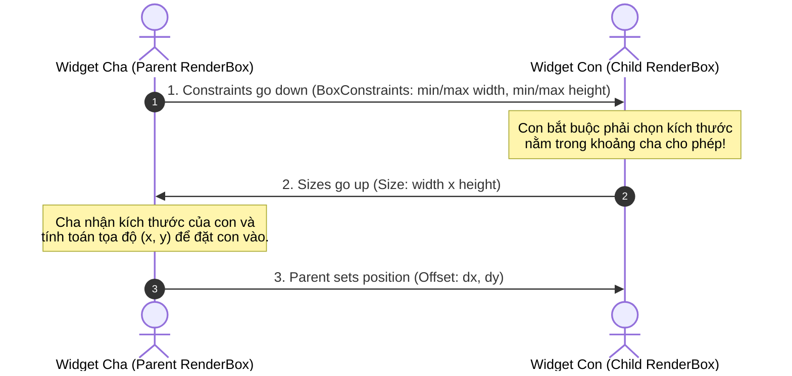
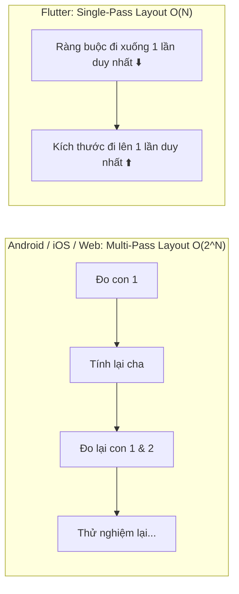

# Chuyên Đề 03 - Bài 01: Quy Tắc Vàng Layout: "Constraints Go Down, Sizes Go Up"

> **Trọng tâm**: Định luật bố cục bất biến số 1 của Flutter, Thuật toán Single-Pass Layout $O(N)$ (tại sao Flutter không bao giờ bị nghẽn đo đạc như Android/iOS), Cơ chế đàm phán kích thước 3 bước, và Bộ câu hỏi phỏng vấn chuẩn Google.

---

## 1. Định Luật Bố Cục Bất Biến Của Google

Trong tài liệu chính thức của Flutter, đội ngũ kỹ sư Google tóm gọn toàn bộ hệ thống layout chỉ trong một câu khẩu quyết duy nhất:

> ### *"Constraints go down. Sizes go up. Parent sets position."*  
> *(Ràng buộc truyền xuống. Kích thước báo lên. Cha quyết định vị trí.)*



---

## 2. Tại Sao Thuật Toán Layout Của Flutter Luôn Đạt Tốc Độ Tuyệt Đối $O(N)$?

Trong các hệ thống layout truyền thống (Android XML với `RelativeLayout`, iOS AutoLayout hoặc Web CSS):
- Khi cây giao diện lồng nhau sâu, hệ thống thường phải thực hiện **đo đạc nhiều lượt (Multi-pass Layout)**: Đo thử lần 1 $\rightarrow$ quay lại tính toán $\rightarrow$ đo lại lần 2 $\rightarrow$ chỉnh sửa.
- Độ phức tạp có thể bùng nổ lên thành cấp số nhân $O(2^N)$ trong trường hợp xấu nhất, gây giật lag (frame drop) khi cuộn các danh sách phức tạp.



### Triết Lý Single-Pass Của Flutter:
- Ràng buộc đi xuống **đúng một lần duy nhất**.
- Kích thước đi lên **đúng một lần duy nhất**.
- Mỗi `RenderBox` trên cây chỉ được ghé thăm tối đa 2 lần (lượt đi xuống và lượt đi lên).
- $\rightarrow$ **Độ phức tạp luôn luôn là $O(N)$ tuyến tính thuần túy**, với $N$ là tổng số widget. Đây là lý do Flutter có thể cuộn danh sách phức tạp ở tốc độ 120 FPS nhẹ như không!

---

## 3. Giải Mã 3 Bước Đàm Phán Layout

### Bước 1: Ràng Buộc Truyền Xuống (Constraints Go Down)
Widget cha gửi cho con một `BoxConstraints` gồm 4 con số: `minWidth`, `maxWidth`, `minHeight`, `maxHeight`.  
*Ví dụ*: Cửa sổ điện thoại gửi xuống: `minWidth: 360, maxWidth: 360, minHeight: 780, maxHeight: 780`.

### Bước 2: Kích Thước Báo Lên (Sizes Go Up)
Widget con tự tính toán nội dung của nó và chọn một kích thước `Size(width, height)`.

> [!IMPORTANT]
> **Quy Tắc Ép Buộc (Clamping Rule)**:  
> Kích thước con chọn **bắt buộc phải nằm trong phạm vi ràng buộc** của cha:  
> $$\text{minWidth} \le \text{width} \le \text{maxWidth}$$  
> $$\text{minHeight} \le \text{height} \le \text{maxHeight}$$  
> Nếu con cố tình đòi rộng 500px trong khi `maxWidth` cha cho phép chỉ là 360px, Flutter sẽ **tự động cắt gọt (clamp)** kích thước của con về đúng 360px!

### Bước 3: Cha Quyết Định Vị Trí (Parent Sets Position)
Sau khi con báo kích thước, **Widget cha sẽ tính toán tọa độ `Offset(dx, dy)` để đặt con vào**.
Widget con **hoàn toàn không thể tự đặt tọa độ (x, y) của nó**; chỉ có widget cha mới có quyền quyết định con nằm ở đâu!

---

## 4. Câu Đố Kinh Điển Về Layout Trong Phỏng Vấn

Hãy xem đoạn code sau và dự đoán: **Khối Container màu đỏ sẽ có kích thước bao nhiêu?**

```dart
void main() {
  runApp(
    Container(
      color: Colors.red,
      width: 100,
      height: 100,
    ),
  );
}
```

### Kết quả bất ngờ:
Khối Container màu đỏ **sẽ phủ kín 100% toàn bộ màn hình điện thoại** (thay vì kích thước 100x100 như bạn chỉ định)!

### Tại sao lại như vậy?
1. `runApp` gắn `Container` trực tiếp vào khung nhìn gốc của cửa sổ (`RenderView`).
2. Màn hình điện thoại gửi xuống một **Ràng buộc Chặt (Tight Constraint)**:  
   *`minWidth = maxWidth = 412`*, *`minHeight = maxHeight = 892`*.
3. Theo quy tắc 2: Cho dù `Container` muốn có `width: 100, height: 100`, nhưng vì cha ép `minWidth = 412`, Container **buộc phải tuân thủ** kích thước của cha và mở rộng toàn màn hình!

### Cách sửa để Container giữ đúng 100x100:
Bọc `Container` vào trong một widget `Center` hoặc `Align`:

```dart
runApp(
  Center( // Center nới lỏng ràng buộc (Loose Constraints: 0..412) cho con!
    child: Container(
      color: Colors.red,
      width: 100,
      height: 100,
    ),
  ),
);
```

---

## 🎯 5. Góc Phỏng Vấn Tuyển Dụng (Google & Top Tech Interview Q&A)

### Câu hỏi 1: Giải thích tại sao thuật toán Layout của Flutter luôn đạt độ phức tạp thời gian tuyến tính $O(N)$ (Single-Pass Layout)? So sánh với cơ chế đo đạc đa lượt (Multi-pass) của Android XML hoặc iOS AutoLayout.
**Trả lời chuẩn 10/10**:
- **Bản chất của Single-Pass Layout**:
  - Flutter thực hiện duyệt cây theo thứ tự sâu trước (Depth-First Search): Lượt đi xuống truyền `BoxConstraints`, lượt đi lên trả về `Size`, và cha gán tọa độ `Offset`.
  - Mỗi node trên cây chỉ được ghé thăm một lần duy nhất trong quá trình đo đạc. Flutter nghiêm cấm việc quay lui (No Backtracking) để đo lại.
- **So sánh với Android/iOS/Web**:
  - Trong Android (`RelativeLayout`, `ConstraintLayout` phức tạp) hoặc Web CSS (`flexbox` lồng nhau), khi widget con có thuộc tính `wrap_content` phụ thuộc vào con của nó, hệ thống thường phải thực hiện 2 hoặc nhiều lượt đo (Multi-pass Measure). Nếu lồng nhau 5 tầng, chi phí có thể tăng vọt lên $2^5 = 32$ lượt đo đạc!
  - Nhờ cam kết Single-Pass $O(N)$, Flutter loại bỏ hoàn toàn hiện tượng nghẽn cổ chai tính toán layout, đảm bảo thời gian layout luôn dưới 1-2 mili-giây ngay cả trên các thiết bị cấu hình thấp.

---

### Câu hỏi 2: Một Widget con có thể tự quyết định kích thước vượt ra ngoài `BoxConstraints` mà Widget cha truyền xuống không? Điều gì xảy ra nếu con cố tình trả về `Size(9999, 9999)`?
**Trả lời chuẩn 10/10**:
- **Khẳng định**: **HOÀN TOÀN KHÔNG THỂ**.
- **Cơ chế cưỡng chế**: Trong phương thức `layout()` của class `RenderBox`, Flutter có logic bảo vệ:
  ```dart
  size = constraints.constrain(computedSize);
  ```
  Hàm `constrain()` sẽ tự động kẹp (clamp) kích thước của con vào khoảng `[minWidth..maxWidth]` và `[minHeight..maxHeight]`. Nếu con đòi 9999px nhưng `maxWidth` của cha là 400px, kích thước thực tế được gán cho con sẽ bị ép về 400px.
- **Ngoại lệ duy nhất**: Nếu cha bọc con trong `UnconstrainedBox` hoặc `OverflowBox`, những widget này sẽ truyền một ràng buộc mở rộng xuống cho con, nhưng chính widget cha đó vẫn phải tuân thủ ràng buộc của ông nội!

---

### Câu hỏi 3: Tại sao đặt `Container(width: 100, height: 100)` trực tiếp dưới `runApp()` lại bung rộng toàn màn hình? Làm thế nào để nó đạt đúng kích thước 100x100?
**Trả lời chuẩn 10/10**:
- **Nguyên nhân**: `runApp()` đưa widget trực tiếp vào `RenderView` (gốc của cửa sổ ứng dụng). `RenderView` nhận kích thước vật lý của màn hình điện thoại (ví dụ: $412 \times 892$) và truyền xuống một **Tight Constraint (Ràng buộc chặt)**: `minWidth = maxWidth = 412` và `minHeight = maxHeight = 892`.
- Theo quy tắc vàng, khi nhận được ràng buộc chặt, con không có bất kỳ sự lựa chọn nào khác ngoài việc nhận đúng kích thước đó. Thuộc tính `width: 100` của `Container` bị bỏ qua.
- **Cách khắc phục**: Chèn một Widget có khả năng nới lỏng ràng buộc (Loosen Constraints) ở giữa, ví dụ `Center`, `Align`, hoặc `UnconstrainedBox`. Khi nhận ràng buộc chặt $412 \times 892$, `Center` sẽ truyền xuống cho con nó ràng buộc lỏng: `minWidth: 0, maxWidth: 412, minHeight: 0, maxHeight: 892`. Lúc này `Container` đòi kích thước 100x100 nằm hợp lệ trong khoảng `[0..412]`, nó sẽ đạt đúng 100x100 và `Center` sẽ đặt nó vào chính giữa màn hình!
