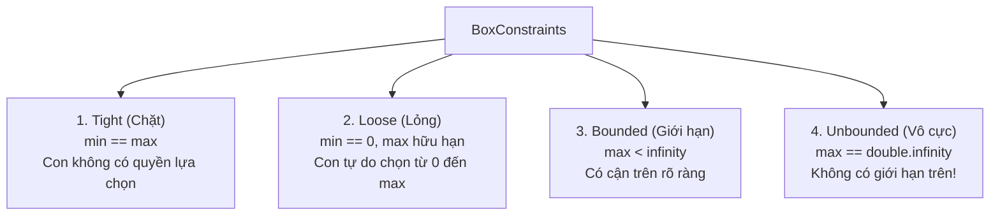
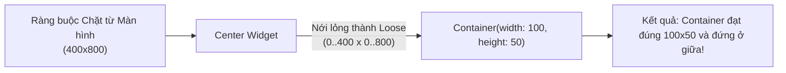

# Chuyên Đề 03 - Bài 02: Giải Phẫu BoxConstraints (Tight, Loose, Bounded & Unbounded)

> **Trọng tâm**: 4 trạng thái cốt lõi của `BoxConstraints`, Các hàm khởi tạo đặc biệt (`tight`, `loose`, `expand`), Cách các Widget biến đổi ràng buộc (`Center`, `SizedBox`, `ConstrainedBox`, `UnconstrainedBox`, `OverflowBox`), và bộ câu hỏi thẩm định năng lực kỹ thuật chuyên sâu.

---

## 1. 4 Trạng Thái Của `BoxConstraints`

`BoxConstraints` là một cấu trúc dữ liệu gồm 4 thuộc tính: `minWidth`, `maxWidth`, `minHeight`, `maxHeight`. Chúng tạo nên 4 trạng thái cơ bản:



| Loại Ràng Buộc | Điều Kiện Toán Học | Ý Nghĩa Với Widget Con | Ví Dụ Widget Áp Đặt |
| :--- | :--- | :--- | :--- |
| **Tight (Chặt)** | `minWidth == maxWidth`<br>`minHeight == maxHeight` | Widget con **bắt buộc phải có kích thước bằng chính xác con số đó**, không được lớn hơn hay nhỏ hơn. | `SizedBox(width: 200, height: 100)`<br>`SizedBox.expand()` |
| **Loose (Lỏng)** | `minWidth == 0`<br>`minHeight == 0`<br>(với `max` hữu hạn) | Widget con **tự do chọn bất kỳ kích thước nào** trong khoảng từ `0` đến `maxWidth/maxHeight`. | `Center`, `Align`, `Scaffold body` |
| **Bounded (Có giới hạn)** | `maxWidth < double.infinity`<br>`maxHeight < double.infinity` | Có trần giới hạn tối đa rõ ràng. | Chiều rộng của màn hình điện thoại (thường là 360 - 430px). |
| **Unbounded (Vô cực)** | `maxWidth == double.infinity`<br>hoặc `maxHeight == double.infinity` | Chiều đó kéo dài vô tận, widget con có thể dài bao nhiêu tùy thích! | Chiều dọc của `ListView` hoặc `Column`. Chiều ngang của `Row`. |

---

## 2. Các Named Constructors Của `BoxConstraints` Cần Thuộc Lòng

```dart
// 1. Tạo ràng buộc chặt: Ép con đúng 100x50
BoxConstraints.tight(const Size(100, 50));
BoxConstraints.tightFor(width: 100); // Chỉ ép chặt width, height tự do

// 2. Tạo ràng buộc lỏng: Con từ 0 đến 300px
BoxConstraints.loose(const Size(300, 600));

// 3. Bung hết cỡ không gian của cha:
BoxConstraints.expand(width: double.infinity, height: double.infinity);
```

---

## 3. Cách Các Widget Biến Đổi Ràng Buộc

Widget không chỉ truyền nguyên xi ràng buộc, mà chúng thường xuyên **biến đổi** ràng buộc trước khi gửi cho con của mình:



### 3.1. `SizedBox`: Biến Ràng Buộc Thành Tight
Cho dù ràng buộc nhận vào là gì, `SizedBox(width: w, height: h)` sẽ cố gắng ép con của nó nhận một ràng buộc chặt có kích thước `w` và `h`.

### 3.2. `Center` & `Align`: Nới Lỏng Ràng Buộc (Tight $\rightarrow$ Loose)
Nếu `Center` nhận vào một ràng buộc chặt (ví dụ toàn màn hình 400x800), nó sẽ nới lỏng giới hạn tối thiểu về `0` (`0 <= width <= 400`, `0 <= height <= 800`) rồi mới truyền cho con. Nhờ vậy widget con mới có thể hiển thị kích thước thực của nó!

### 3.3. `ConstrainedBox`: Bổ Sung Giới Hạn Cho Con
Dùng khi bạn muốn một widget con không bao giờ được nhỏ hơn một khoảng, hoặc không được vượt quá một giới hạn:

```dart
ConstrainedBox(
  constraints: const BoxConstraints(
    minWidth: 120, // Nút bấm tối thiểu phải rộng 120px
    maxWidth: 300, // Nhưng không được vượt quá 300px
    minHeight: 48,
  ),
  child: ElevatedButton(
    onPressed: () {},
    child: const Text('Bấm vào đây'),
  ),
)
```

### 3.4. `UnconstrainedBox` vs `OverflowBox`: Vượt Ra Khỏi Ràng Buộc Của Cha
- **`UnconstrainedBox`**: Xóa bỏ hoàn toàn ràng buộc của cha, để con có kích thước tự nhiên. Nhưng nếu con to hơn cha, Flutter sẽ **báo lỗi vạch vàng đen Overflow**!
- **`OverflowBox`**: Cho phép con có kích thước lớn hơn cha **mà không báo lỗi Overflow**! Widget con sẽ vẽ tràn ra ngoài như một chi tiết đồ họa nổi.

```dart
// Cho phép một vòng tròn trang trí rộng 600px vẽ tràn ra mép màn hình 360px:
OverflowBox(
  minWidth: 0,
  maxWidth: 600,
  minHeight: 0,
  maxHeight: 600,
  child: Container(
    decoration: const BoxDecoration(shape: BoxShape.circle, color: Colors.blueAccent),
  ),
)
```

---

## 🎯 4. Thẩm Định Năng Lực & Phân Tích Chuyên Sâu (Technical Competency & Deep Dive)

### Câu hỏi 1: Phân biệt chi tiết 4 trạng thái của `BoxConstraints`: Tight, Loose, Bounded, Unbounded. Nêu một widget đại diện truyền xuống từng loại ràng buộc này.
**Trả lời chuẩn 10/10**:
1. **Tight (Chặt)**: Khi `minWidth == maxWidth` và `minHeight == maxHeight`. Widget con bị tước quyền chọn kích thước. Widget đại diện: `SizedBox(width: 100, height: 100)` hoặc `Expanded`.
2. **Loose (Lỏng)**: Khi `minWidth == 0` và `minHeight == 0`, trong khi `maxWidth` và `maxHeight` hữu hạn. Widget con tự do chọn kích thước từ 0 đến max. Widget đại diện: `Center`, `Align`.
3. **Bounded (Có giới hạn)**: Khi cả `maxWidth` và `maxHeight` đều nhỏ hơn `double.infinity`. Toàn bộ màn hình điện thoại hoặc một thẻ Card cố định là môi trường Bounded.
4. **Unbounded (Vô cực)**: Khi `maxWidth == double.infinity` hoặc `maxHeight == double.infinity`. Widget con có thể bung dài vô tận dọc theo trục đó. Widget đại diện: Trục dọc của `Column` hoặc `ListView`, trục ngang của `Row`.

---

### Câu hỏi 2: Phân biệt sự khác nhau giữa `UnconstrainedBox` và `OverflowBox`. Trong trường hợp nào thì nên dùng `OverflowBox`?
**Trả lời chuẩn 10/10**:
- **`UnconstrainedBox`**:
  - Truyền cho con ràng buộc vô hạn (`min = 0, max = double.infinity`).
  - Tuy nhiên, bản thân `UnconstrainedBox` vẫn phải tuân thủ kích thước của cha nó. Nếu kích thước con lớn hơn khoảng trống của cha, `UnconstrainedBox` sẽ **ném ra cảnh báo lỗi Overflow (vạch vàng đen)**.
- **`OverflowBox`**:
  - Không chỉ nới lỏng ràng buộc mà còn cho phép chỉ định rõ ràng `maxWidth`/`maxHeight` cụ thể vượt quá kích thước của cha.
  - Quan trọng nhất: Nó **chủ động bỏ qua cảnh báo Overflow**. Nó cho phép widget con vẽ tràn ra ngoài biên giới của cha mà không làm bùng nổ cờ cảnh báo lỗi giao diện.
  - **Trường hợp nên dùng**: Làm các chi tiết hình khối đồ họa trang trí trừu tượng (như các vòng tròn gradient mờ kích thước 500x500 nằm lệch ở góc màn hình đăng nhập).

---

### Câu hỏi 3: Tại sao môi trường Unbounded (vô cực) lại là nguồn gốc của hầu hết các lỗi crash màn hình đỏ trong Flutter?
**Trả lời chuẩn 10/10**:
- **Bản chất**: Trong toán học, một đại lượng có kích thước vô cực (`double.infinity`) không thể được vẽ lên một màn hình vật lý có số lượng pixel hữu hạn.
- Khi một widget được đặt vào môi trường Unbounded:
  - Nếu widget đó có kích thước nội tại tự thân (Intrinsics), ví dụ `Text('Hello')` cao 20px, nó sẽ chọn 20px và báo lên cha bình thường $\rightarrow$ Không có lỗi.
  - Nhưng nếu widget đó là một thành phần **muốn bung hết cỡ (Greedy widgets)** như `Expanded`, `Flexible(fit: tight)`, hoặc một `ListView` lồng bên trong, nó sẽ cố gắng chiếm 100% không gian của cha. Mà 100% của vô cực là vô cực!
  - Khi RenderObject chuẩn bị bước vào giai đoạn Paint, nó phát hiện kích thước hộp có chứa `double.infinity`, Flutter Engine sẽ lập tức chặn lại và ném ngoại lệ `RenderBox was not laid out` hoặc `BoxConstraints forces an infinite size` để bảo vệ GPU không bị treo.
