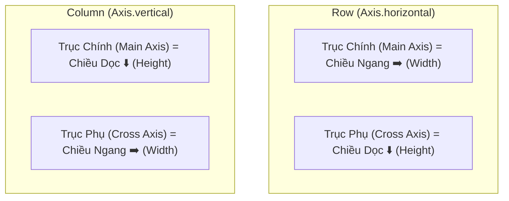
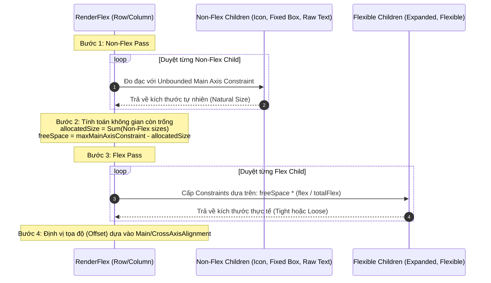
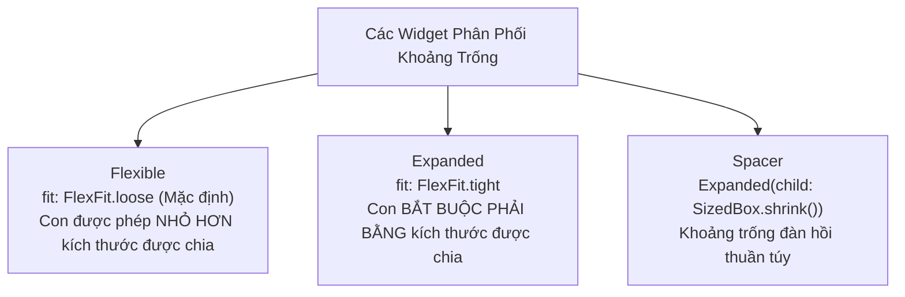

# Chuyên Đề 03 - Bài 03: Flex Layouts: Làm Chủ Row, Column, Expanded & Flexible

> **Trọng tâm**: Cơ chế toán học đằng sau `RenderFlex`, Thuật toán layout 2-pass nội bộ, Trục chính (Main Axis) vs Trục phụ (Cross Axis), Căn gióng đường chân chữ với `CrossAxisAlignment.baseline`, So sánh chuẩn xác `Expanded` (`FlexFit.tight`) vs `Flexible` (`FlexFit.loose`), và bộ câu hỏi thẩm định năng lực kỹ thuật chuyên sâu.

---

## 1. Bản Chất Của Row & Column: Hai Biến Thể Của `Flex`

Trong Flutter, cả `Row` và `Column` đều không có RenderObject riêng biệt mà dùng chung **`RenderFlex`**:
- `Row` = `Flex(direction: Axis.horizontal)`
- `Column` = `Flex(direction: Axis.vertical)`



---

## 2. Thuật Toán Layout 2-Pass Nội Bộ Của `RenderFlex`

Hiểu được cách `RenderFlex.performLayout()` vận hành giúp bạn giải thích được mọi hành vi và lỗi bố cục:



### Chi tiết các bước:
1. **Pass 1 (Non-Flex Layout)**: `RenderFlex` duyệt qua toàn bộ các con **không có** `Expanded`/`Flexible`. Mỗi con được cấp một ràng buộc lỏng (Loose) có chiều chính không giới hạn (`max = infinity` trên Main Axis) để đo kích thước tự nhiên của nó.
2. **Tính `freeSpace`**: Lấy `constraints.maxHeight` (với Column) hoặc `constraints.maxWidth` (với Row) trừ đi tổng kích thước các con non-flex đã chiếm.
3. **Pass 2 (Flex Layout)**: Không gian dư thừa `freeSpace` được chia cho các widget con có `Flexible`/`Expanded` dựa trên hệ số `flex` của từng con.
4. **Positioning**: Dựa vào `mainAxisAlignment` và `crossAxisAlignment`, các con được gán tọa độ offset chính xác trên canvas.

---

## 3. Các Thuộc Tính Điều Khiển Bố Cục Chuyên Sâu

### 3.1. `MainAxisSize`: Ôm Sát Hay Bung Hết Cỡ?
- **`MainAxisSize.max` (Mặc định)**: Cố gắng chiếm toàn bộ không gian trục chính mà cha cho phép (`constraints.max`).
- **`MainAxisSize.min`**: Co lại vừa khít với tổng kích thước thực tế của các con (`Hug Content`).

```dart
// Dialog tự động co giãn vừa vặn theo nội dung bên trong
Dialog(
  child: Column(
    mainAxisSize: MainAxisSize.min, // Tránh để Dialog cao hết màn hình
    children: [
      const Text('Xác nhận xóa tài khoản?'),
      const SizedBox(height: 16),
      ElevatedButton(onPressed: () {}, child: const Text('Xác nhận')),
    ],
  ),
);
```

> [!CAUTION]
> **Quy tắc vàng**: Không bao giờ đặt `Expanded` hoặc `Spacer` bên trong một `Flex` có `mainAxisSize: MainAxisSize.min`. `Expanded` đòi hỏi không gian còn lại phải hữu hạn và cố định để chiếm hữu, trong khi `min` lại đòi hỏi thu nhỏ lại theo con $\rightarrow$ Mâu thuẫn toán học dẫn đến văng Assertion Error!

---

### 3.2. Căn Gióng Đường Chân Chữ: `CrossAxisAlignment.baseline`

Khi bạn đặt một đoạn Text chữ to (ví dụ: Giá tiền `499`) cạnh một đoạn Text chữ nhỏ (ví dụ: Đơn vị `VND` hoặc `/tháng`), nếu dùng `CrossAxisAlignment.center` hoặc `CrossAxisAlignment.start`, chữ sẽ bị lệch trông rất mất thẩm mỹ.

Để các con số và chữ cái có **chung một đường chân chữ nằm ngang**, ta phải dùng `CrossAxisAlignment.baseline`:

```dart
Row(
  crossAxisAlignment: CrossAxisAlignment.baseline,
  // ⚠️ BẮT BUỘC phải khai báo textBaseline khi dùng CrossAxisAlignment.baseline!
  textBaseline: TextBaseline.alphabetic, 
  children: const [
    Text(
      '\$99',
      style: TextStyle(fontSize: 48, fontWeight: FontWeight.bold),
    ),
    SizedBox(width: 4),
    Text(
      '/tháng',
      style: TextStyle(fontSize: 16, color: Colors.grey),
    ),
  ],
)
```

> [!IMPORTANT]
> - `TextBaseline.alphabetic`: Dùng để gióng chân các ký tự chữ cái chuẩn Latin, Tiếng Việt, Tiếng Anh.
> - `TextBaseline.ideographic`: Dùng cho các ngôn ngữ tượng hình (CJK: Chữ Hán, Nhật, Hàn) có hộp ký tự hình vuông.
> - Nếu bạn set `crossAxisAlignment: CrossAxisAlignment.baseline` nhưng quên khai báo `textBaseline`, Flutter sẽ ném ra ngoại lệ: `assert(textBaseline != null, 'To use CrossAxisAlignment.baseline, you must also specify which baseline to use using the "textBaseline" argument.')`.

---

## 4. Phân Biệt Sâu: `Expanded` vs `Flexible` vs `Spacer`

Rất nhiều kỹ sư Flutter nhầm lẫn giữa `Expanded` và `Flexible`. Thực tế, mã nguồn của Flutter định nghĩa `Expanded` như sau:

```dart
// Trích xuất mã nguồn Framework:
class Expanded extends Flexible {
  const Expanded({
    super.key,
    super.flex = 1,
    required super.child,
  }) : super(fit: FlexFit.tight); // 👈 Khác biệt duy nhất nằm ở đây!
}
```



### So sánh trực quan sự khác biệt:

Giả sử không gian còn lại là **200px**, và widget con bên trong chỉ cần **80px**:
- Nếu dùng `Expanded`: Widget con bị ép buộc nhận đúng **200px** (`tight`). 120px còn lại bị bỏ trống bên trong con.
- Nếu dùng `Flexible(fit: FlexFit.loose)`: Widget con được cấp hạn mức tối đa 200px, nhưng nó **chỉ lấy đúng 80px**, nhường 120px còn lại cho layout co lại!

### Ứng dụng thực tế của `Flexible(fit: FlexFit.loose)`:
Trong màn hình Chat, một dòng tin nhắn có thể ngắn (1 từ "Hi") hoặc rất dài (1 đoạn văn):
- Nếu dùng `Expanded`: Khung bong bóng chat (Chat Bubble) ngắn tí cũng bị kéo giãn toang hoác hết chiều ngang màn hình.
- Nếu dùng `Flexible`: Khi tin nhắn ngắn, khung chat ôm sát chữ ("Hi"). Khi tin nhắn dài vượt quá chiều ngang, nó tự động giới hạn lại và xuống dòng mà không bị tràn màn hình!

```dart
Row(
  children: [
    const CircleAvatar(child: Icon(Icons.person)),
    const SizedBox(width: 8),
    // ✅ Dùng Flexible(fit: FlexFit.loose): Bong bóng chat co giãn tự nhiên
    Flexible(
      child: Container(
        padding: const EdgeInsets.all(12),
        decoration: BoxDecoration(
          color: Colors.blue[100],
          borderRadius: BorderRadius.circular(16),
        ),
        child: const Text(
          'Tin nhắn chat có độ dài linh hoạt...',
          overflow: TextOverflow.clip,
        ),
      ),
    ),
  ],
)
```

---

## 5. Thuật Toán Chia Tỷ Lệ `flex`

Hệ số `flex` nhận một số nguyên dương $k \ge 1$ (mặc định là `1`). Không gian còn lại được phân bổ theo công thức:

$$\text{Chiều dài con } i = \text{Free Space} \times \frac{\text{flex}_i}{\sum_{j=1}^{n} \text{flex}_j}$$

```dart
Row(
  children: [
    // Chiếm: 1 / (1 + 2 + 1) = 25% free space
    Expanded(
      flex: 1,
      child: Container(color: Colors.red, height: 48),
    ),
    // Chiếm: 2 / (1 + 2 + 1) = 50% free space
    Expanded(
      flex: 2,
      child: Container(color: Colors.blue, height: 48),
    ),
    // Chiếm: 1 / (1 + 2 + 1) = 25% free space
    Expanded(
      flex: 1,
      child: Container(color: Colors.green, height: 48),
    ),
  ],
)
```

---

## 🎯 Thẩm Định Năng Lực & Phân Tích Chuyên Sâu (Technical Competency & Deep Dive)

### Câu hỏi 1: Sự khác biệt cốt lõi giữa `Expanded` và `Flexible` là gì? Hãy nêu một trường hợp thực tế bắt buộc phải dùng `Flexible(fit: FlexFit.loose)` thay vì `Expanded`?

#### 🎯 Điểm Đánh Giá Benchmark 10/10:
1. **Bản chất kế thừa**: `Expanded` thực chất kế thừa trực tiếp từ `Flexible` với tham số duy nhất bị hard-code là `fit: FlexFit.tight`. Mặc định của `Flexible` là `fit: FlexFit.loose`.
2. **Cơ chế Constraints**:
   - `FlexFit.tight`: Ép buộc widget con phải nhận kích thước chính xác bằng phần không gian `allocatedFlexSpace` (min = max = allocatedSpace).
   - `FlexFit.loose`: Chỉ đặt chặn trần (`max = allocatedFlexSpace`, `min = 0`). Widget con được quyền tự do định kích thước theo `intrinsic size` của nó, miễn là không vượt trần.
3. **Trường hợp thực tế**:
   - Xây dựng **Bong bóng tin nhắn chat (Chat Bubble)** hoặc **Thẻ Chip Tag** trong một `Row` có kèm Avatar hoặc Nút gửi. Nếu dùng `Expanded`, một chữ "Ok" cũng sẽ bị kéo dài ngoằng hết chiều ngang màn hình. Dùng `Flexible` (mặc định là `loose`) giúp bong bóng chat ôm khít nội dung ngắn nhưng tự động giới hạn và xuống dòng khi nội dung vượt quá chiều ngang màn hình.

---

### Câu hỏi 2: Hãy phân tích thuật toán layout nội bộ 2-pass của `RenderFlex`. Tại sao Flutter không thể giải quyết `flex` chỉ trong 1 pass duy nhất? Điều gì xảy ra nếu đặt `Expanded` trong `Column(mainAxisSize: MainAxisSize.min)`?

#### 🎯 Điểm Đánh Giá Benchmark 10/10:
1. **Tại sao cần 2 pass**:
   - `RenderFlex` không thể biết được không gian dư thừa (`freeSpace`) là bao nhiêu trước khi nó biết chính xác kích thước thực tế của tất cả các widget cố định (non-flex children như `Icon`, `Text`, fixed `SizedBox`).
   - Do đó, Pass 1 bắt buộc phải duyệt và đo lường kích thước các non-flex children với `unbounded main axis constraints`. Sau đó mới thực hiện phép trừ `freeSpace = maxExtent - allocatedExtent`. Pass 2 mới có số liệu cụ thể để chia tỷ lệ cho các flex children.
2. **Hậu quả khi đặt `Expanded` trong `Column(mainAxisSize: MainAxisSize.min)`**:
   - Khi `mainAxisSize: MainAxisSize.min`, chiều cao của `Column` được định nghĩa bằng tổng chiều cao các con. Nhưng `Expanded` lại đòi hỏi chiều cao của mình được tính dựa trên chiều cao còn lại của `Column`!
   - Đây là bài toán **tham chiếu vòng lặp (Circular Dependency)**: Con chờ cha định kích thước, cha lại chờ con định kích thước.
   - Flutter Engine sẽ lập tức phát hiện mâu thuẫn này trong phương thức `RenderFlex.performLayout()` và ném ra ngoại lệ: `RenderFlex children have non-zero flex but incoming height constraints are unbounded`.

---

### Câu hỏi 3: Khi nào cần dùng `CrossAxisAlignment.baseline` trong `Row`? Tại sao tham số `textBaseline` lại là bắt buộc và cơ chế căn gióng đường chân chữ hoạt động như thế nào?

#### 🎯 Điểm Đánh Giá Benchmark 10/10:
1. **Lý do sử dụng**:
   - Khi trong cùng một hàng (`Row`) có nhiều đoạn văn bản với kích thước phông chữ (`fontSize`) khác nhau hoặc kiểu chữ (`fontFamily`) khác nhau (ví dụ: Số tiền lớn kèm ký hiệu tiền tệ nhỏ).
   - Nếu dùng `CrossAxisAlignment.center` hoặc `start`, các chữ cái sẽ bị lệch đường đáy, gây mất cân đối thị giác nghiêm trọng. `CrossAxisAlignment.baseline` giúp đáy của tất cả các chữ cái nằm trên một đường thẳng nằm ngang hoàn hảo.
2. **Tại sao `textBaseline` là bắt buộc**:
   - Các họ phông chữ khác nhau lưu trữ thông tin độ cao đường chân chữ (font metrics: ascent, descent, baseline) khác nhau trong bảng OpenType/TrueType.
   - Ngôn ngữ Latinh/Việt/Anh sử dụng `TextBaseline.alphabetic` (đường đáy của các chữ cái như 'a', 'x', 'm').
   - Ngôn ngữ tượng hình CJK sử dụng `TextBaseline.ideographic` (đường đáy của khung vuông ký tự).
   - Flutter không thể tự đoán loại đường chân chữ mà bạn muốn căn gióng. Do đó, nếu thiếu tham số này, hàm `performLayout()` của `RenderFlex` sẽ gặp `assert(textBaseline != null)` và văng runtime error ngay lập tức.
