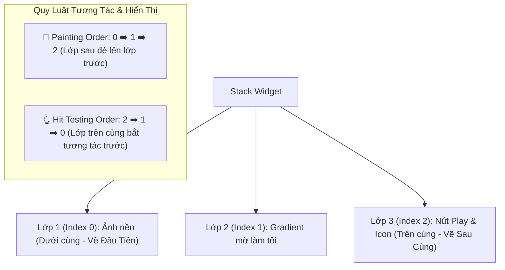
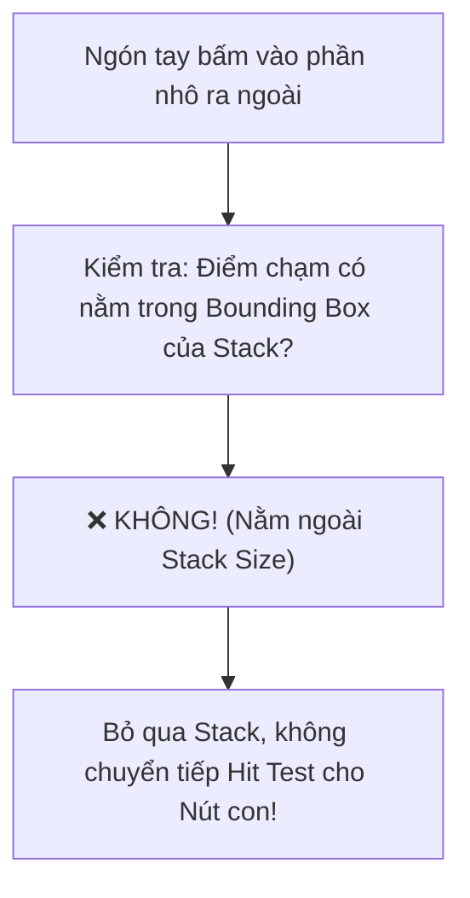

# Chuyên Đề 03 - Bài 04: Stack, Positioned & Kỹ Thuật Xếp Lớp Giao Diện Chuyên Sâu

> **Trọng tâm**: Cơ chế xếp chồng theo trục Z (`RenderStack`), Trật tự vẽ (Painting) vs Trật tự tương tác (Hit Testing), Thuật toán xác định kích thước Stack, `StackFit` (`loose`, `expand`, `passthrough`), Cạm bẫy cử chỉ với `Clip.none`, và tối ưu State đa màn hình với `IndexedStack`.

---

## 1. Cơ Chế Trục Z: Painting Order vs Hit Testing Order

Nếu `Row` xếp theo trục X (ngang), `Column` xếp theo trục Y (dọc), thì **`Stack` xếp chồng các Widget lên nhau theo trục Z** (từ dưới lên trên, từ sau ra trước):



> [!IMPORTANT]
> - **Painting Order (Thứ tự vẽ)**: Duyệt mảng `children` từ `0` đến `n-1`. Phần tử cuối cùng trong mảng sẽ nằm ở trên cùng màn hình.
> - **Hit Testing Order (Thứ tự bắt chạm)**: Flutter duyệt ngược từ `n-1` về `0`. Phần tử nổi trên cùng sẽ nhận diện cử chỉ ngón tay (`onTap`) trước tiên. Nếu phần tử trên không chặn cử chỉ, cử chỉ mới truyền xuống phần tử bên dưới!

---

## 2. Thuật Toán Định Kích Thước Của `RenderStack`

Bên trong `Stack`, các widget con được phân loại thành 2 nhóm hoàn toàn tách biệt:

### 2.1. Non-positioned Children (Widget không bọc trong `Positioned`)
- **Quyết định kích thước tổng thể của `Stack`**:
  $$\text{Stack Width} = \max(\text{width của các con non-positioned})$$
  $$\text{Stack Height} = \max(\text{height của các con non-positioned})$$
- Sau đó, kích thước này được clamp vào `constraints` mà cha cấp cho Stack.
- Các con non-positioned được đặt ở vị trí xác định bởi thuộc tính `alignment` (mặc định: `AlignmentDirectional.topStart`).

### 2.2. Positioned Children (Widget bọc trong `Positioned` hoặc `Positioned.fill`)
- **Hoàn toàn KHÔNG can thiệp vào việc định kích thước của Stack**.
- Được định vị tọa độ tuyệt đối dựa theo các cạnh của Stack: `top`, `bottom`, `left`, `right`, hoặc gán kích thước cố định bằng `width`, `height`.

```dart
Stack(
  alignment: Alignment.center,
  children: [
    // 1. Non-positioned child: Ảnh bìa (Quyết định kích thước Stack: 320x200)
    Image.network(
      'https://picsum.photos/320/200',
      width: 320,
      height: 200,
      fit: BoxFit.cover,
    ),

    // 2. Positioned child: Huy hiệu VIP ở góc trên bên phải
    Positioned(
      top: 12,
      right: 12,
      child: Container(
        padding: const EdgeInsets.symmetric(horizontal: 8, vertical: 4),
        decoration: BoxDecoration(
          color: Colors.amber,
          borderRadius: BorderRadius.circular(12),
        ),
        child: const Text('VIP PRO', style: TextStyle(fontWeight: FontWeight.bold)),
      ),
    ),

    // 3. Positioned.fill: Lớp phủ mờ toàn bộ ảnh bìa
    Positioned.fill(
      child: Container(
        decoration: BoxDecoration(
          gradient: LinearGradient(
            begin: Alignment.topCenter,
            end: Alignment.bottomCenter,
            colors: [Colors.transparent, Colors.black.withOpacity(0.7)],
          ),
        ),
      ),
    ),
  ],
)
```

> [!CAUTION]
> **Hiện tượng Stack rỗng khi tất cả con đều là `Positioned`**:  
> Nếu bạn tạo một `Stack` mà **tất cả các con đều là `Positioned`**, Stack sẽ không có con non-positioned nào để đo kích thước. Kết quả: Stack sẽ cố gắng co lại nhỏ nhất có thể (`minWidth` và `minHeight` từ parent). Nếu parent cấp loose constraints `(0..infinity)`, Stack sẽ có kích thước `0x0` và biến mất khỏi màn hình!

---

## 3. Các Chế Độ `StackFit`

Thuộc tính `fit` điều khiển cách Stack truyền ràng buộc cho các con **non-positioned**:

| Giá Trị | Cơ Chế Constraints Truyền Cho Con Non-Positioned | Trường Hợp Sử Dụng |
| :--- | :--- | :--- |
| **`StackFit.loose` (Mặc định)** | Nới lỏng ràng buộc (`minWidth: 0, minHeight: 0`, max giữ nguyên). | Cho phép con tự do có kích thước tự nhiên nhỏ hơn Stack. |
| **`StackFit.expand`** | Ép ràng buộc chặt (`tight`): `min = max = constraints.biggest`. | Bắt buộc con non-positioned phải bung kín 100% kích thước Stack (VD: Background toàn trang). |
| **`StackFit.passthrough`** | Giữ nguyên vẹn constraints của cha truyền xuống mà không can thiệp. | Dùng khi muốn widget con thừa hưởng chính xác ràng buộc mà cha của Stack nhận được. |

---

## 4. Kỹ Thuật Làm Badge Vượt Khung & Cạm Bẫy Cử Chỉ Với `Clip.none`

Mặc định, `Stack` có `clipBehavior: Clip.hardEdge`. Nếu bạn đặt tọa độ âm (`top: -8, right: -8`), widget con sẽ bị cắt đứt đoạn nhô ra ngoài.

Để làm hiệu ứng Badge đè ra ngoài Avatar (như Facebook Messenger, Shopee):

```dart
Stack(
  clipBehavior: Clip.none, // 👈 Cho phép vẽ tràn ra ngoài ranh giới Stack
  children: [
    const CircleAvatar(
      radius: 30,
      backgroundImage: NetworkImage('https://i.pravatar.cc/150?img=8'),
    ),
    Positioned(
      bottom: -2,
      right: -2,
      child: Container(
        width: 16,
        height: 16,
        decoration: BoxDecoration(
          color: Colors.green,
          shape: BoxShape.circle,
          border: Border.all(color: Colors.white, width: 2),
        ),
      ),
    ),
  ],
)
```

### ⚠️ Cạm Bẫy Kinh Điển Về Hit Testing Với `Clip.none`:
Nếu bạn đặt một nút bấm (`ElevatedButton` hoặc `GestureDetector`) nhô ra ngoài ranh giới Stack bằng `Clip.none`, **người dùng sẽ nhìn thấy nút bấm nhưng khi bấm vào phần nhô ra ngoài, nút bấm hoàn toàn KHÔNG phản hồi!**



> [!WARNING]
> **Nguyên nhân cốt lõi**: Phương thức `RenderBox.hitTest()` kiểm tra `size.contains(position)` trước khi cho phép gọi `hitTestChildren()`. Vì phần nhô ra nằm ngoài `size` của `RenderStack`, sự kiện chạm bị hủy ngay từ cửa vào!

---

## 5. `IndexedStack`: Giữ Nguyên Trạng Thái Màn Hình Cho Bottom Navigation

Khi làm thanh điều hướng `BottomNavigationBar`, nếu bạn dùng `switch (_currentIndex)` hoặc toán tử 3 ngôi để render màn hình, mỗi lần chuyển tab, màn hình cũ sẽ bị gọi `dispose()`. Người dùng quay lại sẽ bị mất sạch vị trí cuộn trang (scroll position) và dữ liệu form đang nhập dở!

### Giải pháp tối ưu: `IndexedStack`
`IndexedStack` giữ **toàn bộ các màn hình con trong Element Tree và Render Tree cùng lúc**, nhưng chỉ hiển thị và cho phép tương tác với màn hình tại vị trí `index`:

```dart
class MainShellScreen extends StatefulWidget {
  const MainShellScreen({super.key});

  @override
  State<MainShellScreen> createState() => _MainShellScreenState();
}

class _MainShellScreenState extends State<MainShellScreen> {
  int _selectedIndex = 0;

  // Danh sách các trang chính
  final List<Widget> _pages = const [
    HomeScreen(),      // Giữ nguyên trạng thái cuộn
    SearchScreen(),    // Giữ nguyên từ khóa tìm kiếm đang gõ dở
    ProfileScreen(),   // Giữ nguyên thông tin cá nhân
  ];

  @override
  Widget build(BuildContext context) {
    return Scaffold(
      body: IndexedStack(
        index: _selectedIndex,
        children: _pages,
      ),
      bottomNavigationBar: NavigationBar(
        selectedIndex: _selectedIndex,
        onDestinationSelected: (index) => setState(() => _selectedIndex = index),
        destinations: const [
          NavigationDestination(icon: Icon(Icons.home), label: 'Trang chủ'),
          NavigationDestination(icon: Icon(Icons.search), label: 'Tìm kiếm'),
          NavigationDestination(icon: Icon(Icons.person), label: 'Cá nhân'),
        ],
      ),
    );
  }
}
```

---

## 🎯 Góc Phỏng Vấn Tuyển Dụng (Google & Top Tech Interview Q&A)

### Câu hỏi 1: Cơ chế tính toán kích thước (Size) của `Stack` hoạt động như thế nào? Điều gì xảy ra nếu TẤT CẢ các con bên trong một `Stack` đều là widget `Positioned`?

#### 🎯 Điểm Đánh Giá Benchmark 10/10:
1. **Thuật toán đo lường của `RenderStack`**:
   - `RenderStack` chỉ duyệt qua các widget con **non-positioned** (không bọc trong `Positioned`) để lấy kích thước lớn nhất về cả chiều ngang và chiều dọc: `width = max(childWidth)`, `height = max(childHeight)`.
   - Các widget con có `Positioned` bị bỏ qua hoàn toàn trong bước đo lường kích thước này.
   - Sau đó, kích thước của Stack được clamp bởi incoming constraints của cha: `size = constraints.constrain(Size(width, height))`.
2. **Hiện tượng khi tất cả con đều là `Positioned`**:
   - Nếu không có bất kỳ con non-positioned nào, kích thước tạm tính của Stack là `0 x 0`.
   - Khi đó, kích thước cuối cùng phụ thuộc hoàn toàn vào incoming constraints của cha:
     - Nếu cha cấp **Tight constraints** (như `SizedBox(width: 300, height: 200)` hoặc màn hình Scaffold): Stack sẽ nhận kích thước bằng đúng tight constraint đó (`300x200`).
     - Nếu cha cấp **Loose constraints** (`minWidth: 0, minHeight: 0`): Stack sẽ co lại thành `0 x 0`, dẫn đến toàn bộ các widget con `Positioned` bên trong có thể biến mất hoặc bị lỗi layout không mong muốn.

---

### Câu hỏi 2: Khi thiết lập `clipBehavior: Clip.none` để đặt một nút bấm nhô ra ngoài ranh giới của `Stack`, tại sao người dùng chạm vào phần nhô ra ngoài lại KHÔNG nhận tương tác (`onTap` không hoạt động)? Hãy giải thích cơ chế Hit Testing bên dưới và đề xuất giải pháp xử lý.

#### 🎯 Điểm Đánh Giá Benchmark 10/10:
1. **Bản chất cơ chế Hit Testing trong Flutter**:
   - Khi một sự kiện chạm (`PointerDownEvent`) xảy ra, Flutter Engine bắt đầu quy trình Hit Test từ gốc cây RenderObject đi xuống các con (Dispatch).
   - Trong `RenderBox`, hàm `hitTest(BoxHitTestResult result, {required Offset position})` tuân theo nguyên tắc: Nó chỉ gọi `hitTestChildren()` **khi và chỉ khi** hàm `size.contains(position)` trả về `true` (tức là điểm chạm phải nằm trong ranh giới `Size` của RenderObject đó).
   - `clipBehavior: Clip.none` chỉ là một cờ điều khiển việc **Vẽ (Paint)** trên Canvas bằng cách không gọi hàm cắt khung (clip canvas). Nó **hoàn toàn không thay đổi `Size` của `RenderStack`**.
   - Khi người dùng chạm vào phần nút bấm nhô ra ngoài, `size.contains(position)` của `RenderStack` trả về `false`. Do đó, Flutter lập tức loại bỏ toàn bộ cây con của Stack khỏi danh sách tương tác, dẫn đến nút bấm không nhận được event.
2. **Giải pháp thực tế**:
   - Mở rộng kích thước của `Stack` bằng cách bọc Stack trong một `Padding` hoặc `Container` có kích thước bao trùm cả phần nhô ra.
   - Hoặc can thiệp vào tầng RenderObject bằng cách ghi đè phương thức `hitTest(result, {position})` để cho phép nhận tọa độ ngoài bounding box.

---

### Câu hỏi 3: So sánh chi tiết ưu và nhược điểm về hiệu năng và bộ nhớ giữa `IndexedStack` và `PageView` (kết hợp `AutomaticKeepAliveClientMixin`) khi làm màn hình Bottom Navigation nhiều tab.

#### 🎯 Điểm Đánh Giá Benchmark 10/10:
1. **Cơ chế của `IndexedStack`**:
   - **Cách hoạt động**: Khởi tạo và giữ toàn bộ tất cả các tab trong Element Tree và Render Tree cùng một lúc. Mọi widget ở các tab ẩn vẫn tồn tại trong bộ nhớ, chỉ bị tắt tính năng vẽ (`paint`) và bắt tương tác (`hitTest`).
   - **Ưu điểm**: Tốc độ chuyển tab là tức thì ($0\text{ms}$), trạng thái (State, Scroll Controller, Form inputs) được giữ nguyên vẹn 100% một cách tự nhiên.
   - **Nhược điểm**: Nếu có 5 tab và mỗi tab đều load dữ liệu nặng (ảnh, danh sách API, biểu đồ), tất cả đều bị build đồng thời ngay khi mở app $\rightarrow$ Tăng thời gian khởi động (Startup Time) và tiêu tốn nhiều RAM.
2. **Cơ chế của `PageView` + `AutomaticKeepAliveClientMixin`**:
   - **Cách hoạt động**: Tải lười (Lazy-loading). Chỉ khởi tạo tab khi người dùng vuốt hoặc điều hướng tới tab đó. `AutomaticKeepAliveClientMixin` giúp giữ lại state của những tab **đã từng được truy cập** thay vì hủy đi.
   - **Ưu điểm**: Tiết kiệm tài nguyên lúc mở app, chỉ khởi tạo những gì người dùng thực sự xem.
   - **Nhược điểm**: Tab chưa xem lần nào sẽ có độ trễ nhẹ ở lần click đầu tiên để build. Đòi hỏi quản lý phức tạp hơn với `PageController`.
3. **Kết luận kiến trúc**:
   - Dùng `IndexedStack` cho các ứng dụng có số lượng tab ít (3-4 tab) và UI các tab tương đối nhẹ.
   - Dùng `PageView` (hoặc `StatefulShellRoute` trong `go_router`) khi các màn hình con chứa logic phức tạp, tải nhiều dữ liệu truyền thông đa phương tiện.
