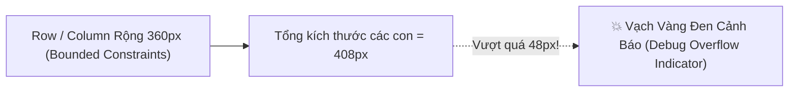
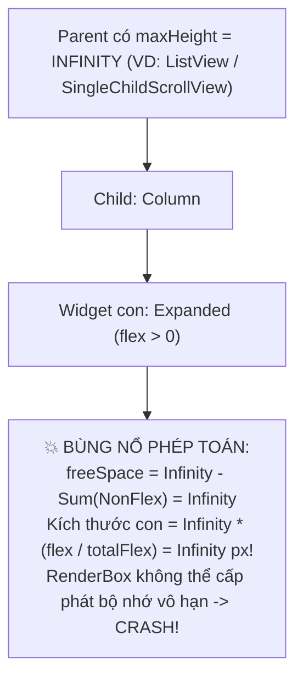
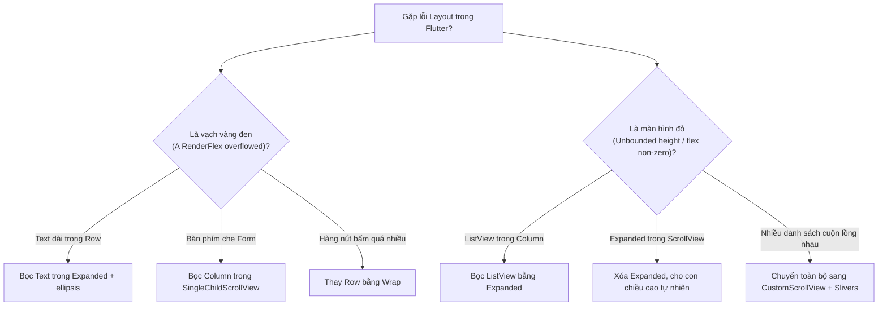

# Chuyên Đề 03 - Bài 05: Chẩn Đoán & Trị Dứt Điểm Các Lỗi Layout Kinh Điển Trong Flutter

> **Trọng tâm**: Bản chất toán học đằng sau các lỗi "cháy màn hình" kinh điển trong Flutter: `A RenderFlex overflowed by ... pixels`, `RenderFlex children have non-zero flex but incoming height constraints are unbounded`, và `Vertical viewport was given unbounded height`. Cẩm nang tra cứu và giải pháp chuẩn Google.

---

## 1. Lỗi Số 1: "A RenderFlex Overflowed by XXX Pixels"

### Hiện tượng:
Giao diện xuất hiện các dải sọc chéo màu **vàng - đen** ở mép dưới hoặc mép phải màn hình, kèm thông báo lỗi trong Debug Console:  
`A RenderFlex overflowed by 48.0 pixels on the bottom/right.`



### Nguyên nhân cốt lõi:
Một `Row` hoặc `Column` nhận ràng buộc có giới hạn (Bounded), nhưng tổng kích thước tự nhiên của các widget con bên trong **vượt quá không gian tối đa cho phép**. Flutter không tự ý co nhỏ con lại nếu con không được bọc trong các widget điều tiết flex.

> [!NOTE]
> **Tại sao Flutter vẽ sọc vàng đen thay vì tự động cuộn?**  
> Đây là triết lý thiết kế **"Fail-Fast & Explicit"** của Google Flutter. Nếu Flutter âm thầm cuộn hoặc cắt bớt (như Web Browser), lập trình viên có thể không nhận ra nút bấm "Thanh Toán" hoặc dòng Text quan trọng đã bị che khuất trên màn hình nhỏ. Trong Release Mode, các dải sọc vàng đen sẽ tự động bị ẩn đi để bảo toàn giao diện, nhưng nội dung bị tràn vẫn bị cắt cụt.

---

### 🛠️ 4 Phương Án Khắc Phục Tùy Ngữ Cảnh:

#### 1. Text quá dài trong `Row` $\rightarrow$ Bọc bằng `Expanded` + `TextOverflow.ellipsis`
```dart
// ❌ GÂY TRÀN NẾU ĐỊA CHỈ DÀI:
Row(
  children: [
    const Icon(Icons.location_on),
    Text('Số 123 Đường Nguyễn Huệ, Phường Bến Nghé, Quận 1, TP. Hồ Chí Minh'),
  ],
)

// ✅ SỬA ĐÚNG:
Row(
  children: [
    const Icon(Icons.location_on),
    const SizedBox(width: 8),
    Expanded(
      child: Text(
        'Số 123 Đường Nguyễn Huệ, Phường Bến Nghé, Quận 1, TP. Hồ Chí Minh',
        maxLines: 1,
        overflow: TextOverflow.ellipsis, // Cắt bằng dấu 3 chấm (...)
      ),
    ),
  ],
)
```

#### 2. Màn hình Form nhập liệu bị bàn phím ảo đẩy trồi lên $\rightarrow$ `SingleChildScrollView`
```dart
// ✅ Tránh vạch vàng đen khi bàn phím trồi lên chiếm 300px:
Scaffold(
  body: SafeArea(
    child: SingleChildScrollView(
      padding: const EdgeInsets.all(16),
      child: Column(
        children: [
          const FlutterLogo(size: 100),
          const SizedBox(height: 24),
          TextFormField(decoration: const InputDecoration(labelText: 'Email')),
          const SizedBox(height: 16),
          TextFormField(decoration: const InputDecoration(labelText: 'Mật khẩu')),
          const SizedBox(height: 24),
          ElevatedButton(onPressed: () {}, child: const Text('Đăng nhập')),
        ],
      ),
    ),
  ),
)
```

#### 3. Danh sách các Tags / Chips quá dài $\rightarrow$ Dùng `Wrap` thay vì `Row`
```dart
// ✅ Wrap tự động rớt xuống hàng tiếp theo khi hết chỗ trống
Wrap(
  spacing: 8, // Khoảng cách giữa các chip trên cùng một hàng
  runSpacing: 4, // Khoảng cách giữa các hàng
  children: const [
    Chip(label: Text('Flutter')),
    Chip(label: Text('Dart')),
    Chip(label: Text('Mobile Development')),
    Chip(label: Text('Architecture')),
    Chip(label: Text('Clean Code')),
  ],
)
```

#### 4. Khung hình ảnh hoặc Logo cần tự co giãn theo diện tích cha $\rightarrow$ `FittedBox`
```dart
// ✅ Tự động thu nhỏ ảnh/chữ vừa khít hộp chứa mà không bị biến dạng tỷ lệ
SizedBox(
  width: 100,
  height: 50,
  child: FittedBox(
    fit: BoxFit.scaleDown,
    child: const Text('GIẢM GIÁ 50%', style: TextStyle(fontSize: 40)),
  ),
)
```

---

## 2. Lỗi Số 2: "RenderFlex Children Have Non-zero Flex But Incoming Height Constraints Are Unbounded"

### Hiện tượng:
Màn hình xuất hiện **màn hình đỏ chết chóc (Red Screen of Death)** trong Debug mode, kèm thông báo lỗi nghiêm trọng trong console:  
`RenderFlex children have non-zero flex but incoming height constraints are unbounded.`



### Bản chất toán học:
Một widget có `flex > 0` (như `Expanded`, `Flexible`) yêu cầu cha phải có **không gian hữu hạn cố định** để chia tỷ lệ.  
Nếu cha của nó nằm trong một danh sách có thể cuộn vô tận (`maxHeight = double.infinity`), phép tính chia tỷ lệ của `RenderFlex` trở thành:

$$\text{Kích thước con} = \infty \times \frac{\text{flex}}{\text{totalFlex}} = \infty$$

Flutter Engine từ chối cấp phát kích thước vô cực cho một RenderBox vì GPU không thể vẽ một hộp có kích thước $\infty \times \infty$.

---

## 3. Lỗi Số 3: "Vertical Viewport Was Given Unbounded Height"

### Tình huống kinh điển: Đặt `ListView` trực tiếp trong `Column`
Khi bạn muốn hiển thị một tiêu đề và bên dưới là danh sách:

```dart
// ❌ GÂY CRASH MÀN HÌNH ĐỎ NGAY LẬP TỨC:
Column(
  children: [
    const Text('Danh sách đơn hàng:', style: TextStyle(fontSize: 20)),
    ListView.builder(
      itemCount: 100,
      itemBuilder: (context, index) => ListTile(title: Text('Đơn hàng #$index')),
    ),
  ],
)
```

### Tại sao lại vỡ layout?
1. `Column` nói với `ListView`: "Chiều cao tối đa của bạn là vô tận (`maxHeight = double.infinity`)".
2. `ListView` nói: "Tôi là một thanh cuộn, tôi muốn mở rộng vô tận để chứa tất cả các phần tử".
3. Cả hai cùng muốn vô hạn $\rightarrow$ Xung đột vô cực khiến RenderViewport ném ngoại lệ `Vertical viewport was given unbounded height`.

---

### 🛠️ 2 Cách Xử Lý Chuẩn Kiến Trúc:

#### Cách A: Bọc `ListView` trong `Expanded` (Nếu `Column` nằm trong màn hình cố định)
```dart
// ✅ ListView nhận chiều cao còn lại của Column trên màn hình:
Column(
  children: [
    const Text('Danh sách đơn hàng:', style: TextStyle(fontSize: 20)),
    Expanded(
      child: ListView.builder(
        itemCount: 100,
        itemBuilder: (context, index) => ListTile(title: Text('Đơn hàng #$index')),
      ),
    ),
  ],
)
```

#### Cách B: Dùng `CustomScrollView` + `SliverList` (Khi toàn bộ trang cuộn cùng nhau)
```dart
// ✅ Chuẩn Google cho giao diện phức tạp:
CustomScrollView(
  slivers: [
    const SliverToBoxAdapter(
      child: Padding(
        padding: EdgeInsets.all(16),
        child: Text('Danh sách đơn hàng:', style: TextStyle(fontSize: 20)),
      ),
    ),
    SliverList.builder(
      itemCount: 100,
      itemBuilder: (context, index) => ListTile(title: Text('Đơn hàng #$index')),
    ),
  ],
)
```

> [!WARNING]
> **Cạm Bẫy `shrinkWrap: true`**:  
> Rất nhiều lập trình viên giải quyết lỗi trên bằng cách:  
> `ListView.builder(shrinkWrap: true, physics: const NeverScrollableScrollPhysics(), ...)`  
> **Hậu quả**: `shrinkWrap: true` triệt tiêu hoàn toàn cơ chế Virtualization (Lazy Loading) của Flutter! Nó ép Flutter phải build và tính toán kích thước của **toàn bộ 1000 phần tử cùng lúc** thay vì chỉ build các item đang thấy trên màn hình. Gây lag khung hình, tụt FPS nghiêm trọng và có thể dẫn đến tràn RAM (Out of Memory)! Chỉ chấp nhận dùng `shrinkWrap: true` nếu danh sách chắc chắn có dưới 15 phần tử.

---

## 4. Cây Quyết Định Chẩn Đoán Lỗi (Diagnostic Decision Tree)



---

## 🎯 Thẩm Định Năng Lực & Phân Tích Chuyên Sâu (Technical Competency & Deep Dive)

### Câu hỏi 1: Tại sao Flutter lại chọn cách vẽ dải sọc vàng đen cảnh báo tràn màn hình (Overflow) trong môi trường Debug thay vì tự động sinh thanh cuộn hoặc ẩn đi (Clip) như cơ chế mặc định của trình duyệt Web?

#### 🎯 Điểm Đánh Giá Benchmark 10/10:
1. **Triết lý thiết kế "Explicit & Fail-Fast"**:
   - Trình duyệt Web tuân theo triết lý "Fault-Tolerant" (chấp nhận lỗi và cố gắng hiển thị bằng mọi giá). Điều này dẫn đến việc lỗi giao diện (như chữ bị xén cụt, nút quan trọng bị đẩy ra khỏi màn hình) âm thầm lọt vào môi trường Production mà lập trình viên không hề hay biết.
   - Flutter áp dụng nguyên lý Fail-Fast: Mọi sai lệch về ràng buộc không gian phải được phơi bày ngay lập tức dưới mắt nhà phát triển trong giai đoạn Debug.
2. **Cơ chế thực thi bên dưới (`_drawOverflowIndicator`)**:
   - Trong phương thức `paint()` của `RenderFlex`, nếu kích thước các con vượt quá `size` của Flex, cờ `_hasOverflow` bật lên và hàm `_drawOverflowIndicator()` được kích hoạt để vẽ các dải sọc vàng đen cùng nhãn số pixel bị tràn.
   - Trong Release mode, hàm này được biên dịch rút gọn (stripped out) nhằm tiết kiệm hiệu năng, và nội dung tràn chỉ đơn thuần bị clip (cắt mép) mà không có vạch cảnh báo.

---

### Câu hỏi 2: Phân tích cặn kẽ tại sao thuộc tính `shrinkWrap: true` trong `ListView` lại bị coi là một Anti-Pattern nghiêm trọng về hiệu năng nếu danh sách có nhiều phần tử? Giải pháp thay thế chuẩn kiến trúc là gì?

#### 🎯 Điểm Đánh Giá Benchmark 10/10:
1. **Bản chất của Virtualization (Lazy Loading) trong `RenderViewport`**:
   - Mặc định, `ListView.builder` sử dụng `RenderViewport` và `SliverMultiBoxAdaptorElement` để chỉ khởi tạo và layout các widget con nằm trong khu vực hiển thị cộng thêm một khoảng đệm an toàn (`cacheExtent`, thường khoảng 250px). Các phần tử nằm ngoài vùng đệm hoàn toàn không được khởi tạo để tiết kiệm CPU và bộ nhớ RAM.
2. **Cơ chế phá hủy hiệu năng của `shrinkWrap: true`**:
   - Khi bật `shrinkWrap: true`, `RenderViewport` không thể dựa vào kích thước màn hình để định giới hạn nữa, mà nó phải biết chính xác tổng chiều cao của toàn bộ nội dung để báo ngược lại cho widget cha.
   - Để biết tổng chiều cao, Flutter buộc phải khởi tạo (build) và thực hiện layout cho **tất cả các item từ 0 đến N** cùng một lúc trong một frame hình duy nhất.
   - Nếu danh sách có hàng trăm hoặc hàng nghìn item (chứa ảnh mạng, text phức tạp), thao tác này sẽ gây nghẽn luồng UI (Jank), rớt FPS từ 60/120fps xuống còn vài fps và nguy cơ cao bị crash ứng dụng do tràn bộ nhớ (Out-Of-Memory).
3. **Giải pháp chuẩn kiến trúc**:
   - Thay vì lồng `SingleChildScrollView` + `Column` + `ListView(shrinkWrap: true)`, kiến trúc chuẩn của Google là sử dụng **`CustomScrollView`** kết hợp với các Slivers chuyên dụng:
     - Các widget tĩnh (Banner, Header) bọc trong `SliverToBoxAdapter`.
     - Danh sách cuộn sử dụng `SliverList.builder` hoặc `SliverFixedExtentList` để bảo toàn trọn vẹn khả năng Virtualization $O(1)$ bộ nhớ.

---

### Câu hỏi 3: Hãy giải thích bản chất toán học của ngoại lệ: `RenderFlex children have non-zero flex but incoming height constraints are unbounded`. Khi gặp trường hợp cần chia tỷ lệ không gian giữa 2 phần tử bên trong một danh sách cuộn, bạn sẽ giải quyết như thế nào?

#### 🎯 Điểm Đánh Giá Benchmark 10/10:
1. **Bản chất toán học**:
   - Một scroll container (như `SingleChildScrollView`, `ListView`) cấp cho các con bên trong một ràng buộc lỏng vô tận theo trục cuộn: `BoxConstraints(minHeight: 0, maxHeight: double.infinity)`.
   - Khi một `Column` nằm bên trong container này, nó nhận `maxHeight = infinity`.
   - Nếu trong `Column` có một con mang `Expanded` (tương đương `flex: 1`), thuật toán `RenderFlex.performLayout()` cần tính `freeSpace = constraints.maxHeight - allocatedHeight = infinity - allocatedHeight = infinity`.
   - Khi đó, kích thước được chia cho con mang `Expanded` là: $\text{infinity} \times \frac{\text{flex}}{\text{totalFlex}} = \text{infinity}$.
   - Vì một `RenderBox` bắt buộc phải có kích thước hữu hạn trên hệ tọa độ pixel của màn hình để GPU rasterize, Flutter assert chặn lại và ném ra ngoại lệ trên.
2. **Cách giải quyết khi cần chia tỷ lệ trong scrollable container**:
   - **Cách 1 (Dùng Fixed Aspect Ratio)**: Bọc các phần tử cần chia tỷ lệ bằng `AspectRatio` hoặc gán kích thước cố định bằng `SizedBox`.
   - **Cách 2 (Dùng LayoutBuilder)**: Sử dụng `LayoutBuilder` ở bên ngoài để lấy kích thước chiều rộng/chiều cao khả dụng hữu hạn, từ đó tính toán kích thước cụ thể bằng pixel truyền cho các con.
   - **Cách 3 (Dùng IntrinsicHeight)**: Bọc hàng hoặc cột đó trong `IntrinsicHeight` để ép cha đo đạc kích thước tự nhiên trước, sau đó con có thể giãn đều theo nhau mà không đòi hỏi vô hạn.
