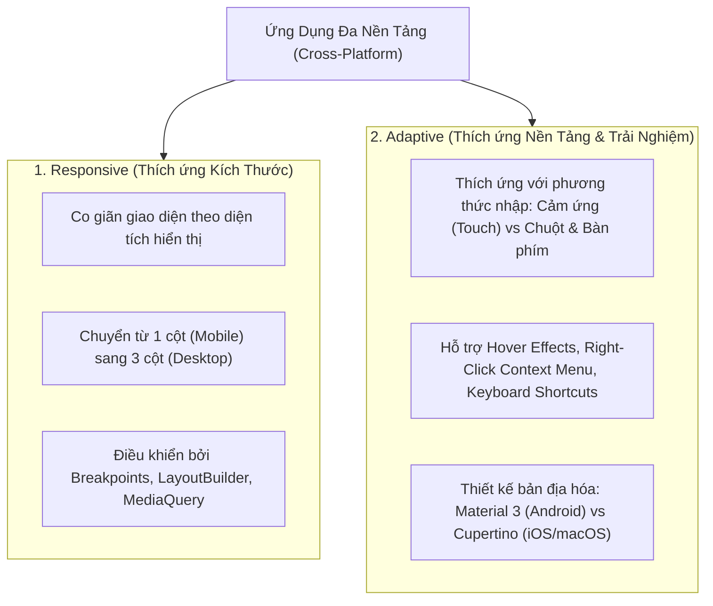
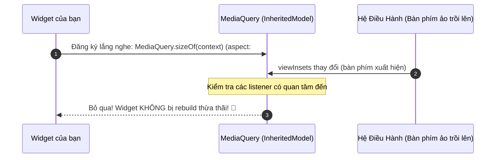

# Chuyên Đề 03 - Bài 06: Thiết Kế Giao Diện Thích Ứng (Responsive & Adaptive Layouts) Chuyên Sâu

> **Trọng tâm**: Phân biệt bản chất Responsive vs Adaptive, Cơ chế tối ưu hóa rebuild với `InheritedModel` trong `MediaQuery.sizeOf(context)` (Flutter 3.7+), `TextScaler` (Flutter 3.16+), Đối chiếu sâu sắc `LayoutBuilder` vs `MediaQuery`, Xây dựng hệ thống Breakpoints công nghiệp, và bộ câu hỏi phỏng vấn tuyển dụng top tech.

---

## 1. Phân Biệt Cốt Lõi: Responsive vs Adaptive

Nhiều lập trình viên đánh đồng hai khái niệm này, nhưng trong kiến trúc phần mềm chuẩn Google:



---

## 2. Cách Mạng Hiệu Năng: `MediaQuery.sizeOf(context)` & `InheritedModel`

### Vấn đề lịch sử của `MediaQuery.of(context)`:
Trước phiên bản Flutter 3.7, cách lấy kích thước màn hình phổ biến nhất là:

```dart
// ❌ CÁCH CŨ: Gây Rebuild tràn lan toàn bộ cây widget!
final screenWidth = MediaQuery.of(context).size.width;
```

### Tại sao lại gây tụt FPS?
`MediaQuery` chứa một đối tượng khổng lồ mang tên `MediaQueryData`, bao gồm:
- Kích thước màn hình (`size`)
- Độ cao bàn phím trồi lên (`viewInsets.bottom`)
- Khoảng cách tai thỏ / thanh điều hướng (`padding`, `viewPadding`)
- Hướng thiết bị (`orientation`)
- Tỷ lệ phóng to chữ của người khiếm thị (`textScaler`)
- Chế độ sáng / tối (`platformBrightness`)

Khi bạn gọi `MediaQuery.of(context)`, widget của bạn đã đăng ký lắng nghe **toàn bộ đối tượng này**.  
$\rightarrow$ **Chỉ cần người dùng chạm vào ô TextField làm bàn phím ảo trồi lên (`viewInsets` thay đổi), widget của bạn bị ép rebuild lại từ đầu dù chiều rộng màn hình không suy suyển 1 pixel nào!**

---

### ✅ Chuẩn Google Hiện Đại (Flutter 3.7+ và 3.16+):
Bên dưới tầng Framework, `MediaQuery` đã được nâng cấp thành **`InheritedModel<Object>`**. Flutter cung cấp các phương thức chọn lọc (`Aspect-specific queries`):

```dart
// ✅ CHỈ rebuild khi kích thước màn hình thay đổi (Ví dụ xoay màn hình):
final size = MediaQuery.sizeOf(context);
final width = size.width;

// ✅ CHỈ rebuild khi bàn phím trồi lên hoặc hạ xuống:
final bottomInset = MediaQuery.viewInsetsOf(context).bottom;

// ✅ CHỈ rebuild khi tai thỏ hoặc thanh Home Bar thay đổi:
final safePadding = MediaQuery.paddingOf(context);

// ✅ Flutter 3.16+ (Thay thế textScaleFactor cũ):
final textScaler = MediaQuery.textScalerOf(context);
final scaledFontSize = textScaler.scale(16.0);
```



---

## 3. So Sánh Kiến Trúc: `LayoutBuilder` vs `MediaQuery`

| Tiêu Chí Đánh Giá | `MediaQuery` | `LayoutBuilder` |
| :--- | :--- | :--- |
| **Phạm vi phản ánh** | Toàn bộ **màn hình vật lý của thiết bị** (Screen-level). | **Không gian thực tế cha cấp cho nó** (Parent Constraints-level). |
| **Kịch bản Split-Screen** | Trả về kích thước tổng thể thiết bị $\rightarrow$ Dễ tính toán sai khi chia đôi màn hình. | Trả về chính xác kích thước cửa sổ thu nhỏ mà app đang nhận được. |
| **Tính độc lập của Component** | Thấp (Phụ thuộc vào context của toàn bộ App). | **Tuyệt đối (Self-contained & Reusable)**: Đặt ở bất kỳ đâu cũng tự thích ứng được. |

### 💡 Quy Tắc Vàng:
- Dùng `MediaQuery` cho các quyết định **bố cục cấp cao (Macro-level)**: Hiển thị thanh Sidebar điều hướng hay BottomNavigationBar.
- Dùng `LayoutBuilder` cho các quyết định **bố cục cấp linh kiện (Micro-level)**: Một thẻ Card tự quyết định xếp ảnh và chữ dạng hàng ngang (`Row`) hay hàng dọc (`Column`).

```dart
// Thẻ sản phẩm tự động chuyển dạng hiển thị tùy theo không gian được cấp
class ResponsiveProductCard extends StatelessWidget {
  const ResponsiveProductCard({super.key});

  @override
  Widget build(BuildContext context) {
    return LayoutBuilder(
      builder: (context, constraints) {
        // Nếu không gian cha cấp cho thẻ này rộng hơn 400px:
        if (constraints.maxWidth > 400) {
          return Row(
            children: [
              Image.network('https://picsum.photos/150/150', width: 120),
              const Expanded(child: Text('Chi tiết sản phẩm xếp ngang...')),
            ],
          );
        } else {
          // Không gian chật hẹp: Xếp dọc
          return Column(
            children: [
              Image.network('https://picsum.photos/300/150'),
              const Text('Chi tiết sản phẩm xếp dọc...'),
            ],
          );
        }
      },
    );
  }
}
```

---

## 4. Hệ Thống Breakpoints Chuẩn Công Nghiệp Cho Flutter

Xây dựng một hệ thống Breakpoints chuẩn giúp mở rộng ứng dụng mượt mà từ iPhone Mini đến màn hình Ultra-wide 4K:

```dart
// 1. Định nghĩa chuẩn Breakpoints theo Material 3 Design
class Breakpoints {
  static const double compact = 600.0;   // Mobile dọc
  static const double medium = 840.0;    // Mobile xoay ngang, Tablet nhỏ
  static const double expanded = 1200.0; // Tablet lớn, Laptop nhỏ
  static const double large = 1600.0;    // Desktop màn hình lớn
}

// 2. Enum phân loại thiết bị
enum DeviceScreenType { mobile, tablet, desktop }

// 3. Widget điều phối bố cục đa màn hình
class ResponsiveLayout extends StatelessWidget {
  final Widget mobile;
  final Widget? tablet;
  final Widget desktop;

  const ResponsiveLayout({
    super.key,
    required this.mobile,
    this.tablet,
    required this.desktop,
  });

  @override
  Widget build(BuildContext context) {
    return LayoutBuilder(
      builder: (context, constraints) {
        if (constraints.maxWidth >= Breakpoints.expanded) {
          return desktop;
        }
        if (constraints.maxWidth >= Breakpoints.compact) {
          return tablet ?? mobile; // Fallback linh hoạt
        }
        return mobile;
      },
    );
  }
}
```

---

## 🎯 Góc Phỏng Vấn Tuyển Dụng (Google & Top Tech Interview Q&A)

### Câu hỏi 1: Hãy phân biệt sự khác biệt cốt lõi giữa Responsive Layout và Adaptive Layout trong phát triển ứng dụng Flutter đa nền tảng. Lấy ví dụ minh họa cụ thể cho từng khái niệm.

#### 🎯 Điểm Đánh Giá Benchmark 10/10:
1. **Bản chất của Responsive Layout (Thích ứng kích thước)**:
   - Tập trung vào tính chất hình học: kích thước màn hình, tỷ lệ khung hình (aspect ratio) và hướng xoay (orientation).
   - Mục tiêu: Bố trí các phần tử UI sao cho không gian hiển thị được tận dụng tối đa, không bị vỡ bố cục hay tràn pixel.
   - Ví dụ: Chuyển đổi từ `ListView` 1 cột trên Mobile sang `GridView` 3 cột trên Tablet; thu gọn Drawer thành Sidebar cố định trên Desktop.
2. **Bản chất của Adaptive Layout (Thích ứng nền tảng & trải nghiệm)**:
   - Tập trung vào bản sắc hệ điều hành (Platform Idioms) và phương thức nhập liệu (Input Modalities: Touch, Mouse, Trackpad, Keyboard, Stylus).
   - Mục tiêu: Ứng dụng mang lại cảm giác bản địa tự nhiên (Native feel) trên từng môi trường người dùng trải nghiệm.
   - Ví dụ:
     - Trên Desktop/Web: Hỗ trợ hiệu ứng rê chuột (`MouseRegion`, `InkWell` hover), trình đơn ngữ cảnh chuột phải (`ContextMenuRegion`), phím tắt bàn phím (`Shortcuts` & `Actions`), thanh cuộn kéo bằng chuột (`Scrollbar`).
     - Trên Mobile: Cử chỉ vuốt chạm chạm mượt mà (Swipe-to-dismiss, Pull-to-refresh).
     - Giao diện người dùng: Tự động chuyển đổi giữa `CupertinoNavigationBar` (iOS) và `NavigationRail` / `Material 3 AppBar` (Android/Desktop).

---

### Câu hỏi 2: Tại sao phương thức `MediaQuery.sizeOf(context)` lại tối ưu hiệu năng vượt trội hơn `MediaQuery.of(context).size`? Hãy giải thích cơ chế đăng ký phụ thuộc theo `aspect` của `InheritedModel` bên dưới Framework.

#### 🎯 Điểm Đánh Giá Benchmark 10/10:
1. **Cơ chế của `MediaQuery.of(context)`**:
   - `MediaQuery.of` gọi phương thức kinh điển `context.dependOnInheritedWidgetOfExactType<MediaQuery>()`.
   - Cơ chế này biến `BuildContext` hiện tại thành một `Dependent` của toàn bộ widget `MediaQuery`. Bất kỳ khi nào một trường dữ liệu bất kỳ trong `MediaQueryData` thay đổi (như `viewInsets` khi bàn phím mở, `viewPadding` do thanh trạng thái hệ thống cập nhật, hoặc `platformBrightness`), hàm `updateShouldNotify` trả về `true` và đánh dấu `markNeedsBuild()` cho tất cả các widget đã đăng ký phụ thuộc.
2. **Cơ chế tối ưu theo `aspect` của `MediaQuery.sizeOf(context)`**:
   - Từ Flutter 3.7, `MediaQuery` mở rộng từ `InheritedModel<_MediaQueryAspect>`.
   - Khi gọi `MediaQuery.sizeOf(context)`, Framework thực thi lệnh:
     `InheritedModel.inheritFrom<MediaQuery>(context, aspect: _MediaQueryAspect.size)`.
   - Khi một sự kiện làm biến động `MediaQueryData` xảy ra (ví dụ: bàn phím trồi lên), `MediaQuery` gọi `updateShouldNotifyDependent(oldWidget, dependencies)`.
   - Framework kiểm tra: Tập hợp `dependencies` của widget này có chứa `_MediaQueryAspect.size` không? Nếu chỉ có `viewInsets` thay đổi mà `size` giữ nguyên, Framework sẽ bỏ qua và **hoàn toàn không đánh dấu rebuild cho widget đó**. Điều này loại bỏ hoàn toàn các lần render thừa thãi (Jank frames), giúp ứng dụng duy trì 60/120 FPS ổn định.

---

### Câu hỏi 3: Khi nào bạn nên chọn `LayoutBuilder` thay vì `MediaQuery` để xử lý giao diện thích ứng? Nêu một kịch bản cụ thể mà việc sử dụng `MediaQuery` sẽ gây ra lỗi nghiêm trọng về bố cục.

#### 🎯 Điểm Đánh Giá Benchmark 10/10:
1. **Nguyên tắc phân định kiến trúc**:
   - `MediaQuery` cung cấp dữ liệu ở cấp độ màn hình thiết bị (`Window / Screen-level`).
   - `LayoutBuilder` cung cấp dữ liệu ở cấp độ thành phần cụ thể (`Widget / Constraint-level`), tức là kích thước mà Widget cha cấp cho Widget hiện tại thông qua `BoxConstraints`.
2. **Kịch bản dùng `MediaQuery` gây vỡ layout (Breakdown Case Study)**:
   - **Trường hợp 1: Chế độ Split-Screen / Đa nhiệm cửa sổ**: Trên iPadOS, Android Tablet hoặc Desktop, người dùng mở app ở chế độ chia đôi màn hình (Side-by-side) với chiều rộng chỉ 350px. `MediaQuery.sizeOf(context).width` vẫn trả về chiều rộng của toàn bộ thiết bị vật lý (ví dụ: 1024px). Nếu component dựa vào con số này để render layout dạng 3 cột của Desktop, toàn bộ nội dung sẽ bị bóp nghẹt, vỡ layout và tràn sọc vàng đen ngay lập tức!
   - **Trường hợp 2: Component tái sử dụng bên trong Sidebar**: Giả sử bạn xây dựng một `UserCard` dùng được ở cả màn hình chính lẫn bên trong thanh menu điều hướng `Drawer` (rộng 304px). Nếu `UserCard` dùng `MediaQuery`, nó sẽ luôn thấy kích thước màn hình điện thoại (390px) và render dạng nằm ngang, làm tràn khung menu `Drawer`.
   - **Giải pháp**: Bọc component bằng `LayoutBuilder`. Component sẽ độc lập hoàn toàn với ngữ cảnh bên ngoài, tự đo kích thước thực tế cha cấp cho nó (`constraints.maxWidth`) để tự đưa ra quyết định hiển thị chuẩn xác 100%.
