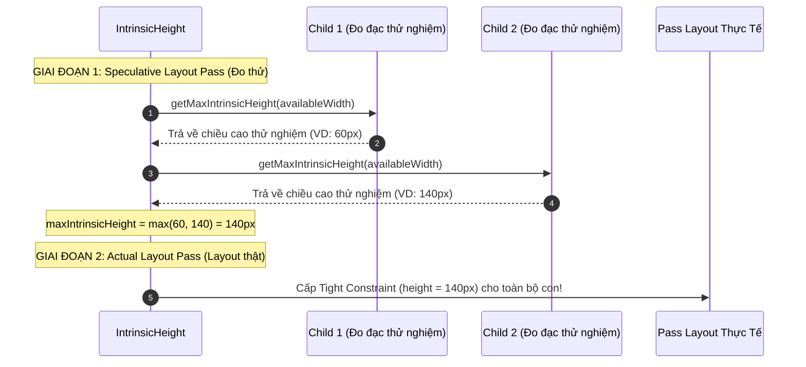
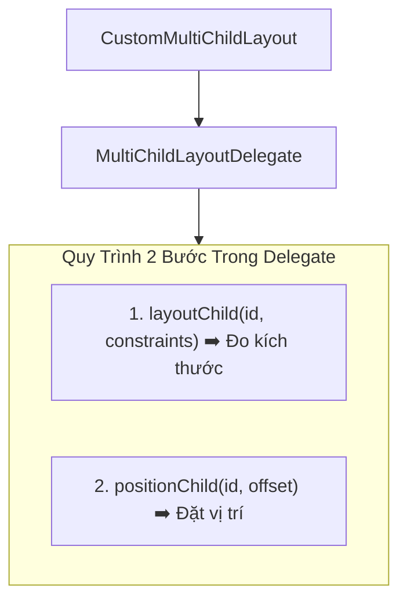

# Chuyên Đề 03 - Bài 07: Intrinsics & Custom Layout Delegates (Kỹ Thuật Bố Cục Chuyên Sâu)

> **Trọng tâm**: Bản chất của `IntrinsicHeight` & `IntrinsicWidth`, Tại sao tài liệu Flutter cảnh báo cái giá hiệu năng $O(N^2)$ (Speculative Layout Pass), Kỹ thuật điều phối kích thước thẻ bằng nhau, và làm chủ `CustomMultiChildLayout` với `MultiChildLayoutDelegate` để giải quyết các bố cục phụ thuộc tương quan (Sibling Dependencies).

---

## 1. Bài Toán Kinh Điển: Kéo Dãn Chiều Cao Bằng Nhau Trong `Row`

Hãy tưởng tượng bạn cần thiết kế một hàng gồm 2 cột nội dung và một thanh phân cách dọc (`VerticalDivider`) ở giữa:

```dart
// ❌ THẤT BẠI: VerticalDivider sẽ BIẾN MẤT hoặc gây lỗi Unbounded!
Row(
  children: [
    Text('Nội dung cột trái...'),
    VerticalDivider(thickness: 2), // 💥 Chiều cao của VerticalDivider là bao nhiêu?
    Text('Nội dung cột phải rất dài nhiều dòng...'),
  ],
)
```

Vì `Row` không áp đặt chiều cao chặt chẽ lên các con, `VerticalDivider` không biết mình phải cao bao nhiêu $\rightarrow$ Nó co lại về `0` hoặc gây xung đột layout!

### ✅ Cứu Tinh: `IntrinsicHeight`
`IntrinsicHeight` ép toàn bộ các widget con trong `Row` phải nhận chiều cao bằng đúng **chiều cao tự nhiên lớn nhất (Max Intrinsic Height)** của widget con cao nhất trong hàng:

```dart
// ✅ HIỂN THỊ HOÀN HẢO:
IntrinsicHeight(
  child: Row(
    crossAxisAlignment: CrossAxisAlignment.stretch, // Ép các con bung hết chiều cao của Row
    children: [
      Expanded(
        child: Container(
          padding: const EdgeInsets.all(12),
          color: Colors.blue[50],
          child: const Text('Thẻ tóm tắt ngắn'),
        ),
      ),
      const VerticalDivider(width: 16, thickness: 2, color: Colors.grey),
      Expanded(
        child: Container(
          padding: const EdgeInsets.all(12),
          color: Colors.amber[50],
          child: const Text(
            'Thẻ chi tiết rất dài với nhiều nội dung văn bản tự động xuống dòng...',
          ),
        ),
      ),
    ],
  ),
)
```

---

## 2. Cái Giá Hiệu Năng $O(N^2)$: "Speculative Layout Pass" Là Gì?

Trong tài liệu chính thức của Google Flutter, nhóm kỹ sư cốt lõi luôn đính kèm một cảnh báo nghiêm trọng:

> *"This class is relatively expensive, because it adds a speculative layout pass before the final layout pass. Avoid using it where possible. In the worst case, this class can result in a layout that is $O(N^2)$ in the depth of the tree."*



### Tại sao lại dẫn tới độ phức tạp $O(N^2)$?
1. **Phá vỡ Single-Pass Layout**: Bình thường Flutter đạt hiệu năng cực đại nhờ bố cục 1 lần duy nhất ($O(N)$). `IntrinsicHeight` buộc Flutter phải thực hiện thêm 1 lần "đo thử giả lập" (`speculative pass`) trước khi thực hiện lần layout chính thức.
2. **Hiệu ứng số mũ khi lồng nhau (Nesting)**: Nếu bên trong một widget con của `IntrinsicHeight` lại chứa tiếp một `IntrinsicHeight` hoặc `IntrinsicWidth` khác, số lần đo thử sẽ nhân lên theo cấp số nhân. Với cây widget sâu $K$ tầng lồng nhau, chi phí layout sẽ tăng vọt lên $O(N^2)$ hoặc tệ hơn, dẫn đến nghẽn CPU và rớt khung hình (Jank) nghiêm trọng!

> [!TIP]
> **Quy Tắc Thực Hành Tốt Nhất (Best Practice)**:  
> - Hoàn toàn an toàn khi dùng `IntrinsicHeight` cho các cụm giao diện độc lập, nhỏ gọn (ví dụ: Một hàng gồm 2 nút bấm hoặc thẻ so sánh giá).  
> - **TUYỆT ĐỐI KHÔNG** dùng `IntrinsicHeight` bên trong từng hàng của `ListView.builder` cuộn dài hàng nghìn phần tử!

---

## 3. `CustomMultiChildLayout`: Làm Chủ Bố Cục Tùy Biến Đỉnh Cao

Khi `Row`, `Column`, hay `Stack` không thể đáp ứng được các mối quan hệ không gian phức tạp giữa các widget anh chị em (Sibling Dependencies), giải pháp kiến trúc sạch sẽ và mạnh mẽ nhất là **`CustomMultiChildLayout`**.



### Bài toán thực tế: Avatar và Huy hiệu đính kèm theo kích thước động
Giả sử bạn cần đặt một huy hiệu trạng thái (Badge) luôn bám sát mép dưới bên phải của một avatar, bất kể avatar đó tròn, vuông hay có kích thước thay đổi linh hoạt:

```dart
import 'package:flutter/material.dart';

// 1. Định nghĩa ID cho từng phần tử con
enum ProfileLayoutId { avatar, badge }

// 2. Viết Delegate điều phối kích thước và tọa độ
class ProfileBadgeLayoutDelegate extends MultiChildLayoutDelegate {
  @override
  void performLayout(Size size) {
    Size avatarSize = Size.zero;

    // Bước 1: Đo và layout phần tử Avatar trước
    if (hasChild(ProfileLayoutId.avatar)) {
      // Cấp ràng buộc nới lỏng cho avatar
      avatarSize = layoutChild(
        ProfileLayoutId.avatar,
        BoxConstraints.loose(size),
      );
      // Đặt avatar ở góc (0, 0)
      positionChild(ProfileLayoutId.avatar, Offset.zero);
    }

    // Bước 2: Đo và đặt vị trí Badge dựa trên kích thước thực tế của Avatar!
    if (hasChild(ProfileLayoutId.badge)) {
      final badgeSize = layoutChild(
        ProfileLayoutId.badge,
        BoxConstraints.loose(size),
      );

      // Đặt Badge lệch một nửa ra mép ngoài góc dưới bên phải của Avatar:
      final badgeX = avatarSize.width - (badgeSize.width / 2);
      final badgeY = avatarSize.height - (badgeSize.height / 2);

      positionChild(ProfileLayoutId.badge, Offset(badgeX, badgeY));
    }
  }

  @override
  bool shouldRelayout(covariant ProfileBadgeLayoutDelegate oldDelegate) {
    return false; // Trả về true nếu delegate có tham số cấu hình thay đổi
  }
}

// 3. Sử dụng CustomMultiChildLayout trên giao diện
class CustomProfileWidget extends StatelessWidget {
  const CustomProfileWidget({super.key});

  @override
  Widget build(BuildContext context) {
    return CustomMultiChildLayout(
      delegate: ProfileBadgeLayoutDelegate(),
      children: [
        LayoutId(
          id: ProfileLayoutId.avatar,
          child: const CircleAvatar(
            radius: 40,
            backgroundImage: NetworkImage('https://i.pravatar.cc/150?img=12'),
          ),
        ),
        LayoutId(
          id: ProfileLayoutId.badge,
          child: Container(
            padding: const EdgeInsets.all(4),
            decoration: const BoxDecoration(
              color: Colors.green,
              shape: BoxShape.circle,
            ),
            child: const Icon(Icons.check, size: 16, color: Colors.white),
          ),
        ),
      ],
    );
  }
}
```

### Tại sao `CustomMultiChildLayout` lại ưu việt hơn `Stack`?
- Trong `Stack`, các widget con `Positioned` chỉ có thể neo theo khoảng cách cố định so với mép của Stack (`top: 10, right: 10`). Widget con B **hoàn toàn mù tịt về kích thước thực tế của Widget con A**.
- Trong `CustomMultiChildLayout`, `MultiChildLayoutDelegate` cho phép bạn thực hiện layout tuần tự: Đo Widget A xong $\rightarrow$ Lấy được chính xác `Size` của A $\rightarrow$ Dùng `Size` của A để tính toán ràng buộc và tọa độ pixel cho Widget B!

---

## 🎯 Thẩm Định Năng Lực & Phân Tích Chuyên Sâu (Technical Competency & Deep Dive)

### Câu hỏi 1: Tại sao Flutter lại cảnh báo `IntrinsicHeight` và `IntrinsicWidth` có độ phức tạp thuật toán $O(N^2)$ trong trường hợp xấu nhất? Bản chất của "Speculative Layout Pass" là gì?

#### 🎯 Điểm Đánh Giá Benchmark 10/10:
1. **Nguyên lý thiết kế Single-Pass Layout của Flutter**:
   - Bình thường, cây RenderObject của Flutter duy trì hiệu năng cực cao bằng cách chỉ duyệt cây 1 lần duy nhất ($O(N)$): Ràng buộc đi xuống (Down), Kích thước đi lên (Up).
2. **Bản chất của Speculative Layout Pass (Đo thử nghiệm giả lập)**:
   - Khi gặp `IntrinsicHeight`, để biết được cha cần cấp chiều cao bao nhiêu cho các con, `RenderIntrinsicHeight` bắt buộc phải gọi phương thức `getMaxIntrinsicHeight(width)` trên tất cả các con của nó trước khi hàm `performLayout()` chính thức được kích hoạt.
   - Các con lại tiếp tục gọi đệ quy xuống các con cháu của chúng để tự tính toán kích thước tự nhiên giả định của mình.
   - Sau khi hoàn thành lượt đo giả lập này và tìm ra kích thước lớn nhất, Flutter mới bước vào lượt Layout thật (Actual Layout Pass) để gán kích thước thật.
3. **Hiện tượng bùng nổ độ phức tạp $O(N^2)$**:
   - Nếu bạn lồng một widget có tính chất intrinsic bên trong một widget intrinsic khác (ví dụ: `IntrinsicHeight` lồng `IntrinsicWidth`), mỗi lần cha đo thử một node con, node con đó lại chạy một vòng lặp đo đạc toàn bộ cây con của nó.
   - Khi độ sâu cây widget tăng lên $d$, tổng số phép tính toán kích thước không còn là $O(N)$ tuyến tính nữa mà sẽ bùng nổ theo cấp số bậc hai $O(N^2)$ hoặc số mũ, làm treo luồng UI (UI Thread Bottleneck) và trực tiếp gây rớt khung hình (Frame Drop/Jank).

---

### Câu hỏi 2: Kịch bản thực tế nào trong giao diện bắt buộc bạn phải dùng `IntrinsicHeight`? Đâu là các giải pháp thay thế nếu bạn gặp vấn đề nghiêm trọng về hiệu năng?

#### 🎯 Điểm Đánh Giá Benchmark 10/10:
1. **Kịch bản thực tế điển hình**:
   - Một hàng (`Row`) chứa 2 hoặc 3 thẻ sản phẩm cạnh nhau, trong đó nội dung text mô tả có độ dài ngắn khác nhau, nhưng yêu cầu UI là: Tất cả các thẻ phải có **chiều cao bằng đúng thẻ dài nhất**, và đường viền / bóng đổ (box-shadow) / nút "Mua ngay" ở đáy thẻ phải thẳng hàng chằn chặn nhau.
   - Một `Row` chứa nội dung text và một thanh ngăn cách dọc `VerticalDivider` ở giữa.
2. **Các giải pháp thay thế tối ưu hiệu năng**:
   - **Giải pháp 1: Khóa chiều cao cố định (Fixed Height)**: Nếu có thể, hãy định nghĩa chiều cao cố định cho các thẻ bằng `SizedBox(height: 180)` và cắt bớt text bằng `TextOverflow.ellipsis`. Cách này bảo toàn tốc độ $O(N)$ tuyệt đối.
   - **Giải pháp 2: Sử dụng CustomMultiChildLayout**: Nếu chỉ có 2 phần tử phụ thuộc nhau, viết một `MultiChildLayoutDelegate` để đo kích thước của phần tử chính trước rồi ép constraints cho phần tử phụ, tránh việc duyệt đệ quy toàn cây.
   - **Giải pháp 3: Đối với danh sách cuộn**: Tuyệt đối không dùng `IntrinsicHeight` trong từng item của `ListView.builder`. Thay vào đó, hãy sử dụng `SliverFixedExtentList` hoặc `SliverGrid` với `childAspectRatio` xác định để GPU tối ưu hóa bộ nhớ đệm.

---

### Câu hỏi 3: `CustomMultiChildLayout` hoạt động như thế nào và nó giải quyết bài toán gì mà `Row`, `Column`, hay `Stack` không thể giải quyết được một cách thanh lịch?

#### 🎯 Điểm Đánh Giá Benchmark 10/10:
1. **Cơ chế hoạt động của `CustomMultiChildLayout`**:
   - Widget này giao toàn bộ trách nhiệm layout cho một đối tượng kế thừa từ `MultiChildLayoutDelegate`.
   - Mỗi widget con được gán một định danh duy nhất thông qua `LayoutId(id: ..., child: ...)`.
   - Trong phương thức `performLayout(Size size)`, lập trình viên có toàn quyền kiểm soát quy trình bằng 2 API cốt lõi:
     - `layoutChild(id, BoxConstraints constraints)`: Đo lường và layout một con cụ thể, trả về đối tượng `Size` thực tế của con đó.
     - `positionChild(id, Offset offset)`: Đặt tọa độ (x, y) chính xác của con đó trên hệ quy chiếu của cha.
2. **Bài toán giải quyết (Sibling Dependencies)**:
   - `Row` và `Column` chỉ hỗ trợ layout thẳng hàng theo 1 chiều, không hỗ trợ đặt vị trí tự do theo tọa độ 2D.
   - `Stack` cho phép xếp lớp tự do theo tọa độ 2D với `Positioned`, nhưng các con trong `Stack` bị **cô lập hoàn toàn với nhau**: Con B không thể nào biết được con A rộng bao nhiêu pixel để tự lùi lại một khoảng tương ứng mà không bị trễ 1 frame (trừ khi dùng các kỹ thuật hacky như PostFrameCallback và setState).
   - `CustomMultiChildLayout` giải quyết triệt để bài toán phụ thuộc giữa các anh chị em (Sibling Dependencies): Bạn có thể gọi `layoutChild(A)`, lấy được `Size` của A, rồi ngay lập tức dùng kích thước đó để tính toán và truyền constraints chuẩn xác cho `layoutChild(B)` và gán `positionChild(B)`, tất cả diễn ra hoàn hảo chỉ trong **một frame hình duy nhất** mà không cần phải viết một `RenderObject` cấp thấp từ đầu!
