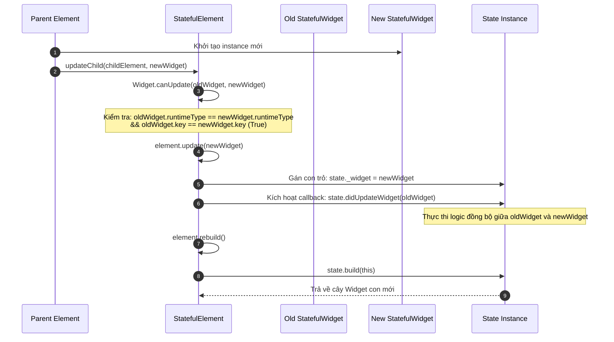

# Bài 3.1 — StatelessWidget vs StatefulWidget Internals

## Phần 1 — Khái Niệm & Ràng Buộc Kiến Trúc

### 1.1 — Định nghĩa kỹ thuật theo Flutter Framework

Trong mã nguồn Flutter Framework (`packages/flutter/lib/src/widgets/framework.dart`), hai lớp cơ sở mô tả cấu trúc giao diện người dùng được định nghĩa như sau:

- **`StatelessWidget`**: Lớp widget mô tả một phần giao diện người dùng không phụ thuộc vào trạng thái nội bộ có thể biến đổi theo thời gian. Giao diện của `StatelessWidget` chỉ phụ thuộc vào hai nguồn dữ liệu:
  1. Các thông tin cấu hình bất biến được truyền qua constructor (các trường `final`).
  2. Dữ liệu ngữ cảnh môi trường được đọc từ `BuildContext` tại vị trí widget được nạp (inflate) vào cây (ví dụ: `Theme.of(context)`, `MediaQuery.of(context)`).

- **`StatefulWidget`**: Lớp widget mô tả một phần giao diện có gắn liền với một đối tượng trạng thái (`State`). Trạng thái này chứa các trường dữ liệu có thể thay đổi trong suốt vòng đời của widget do tương tác người dùng, phản hồi từ mạng, luồng dữ liệu (`Stream`), hoặc bộ định thời (`Timer`).

---

### 1.2 — Nguyên nhân phân tách kiến trúc thành hai lớp: StatefulWidget và State

Flutter hoạt động dựa trên mô hình Declarative UI, trong đó giao diện người dùng là một hàm thuần túy của trạng thái:

$$UI = f(State)$$

Mỗi khi trạng thái thay đổi, framework sẽ thực thi lại hàm `build()` để tạo ra một bản mô tả giao diện mới. Việc tách `StatefulWidget` thành hai lớp riêng biệt (`StatefulWidget` và `State`) bắt nguồn từ hai ràng buộc kỹ thuật cốt lõi:

#### Ràng buộc 1: Tính bất biến của Widget (Immutable Configuration)
Lớp cơ sở `Widget` được đánh dấu với annotation `@immutable`. Ràng buộc này quy định mọi lớp kế thừa từ `Widget` bắt buộc phải có tất cả các trường dữ liệu là `final`. 
- Khi cấu hình thay đổi, các đối tượng `Widget` cũ bị hủy bỏ và các đối tượng `Widget` mới được khởi tạo để thay thế với chi phí $O(1)$.
- Widget đóng vai trò là một **bản vẽ cấu hình (blueprint)** tạm thời, không giữ trạng thái động và có thể bị Garbage Collector thu hồi bất cứ lúc nào.

#### Ràng buộc 2: Sự bền vững của trạng thái qua các khung hình (State Persistence)
Nếu dữ liệu biến đổi (như nội dung văn bản đang nhập dở, vị trí cuộn trang, hoặc tiến trình tải) được đặt trực tiếp bên trong `StatefulWidget`, thì mỗi khi widget cha rebuild và khởi tạo lại `StatefulWidget`, toàn bộ dữ liệu nội bộ đó sẽ bị xóa sạch.
- Để giải quyết vấn đề này, Flutter tách toàn bộ logic biến đổi vào một lớp riêng biệt là `State<T>`.
- Đối tượng `State` được khởi tạo một lần duy nhất và được quản lý trực tiếp bởi `StatefulElement` trên Element Tree. 
- Khi `StatefulWidget` bị hủy và tạo mới ở mỗi lần render, đối tượng `State` vẫn được giữ nguyên tại vị trí node đó trong bộ nhớ, chỉ có tham chiếu cấu hình `widget` được trỏ sang instance mới.

```
┌────────────────────────────────────────────────────────┐
│ WIDGET TREE (Bản vẽ cấu hình - Bất biến, Transient)   │
│   MyStatefulWidget (khung hình 1) ──► Thu hồi bởi GC   │
│   MyStatefulWidget (khung hình 2) ──► Instance mới     │
└───────────────────────────┬────────────────────────────┘
                            │ update(newWidget)
┌───────────────────────────▼────────────────────────────┐
│ ELEMENT TREE (Bộ điều phối thực thi - Bền vững)        │
│   StatefulElement (Tồn tại suốt vòng đời màn hình)     │
│       ├── _state  ───────────────────────────────────┐ │
│       └── _widget ─────────┐                         │ │
└────────────────────────────┼─────────────────────────┼─┘
                             │                         ▼
┌────────────────────────────┴───────────────────────────┐
│ STATE OBJECT (Vùng lưu trữ dữ liệu biến đổi - Bền vững)│
│   _MyWidgetState                                       │
│     • int counter;                                     │
│     • TextEditingController controller;                │
└────────────────────────────────────────────────────────┘
```

---

## Phần 2 — Cơ Chế Hoạt Động & Mã Nguồn Đối Chiếu

### 2.1 — Cơ chế nội bộ của StatelessWidget và StatelessElement

Mã nguồn triển khai của `StatelessWidget` và `StatelessElement` trong `framework.dart`:

```dart
abstract class StatelessWidget extends Widget {
  const StatelessWidget({ super.key });

  @override
  StatelessElement createElement() => StatelessElement(this);

  @protected
  Widget build(BuildContext context);
}

class StatelessElement extends ComponentElement {
  StatelessElement(StatelessWidget super.widget);

  @override
  StatelessWidget get widget => super.widget as StatelessWidget;

  @override
  Widget build() => widget.build(this);

  @override
  void update(StatelessWidget newWidget) {
    super.update(newWidget);
    assert(widget == newWidget);
    rebuild(force: true);
  }
}
```

#### Đặc tính vận hành:
1. **Khởi tạo Element**: Khi `StatelessWidget` được mount vào cây, phương thức `createElement()` được gọi để tạo ra một instance `StatelessElement`.
2. **Cơ chế ủy quyền (Delegation)**: `StatelessElement` không quản lý vòng đời phức tạp. Khi framework yêu cầu cập nhật giao diện (`rebuild()`), `StatelessElement` chỉ đơn giản gọi phương thức `build(this)`, truyền chính nó (dưới interface `BuildContext`) làm tham số cho widget.
3. **Cập nhật cấu hình**: Khi widget cha rebuild với cấu hình mới nhưng cùng `runtimeType` và `key`, phương thức `update()` được gọi để gán widget mới và đánh dấu `rebuild(force: true)`.

---

### 2.2 — Cơ chế nội bộ của StatefulWidget và StatefulElement

Mã nguồn triển khai của `StatefulWidget` và `StatefulElement` trong `framework.dart`:

```dart
abstract class StatefulWidget extends Widget {
  const StatefulWidget({ super.key });

  @override
  StatefulElement createElement() => StatefulElement(this);

  @protected
  @factory
  State createState();
}

class StatefulElement extends ComponentElement {
  StatefulElement(StatefulWidget widget)
      : _state = widget.createState(),
        super(widget) {
    state._element = this;
    state._widget = widget;
  }

  @override
  State<StatefulWidget> get state => _state;
  late State<StatefulWidget> _state;

  @override
  Widget build() => state.build(this);

  @override
  void mount(Element? parent, Object? newSlot) {
    super.mount(parent, newSlot);
    state._element = this;
    state.initState();
    state.didChangeDependencies();
  }
}
```

#### Cơ chế liên kết hai chiều (Two-Way Implicit Binding):
Lớp `State<T>` định nghĩa hai getter quan trọng:
```dart
abstract class State<T extends StatefulWidget> {
  T get widget => _widget!;
  T? _widget;

  BuildContext get context {
    assert(_element != null, 'Cannot access context after dispose or before initState.');
    return _element!;
  }
  StatefulElement? _element;
}
```
Khi `StatefulElement` được khởi tạo trong constructor của nó:
- `state._element = this`: Gắn con trỏ Element vào State. Nhờ đó, getter `context` trong State trả về chính instance `StatefulElement`.
- `state._widget = widget`: Gắn con trỏ cấu hình Widget vào State. Nhờ đó, getter `widget` trong State có thể đọc được các tham số từ Widget cấu hình.

---

### 2.3 — Luồng Reconciliation khi Widget cha Rebuild

Khi một widget cha rebuild, một instance `StatefulWidget` mới được sinh ra tại cùng vị trí. Luồng xử lý diễn ra như sau:



Mã nguồn thực thi phương thức `update()` của `StatefulElement`:

```dart
@override
void update(StatefulWidget newWidget) {
  super.update(newWidget);
  final StatefulWidget oldWidget = state._widget!;
  
  // 1. Cập nhật con trỏ tham chiếu cấu hình sang Widget mới
  state._widget = newWidget;
  
  // 2. Thông báo cho State xử lý sự thay đổi cấu hình
  final Object? debugCheckForReturnedFuture = state.didUpdateWidget(oldWidget) as dynamic;
  
  // 3. Đánh dấu Element cần thực thi lại hàm build()
  rebuild(force: true);
}
```

Kết quả: Instance `State` trên Heap không bị khởi tạo lại. Toàn bộ các trường dữ liệu nội bộ được giữ nguyên, chỉ có con trỏ `state.widget` được cập nhật sang widget mới.

---

### 2.4 — Bảng so sánh đặc tính kỹ thuật (Technical Specification)

| Đặc tính kỹ thuật | StatelessWidget | StatefulWidget |
| :--- | :--- | :--- |
| **Lớp Element tương ứng** | `StatelessElement` | `StatefulElement` |
| **Cơ chế lưu trữ trạng thái** | Không có đối tượng State nội bộ | Lưu trữ trong đối tượng `State<T>` riêng biệt |
| **Vị trí hàm `build()`** | Trực tiếp trong class `StatelessWidget` | Nằm trong class `State<T>` |
| **Cơ chế truy cập `BuildContext`** | Nhận qua tham số của hàm `build(context)` | Truy cập qua getter `this.context` trong `State` |
| **Vòng đời đối tượng** | Không có lifecycle hooks | Hỗ trợ: `initState`, `didUpdateWidget`, `dispose`... |
| **Khả năng tối ưu với `const`** | Khởi tạo constructor `const` cho toàn bộ class | Chỉ khởi tạo `const` cho lớp Widget factory |
| **Điều kiện tái sử dụng State** | Không áp dụng | `Widget.canUpdate` trả về `true` |
| **Điều kiện hủy bỏ State** | Không áp dụng | Khi node bị unmount khỏi Element Tree |

---

### 2.5 — Phân bổ tài nguyên trên Dart VM Heap & Ảnh hưởng Garbage Collector

Việc lựa chọn giữa `StatelessWidget` và `StatefulWidget` ảnh hưởng trực tiếp đến việc cấp phát vùng nhớ trên Heap:

1. **Cấp phát bộ nhớ cho `StatelessWidget`:**
   - Khi được khai báo với constructor `const`, Dart VM lưu instance tại vùng nhớ chuẩn hóa (Canonicalized Memory). Không có instance mới nào được tạo thêm trên Heap giữa các lần rebuild.
   - Khi mount vào cây, framework chỉ cấp phát duy nhất một đối tượng `StatelessElement`.
   - Áp lực lên Garbage Collector (GC) ở mức tối thiểu.

2. **Cấp phát bộ nhớ cho `StatefulWidget`:**
   - Dù lớp `StatefulWidget` có constructor `const`, khi mount vào cây, framework bắt buộc phải khởi tạo hai đối tượng độc lập: một đối tượng `StatefulElement` và một đối tượng `State`.
   - Mỗi đối tượng `State` cấp phát bộ nhớ cho: bảng tra cứu kiểu (Type dispatch table), con trỏ `_element`, con trỏ `_widget`, cờ trạng thái `_debugLifecycleState`, và toàn bộ các trường biến cục bộ.
   - Do đó, đối với các thành phần giao diện tĩnh, việc sử dụng `StatefulWidget` sẽ làm tăng dung lượng bộ nhớ Heap và tăng số lượng đối tượng mà GC cần quét trong chu kỳ Mark-Sweep.

---

## Phần 3 — Mẫu Triển Khai Chuẩn (Standard Implementation Patterns)

### 3.1 — Mẫu triển khai StatelessWidget thuần túy

```dart
import 'package:flutter/material.dart';

/// Thành phần giao diện tĩnh hiển thị thông tin người dùng.
/// Mọi thuộc tính đều là final; cung cấp const constructor.
@immutable
class UserMetricCard extends StatelessWidget {
  final String label;
  final String value;
  final IconData icon;

  const UserMetricCard({
    super.key,
    required this.label,
    required this.value,
    required this.icon,
  });

  @override
  Widget build(BuildContext context) {
    final theme = Theme.of(context);

    return Card(
      elevation: 1,
      child: Padding(
        padding: const EdgeInsets.all(16),
        child: Row(
          children: [
            Icon(icon, color: theme.colorScheme.primary),
            const SizedBox(width: 12),
            Column(
              crossAxisAlignment: CrossAxisAlignment.start,
              mainAxisSize: MainAxisSize.min,
              children: [
                Text(label, style: theme.textTheme.bodySmall),
                Text(value, style: theme.textTheme.titleMedium),
              ],
            ),
          ],
        ),
      ),
    );
  }
}
```

---

### 3.2 — Mẫu triển khai StatefulWidget kết hợp didUpdateWidget

```dart
import 'dart:async';
import 'package:flutter/material.dart';

/// Bộ đếm thời gian quản lý tài nguyên nội bộ và tự động đồng bộ khi cấu hình thay đổi.
class PollingStatusWidget extends StatefulWidget {
  final String endpointUrl;
  final Duration interval;

  const PollingStatusWidget({
    super.key,
    required this.endpointUrl,
    required this.interval,
  });

  @override
  State<PollingStatusWidget> createState() => _PollingStatusWidgetState();
}

class _PollingStatusWidgetState extends State<PollingStatusWidget> {
  Timer? _pollingTimer;
  int _fetchCount = 0;

  @override
  void initState() {
    super.initState();
    _startPolling();
  }

  @override
  void didUpdateWidget(covariant PollingStatusWidget oldWidget) {
    super.didUpdateWidget(oldWidget);
    
    // Đồng bộ khi interval hoặc endpoint thay đổi từ widget cha
    if (oldWidget.interval != widget.interval || oldWidget.endpointUrl != widget.endpointUrl) {
      _stopPolling();
      _startPolling();
    }
  }

  void _startPolling() {
    _pollingTimer = Timer.periodic(widget.interval, (_) {
      if (!mounted) return;
      setState(() {
        _fetchCount++;
      });
    });
  }

  void _stopPolling() {
    _pollingTimer?.cancel();
    _pollingTimer = null;
  }

  @override
  void dispose() {
    _stopPolling();
    super.dispose();
  }

  @override
  Widget build(BuildContext context) {
    return Text('Endpoint: ${widget.endpointUrl} | Polled: $_fetchCount lần');
  }
}
```

---

### 3.3 — Cây quyết định lựa chọn Widget (Decision Matrix)

```
                            [Xác định yêu cầu giao diện]
                                        │
                                        ▼
             Dữ liệu có thay đổi nội bộ trong suốt vòng đời của node không?
                                   /          \
                                 /              \
                             [Không]            [Có]
                               │                  │
                               ▼                  ▼
                       StatelessWidget     Dữ liệu có thể chuyển lên cấp cha
                                           quản lý (State Hoisting) không?
                                                 /          \
                                               /              \
                                            [Có]             [Không]
                                             │                  │
                                             ▼                  ▼
                                      StatelessWidget     StatefulWidget
                                     (Nhận callback)     (Tự quản lý State)
```

---

## Phần 4 — Các Bẫy Kỹ Thuật & Giải Pháp (Common Pitfalls & Mitigations)

### 4.1 — Khai báo trường non-final trong lớp kế thừa StatelessWidget

```dart
// Vi phạm hợp đồng bất biến: Lớp kế thừa StatelessWidget nhưng có trường non-final
class MutableStatelessCard extends StatelessWidget {
  int tapCount = 0; // Lỗi: This class should be immutable

  MutableStatelessCard({super.key});

  @override
  Widget build(BuildContext context) {
    return InkWell(
      onTap: () {
        tapCount++; // Dữ liệu thay đổi trên Heap nhưng UI không được đánh dấu rebuild
      },
      child: Text('$tapCount'),
    );
  }
}

// Giải pháp: Sử dụng StatefulWidget hoặc quản lý trạng thái bằng ValueNotifier
```

---

### 4.2 — Lỗi Stale State do chỉ khởi tạo dữ liệu trong initState

```dart
// Lỗi: Sao chép tham số widget vào biến trạng thái trong initState và bỏ qua didUpdateWidget
class StaleGreetingWidget extends StatefulWidget {
  final String userName;
  const StaleGreetingWidget({super.key, required this.userName});

  @override
  State<StaleGreetingWidget> createState() => _StaleGreetingWidgetState();
}

class _StaleGreetingWidgetState extends State<StaleGreetingWidget> {
  late String _cachedName;

  @override
  void initState() {
    super.initState();
    _cachedName = widget.userName; // Chỉ thực thi một lần khi mount
  }

  @override
  Widget build(BuildContext context) {
    // Khi widget cha truyền userName mới, _cachedName vẫn mang giá trị cũ
    return Text('Xin chào, $_cachedName');
  }
}

// Giải pháp 1: Đọc trực tiếp từ widget.userName trong build()
// Giải pháp 2: Override didUpdateWidget để cập nhật lại _cachedName khi tham số thay đổi
```

---

### 4.3 — Lưu trữ BuildContext trong biến thành viên dài hạn

```dart
// Lỗi: Lưu BuildContext vào trường dữ liệu gây rò rỉ bộ nhớ hoặc truy cập node đã unmount
class LeakyStateWidget extends StatefulWidget {
  const LeakyStateWidget({super.key});

  @override
  State<LeakyStateWidget> createState() => _LeakyStateWidgetState();
}

class _LeakyStateWidgetState extends State<LeakyStateWidget> {
  BuildContext? _retainedContext;

  @override
  Widget build(BuildContext context) {
    _retainedContext = context; // Sai: Giữ tham chiếu Context ngoài phạm vi hàm
    return const SizedBox.shrink();
  }
}

// Giải pháp: Trong State, luôn sử dụng getter `this.context` được cung cấp sẵn bởi framework
```

---

## Phần 5 — Câu Hỏi Kỹ Thuật & Phân Tích Thực Thi (Technical Analysis & Code Tracing)

---

#### Q1 — "Tại sao phương thức `createState()` được khai báo trong `StatefulWidget` thay vì `StatefulElement`?"

**Phân tích kỹ thuật:**
1. `StatefulWidget` đóng vai trò là một factory cung cấp cấu hình và chỉ định loại `State` tương ứng mà nó cần thông qua `createState()`.
2. Lớp `StatefulElement` là lớp generic thuộc framework (`StatefulElement(StatefulWidget widget)`). Nó không chứa mã nguồn đặc thù của ứng dụng mà chỉ triệu gọi phương thức trừu tượng `widget.createState()` để nhận về instance `State` cụ thể được định nghĩa bởi nhà phát triển.

---

#### Q2 — "Cơ chế hoán đổi tham chiếu trong `StatefulElement.update()` hoạt động như thế nào?"

**Phân tích kỹ thuật:**
Khi widget cha rebuild, framework thực hiện các bước sau tại node con:
1. Gọi hàm tĩnh `Widget.canUpdate(oldWidget, newWidget)`. Nếu cả hai đối tượng có cùng `runtimeType` và cùng `key`, framework giữ lại `StatefulElement` hiện tại.
2. Thực thi `StatefulElement.update(newWidget)`.
3. Gán con trỏ nội bộ: `state._widget = newWidget`.
4. Kích hoạt hook: `state.didUpdateWidget(oldWidget)` với tham số là widget cũ.
5. Triệu gọi `rebuild(force: true)` để đưa Element vào danh sách dirty của `BuildOwner`, chuẩn bị cho frame render tiếp theo.

---

#### Q3 — "Tại sao việc truy cập getter `widget` hoặc `context` trong constructor của lớp `State` sẽ gây lỗi Runtime?"

**Phân tích kỹ thuật:**
Constructor của lớp `State` được thực thi ngay khi `widget.createState()` được gọi. Tại thời điểm này:
- Quá trình liên kết của `StatefulElement` chưa diễn ra. Cả hai trường con trỏ `state._element` và `state._widget` đều có giá trị `null`.
- Các getter `widget` và `context` có assertion kiểm tra `_element != null` và `_widget != null`. Do đó, truy cập các thuộc tính này trước khi phương thức `initState()` được framework gọi sẽ kích hoạt assertion failure.

---

#### Q4 — "Phân tích sự khác biệt về cấp phát bộ nhớ trên Heap giữa 1000 StatelessWidget và 1000 StatefulWidget trong một danh sách tĩnh."

**Phân tích kỹ thuật:**
1. **1000 `StatelessWidget` (sử dụng constructor `const`):**
   - Chỉ có 1 instance của Widget tồn tại trong bộ nhớ canonical của Dart VM.
   - Khi render, sinh ra 1000 đối tượng `StatelessElement`.
   - Mỗi `StatelessElement` chỉ nắm giữ 1 con trỏ tham chiếu tới Widget.
2. **1000 `StatefulWidget`:**
   - Dù có constructor `const`, framework vẫn bắt buộc phải gọi `createState()` 1000 lần.
   - Sinh ra 1000 đối tượng `StatefulElement` và 1000 đối tượng `State` riêng biệt trên Heap.
   - Tăng thêm ít nhất 2000 con trỏ tham chiếu hai chiều (`_element` và `_widget`), kéo theo chi phí bộ nhớ lớn hơn và tăng thời gian duyệt rác của Garbage Collector.

---

#### Q5 (Trace Code) — "Dự đoán thứ tự thực thi của các phương thức vòng đời khi Parent rebuild"

Xem xét đoạn mã sau:

```dart
class ExecutionTraceParent extends StatefulWidget {
  const ExecutionTraceParent({super.key});
  @override State<ExecutionTraceParent> createState() => _ExecutionTraceParentState();
}

class _ExecutionTraceParentState extends State<ExecutionTraceParent> {
  int _counter = 0;

  @override
  Widget build(BuildContext context) {
    print('1. Parent: build');
    return Column(
      children: [
        ExecutionTraceChild(value: _counter),
        ElevatedButton(
          onPressed: () => setState(() => _counter = 1),
          child: const Text('Update'),
        ),
      ],
    );
  }
}

class ExecutionTraceChild extends StatefulWidget {
  final int value;
  const ExecutionTraceChild({super.key, required this.value});

  @override
  State<ExecutionTraceChild> createState() {
    print('2. Child: createState');
    return _ExecutionTraceChildState();
  }
}

class _ExecutionTraceChildState extends State<ExecutionTraceChild> {
  @override
  void initState() {
    super.initState();
    print('3. Child: initState');
  }

  @override
  void didChangeDependencies() {
    super.didChangeDependencies();
    print('4. Child: didChangeDependencies');
  }

  @override
  void didUpdateWidget(covariant ExecutionTraceChild oldWidget) {
    super.didUpdateWidget(oldWidget);
    print('5. Child: didUpdateWidget (old: ${oldWidget.value}, new: ${widget.value})');
  }

  @override
  Widget build(BuildContext context) {
    print('6. Child: build');
    return Text('${widget.value}');
  }
}
```

**Thứ tự in log khi ứng dụng khởi chạy lần đầu:**
```
1. Parent: build
2. Child: createState
3. Child: initState
4. Child: didChangeDependencies
6. Child: build
```

**Thứ tự in log khi người dùng kích hoạt nút nhấn `Update` (`_counter` chuyển từ 0 thành 1):**
```
1. Parent: build
5. Child: didUpdateWidget (old: 0, new: 1)
6. Child: build
```
*(Giải thích: Khi widget cha rebuild, `canUpdate` trả về `true` nên Element và State của child được tái sử dụng. Các phương thức `createState`, `initState` và `didChangeDependencies` không được kích hoạt lại).*
