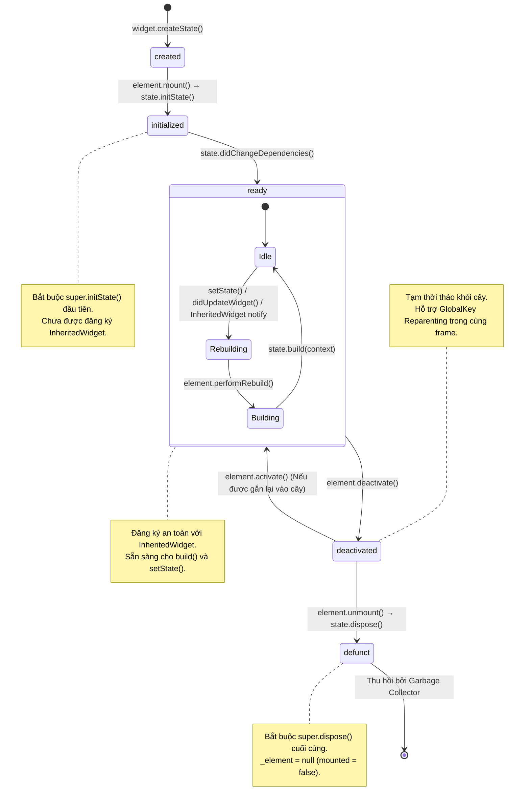

# Bài 3.2 — Vòng Đời Đầy Đủ của StatefulWidget (State Lifecycle)

## Phần 1 — Khái Niệm & Máy Trạng Thái (Concepts & State Machine)

### 1.1 — Khái niệm vòng đời đối tượng State

Trong Flutter Framework, đối tượng `State` đại diện cho logic và dữ liệu nội bộ có thể biến đổi của một `StatefulWidget`. Khác với `Widget` (chỉ là đối tượng cấu hình tạm thời, bị tạo mới và hủy bỏ liên tục), đối tượng `State` có **vòng đời bền vững** (persistent lifecycle) được gắn chặt với sự tồn tại của `StatefulElement` trên Element Tree.

Quản lý vòng đời đối tượng `State` bao gồm 4 trách nhiệm kỹ thuật:
1. **Khởi tạo tài nguyên ban đầu (Initialization):** Cấp phát bộ nhớ cho các controller (`AnimationController`, `TextEditingController`), đăng ký lắng nghe luồng dữ liệu (`StreamSubscription`), hoặc thiết lập bộ định thời (`Timer`).
2. **Đồng bộ hóa cấu hình (Configuration Synchronization):** Cập nhật dữ liệu nội bộ khi widget cha truyền vào tham số cấu hình mới (`didUpdateWidget`).
3. **Liên kết ngữ cảnh môi trường (Dependency Resolution):** Lắng nghe và phản ứng khi các `InheritedWidget` tổ tiên thay đổi dữ liệu (`didChangeDependencies`).
4. **Giải phóng tài nguyên (Teardown & Cleanup):** Hủy bỏ hoàn toàn các controller, listeners, và kết nối mạng trước khi đối tượng bị thu hồi khỏi bộ nhớ (`dispose`).

---

### 1.2 — Máy trạng thái hữu hạn `_StateLifecycle` trong Flutter Framework

Bên trong mã nguồn `packages/flutter/lib/src/widgets/framework.dart`, vòng đời của lớp `State` được điều khiển bởi một máy trạng thái hữu hạn thông qua enum nội bộ:

```dart
enum _StateLifecycle {
  created,      // Trạng thái vừa khởi tạo qua constructor, chưa gắn kết với Element
  initialized,  // Đang hoặc đã hoàn thành phương thức initState()
  ready,        // Đã hoàn thành didChangeDependencies(), sẵn sàng nhận build() và setState()
  defunct,      // Đã hoàn thành dispose(), ngưng hoạt động vĩnh viễn
}
```

Framework sử dụng cờ `_debugLifecycleState` để bảo vệ các bất biến kiến trúc thông qua các câu lệnh assertion:
- **Trước khi `initState()` hoàn tất:** `_debugLifecycleState` ở trạng thái `created`. Mọi thao tác truy cập `BuildContext` để đăng ký phụ thuộc đều bị chặn.
- **Sau khi `dispose()` hoàn tất:** `_debugLifecycleState` chuyển sang `defunct`. Mọi lời gọi `setState()` đều vi phạm assertion `_debugLifecycleState != _StateLifecycle.defunct`.
- **Thuộc tính `mounted`:** Được định nghĩa là một getter kiểm tra trạng thái gắn kết của Element:
  ```dart
  bool get mounted => _element != null;
  ```
  Khi khởi tạo, `_element` được gán tham chiếu; khi đối tượng bị unmount hoàn toàn, `_element` được gán về `null`.

---

## Phần 2 — Cơ Chế Hoạt Động & Mã Nguồn Đối Chiếu

### 2.1 — Đặc tả kỹ thuật 7 giai đoạn vòng đời



---

#### Giai đoạn 1: `createState()`
- **Thời điểm kích hoạt:** Được gọi từ constructor của `StatefulElement` khi widget lần đầu được đưa vào cây:
  ```dart
  StatefulElement(StatefulWidget widget) : _state = widget.createState(), super(widget);
  ```
- **Hợp đồng kỹ thuật:** Khởi tạo instance của lớp kế thừa `State<T>`. Không thực hiện bất kỳ logic truy cập `context` hay tính toán nào tại đây.

---

#### Giai đoạn 2: `initState()`
- **Thời điểm kích hoạt:** Được framework gọi ngay sau khi `StatefulElement` mount vào Element Tree. Lúc này, con trỏ `_element` và `_widget` đã được liên kết với đối tượng `State`.
- **Hợp đồng API:**
  1. **Bắt buộc gọi `super.initState()` ở câu lệnh đầu tiên**:
     ```dart
     @override
     void initState() {
       super.initState();
       // Logic khởi tạo tài nguyên
     }
     ```
  2. **Không gọi các phương thức đăng ký phụ thuộc `BuildContext`**: Không sử dụng `Theme.of(context)` hoặc `MediaQuery.of(context)` tại đây. Mã nguồn framework chặn hành vi này bằng assertion:
     > *"dependOnInheritedWidgetOfExactType was called before initState completed."*

---

#### Giai đoạn 3: `didChangeDependencies()`
- **Thời điểm kích hoạt:**
  1. Được gọi ngay sau `initState()` trong lần mount đầu tiên của widget.
  2. Được gọi lại mỗi khi một `InheritedWidget` mà widget này đang lắng nghe thông báo thay đổi dữ liệu (`updateShouldNotify` trả về `true`).
- **Hợp đồng kỹ thuật:** Là vị trí an toàn đầu tiên trong vòng đời để truy cập `BuildContext` và đăng ký phụ thuộc với các `InheritedElement` tổ tiên.

---

#### Giai đoạn 4: `build(BuildContext context)`
- **Thời điểm kích hoạt:** Được gọi sau `didChangeDependencies()`, sau khi nhận tín hiệu từ `setState()`, hoặc sau khi `didUpdateWidget()` hoàn thành.
- **Hợp đồng kỹ thuật:** Phải là một hàm thuần túy (Pure Function), không chứa side-effect:
  - Không thay đổi biến trạng thái nội bộ.
  - Không gọi `setState()` (vi phạm assertion `!_debugBuilding`).
  - Không khởi tạo các kết nối mạng bất đồng bộ trực tiếp trong phương thức này.

---

#### Giai đoạn 5: `didUpdateWidget(covariant T oldWidget)`
- **Thời điểm kích hoạt:** Được framework triệu gọi khi widget cha rebuild và cung cấp một instance `StatefulWidget` mới tại cùng vị trí, thỏa mãn điều kiện `Widget.canUpdate(oldWidget, newWidget) == true`.
- **Hợp đồng kỹ thuật:**
  - `widget` đã được framework cập nhật sang instance mới.
  - Tham số `oldWidget` đại diện cho cấu hình trước đó.
  - Sử dụng phương thức này để so sánh sự thay đổi giữa `oldWidget` và `widget`, từ đó tái thiết lập các controller hoặc luồng dữ liệu nếu cần thiết.

---

#### Giai đoạn 6: `deactivate()`
- **Thời điểm kích hoạt:** Được gọi khi `StatefulElement` bị gỡ khỏi Element Tree.
- **Cơ chế GlobalKey Reparenting:**
  - Khi một widget bị gỡ khỏi vị trí hiện tại, nó được đưa vào danh sách `_deactivatedElements` của `BuildOwner`.
  - Nếu trong cùng một khung hình render, widget đó được chèn vào một vị trí mới trên cây thông qua `GlobalKey`, framework sẽ gọi phương thức `activate()`. Đối tượng `State` tiếp tục hoạt động mà không bị hủy.
  - Nếu đến cuối khung hình đối tượng không được gắn lại vào cây, framework sẽ chuyển sang giai đoạn `dispose()`.

---

#### Giai đoạn 7: `dispose()`
- **Thời điểm kích hoạt:** Được gọi khi `StatefulElement` bị unmount vĩnh viễn khỏi Element Tree.
- **Hợp đồng kỹ thuật:**
  1. Giải phóng toàn bộ tài nguyên (Controller, StreamSubscription, Timer).
  2. **Bắt buộc gọi `super.dispose()` ở câu lệnh cuối cùng**:
     ```dart
     @override
     void dispose() {
       _controller.dispose();
       _subscription?.cancel();
       super.dispose();
     }
     ```
  3. Sau khi `super.dispose()` thực thi, cờ trạng thái chuyển sang `_StateLifecycle.defunct`, `_element` được gán về `null`, và `mounted` trả về `false`.

---

### 2.2 — Ma trận đặc tính kỹ thuật các phương thức vòng đời

| Phương thức | Context hợp lệ? | Truy cập `widget`? | Đăng ký `InheritedWidget`? | Triệu gọi `setState()`? | Vị trí `super` |
| :--- | :---: | :---: | :---: | :---: | :--- |
| `createState()` | Không | Không | Không | Không | Không áp dụng |
| `initState()` | Hạn chế | Có | **Cấm** (Assertion failure) | Không cần thiết | **Đầu tiên** |
| `didChangeDependencies()` | **Có** | Có | **Hợp lệ** | Hợp lệ | Đầu tiên |
| `build()` | **Có** | Có | **Hợp lệ** | **Cấm** (Assertion failure) | Không áp dụng |
| `didUpdateWidget()` | **Có** | Có | Không khuyến nghị | Hợp lệ (nhưng thừa) | Đầu tiên |
| `deactivate()` | Hạn chế | Có | Không | Không | Cuối cùng |
| `dispose()` | **Vô hiệu** | Có | Không | **Cấm** (Assertion failure) | **Cuối cùng** |

---

### 2.3 — Phân biệt Widget State Lifecycle và App Lifecycle

Cần phân biệt rõ hai hệ thống vòng đời hoạt động ở hai tầng kiến trúc khác nhau:

```
┌────────────────────────────────────────────────────────┐
│ APP LIFECYCLE (Quản lý bởi Hệ điều hành qua Engine)    │
│   Trạng thái: resumed ◄──► inactive ◄──► paused        │
└───────────────────────────┬────────────────────────────┘
                            │ Thông báo qua WidgetsBinding
┌───────────────────────────▼────────────────────────────┐
│ WIDGET STATE LIFECYCLE (Quản lý bởi Flutter Framework) │
│   Trạng thái: initState ──► build ──► dispose          │
└────────────────────────────────────────────────────────┘
```

- **Widget State Lifecycle:** Quản lý sự tồn tại của từng node giao diện trên Element Tree. Khi người dùng chuyển màn hình (Route), widget cũ bị unmount và phương thức `dispose()` được thực thi.
- **App Lifecycle:** Quản lý trạng thái tiến trình của ứng dụng trên hệ điều hành di động (Android / iOS). Khi người dùng đưa ứng dụng xuống background hoặc khóa màn hình, ứng dụng chuyển sang trạng thái `AppLifecycleState.paused`.
- **Ràng buộc tương tác:** Khi ứng dụng chuyển sang background, **Widget State không bị dispose**. Toàn bộ dữ liệu bộ nhớ vẫn được duy trì. Nếu không sử dụng `AppLifecycleListener` để tạm dừng các tiến trình chạy nền (như hoạt ảnh, bộ định thời), ứng dụng sẽ tiếp tục tiêu thụ CPU của thiết bị.

---

## Phần 3 — Mẫu Triển Khai Chuẩn (Standard Implementation Patterns)

### 3.1 — Mẫu quản lý tài nguyên toàn diện kết hợp AppLifecycleListener

```dart
import 'dart:async';
import 'package:flutter/material.dart';

/// Triển khai chuẩn cho Widget quản lý tài nguyên phức tạp:
/// - Quản lý TextEditingController, Timer, StreamSubscription.
/// - Đồng bộ tham số qua didUpdateWidget.
/// - Lắng nghe vòng đời ứng dụng qua AppLifecycleListener.
class ResourceManagementWidget extends StatefulWidget {
  final String streamId;
  final bool isTrackingEnabled;

  const ResourceManagementWidget({
    super.key,
    required this.streamId,
    required this.isTrackingEnabled,
  });

  @override
  State<ResourceManagementWidget> createState() => _ResourceManagementWidgetState();
}

class _ResourceManagementWidgetState extends State<ResourceManagementWidget> {
  late final TextEditingController _textController;
  late final AppLifecycleListener _lifecycleListener;
  StreamSubscription<int>? _dataSubscription;
  Timer? _heartbeatTimer;
  int _latestValue = 0;

  @override
  void initState() {
    super.initState(); // Hợp đồng: Gọi đầu tiên

    _textController = TextEditingController();

    // Đăng ký theo dõi trạng thái ứng dụng trên OS
    _lifecycleListener = AppLifecycleListener(
      onPause: _handleAppPaused,
      onResume: _handleAppResumed,
    );

    _initializeStream(widget.streamId);

    if (widget.isTrackingEnabled) {
      _startHeartbeat();
    }
  }

  @override
  void didChangeDependencies() {
    super.didChangeDependencies();
    // Đọc thông tin môi trường nếu cần thiết (Theme, Locale)
  }

  @override
  void didUpdateWidget(covariant ResourceManagementWidget oldWidget) {
    super.didUpdateWidget(oldWidget);

    // Đồng bộ khi streamId thay đổi
    if (oldWidget.streamId != widget.streamId) {
      _dataSubscription?.cancel();
      _initializeStream(widget.streamId);
    }

    // Đồng bộ khi trạng thái tracking thay đổi
    if (oldWidget.isTrackingEnabled != widget.isTrackingEnabled) {
      if (widget.isTrackingEnabled) {
        _startHeartbeat();
      } else {
        _stopHeartbeat();
      }
    }
  }

  @override
  Widget build(BuildContext context) {
    return Column(
      children: [
        TextField(controller: _textController),
        Text('Giá trị nhận được: $_latestValue'),
      ],
    );
  }

  @override
  void dispose() {
    // Giải phóng tài nguyên trước khi gọi super.dispose()
    _stopHeartbeat();
    _dataSubscription?.cancel();
    _textController.dispose();
    _lifecycleListener.dispose();

    super.dispose(); // Hợp đồng: Gọi cuối cùng
  }

  void _initializeStream(String id) {
    _dataSubscription = Stream.periodic(const Duration(seconds: 1), (count) => count).listen((data) {
      if (!mounted) return;
      setState(() {
        _latestValue = data;
      });
    });
  }

  void _startHeartbeat() {
    _stopHeartbeat();
    _heartbeatTimer = Timer.periodic(const Duration(seconds: 5), (_) {
      // Thực thi tín hiệu đồng bộ định kỳ
    });
  }

  void _stopHeartbeat() {
    _heartbeatTimer?.cancel();
    _heartbeatTimer = null;
  }

  void _handleAppPaused() {
    _stopHeartbeat();
  }

  void _handleAppResumed() {
    if (widget.isTrackingEnabled) {
      _startHeartbeat();
    }
  }
}
```

---

### 3.2 — Mẫu bảo tồn trạng thái qua GlobalKey Reparenting

```dart
import 'package:flutter/material.dart';

/// Minh họa cơ chế GlobalKey Reparenting:
/// Di chuyển Widget giữa hai nhánh cây khác nhau trong cùng một khung hình
/// mà không làm mất trạng thái State hiện tại.
class GlobalKeyReparentingExample extends StatefulWidget {
  const GlobalKeyReparentingExample({super.key});

  @override
  State<GlobalKeyReparentingExample> createState() => _GlobalKeyReparentingExampleState();
}

class _GlobalKeyReparentingExampleState extends State<GlobalKeyReparentingExample> {
  final GlobalKey<_PersistentCounterState> _counterKey = GlobalKey<_PersistentCounterState>();
  bool _renderInFirstContainer = true;

  @override
  Widget build(BuildContext context) {
    return Column(
      children: [
        ElevatedButton(
          onPressed: () => setState(() => _renderInFirstContainer = !_renderInFirstContainer),
          child: const Text('Chuyển đổi vị trí container'),
        ),
        Container(
          height: 80,
          color: Colors.grey.shade200,
          child: _renderInFirstContainer ? PersistentCounter(key: _counterKey) : null,
        ),
        const SizedBox(height: 16),
        Container(
          height: 80,
          color: Colors.grey.shade300,
          child: !_renderInFirstContainer ? PersistentCounter(key: _counterKey) : null,
        ),
      ],
    );
  }
}

class PersistentCounter extends StatefulWidget {
  const PersistentCounter({super.key});

  @override
  State<PersistentCounter> createState() => _PersistentCounterState();
}

class _PersistentCounterState extends State<PersistentCounter> {
  int _counter = 0;

  @override
  void deactivate() {
    // Kích hoạt khi phần tử tạm thời bị tháo khỏi vị trí cũ
    super.deactivate();
  }

  @override
  void activate() {
    // Kích hoạt khi phần tử được gắn vào vị trí mới trong cùng frame
    super.activate();
  }

  @override
  Widget build(BuildContext context) {
    return Row(
      mainAxisAlignment: MainAxisAlignment.center,
      children: [
        Text('Bộ đếm: $_counter'),
        IconButton(
          icon: const Icon(Icons.add),
          onPressed: () => setState(() => _counter++),
        ),
      ],
    );
  }
}
```

---

## Phần 4 — Các Bẫy Kỹ Thuật & Giải Pháp (Common Pitfalls & Mitigations)

### 4.1 — Triệu gọi InheritedWidget trong initState

```dart
// Lỗi: Đăng ký lắng nghe InheritedWidget khi quá trình mount chưa hoàn tất
@override
void initState() {
  super.initState();
  // Kích hoạt FlutterError: dependOnInheritedWidgetOfExactType was called before initState completed.
  final theme = Theme.of(context);
}

// Giải pháp: Di chuyển logic phụ thuộc context vào didChangeDependencies()
@override
void didChangeDependencies() {
  super.didChangeDependencies();
  final theme = Theme.of(context); // Thực thi hợp lệ
}
```

---

### 4.2 — Đảo ngược thứ tự gọi phương thức lớp cha (super)

```dart
// Lỗi: Đảo ngược thứ tự gọi phương thức lớp cha
@override
void initState() {
  _initializeResources();
  super.initState(); // Sai: Bắt buộc phải là câu lệnh đầu tiên
}

@override
void dispose() {
  super.dispose();   // Sai: Khi lớp cha chạy xong, _element = null và trạng thái là defunct
  _controller.dispose(); // Nguy cơ lỗi khi truy cập các thuộc tính nội bộ
}

// Giải pháp: Tuân thủ quy tắc First-In, Last-Out
@override
void initState() {
  super.initState(); // Lớp cha thiết lập trước
  _initializeResources();
}

@override
void dispose() {
  _teardownResources(); // Dọn dẹp tài nguyên trước
  super.dispose();      // Lớp cha đóng vòng đời sau cùng
}
```

---

### 4.3 — Triệu gọi setState sau khi đối tượng đã bị hủy (mounted == false)

```dart
// Lỗi: Gọi setState sau async gap mà không kiểm tra cờ mounted
Future<void> _fetchData() async {
  final result = await httpClient.get('api/data'); // Quá trình bất đồng bộ tạo async gap
  // Nếu người dùng đóng màn hình trong thời gian chờ, đối tượng State đã bị dispose
  setState(() {
    _data = result; // Kích hoạt assertion failure: setState() called after dispose()
  });
}

// Giải pháp: Kiểm tra thuộc tính mounted trước khi thực thi
Future<void> _fetchData() async {
  final result = await httpClient.get('api/data');
  if (!mounted) return; // Guard kiểm tra trạng thái gắn kết của Element
  setState(() {
    _data = result;
  });
}
```

---

## Phần 5 — Câu Hỏi Kỹ Thuật & Phân Tích Thực Thi (Technical Analysis & Code Tracing)

---

#### Q1 — "Trình tự các phương thức được framework triệu gọi khi một StatefulWidget lần đầu tiên mount vào cây?"

**Phân tích kỹ thuật:**
Thứ tự thực thi tuần tự gồm 5 bước:
1. `StatefulWidget.createState()`: Framework khởi tạo instance `State` tương ứng trên Heap.
2. Thiết lập con trỏ liên kết: Framework gán `state._element = this` và `state._widget = widget`.
3. `State.initState()`: Khởi tạo các tài nguyên nội bộ độc lập với context.
4. `State.didChangeDependencies()`: Đăng ký liên kết với các `InheritedElement` tổ tiên.
5. `State.build(BuildContext context)`: Trả về cây Widget con để phục vụ cho các bước Layout và Paint tiếp theo.

---

#### Q2 — "Tại sao framework chặn việc triệu gọi `dependOnInheritedWidgetOfExactType` trong phương thức `initState()`?"

**Phân tích kỹ thuật:**
Phương thức `dependOnInheritedWidgetOfExactType` thực hiện hai thao tác:
1. Tìm kiếm `InheritedElement` phù hợp gần nhất trong danh sách tổ tiên.
2. Đưa `Element` hiện tại vào bảng `_dependents` của `InheritedElement` đó để tự động kích hoạt rebuild khi dữ liệu thay đổi.

Trong thời gian `initState()` đang chạy:
- Đối tượng `StatefulElement` chưa hoàn thành việc mount vào cây. Đồ thị tổ tiên chưa được xác lập đầy đủ.
- Cờ trạng thái `_debugLifecycleState` đang mang giá trị `_StateLifecycle.created`.
- Nếu cho phép đăng ký phụ thuộc tại thời điểm này, cấu trúc cây phụ thuộc có thể rơi vào trạng thái không nhất quán, dẫn đến lỗi rò rỉ hoặc rebuild sai đối tượng. Do đó, framework chặn bằng assertion và chỉ cho phép thao tác này diễn ra kể từ `didChangeDependencies()`.

---

#### Q3 — "Cơ chế hoạt động của danh sách `_deactivatedElements` và quy trình GlobalKey Reparenting diễn ra như thế nào?"

**Phân tích kỹ thuật:**
1. Khi một widget bị xóa khỏi vị trí cũ trên cây Widget, `BuildOwner` không gọi `unmount()` ngay lập tức. Thay vào đó, nó đưa `Element` vào danh sách nội bộ `_deactivatedElements` và gọi phương thức `deactivate()`.
2. `GlobalKey` duy trì một bảng ánh xạ tĩnh toàn cục liên kết giữa key và instance `Element`.
3. Khi duyệt qua các node mới trong cùng một khung hình render, nếu framework phát hiện một widget mới có cùng `GlobalKey`, nó sẽ trích xuất `Element` cũ tương ứng ra khỏi `_deactivatedElements`.
4. Framework gọi phương thức `element.activate()`, sau đó gọi `state.activate()`. Quá trình unmount bị hủy bỏ, đối tượng `State` được duy trì nguyên vẹn và tiếp tục hoạt động tại vị trí mới.
5. Nếu kết thúc khung hình mà `Element` trong `_deactivatedElements` không được gắn vào vị trí mới nào, framework mới chính thức gọi `element.unmount()`, dẫn đến việc thực thi `state.dispose()`.

---

#### Q4 — "Việc gọi `setState()` bên trong phương thức `didUpdateWidget()` có vi phạm hợp đồng API không?"

**Phân tích kỹ thuật:**
1. **Tính hợp lệ:** Việc gọi `setState()` trong `didUpdateWidget()` hoàn toàn hợp lệ và không vi phạm assertion nào của framework vì trạng thái lúc này là `_StateLifecycle.ready`.
2. **Tính cần thiết:** Việc bọc các câu lệnh thay đổi dữ liệu trong `setState(() { ... })` bên trong `didUpdateWidget()` là **không cần thiết**. Trong mã nguồn `StatefulElement.update()`, ngay sau khi dòng lệnh `state.didUpdateWidget(oldWidget)` kết thúc, framework luôn gọi `rebuild(force: true)`. Do đó, mọi thay đổi dữ liệu được gán trực tiếp vào các biến thành viên trong `didUpdateWidget()` đều chắc chắn được phản ánh trong lần thực thi `build()` diễn ra ngay sau đó.

---

#### Q5 (Trace Code) — "Dự đoán thứ tự in log của chương trình sau khi thay đổi vị trí widget"

Xem xét đoạn mã sau:

```dart
class ReparentingTraceApp extends StatefulWidget {
  const ReparentingTraceApp({super.key});
  @override State<ReparentingTraceApp> createState() => _ReparentingTraceAppState();
}

class _ReparentingTraceAppState extends State<ReparentingTraceApp> {
  final GlobalKey _sharedKey = GlobalKey();
  bool _toggle = false;

  @override
  Widget build(BuildContext context) {
    return Column(
      children: [
        if (!_toggle)
          LogTrackerWidget(key: _sharedKey, name: 'Target')
        else
          const SizedBox.shrink(),
        if (_toggle)
          LogTrackerWidget(key: _sharedKey, name: 'Target')
        else
          const SizedBox.shrink(),
        ElevatedButton(
          onPressed: () => setState(() => _toggle = !_toggle),
          child: const Text('Toggle'),
        ),
      ],
    );
  }
}

class LogTrackerWidget extends StatefulWidget {
  final String name;
  const LogTrackerWidget({super.key, required this.name});

  @override
  State<LogTrackerWidget> createState() => _LogTrackerWidgetState();
}

class _LogTrackerWidgetState extends State<LogTrackerWidget> {
  @override void initState() { super.initState(); print('1. initState'); }
  @override void didChangeDependencies() { super.didChangeDependencies(); print('2. didChangeDependencies'); }
  @override void build(BuildContext context) { print('3. build'); return Text(widget.name); }
  @override void deactivate() { print('4. deactivate'); super.deactivate(); }
  @override void activate() { super.activate(); print('5. activate'); }
  @override void dispose() { print('6. dispose'); super.dispose(); }
}
```

**Thứ tự in log khi khởi chạy lần đầu:**
```
1. initState
2. didChangeDependencies
3. build
```

**Thứ tự in log khi người dùng kích hoạt nút nhấn `Toggle`:**
```
4. deactivate
5. activate
3. build
```
*(Giải thích: Do widget sử dụng chung một `GlobalKey`, khi vị trí trong `Column` thay đổi, phần tử bị tháo khỏi vị trí cũ kích hoạt `deactivate()`, sau đó ngay trong cùng frame được gắn vào vị trí mới kích hoạt `activate()` và `build()`. Phương thức `dispose()` và `initState()` hoàn toàn không được gọi).*
