# Bài 3.4 — Vòng Đời Ticker & AnimationController (Animation Lifecycle)

## Phần 1 — Khái Niệm & Cơ Chế Đồng Bộ VSync (Concepts & Hardware Synchronization)

### 1.1 — Tín hiệu VSync phần cứng và hạn chế của bộ định thời phần mềm

Hoạt ảnh (Animation) trong giao diện người dùng kỹ thuật số là một chuỗi các khung hình tĩnh được kết xuất liên tiếp ở tốc độ cao để tạo cảm giác chuyển động mượt mà. 

Trong hệ thống đồ họa di động, tấm nền màn hình quét làm tươi theo một tần số cố định hoặc biến thiên:
- Màn hình tiêu chuẩn: **60Hz** (mỗi khung hình xuất hiện sau **16.67ms**).
- Màn hình tần số quét cao (ProMotion / 120Hz): **120Hz** (mỗi khung hình xuất hiện sau **8.33ms**).

Mỗi khi tấm nền màn hình sẵn sàng hiển thị một khung hình mới, hệ điều hành (Android SurfaceFlinger hoặc iOS CADisplayLink) sẽ phát ra một xung nhịp phần cứng gọi là **VSync (Vertical Synchronization)**.

#### Hạn chế của bộ định thời phần mềm (`Timer.periodic`):
1. **Lệch pha VSync (Phase Misalignment):** `Timer.periodic` hoạt động dựa trên Event Loop thông thường của Dart runtime, hoàn toàn độc lập với nhịp quét của phần cứng. Nếu Timer phát tín hiệu lệch pha so với VSync, khung hình được vẽ ra không khớp với thời điểm màn hình làm tươi, gây ra hiện tượng giật khung hình (*micro-stuttering*) hoặc xé hình (*screen tearing*).
2. **Độ trễ do nghẽn luồng (Event Loop Latency):** Nếu luồng chính của Dart bận xử lý dữ liệu JSON hoặc tác vụ tính toán, callback của `Timer` sẽ bị đẩy lùi trong hàng đợi Event Queue, làm rơi khung hình (drop frame).
3. **Không thích ứng với Variable Refresh Rate (VRR):** Timer phần mềm không thể tự điều chỉnh chu kỳ khi thiết bị chuyển đổi linh hoạt giữa 60Hz, 90Hz và 120Hz.

#### Giải pháp của Flutter: Cơ chế đồng bộ Ticker
Flutter giải quyết triệt để vấn đề này bằng cách đưa đối tượng `Ticker` vào tầng Scheduler (`package:flutter/scheduler.dart`). Thay vì chủ động đếm thời gian bằng phần mềm, `Ticker` đăng ký trực tiếp một frame callback với C++ Engine. Chỉ khi nào phần cứng màn hình phát tín hiệu VSync, engine mới đánh thức `Ticker` để tính toán bước chuyển tiếp tiếp theo của hoạt ảnh.

```
Hệ điều hành / Tấm nền màn hình
       │
       ▼ [Xung nhịp phần cứng: VSync (60Hz / 120Hz)]
Flutter C++ Engine (CADisplayLink / SurfaceFlinger)
       │
       ▼ [SchedulerBinding.scheduleFrameCallback]
Ticker (package:flutter/scheduler.dart)
       │
       ▼ [onTick(Duration elapsed)]
AnimationController (Tính toán giá trị: value = elapsed / duration)
       │
       ▼
Rendering Pipeline (Painting & GPU Layer Compositing)
```

---

### 1.2 — Định nghĩa kỹ thuật: Ticker, TickerProvider và AnimationController

1. **`Ticker`**: Đối tượng đóng vai trò là "bộ lắng nghe xung nhịp". Mỗi khi nhận được tín hiệu VSync từ `SchedulerBinding`, `Ticker` sẽ thực thi một `TickerCallback` đồng thời cung cấp mốc thời gian thực tế đã trôi qua (`Duration elapsed`).
2. **`TickerProvider`**: Một abstract interface hoạt động như một factory chuyên cấp phát các đối tượng `Ticker` thông qua phương thức `Ticker createTicker(TickerCallback onTick)`. Trong Flutter UI, interface này thường được cung cấp thông qua các mixin được gắn vào `State`.
3. **`AnimationController`**: Lớp điều khiển hoạt ảnh kế thừa từ `Animation<double>` và `Listenable`. Nó nhận xung nhịp từ `Ticker`, tính toán giá trị nội suy tuyến tính từ $0.0$ đến $1.0$ dựa trên thời gian thực tế đã trôi qua so với tổng thời lượng (`duration`), và phát tín hiệu thông báo cho các listener.

---

## Phần 2 — Cơ Chế Hoạt Động & Mã Nguồn Đối Chiếu (Framework Internals)

### 2.1 — Phân tích mã nguồn `package:flutter/src/scheduler/ticker.dart`

```dart
// Source code: packages/flutter/lib/src/scheduler/ticker.dart
class Ticker {
  Ticker(this._onTick);
  final TickerCallback _onTick;
  
  int? _animationId;
  Duration? _startTime;

  TickerFuture start() {
    assert(!isActive);
    _future = TickerFuture._();
    _startTime = null;
    _scheduleTick();
    return _future!;
  }

  void _scheduleTick() {
    assert(isActive);
    // Đăng ký trực tiếp callback với SchedulerBinding của Engine
    _animationId = SchedulerBinding.instance.scheduleFrameCallback(_tick);
  }

  void _tick(Duration timeStamp) {
    _animationId = null;
    _startTime ??= timeStamp;
    
    // Tính toán thời gian thực tế đã trôi qua kể từ khi animation bắt đầu
    final Duration elapsed = timeStamp - _startTime!;
    
    // Kích hoạt callback truyền mốc thời gian sang AnimationController
    _onTick(elapsed);

    // Nếu Ticker vẫn còn active, tiếp tục yêu cầu frame VSync tiếp theo
    if (isActive) {
      _scheduleTick();
    }
  }
}
```

#### Cơ chế `TickerFuture` và ngoại lệ `TickerCanceled`:
Phương thức `controller.forward()` trả về một `TickerFuture`. 
- Khi hoạt ảnh hoàn tất bình thường đến đích ($1.0$), `TickerFuture` hoàn thành thành công.
- Nếu hoạt ảnh bị dừng giữa chừng (ví dụ: gọi `controller.stop()`, hoặc widget bị unmount dẫn đến `controller.dispose()` khi hoạt ảnh chưa chạy xong): `TickerFuture` sẽ ném ra ngoại lệ `TickerCanceled`.
- Để tránh unhandled exception khi sử dụng `await controller.forward()`, Flutter cung cấp extension getter `.orCancel`:
  ```dart
  // Nuốt ngoại lệ TickerCanceled một cách an toàn khi widget unmount
  _controller.forward().orCancel.catchError((_) {});
  ```

---

### 2.2 — Cơ chế phân bổ của `SingleTickerProviderStateMixin` vs `TickerProviderStateMixin`

Flutter cung cấp hai Mixin chính cho lớp `State` để thực thi interface `TickerProvider`:

#### 1. `SingleTickerProviderStateMixin`:
```dart
mixin SingleTickerProviderStateMixin<T extends StatefulWidget> on State<T> implements TickerProvider {
  Ticker? _ticker;

  @override
  Ticker createTicker(TickerCallback onTick) {
    // Assertion ràng buộc chỉ cho phép tạo duy nhất 1 Ticker
    assert(_ticker == null, '$runtimeType is a SingleTickerProviderStateMixin but multiple tickers were created.');
    _ticker = Ticker(onTick);
    return _ticker!;
  }

  @override
  void dispose() {
    // Assertion cảnh báo nếu Ticker vẫn đang chạy tại thời điểm State bị hủy
    assert(_ticker == null || !_ticker!.isActive, '$this was disposed with an active Ticker.');
    super.dispose();
  }
}
```
- **Phạm vi sử dụng:** Dành cho các widget chỉ sử dụng duy nhất một `AnimationController`.
- **Tối ưu hóa:** Tiết kiệm bộ nhớ vì chỉ lưu trữ duy nhất một con trỏ `_ticker`.

#### 2. `TickerProviderStateMixin`:
```dart
mixin TickerProviderStateMixin<T extends StatefulWidget> on State<T> implements TickerProvider {
  Set<Ticker>? _tickers;

  @override
  Ticker createTicker(TickerCallback onTick) {
    _tickers ??= <_WidgetTicker>{};
    final _WidgetTicker result = _WidgetTicker(onTick, this);
    _tickers!.add(result);
    return result;
  }

  @override
  void dispose() {
    // Duyệt qua toàn bộ tập hợp Ticker và giải phóng
    if (_tickers != null) {
      for (final Ticker ticker in _tickers!) {
        ticker.dispose();
      }
    }
    super.dispose();
  }
}
```
- **Phạm vi sử dụng:** Dành cho các widget quản lý từ 2 `AnimationController` trở lên hoặc sử dụng song song với `TabController`.

---

### 2.3 — Cơ chế kiểm soát xung nhịp theo ngữ cảnh `TickerMode`

Một tính năng tiết kiệm tài nguyên quan trọng trong kiến trúc Flutter là widget `TickerMode`:

```dart
TickerMode(
  enabled: false, // Tạm dừng toàn bộ Ticker trong cây con
  child: AnimatedSubtree(),
)
```

#### Cách hoạt động bên dưới của Framework:
1. Mỗi `Ticker` được tạo bởi `TickerProviderStateMixin` hoặc `SingleTickerProviderStateMixin` đều đăng ký theo dõi trạng thái của `TickerMode.of(context)`.
2. Khi một Route mới được push đè lên trong Navigator, hoặc khi một tab trong `TabBarView` bị cuộn ra ngoài vùng hiển thị: Framework tự động thiết lập `TickerMode(enabled: false)` cho toàn bộ subtree bị che khuất.
3. Thuộc tính `_WidgetTicker.muted` được kích hoạt thành `true`. Framework lập tức hủy đăng ký callback với `SchedulerBinding`.
4. Toàn bộ các hoạt ảnh bên dưới rơi vào trạng thái đóng băng tạm thời, không tiêu tốn chu kỳ CPU hay GPU. Khi tab hoặc màn hình hiển thị trở lại (`enabled: true`), `Ticker` tự động đăng ký lại với nhịp VSync kế tiếp mà không làm mất mốc thời gian nội bộ đã tích lũy.

---

### 2.4 — Phổ hiệu năng 3 cấp độ điều khiển hoạt ảnh (Performance Spectrum)

```mermaid
graph TD
    subgraph Level1 ["Cấp 1: addListener + setState (Kém hiệu quả)"]
        L1_Tick["Ticker VSync"] --> L1_SetState["setState()"]
        L1_SetState --> L1_Build["Rebuild toàn bộ subtree"]
        L1_Build --> L1_Layout["Relayout"]
        L1_Layout --> L1_Paint["Repaint"]
    end

    subgraph Level2 ["Cấp 2: AnimatedBuilder + Child Caching (Tiêu chuẩn)"]
        L2_Tick["Ticker VSync"] --> L2_Notify["notifyListeners()"]
        L2_Notify --> L2_Builder["Chỉ rebuild builder closure"]
        L2_Builder --> L2_Skip["Bỏ qua child tĩnh (identical)"]
        L2_Skip --> L2_Paint["Repaint vùng thay đổi"]
    end

    subgraph Level3 ["Cấp 3: *Transition Widgets (Zero-Rebuild - Tối ưu cực hạn)"]
        L3_Tick["Ticker VSync"] --> L3_Layer["Cập nhật Transform / Opacity Layer"]
        L3_Layer --> L3_Zero["0 Element Rebuild!"]
        L3_Zero --> L3_GPU["GPU Compositing trực tiếp"]
    end
```



#### Bảng so sánh đặc tính kỹ thuật:

| Cấp độ | Phương thức triển khai | Số lượng Element Rebuild | Tác động Rendering Pipeline | Khuyến nghị sử dụng |
| :--- | :--- | :---: | :--- | :--- |
| **Cấp 1** | `controller.addListener(() => setState(() {}))` | Toàn bộ subtree | Lặp lại toàn bộ chu kỳ: Build $\to$ Layout $\to$ Paint | **Không sử dụng** cho animation liên tục |
| **Cấp 2** | `AnimatedBuilder` (kèm tham số `child`) | Chỉ closure của builder | Chỉ build lại các widget động trong builder | Phù hợp khi cần tính toán layout động |
| **Cấp 3** | `FadeTransition`, `SlideTransition`, `ScaleTransition` | **0** | Bỏ qua Widget Build, cập nhật trực tiếp Render Layer | **Khuyến nghị tối đa** cho các hoạt ảnh chuẩn |

> [!NOTE]
> **Cơ chế Zero-Rebuild của Transition Widgets:**
> Các lớp kế thừa từ `AnimatedWidget` (như `SlideTransition`, `FadeTransition`) không sử dụng phương thức `build()` để tạo lại cây con ở mỗi frame. Thay vào đó, chúng lắng nghe `Animation` và triệu gọi trực tiếp `RenderObject.markNeedsPaint()` hoặc thao tác trực tiếp lên Layer của GPU Compositor, giúp duy trì tốc độ 60–120 FPS ổn định tuyệt đối.

---

### 2.5 — Máy trạng thái 4 pha của `AnimationStatus`

Một `AnimationController` trải qua 4 trạng thái chuyển pha khép kín:

```
[dismissed] ──(forward())──► [forward] ──(về đích)──► [completed]
     ▲                                                    │
     │                                                    │
     └──────(về gốc)──────── [reverse] ◄──(reverse())─────┘
```

- **`AnimationStatus.dismissed`**: Hoạt ảnh đang ở điểm xuất phát ban đầu (giá trị bằng `lowerBound`, mặc định $0.0$).
- **`AnimationStatus.forward`**: Hoạt ảnh đang chuyển động tiến về phía trước (từ `lowerBound` đến `upperBound`).
- **`AnimationStatus.completed`**: Hoạt ảnh đã đi đến điểm kết thúc (giá trị bằng `upperBound`, mặc định $1.0$).
- **`AnimationStatus.reverse`**: Hoạt ảnh đang chuyển động lùi về điểm xuất phát (từ `upperBound` về `lowerBound`).

---

## Phần 3 — Mẫu Triển Khai Chuẩn (Standard Implementation Patterns)

### 3.1 — Mẫu triển khai hoạt ảnh Zero-Rebuild kết hợp Transition Widgets

```dart
import 'package:flutter/material.dart';

/// Hoạt ảnh xoay và phóng to đạt hiệu năng tối ưu:
/// - Không gọi setState trong suốt chu kỳ hoạt ảnh.
/// - Tận dụng ScaleTransition và RotationTransition để tương tác trực tiếp với Render Layer.
class PulseTransitionDemo extends StatefulWidget {
  const PulseTransitionDemo({super.key});

  @override
  State<PulseTransitionDemo> createState() => _PulseTransitionDemoState();
}

class _PulseTransitionDemoState extends State<PulseTransitionDemo>
    with SingleTickerProviderStateMixin {
  late final AnimationController _controller;
  late final Animation<double> _scaleAnimation;
  late final Animation<double> _rotationAnimation;

  @override
  void initState() {
    super.initState();

    _controller = AnimationController(
      vsync: this,
      duration: const Duration(seconds: 2),
    )..repeat(reverse: true);

    final CurvedAnimation curved = CurvedAnimation(
      parent: _controller,
      curve: Curves.easeInOutCubic,
    );

    _scaleAnimation = Tween<double>(begin: 0.8, end: 1.2).animate(curved);
    _rotationAnimation = Tween<double>(begin: 0.0, end: 0.5).animate(curved);
  }

  @override
  void dispose() {
    _controller.dispose(); // Bắt buộc giải phóng controller để hủy Ticker
    super.dispose();
  }

  @override
  Widget build(BuildContext context) {
    // Phương thức build chỉ thực thi một lần duy nhất khi widget mount.
    // Quá trình biến đổi hình học ở các frame tiếp theo được xử lý trực tiếp bởi GPU Compositor.
    return Center(
      child: RotationTransition(
        turns: _rotationAnimation,
        child: ScaleTransition(
          scale: _scaleAnimation,
          child: const Card(
            elevation: 4,
            child: Padding(
              padding: EdgeInsets.all(24),
              child: FlutterLogo(size: 80),
            ),
          ),
        ),
      ),
    );
  }
}
```

---

### 3.2 — Mẫu hoạt ảnh đa bộ điều khiển (Multiple Controllers) kết hợp .orCancel

```dart
import 'package:flutter/material.dart';

/// Quản lý chuỗi hoạt ảnh tuần tự (Staggered Animation) với 2 controller độc lập:
/// - Sử dụng TickerProviderStateMixin để cấp phát nhiều Ticker.
/// - Bắt ngoại lệ TickerCanceled an toàn với extension .orCancel.
class StaggeredPanelSequence extends StatefulWidget {
  const StaggeredPanelSequence({super.key});

  @override
  State<StaggeredPanelSequence> createState() => _StaggeredPanelSequenceState();
}

class _StaggeredPanelSequenceState extends State<StaggeredPanelSequence>
    with TickerProviderStateMixin {
  late final AnimationController _backdropController;
  late final AnimationController _panelController;

  @override
  void initState() {
    super.initState();

    _backdropController = AnimationController(
      vsync: this,
      duration: const Duration(milliseconds: 300),
    );

    _panelController = AnimationController(
      vsync: this,
      duration: const Duration(milliseconds: 500),
    );

    _executeSequence();
  }

  Future<void> _executeSequence() async {
    try {
      // 1. Chạy hiệu ứng backdrop trước
      await _backdropController.forward().orCancel;
      
      // 2. Chạy hiệu ứng trượt panel sau khi backdrop hoàn tất
      if (mounted) {
        await _panelController.forward().orCancel;
      }
    } on TickerCanceled {
      // Ngoại lệ được xử lý an toàn khi widget bị unmount giữa chừng
    }
  }

  @override
  void dispose() {
    _backdropController.dispose();
    _panelController.dispose();
    super.dispose();
  }

  @override
  Widget build(BuildContext context) {
    return Stack(
      children: [
        FadeTransition(
          opacity: _backdropController,
          child: const ColoredBox(color: Colors.black45, child: SizedBox.expand()),
        ),
        SlideTransition(
          position: Tween<Offset>(
            begin: const Offset(0, 1),
            end: Offset.zero,
          ).animate(CurvedAnimation(parent: _panelController, curve: Curves.easeOutCubic)),
          child: const Align(
            alignment: Alignment.bottomCenter,
            child: SizedBox(
              height: 250,
              child: Card(child: Center(child: Text('Panel Content'))),
            ),
          ),
        ),
      ],
    );
  }
}
```

---

## Phần 4 — Các Bẫy Kỹ Thuật & Giải Pháp (Common Pitfalls & Mitigations)

### 4.1 — Rò rỉ tài nguyên do bỏ sót lệnh dispose() trên AnimationController

```dart
// Lỗi: Khởi tạo AnimationController nhưng không override dispose()
class LeakyTickerWidgetState extends State<LeakyTickerWidget> with SingleTickerProviderStateMixin {
  late AnimationController _controller;

  @override
  void initState() {
    super.initState();
    _controller = AnimationController(vsync: this, duration: const Duration(seconds: 1))..repeat();
  }
  // Bỏ sót phương thức dispose()
  // Ticker tiếp tục đăng ký frame callback mỗi 16ms dù màn hình đã bị hủy
}

// Giải pháp: Luôn giải phóng controller trong phương thức dispose()
@override
void dispose() {
  _controller.dispose();
  super.dispose();
}
```

---

### 4.2 — Khởi tạo nhiều controller khi sử dụng SingleTickerProviderStateMixin

```dart
// Lỗi: Sử dụng SingleTickerProviderStateMixin nhưng khởi tạo 2 controller
class MultiControllerErrorState extends State<MultiControllerWidget> 
    with SingleTickerProviderStateMixin { // Lỗi
  late AnimationController _c1;
  late AnimationController _c2;

  @override
  void initState() {
    super.initState();
    _c1 = AnimationController(vsync: this, duration: const Duration(seconds: 1));
    // Kích hoạt assertion failure: createTicker() was called multiple times on SingleTickerProviderStateMixin
    _c2 = AnimationController(vsync: this, duration: const Duration(seconds: 2));
  }
}

// Giải pháp: Chuyển sang sử dụng TickerProviderStateMixin
class MultiControllerFixedState extends State<MultiControllerWidget> 
    with TickerProviderStateMixin {
  // Thực thi hợp lệ
}
```

---

### 4.3 — Triệu gọi setState() trong addListener của AnimationController

```dart
// Lỗi kiến trúc: Bắt buộc toàn bộ subtree phải rebuild ở mỗi frame
@override
void initState() {
  super.initState();
  _controller = AnimationController(vsync: this, duration: const Duration(seconds: 1));
  _controller.addListener(() {
    setState(() {}); // Kích hoạt rebuild 60-120 lần/giây, gây lãng phí chu kỳ CPU
  });
  _controller.forward();
}

// Giải pháp: Sử dụng AnimatedBuilder hoặc các Transition widgets chuyên dụng
```

---

## Phần 5 — Câu Hỏi Kỹ Thuật & Phân Tích Thực Thi (Technical Analysis & Code Tracing)

---

#### Q1 — "Vai trò kỹ thuật của tham số `vsync: this` trong constructor của `AnimationController` là gì?"

**Phân tích kỹ thuật:**
Tham số `vsync` nhận vào một đối tượng thực thi interface `TickerProvider`.
Vai trò kỹ thuật:
1. Kết nối `AnimationController` với hệ thống xung nhịp phần cứng (VSync) của màn hình thông qua `Ticker`, đảm bảo hoạt ảnh chỉ cập nhật giá trị khi tấm nền sẵn sàng hiển thị khung hình mới.
2. Tự động liên kết hoạt ảnh với cơ chế `TickerMode` của widget tree. Khi widget bị che khuất hoặc chuyển vào background, `Ticker` tự động tạm dừng nhận frame callback, ngăn ngừa việc tiêu thụ năng lượng và chu kỳ CPU không cần thiết.

---

#### Q2 — "Cơ chế nào giúp các widget dạng `*Transition` đạt được hiệu năng Zero-Rebuild trên Element Tree?"

**Phân tích kỹ thuật:**
Các widget dạng `*Transition` (như `FadeTransition`, `SlideTransition`) kế thừa từ `SingleChildRenderObjectWidget`.
1. Chúng quản lý trực tiếp một instance `RenderObject` chuyên dụng (ví dụ: `RenderAnimatedOpacity`, `RenderTransform`).
2. Khi `Animation` phát tín hiệu thay đổi giá trị, listener nội bộ của `RenderObject` thực thi lệnh cập nhật trực tiếp lên các trường hình học hoặc thuộc tính ma trận của Layer (`TransformLayer`, `OpacityLayer`) và triệu gọi `markNeedsPaint()`.
3. Quá trình này bỏ qua hoàn toàn giai đoạn thực thi phương thức `build()` và quá trình reconciliation trên Widget Tree / Element Tree, giúp giảm thiểu chi phí CPU và loại bỏ áp lực cấp phát đối tượng tạm thời lên Garbage Collector.

---

#### Q3 — "Cơ chế hoạt động của `TickerMode` khi một Route mới được push đè lên Navigator stack diễn ra như thế nào?"

**Phân tích kỹ thuật:**
1. `TickerMode` là một `InheritedWidget` lưu trữ cờ boolean `enabled`.
2. Khi `Navigator.push()` được thực thi để chèn một màn hình mới, Route bên dưới sẽ được framework chuyển trạng thái hiển thị nội bộ và tự động bọc bằng một `TickerMode` với `enabled = false`.
3. Mọi `Ticker` nằm trong cây con bên dưới (thông qua `_WidgetTicker`) nhận được thông báo thay đổi ngữ cảnh và tự động chuyển cờ `muted = true`.
4. `Ticker` ngay lập tức hủy bỏ frame callback đã lên lịch với `SchedulerBinding`. Hoạt ảnh ngừng tiêu thụ tài nguyên cho đến khi Route bên trên được pop và màn hình cũ hiển thị trở lại.

---

#### Q4 — "Tại sao gọi `await controller.forward()` có thể ném ra ngoại lệ `TickerCanceled` và phương pháp xử lý chuẩn là gì?"

**Phân tích kỹ thuật:**
Phương thức `controller.forward()` trả về một `TickerFuture`.
1. `TickerFuture` được thiết kế để hoàn thành khi hoạt ảnh đi hết thời lượng tới đích.
2. Tuy nhiên, nếu widget bị unmount khỏi cây (khiến `dispose()` được triệu gọi) hoặc nếu hoạt ảnh bị dừng đột ngột bởi lệnh `controller.stop()` / `controller.reset()`, `Ticker` sẽ chủ động hủy bỏ và hoàn thành `TickerFuture` bằng một lỗi `TickerCanceled`.
3. Nếu sử dụng cú pháp `await controller.forward()` mà không bắt lỗi, Dart VM sẽ coi đây là một unhandled exception.
4. Phương pháp xử lý chuẩn là sử dụng extension getter `.orCancel`:
   ```dart
   _controller.forward().orCancel.catchError((_) {});
   ```
   Thuộc tính này cung cấp một `Future` thay thế tự động xử lý và triệt tiêu lỗi `TickerCanceled`.

---

#### Q5 (Trace Code) — "Dự đoán số lần thực thi phương thức `build()` trong 1 giây của 3 đoạn mã sau (màn hình 60Hz)"

Một hoạt ảnh có thời lượng 1 giây (`duration: const Duration(seconds: 1)`) chạy từ 0 đến 1 trên màn hình 60Hz:

- **Trường hợp A:**
  ```dart
  _controller.addListener(() => setState(() {}));
  // trong build():
  return Text('${_controller.value}');
  ```
- **Trường hợp B:**
  ```dart
  return AnimatedBuilder(
    animation: _controller,
    builder: (context, child) => Text('${_controller.value}'),
    child: const StaticContainer(),
  );
  ```
- **Trường hợp C:**
  ```dart
  return FadeTransition(
    opacity: _controller,
    child: const StaticContainer(),
  );
  ```

**Kết quả phân tích:**
1. **Trường hợp A:** Hàm `build()` của toàn bộ State và cây con bên dưới chạy **~60 lần**.
2. **Trường hợp B:**
   - Hàm `build()` của State cha: Thực thi **1 lần**.
   - Closure `builder` của `AnimatedBuilder`: Thực thi **~60 lần**.
   - Widget con `StaticContainer`: Khởi tạo **1 lần** duy nhất và được tái sử dụng qua tham số `child`.
3. **Trường hợp C:**
   - Hàm `build()` của State cha: Thực thi **1 lần**.
   - Widget con `StaticContainer`: Khởi tạo **1 lần**.
   - Số lần Element Rebuild trong quá trình chạy hoạt ảnh: **0 lần** (chỉ có RenderObject repaint layer).
