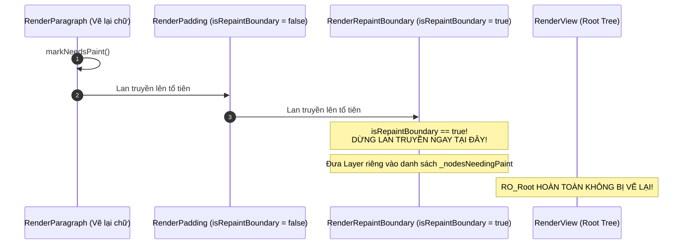

# Bài 3.5 — Tối Ưu Hóa Rebuild & Ba Tầng Phòng Thủ (Rebuild Optimization)

## Phần 1 — Khái Niệm & Ba Tầng Ranh Giới (Concepts & Three Boundaries Model)

### 1.1 — Ngân sách khung hình (Frame Budget)

Trong hệ thống giao diện người dùng của Flutter, tốc độ làm tươi của màn hình quy định một ngân sách thời gian cố định cho việc tính toán và kết xuất mỗi khung hình:
- Ở tần số quét **60 FPS**: Ngân sách tối đa cho mỗi khung hình là **16.67ms**.
- Ở tần số quét **120 FPS** (ProMotion / 120Hz): Ngân sách tối đa cho mỗi khung hình là **8.33ms**.

Chu kỳ kết xuất của một khung hình bao gồm 4 giai đoạn nối tiếp:

$$\text{Frame Time} = T_{\text{Rebuild}} + T_{\text{Layout}} + T_{\text{Paint}} + T_{\text{Compositing}}$$

```
NGÂN SÁCH KHUNG HÌNH (Frame Budget: 16.67ms ở 60 FPS):
┌────────────────┬─────────────┬─────────────┬───────────────┐
│ Rebuild (Dart) │ Layout (RO) │ Paint (RO)  │ Composite/GPU │
│    3 - 5ms     │   2 - 3ms   │   2 - 3ms   │    3 - 5ms    │
└────────────────┴─────────────┴─────────────┴───────────────┘
  ▲
  └── Nếu T_Rebuild vượt mức cho phép ──► Tổng thời gian > 16.67ms ──► Dropped Frame (Jank)
```

Nếu tổng thời gian xử lý của CPU và GPU vượt quá ngân sách khung hình, hiện tượng **Jank (rơi khung hình)** sẽ xảy ra, làm suy giảm độ mượt mà của giao diện và gây tiêu hao năng lượng pin.

---

### 1.2 — Mô hình Ba Tầng Ranh Giới trong Flutter Rendering Pipeline

Để kiểm soát hiệu năng, kiến trúc đồ họa của Flutter thiết lập **3 tầng ranh giới độc lập**:

```
[Thay đổi trạng thái / Dữ liệu đột biến]
       │
       ▼
┌────────────────────────────────────────────────────────┐
│ TẦNG 1: REBUILD BOUNDARY (Widget & Element Level)      │
│   • Cơ chế: const constructor, identical(), Builder    │
│   • Mục tiêu: Ngăn không cho phương thức build() chạy  │
└───────────────────────────┬────────────────────────────┘
                            │ Nếu widget buộc phải rebuild...
┌───────────────────────────▼────────────────────────────┐
│ TẦNG 2: RELAYOUT BOUNDARY (RenderObject Level)         │
│   • Cơ chế: Tight BoxConstraints, kích thước cố định   │
│   • Mục tiêu: Ngăn chặn markNeedsLayout lan lên cha    │
└───────────────────────────┬────────────────────────────┘
                            │ Nếu layout hoàn tất nhưng cần vẽ...
┌───────────────────────────▼────────────────────────────┐
│ TẦNG 3: REPAINT BOUNDARY (Layer & GPU Level)           │
│   • Cơ chế: RepaintBoundary, OffsetLayer riêng biệt    │
│   • Mục tiêu: Ngăn chặn markNeedsPaint lan lên cha     │
└────────────────────────────────────────────────────────┘
```

1. **Tầng 1 — Ranh giới Rebuild (Widget / Element level):** Ngăn chặn việc thực thi lại hàm `build()` của các widget con không có sự thay đổi về cấu hình thông qua việc so khớp tham chiếu bất biến (`const` / `identical`).
2. **Tầng 2 — Ranh giới Relayout (RenderObject level):** Cắt đứt chuỗi lan truyền đo đạc kích thước (`markNeedsLayout`). Nếu một node con có kích thước bị khóa chặt bởi ràng buộc cố định (Tight Constraints), việc node con thay đổi nội dung sẽ không bắt buộc node cha phải tính toán lại kích thước.
3. **Tầng 3 — Ranh giới Repaint (Painting Layer level):** Cô lập vùng vẽ của node vào một `OffsetLayer` độc lập. Khi node con cần vẽ lại, lệnh `markNeedsPaint()` dừng lại tại ranh giới này, ngăn chặn việc vẽ lại toàn bộ cây pixel xung quanh.

---

## Phần 2 — Cơ Chế Hoạt Động & Mã Nguồn Đối Chiếu (Framework Internals)

### 2.1 — Cơ chế Dart VM Canonicalization với từ khóa const

#### 1. Bộ nhớ chuẩn hóa (Canonical Memory Pool):
Khi một đối tượng được khởi tạo với từ khóa `const`, trình biên dịch Dart thực hiện chuẩn hóa địa chỉ ô nhớ:
```dart
const w1 = Text('Title');
const w2 = Text('Title');

assert(identical(w1, w2)); // Trả về true: Cùng chung địa chỉ trên Heap
```
Dù widget cha có rebuild bao nhiêu lần, đối tượng `const` con vẫn duy trì một con trỏ ô nhớ bất biến duy nhất.

#### 2. Giải thuật Short-circuit trong `Element.updateChild()`:
Mỗi khi widget cha rebuild, framework duyệt qua các node con và thực thi phương thức `updateChild()`:

```dart
// Source code: packages/flutter/lib/src/widgets/framework.dart
Element? updateChild(Element? child, Widget? newWidget, Object? newSlot) {
  if (newWidget == null) {
    if (child != null) deactivateChild(child);
    return null;
  }

  if (child != null) {
    // ĐIỀU KIỆN SHORT-CIRCUIT TỐI ƯU HÓA:
    if (child.widget == newWidget) {
      // Do là const -> identical(child.widget, newWidget) trả về true
      // Framework LẬP TỨC TRẢ VỀ child mà KHÔNG GỌI build()!
      return child;
    }
    
    if (Widget.canUpdate(child.widget, newWidget)) {
      child.update(newWidget);
      return child;
    }
    deactivateChild(child);
  }
  return inflateWidget(newWidget, newSlot);
}
```

- Khi `child.widget == newWidget` là `true`, framework bỏ qua hoàn toàn việc duyệt hoặc gọi lại phương thức `build()` của subtree đó với độ phức tạp **$O(1)$**.
- Toàn bộ cây con bên dưới được giữ nguyên trạng thái mà không tiêu tốn tài nguyên xử lý của CPU.

---

### 2.2 — Bản chất RenderObject và Layer của RepaintBoundary

Khi một `RenderObject` cần cập nhật hình ảnh hiển thị, nó gọi:
```dart
markNeedsPaint();
```
Mặc định, lệnh này sẽ lan truyền ngược lên cây tổ tiên cho đến khi gặp một node có thuộc tính:
```dart
bool get isRepaintBoundary => true;
```



#### Đánh giá đánh đổi kỹ thuật (Trade-off Analysis):

| Tiêu chí | Lợi ích kỹ thuật | Chi phí & Rủi ro (Layer Explosion) |
| :--- | :--- | :--- |
| **CPU Painting** | Cắt đứt chuỗi repaint, tái sử dụng DisplayList cache của GPU. | Không có. |
| **Bộ nhớ VRAM** | Không đáng kể nếu dùng đúng chỗ. | **Mỗi RepaintBoundary tạo ra 1 Layer riêng biệt trên GPU.** Lạm dụng sẽ gây cạn kiệt VRAM. |
| **GPU Compositing** | Giảm số lần vẽ vector lại từ đầu. | GPU phải thực hiện ghép (composite) nhiều Layer thành một mặt phẳng. Quá nhiều layer làm tăng thời gian compositing. |
| **Phạm vi áp dụng** | Hoạt ảnh lặp vô tận, CustomPainter phức tạp, Video. | **Cấm dùng** cho các phần tử danh sách thông thường hoặc widget tĩnh. |

---

### 2.3 — Cơ chế hoạt động của AutomaticKeepAliveClientMixin

#### Bài toán Virtualization của RenderSliver:
Trong các danh sách cuộn ảo hóa (`ListView.builder`, `GridView.builder`), lớp `RenderSliverMultiBoxAdaptor` chỉ duy trì các phần tử nằm trong vùng hiển thị (viewport cộng thêm cacheExtent). Khi một phần tử bị cuộn ra ngoài, framework thực hiện unmount Element và kích hoạt `dispose()` trên đối tượng `State`, dẫn đến việc mất dữ liệu cuộn hoặc dữ liệu biểu mẫu.

#### Cơ chế giải quyết qua KeepAliveHandle:

```dart
// Source code: packages/flutter/lib/src/widgets/automatic_keep_alive.dart
mixin AutomaticKeepAliveClientMixin<T extends StatefulWidget> on State<T> {
  KeepAliveHandle? _keepAliveHandle;

  @override
  Widget build(BuildContext context) {
    // Bắt buộc gọi super.build(context) để cập nhật cờ KeepAlive
    _updateKeepAlive();
    return ...;
  }

  void _updateKeepAlive() {
    if (wantKeepAlive) {
      if (_keepAliveHandle == null) {
        _keepAliveHandle = KeepAliveHandle();
        // Phát thông báo lên RenderSliver tổ tiên
        KeepAliveNotification(_keepAliveHandle!).dispatch(context);
      }
    } else {
      _keepAliveHandle?.release();
      _keepAliveHandle = null;
    }
  }
}
```

1. Khi `wantKeepAlive` trả về `true`, `State` phát đi một `KeepAliveNotification` chứa `KeepAliveHandle`.
2. Lớp `RenderSliverMultiBoxAdaptor` nhận được notification này và đưa Element vào danh sách bảo vệ `_keepAliveBucket`.
3. Khi phần tử cuộn ra ngoài viewport: `RenderSliver` không gọi `deactivateChild()`. Element vẫn giữ trạng thái `mounted = true` và đối tượng `State` không bị `dispose()`.

---

### 2.4 — Ma trận đánh giá đánh đổi hiệu năng (Trade-off Matrix)

| Kỹ thuật | Đối tượng tối ưu | Tác động CPU | Tác động RAM / VRAM | Độ phức tạp code | Trường hợp áp dụng |
| :--- | :--- | :---: | :---: | :---: | :--- |
| **`const` Constructor** | Bỏ qua phương thức `build()` | Giảm mạnh ($O(1)$) | Giảm (tái sử dụng Heap) | Thấp | Toàn bộ widget tĩnh không phụ thuộc biến |
| **Passing `child` tĩnh** | Tránh build lại cây con trong Builder | Giảm mạnh | Không đổi | Thấp | Mọi `AnimatedBuilder`, `ListenableBuilder` |
| **`RepaintBoundary`** | Cô lập chuỗi repaint pixel | Giảm CPU Paint | **Tăng VRAM GPU** | Thấp | Widget có hoạt ảnh độc lập hoặc CustomPainter |
| **`AutomaticKeepAlive`** | Bảo toàn State khi cuộn | Giảm CPU tái tạo | **Tăng RAM** (giữ node) | Trung bình | TabBarView, các item biểu mẫu nhập liệu |
| **Tách nhỏ Class Widget** | Thu hẹp phạm vi dirty | Giảm đáng kể | Tăng nhẹ allocations | Trung bình | Tách logic biến đổi khỏi layout tĩnh bao bọc |

---

## Phần 3 — Mẫu Triển Khai Chuẩn (Standard Implementation Patterns)

### 3.1 — Mẫu truyền tham số child tĩnh trong AnimatedBuilder

```dart
import 'package:flutter/material.dart';

/// Tối ưu hóa hiệu năng hoạt ảnh bằng cách truyền cây con tĩnh qua tham số child:
/// - Đối tượng HeavyStaticSubtree chỉ thực thi build() duy nhất 1 lần.
/// - Ở mỗi khung hình hoạt ảnh, chỉ có Transform.translate chạy lại.
class CachedChildAnimationDemo extends StatefulWidget {
  const CachedChildAnimationDemo({super.key});

  @override
  State<CachedChildAnimationDemo> createState() => _CachedChildAnimationDemoState();
}

class _CachedChildAnimationDemoState extends State<CachedChildAnimationDemo>
    with SingleTickerProviderStateMixin {
  late final AnimationController _controller;

  @override
  void initState() {
    super.initState();
    _controller = AnimationController(
      vsync: this,
      duration: const Duration(seconds: 2),
    )..repeat(reverse: true);
  }

  @override
  void dispose() {
    _controller.dispose();
    super.dispose();
  }

  @override
  Widget build(BuildContext context) {
    return Scaffold(
      body: Center(
        child: AnimatedBuilder(
          animation: _controller,
          // Cung cấp cây con tĩnh tại tham số child
          child: const HeavyStaticSubtree(),
          builder: (context, child) {
            return Transform.translate(
              offset: Offset(0, _controller.value * 40),
              // Tái sử dụng tham chiếu child, bỏ qua việc khởi tạo lại cây con
              child: child,
            );
          },
        ),
      ),
    );
  }
}

class HeavyStaticSubtree extends StatelessWidget {
  const HeavyStaticSubtree({super.key});

  @override
  Widget build(BuildContext context) {
    return Container(
      width: 150,
      height: 150,
      decoration: BoxDecoration(
        color: Colors.blueGrey,
        borderRadius: BorderRadius.circular(12),
      ),
      child: const Center(
        child: Text('Static Subtree', style: TextStyle(color: Colors.white)),
      ),
    );
  }
}
```

---

### 3.2 — Mẫu cô lập repaint bằng RepaintBoundary cho CustomPainter

```dart
import 'package:flutter/material.dart';

/// Cô lập khu vực vẽ lại của CustomPainter phức tạp khỏi danh sách cuộn:
/// - CustomPainter vẽ liên tục theo hoạt ảnh.
/// - RepaintBoundary ngăn không cho lệnh markNeedsPaint lan ra ListTile cha.
class IsolatedPainterListItem extends StatelessWidget {
  final int index;
  const IsolatedPainterListItem({super.key, required this.index});

  @override
  Widget build(BuildContext context) {
    return ListTile(
      title: Text('Mục dữ liệu #$index'),
      trailing: const SizedBox(
        width: 48,
        height: 48,
        child: RepaintBoundary(
          child: AnimatedWaveformWidget(),
        ),
      ),
    );
  }
}

class AnimatedWaveformWidget extends StatefulWidget {
  const AnimatedWaveformWidget({super.key});

  @override
  State<AnimatedWaveformWidget> createState() => _AnimatedWaveformWidgetState();
}

class _AnimatedWaveformWidgetState extends State<AnimatedWaveformWidget>
    with SingleTickerProviderStateMixin {
  late final AnimationController _waveController;

  @override
  void initState() {
    super.initState();
    _waveController = AnimationController(
      vsync: this,
      duration: const Duration(milliseconds: 800),
    )..repeat();
  }

  @override
  void dispose() {
    _waveController.dispose();
    super.dispose();
  }

  @override
  Widget build(BuildContext context) {
    return AnimatedBuilder(
      animation: _waveController,
      builder: (context, _) {
        return CustomPaint(
          painter: WaveformPainter(progress: _waveController.value),
        );
      },
    );
  }
}

class WaveformPainter extends CustomPainter {
  final double progress;
  WaveformPainter({required this.progress});

  @override
  void paint(Canvas canvas, Size size) {
    final paint = Paint()
      ..color = Colors.blue
      ..strokeWidth = 2.0
      ..style = PaintingStyle.stroke;

    final path = Path();
    path.moveTo(0, size.height / 2);
    path.lineTo(size.width * progress, size.height * (1.0 - progress));
    canvas.drawPath(path, paint);
  }

  @override
  bool shouldRepaint(covariant WaveformPainter oldDelegate) =>
      oldDelegate.progress != progress;
}
```

---

### 3.3 — Mẫu duy trì trạng thái tab bằng AutomaticKeepAliveClientMixin

```dart
import 'package:flutter/material.dart';

/// Duy trì dữ liệu và vị trí cuộn của Tab khi người dùng chuyển tab:
/// - wantKeepAlive trả về true khi dữ liệu đã nạp thành công.
/// - super.build(context) được triệu gọi ở dòng đầu tiên của hàm build.
class KeepAliveTabItem extends StatefulWidget {
  final String categoryTitle;
  const KeepAliveTabItem({super.key, required this.categoryTitle});

  @override
  State<KeepAliveTabItem> createState() => _KeepAliveTabItemState();
}

class _KeepAliveTabItemState extends State<KeepAliveTabItem>
    with AutomaticKeepAliveClientMixin {
  
  @override
  bool get wantKeepAlive => true; // Xác lập yêu cầu giữ sống State

  @override
  Widget build(BuildContext context) {
    super.build(context); // Hợp đồng kỹ thuật: Bắt buộc gọi đầu tiên

    return ListView.builder(
      itemCount: 100,
      itemBuilder: (context, index) {
        return ListTile(title: Text('${widget.categoryTitle} - Hàng số $index'));
      },
    );
  }
}
```

---

## Phần 4 — Các Bẫy Kỹ Thuật & Giải Pháp (Common Pitfalls & Mitigations)

### 4.1 — Sử dụng hàm helper _buildWidget() thay vì khai báo lớp StatelessWidget

```dart
// Lỗi kiến trúc: Gom code thành hàm helper trong cùng một class
class InefficientScreen extends StatelessWidget {
  const InefficientScreen({super.key});

  @override
  Widget build(BuildContext context) {
    return Column(
      children: [
        _buildStaticBanner(), // Hàm helper
      ],
    );
  }

  // Hạn chế kỹ thuật của hàm helper:
  // 1. Không thể khai báo constructor const.
  // 2. Không tạo Element riêng trên cây -> Không kích hoạt được short-circuit O(1).
  // 3. Mỗi khi InefficientScreen rebuild, toàn bộ mã trong _buildStaticBanner đều chạy lại.
  Widget _buildStaticBanner() {
    return Container(padding: const EdgeInsets.all(16), child: const Text('Banner'));
  }
}

// Giải pháp chuẩn: Tách thành lớp StatelessWidget riêng biệt với constructor const
class EfficientScreen extends StatelessWidget {
  const EfficientScreen({super.key});

  @override
  Widget build(BuildContext context) {
    return const Column(
      children: [
        StaticBannerWidget(), // Sử dụng const -> Flutter bỏ qua rebuild hoàn toàn
      ],
    );
  }
}

class StaticBannerWidget extends StatelessWidget {
  const StaticBannerWidget({super.key});

  @override
  Widget build(BuildContext context) {
    return Container(padding: const EdgeInsets.all(16), child: const Text('Banner'));
  }
}
```

---

### 4.2 — Lạm dụng RepaintBoundary gây hiện tượng Layer Explosion

```dart
// Bẫy kỹ thuật: Bọc RepaintBoundary cho mọi phần tử trong danh sách cuộn
ListView.builder(
  itemCount: 1000,
  itemBuilder: (context, index) {
    return RepaintBoundary( // Gây hiện tượng Layer Explosion
      child: ListTile(title: Text('Item $index')),
    );
  },
);
// Hậu quả: Tạo ra 1000 Layer riêng biệt trên GPU, gây quá tải bộ nhớ VRAM 
// và kéo dài thời gian Compositing của GPU ở mỗi khung hình.

// Giải pháp: Chỉ bọc RepaintBoundary cho các widget thực sự có repaint độc lập.
```

---

### 4.3 — Bỏ sót lệnh triệu gọi super.build(context) trong AutomaticKeepAliveClientMixin

```dart
// Lỗi: Quên gọi super.build(context)
class BrokenKeepAliveState extends State<TabItem> with AutomaticKeepAliveClientMixin {
  @override
  bool get wantKeepAlive => true;

  @override
  Widget build(BuildContext context) {
    // Bỏ sót super.build(context) -> KeepAliveNotification không được dispatch
    // State vẫn bị dispose khi cuộn ra ngoài màn hình như thông thường
    return const Text('Content');
  }
}

// Giải pháp: Luôn gọi super.build(context) ở câu lệnh đầu tiên của phương thức build
@override
Widget build(BuildContext context) {
  super.build(context);
  return const Text('Content');
}
```

---

## Phần 5 — Câu Hỏi Kỹ Thuật & Phân Tích Thực Thi (Technical Analysis & Code Tracing)

---

#### Q1 — "Cơ chế nào giúp từ khóa `const` loại bỏ việc thực thi phương thức `build()` ở cây con?"

**Phân tích kỹ thuật:**
1. **Tại máy ảo Dart VM:** Các biểu thức widget có từ khóa `const` được lưu tại vùng nhớ chuẩn hóa (Canonical Memory Pool). Các lần khởi tạo tiếp theo có cùng tham số đều trả về cùng một tham chiếu địa chỉ trên Heap.
2. **Tại Element Tree:** Trong phương thức `Element.updateChild(child, newWidget)`, framework thực hiện phép so sánh tham chiếu:
   ```dart
   if (child.widget == newWidget) return child;
   ```
   Do cả hai tham chiếu trỏ về cùng một địa chỉ ô nhớ (`identical` trả về `true`), framework lập tức trả về `child` hiện tại mà không thực thi `child.update()` hay `child.rebuild()`. Toàn bộ cây con bên dưới được bỏ qua với chi phí $O(1)$.

---

#### Q2 — "Phân tích sự khác biệt về mặt kiến trúc giữa hàm helper `_buildSomething()` và lớp `StatelessWidget`."

**Phân tích kỹ thuật:**
1. **Khả năng tối ưu hóa `const`:** Hàm helper không thể cung cấp constructor `const`. Lớp `StatelessWidget` có thể khai báo constructor `const`, cho phép framework kích hoạt giải thuật short-circuit tại `updateChild()`.
2. **Cấu trúc Element Tree:** Lớp `StatelessWidget` sở hữu một node `StatelessElement` riêng biệt trong cây. Khi một node cha rebuild, framework có thể khoanh vùng phạm vi kiểm tra tại ranh giới Element đó. Hàm helper chỉ đơn thuần là inline mã nguồn vào hàm `build()` của cha, làm tăng độ phức tạp và kích thước của hàm `build()` bao bọc.
3. **Quản lý phân bổ Heap:** Hàm helper khởi tạo lại các đối tượng Dart Plain Object ở mỗi lần hàm cha thực thi mà không có cơ hội tái sử dụng Element.
4. **Hỗ trợ DevTools Profiler:** Các lớp Widget riêng biệt xuất hiện dưới dạng các node có định danh rõ ràng trên widget tree của DevTools Inspector, giúp việc đo lường số lần rebuild được chính xác.

---

#### Q3 — "Bản chất của `RepaintBoundary` trong Layer Tree là gì và giải thích hiện tượng Layer Explosion."

**Phân tích kỹ thuật:**
1. **Bản chất của RepaintBoundary:**
   - Trong pipeline đồ họa của Flutter, màn hình được phân chia thành các lớp kết xuất (`Layer`).
   - Một `RenderObject` thông thường sẽ vẽ trực tiếp vào `PictureLayer` của tổ tiên gần nhất. Khi node con gọi `markNeedsPaint()`, toàn bộ `PictureLayer` đó phải được ghi lại (record lại vào Skia/Impeller DisplayList).
   - Khi thiết lập `isRepaintBoundary = true`, `RenderRepaintBoundary` tạo ra một `OffsetLayer` độc lập. Khi các node con bên dưới cần vẽ lại, lệnh repaint dừng lại tại ranh giới này, chỉ vẽ lại `OffsetLayer` nội bộ mà không làm bẩn các layer xung quanh.
2. **Hiện tượng Layer Explosion:**
   - Mỗi Layer tiêu tốn bộ nhớ VRAM để lưu trữ Texture và ma trận Transform.
   - Trước khi hiển thị lên tấm nền, GPU phải thực hiện pha **Compositing** (ghép các Layer lại thành một ảnh phẳng).
   - Nếu lạm dụng `RepaintBoundary` trên hàng trăm phần tử danh sách, chi phí bộ nhớ VRAM tăng cao và thời gian Compositing của GPU kéo dài, dẫn đến sụt giảm FPS nghiêm trọng hơn việc vẽ thông thường.

---

#### Q4 — "Cơ chế `KeepAliveHandle` và `_keepAliveBucket` trong `RenderSliver` hoạt động như thế nào?"

**Phân tích kỹ thuật:**
1. Lớp `RenderSliverMultiBoxAdaptor` chịu trách nhiệm quản lý việc cấp phát và thu hồi các phần tử con trong danh sách cuộn ảo hóa.
2. Khi một widget con sử dụng `AutomaticKeepAliveClientMixin` và có `wantKeepAlive = true`, nó tạo một `KeepAliveHandle` và dispatch một `KeepAliveNotification` ngược lên cây tổ tiên.
3. `RenderSliverMultiBoxAdaptor` chặn notification này và ghi nhận yêu cầu bảo toàn trạng thái của phần tử.
4. Khi phần tử này cuộn ra ngoài phạm vi viewport: Thay vì gọi `deactivateChild()` và thu hồi Element, `RenderSliver` chuyển Element đó vào danh sách bảo vệ `_keepAliveBucket`.
5. Đối tượng Element trong `_keepAliveBucket` vẫn duy trì `mounted = true`, đối tượng `State` không bị `dispose()`. Khi người dùng cuộn ngược lại, `RenderSliver` lấy Element từ bucket ra và gắn lại vào vị trí hiển thị mà không tốn chi phí khởi tạo lại từ đầu.

---

#### Q5 (Trace Code) — "Dự đoán số lần in ra console của 3 cách triển khai widget con khi Parent rebuild"

Xem xét đoạn mã sau:

```dart
class OptimizationTraceParent extends StatefulWidget {
  const OptimizationTraceParent({super.key});
  @override State<OptimizationTraceParent> createState() => _OptimizationTraceParentState();
}

class _OptimizationTraceParentState extends State<OptimizationTraceParent> {
  int _counter = 0;

  Widget _buildHelperChild() {
    print('1. Helper Function Executed');
    return const Text('Helper');
  }

  @override
  Widget build(BuildContext context) {
    print('===> Parent build() [counter = $_counter]');
    return Column(
      children: [
        _buildHelperChild(),
        const ConstChildWidget(),
        NonConstChildWidget(label: 'Dynamic'),
        ElevatedButton(
          onPressed: () => setState(() => _counter++),
          child: const Text('Increment'),
        ),
      ],
    );
  }
}

class ConstChildWidget extends StatelessWidget {
  const ConstChildWidget({super.key});

  @override
  Widget build(BuildContext context) {
    print('2. ConstChildWidget build()');
    return const Text('Const Child');
  }
}

class NonConstChildWidget extends StatelessWidget {
  final String label;
  NonConstChildWidget({super.key, required this.label}); // Không có const constructor

  @override
  Widget build(BuildContext context) {
    print('3. NonConstChildWidget build()');
    return Text(label);
  }
}
```

**Thứ tự in log khi khởi chạy lần đầu (`_counter = 0`):**
```
===> Parent build() [counter = 0]
1. Helper Function Executed
2. ConstChildWidget build()
3. NonConstChildWidget build()
```

**Thứ tự in log khi người dùng kích hoạt nút nhấn `Increment` (`_counter = 1`):**
```
===> Parent build() [counter = 1]
1. Helper Function Executed
3. NonConstChildWidget build()
```

**Phân tích kỹ thuật:**
1. `_buildHelperChild()`: **Thực thi lại** vì hàm helper nằm trực tiếp trong thân phương thức `build()` của Parent.
2. `ConstChildWidget`: **Hoàn toàn không thực thi lại** vì đối tượng con có constructor `const`, thỏa mãn điều kiện `child.widget == newWidget` (`identical == true`), framework kích hoạt short-circuit $O(1)$.
3. `NonConstChildWidget`: **Thực thi lại** vì không có constructor `const`. Ở mỗi lần Parent chạy hàm `build()`, một instance mới được tạo ra trên Heap (`identical == false`), framework buộc phải gọi `child.update()` và thực thi lại phương thức `build()`.
