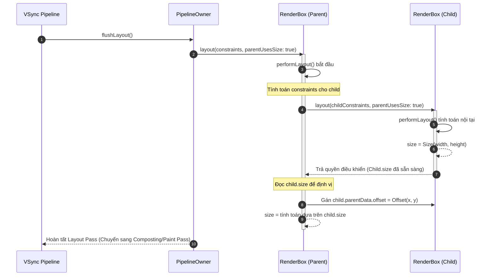

# Bài 4.1 — Nguyên Lý Truyền Ràng Buộc: Constraints Go Down, Sizes Go Up

## Phần 1 — Khái Niệm & Ràng Buộc Kiến Trúc (Architecture & Design Philosophy)

### 1.1 — Mô hình bố cục một lượt (Single-Pass Layout Paradigm) và độ phức tạp $O(N)$

Trong các hệ thống UI truyền thống (như DOM trên trình duyệt web hoặc View System trên Android), quá trình tính toán bố cục thường phải trải qua nhiều lượt quét (Multi-pass Layout / Reflow). Một phần tử con có thể yêu cầu phần tử cha đo đạc nhiều lần với các thông số khác nhau, dẫn đến hiện tượng **Layout Thrashing** với độ phức tạp tính toán có thể chạm ngưỡng $O(N^2)$ hoặc $O(2^N)$ khi cây phân cấp lồng nhau sâu.

Flutter giải quyết triệt để vấn đề này bằng việc thiết lập một quy tắc kiến trúc mang tính bất biến: **Hệ thống bố cục một lượt (Single-Pass Layout)** với độ phức tạp tuyến tính $O(N)$, trong đó $N$ là số lượng node trên Render Tree. Trong mỗi khung hình (frame), mỗi RenderObject chỉ được yêu cầu thực thi phương thức layout một lần duy nhất trong quá trình duyệt cây theo thứ tự sâu (Depth-First Search - DFS).

Quy tắc nền tảng điều phối toàn bộ hệ thống bố cục của Flutter được định nghĩa bởi bộ ba nguyên lý:

$$\text{Constraints go down} \longrightarrow \text{Sizes go up} \longrightarrow \text{Parent sets position}$$

---

### 1.2 — Hợp đồng phân định trách nhiệm hình học (Geometric Contract)

Hệ thống layout của Flutter phân định ranh giới trách nhiệm rõ ràng giữa node cha (Parent) và node con (Child) trong không gian Euclid hai chiều:

```
┌────────────────────────────────────────────────────────────────────────┐
│ PARENT RENDER OBJECT                                                   │
│   1. Tính toán và áp đặt giới hạn không gian: Constraints Go Down      │
│      └─► Truyền BoxConstraints(minW, maxW, minH, maxH) cho Child       │
└───────────────────────────────────┬────────────────────────────────────┘
                                    │
                         Constraints│ (Input)
                                    ▼
┌────────────────────────────────────────────────────────────────────────┐
│ CHILD RENDER OBJECT                                                    │
│   2. Tự tính toán kích thước trong giới hạn: Sizes Go Up              │
│      └─► Trả về Size(width, height) thỏa mãn:                         │
│            minW <= width <= maxW  và  minH <= height <= maxH           │
└───────────────────────────────────┬────────────────────────────────────┘
                                    │
                                Size│ (Output)
                                    ▼
┌────────────────────────────────────────────────────────────────────────┐
│ PARENT RENDER OBJECT                                                   │
│   3. Quyết định tọa độ hiển thị của Child: Parent Sets Position        │
│      └─► Gán BoxParentData.offset = Offset(x, y)                       │
└────────────────────────────────────────────────────────────────────────┘
```

#### Ba bất biến hình học (Geometric Invariants):

1. **Ràng buộc đi xuống (Constraints Go Down):**
   - Node cha quyết định giới hạn không gian mà node con được phép chiếm dụng bằng cách truyền một đối tượng `Constraints` (phổ biến nhất là `BoxConstraints`).
   - Node con tuyệt đối không thể tự quyết định không gian nằm ngoài phạm vi này.

2. **Kích thước đi lên (Sizes Go Up):**
   - Node con nhận ràng buộc từ cha, căn cứ vào nội dung hiển thị nội tại (intrinsic content) hoặc các ràng buộc áp xuống các node con cấp dưới của nó để chọn ra một `Size` chính xác.
   - Kích thước này bắt buộc phải nằm trong miền đóng $[min, max]$ của ràng buộc do cha áp đặt. Mọi hành vi báo cáo kích thước vượt ra ngoài miền giới hạn đều bị framework chặn lại thông qua hệ thống assertion trong môi trường debug.

3. **Cha quyết định vị trí (Parent Sets Position):**
   - Node con hoàn toàn không có khái niệm về tọa độ hiển thị $(x, y)$ của chính nó trên màn hình thiết bị.
   - Sau khi node con hoàn tất việc tính toán và báo cáo `Size` lên, node cha sẽ dựa trên thuật toán sắp đặt riêng (ví dụ: căn giữa, xếp nối tiếp, căn lề) để thiết lập giá trị `Offset` và lưu trữ trực tiếp vào cấu trúc `ParentData` của node con.

---

## Phần 2 — Cơ Chế Hoạt Động & Mã Nguồn Đối Chiếu (Under the Hood / Deep-Dive)

### 2.1 — Giải phẫu quy trình thực thi `RenderObject.layout()`

Phương thức điều phối trung tâm của toàn bộ hệ thống layout nằm tại lớp `RenderObject` trong mã nguồn `packages/flutter/lib/src/rendering/object.dart`:

```dart
void layout(Constraints constraints, { bool parentUsesSize = false }) {
  RenderObject? relayoutBoundary;
  if (!parentUsesSize || sizedByParent || constraints.isTight || parent is! RenderObject) {
    relayoutBoundary = this;
  } else {
    relayoutBoundary = (parent! as RenderObject)._relayoutBoundary;
  }

  if (!_needsLayout && constraints == _constraints && relayoutBoundary == _relayoutBoundary) {
    return;
  }

  _constraints = constraints;
  if (_relayoutBoundary != null && relayoutBoundary != _relayoutBoundary) {
    markNeedsLayoutForSizedByParentChange();
  }
  _relayoutBoundary = relayoutBoundary;

  if (sizedByParent) {
    performResize();
  }
  performLayout();
  _needsLayout = false;
  markNeedsPaint();
}
```

#### Phân tích cờ `parentUsesSize`:
- `parentUsesSize: false` (Mặc định): Node cha tuyên bố rằng kích thước của node con hoàn toàn không ảnh hưởng đến kích thước của cha. Khi node con bị đánh dấu bẩn (`markNeedsLayout()`), chuỗi yêu cầu layout sẽ dừng lại ngay tại node con mà không lan truyền ngược lên node cha.
- `parentUsesSize: true`: Node cha thông báo rằng nó cần đọc giá trị `child.size` để hoàn thành quá trình tính toán kích thước hoặc vị trí của chính nó. Khi node con thay đổi kích thước, node cha bắt buộc phải được đánh dấu bẩn để layout lại.

---

### 2.2 — Ranh giới tái bố cục (Relayout Boundary) và Bất biến toán học

Nhằm duy trì hiệu năng 60/120 FPS khi một node trên cây thay đổi trạng thái, Flutter không thực hiện layout lại toàn bộ cây. Thay vào đó, framework sử dụng khái niệm **Relayout Boundary** để khoanh vùng phạm vi bẩn.

Một RenderObject trở thành một **Relayout Boundary** khi và chỉ khi thỏa mãn ít nhất một trong bốn điều kiện độc lập sau:

$$\text{isRelayoutBoundary} = (!\text{parentUsesSize}) \lor \text{sizedByParent} \lor \text{constraints.isTight} \lor (\text{parent is! RenderObject})$$

| Điều kiện | Cơ sở lý luận kiến trúc | Ví dụ RenderObject |
| :--- | :--- | :--- |
| `!parentUsesSize` | Node cha không quan tâm đến kích thước của con, do đó sự thay đổi kích thước của con không thể làm thay đổi hình học của cha. | Node con nằm trong `RenderView` hoặc các container có layout độc lập. |
| `sizedByParent` | Kích thước của node chỉ phụ thuộc duy nhất vào constraints từ cha truyền xuống, không phụ thuộc vào các con bên dưới. | `RenderFractionallySizedBox`, `RenderAspectRatio`. |
| `constraints.isTight` | Khoảng biến thiên kích thước bằng 0 ($\min W = \max W$ và $\min H = \max H$). Kích thước của node đã bị khóa cứng, con bên dưới biến đổi thế nào thì node này vẫn giữ nguyên kích thước. | Widget con của `SizedBox(width: 200, height: 100)`. |
| `parent is! RenderObject` | Node là gốc của cây kết xuất (Root RenderObject). | `RenderView` (node kết xuất tầng cao nhất gắn với window). |

```
[RenderView] (Root - Relayout Boundary)
     │
     ▼
[RenderCustomContainer]
     │ (constraints.isTight == true) ──► RELAYOUT BOUNDARY TẠI ĐÂY
     ▼
[RenderBox A] (Đánh dấu bẩn markNeedsLayout)
     │
     ▼
[RenderBox B]
```

Khi `RenderBox A` gọi `markNeedsLayout()`, framework duyệt ngược lên cây thông qua con trỏ `parent`. Quá trình duyệt dừng lại ngay lập tức khi chạm tới node có `_relayoutBoundary == this`. Chỉ có subtree từ Relayout Boundary trở xuống mới được đưa vào danh sách `_nodesNeedingLayout` của `PipelineOwner`.

---

### 2.3 — Cơ chế tách biệt hai pha: `sizedByParent` & `performResize()` vs `performLayout()`

Thông thường, việc tính toán `size` và ra lệnh layout cho các node con đều diễn ra bên trong phương thức `performLayout()`. Tuy nhiên, để tối ưu hóa việc phân tách Relayout Boundary, lớp `RenderBox` cung cấp cơ chế hai pha:

```dart
// Bất biến kiến trúc trong RenderBox
@override
void performResize() {
  // Chỉ được phép gán size dựa HOÀN TOÀN vào constraints nhận được từ cha.
  // Tuyệt đối không được truy cập child.size hoặc gọi child.layout() tại đây.
  size = constraints.smallest;
}
```

- Nếu `sizedByParent = true`: Kích thước của node được tính toán trước trong `performResize()`. Khi con của node này thay đổi kích thước, node này không cần tính lại `size`, giúp triệt tiêu hoàn toàn sự lan truyền bẩn lên các tầng cao hơn.
- Nếu `sizedByParent = false`: Cả việc tính kích thước và bố trí con đều được đóng gói trong `performLayout()`.

---

### 2.4 — Sơ đồ tuần tự điều phối trong PipelineOwner

Quá trình điều phối bố cục một lượt được thực thi thông qua phương thức `flushLayout()` của `PipelineOwner`:



---

### 2.5 — Cơ chế lưu trữ vị trí: `BoxParentData.offset`

Trong mô hình kiến trúc của Flutter, một RenderObject không tự sở hữu biến tọa độ `Offset`. Toàn bộ dữ liệu vị trí tương đối so với cha được lưu trữ tại thuộc tính `parentData`:

```dart
class BoxParentData extends ParentData {
  Offset offset = Offset.zero;
}
```

Khi node cha thực hiện vẽ node con trong pha Paint Pass (`paint()`):
```dart
@override
void paint(PaintingContext context, Offset offset) {
  final BoxParentData childParentData = child!.parentData! as BoxParentData;
  // Tọa độ thực tế trên canvas = tọa độ của cha + offset do cha lưu trữ cho con
  context.paintChild(child!, offset + childParentData.offset);
}
```
Thiết kế này đảm bảo nguyên lý: **Vị trí của một node là thuộc tính thuộc quyền quản lý của node cha, không phải trạng thái nội bộ của node con.**

---

## Phần 3 — Hướng Dẫn Thực Hành Chuẩn (Production-Ready Implementations)

### 3.1 — Truy vết luồng truyền ràng buộc bằng `LayoutBuilder`

Để quan sát chính xác miền giá trị `BoxConstraints` đi từ trên xuống và kiểm tra xem một widget có đang nhận tight hay loose constraint, `LayoutBuilder` là công cụ chẩn đoán tiêu chuẩn:

```dart
import 'package:flutter/material.dart';

class ConstraintInspector extends StatelessWidget {
  final Widget child;
  final String debugTag;

  const ConstraintInspector({
    super.key,
    required this.child,
    required this.debugTag,
  });

  @override
  Widget build(BuildContext context) {
    return LayoutBuilder(
      builder: (BuildContext context, BoxConstraints constraints) {
        debugPrint(
          '[$debugTag] minW: ${constraints.minWidth.toStringAsFixed(1)}, '
          'maxW: ${constraints.maxWidth.toStringAsFixed(1)}, '
          'minH: ${constraints.minHeight.toStringAsFixed(1)}, '
          'maxH: ${constraints.maxHeight.toStringAsFixed(1)}, '
          'isTight: ${constraints.isTight}',
        );
        return child;
      },
    );
  }
}
```

---

### 3.2 — Triển khai Custom RenderBox tuân thủ hợp đồng hình học

Dưới đây là một ví dụ hoàn chỉnh về việc tự xây dựng một `RenderBox` đơn giản (`RenderCustomConstrainedBox`) tuân thủ nghiêm ngặt hợp đồng: Nhận constraint $\to$ Layout con $\to$ Tính size $\to$ Thiết lập vị trí con.

```dart
import 'dart:math' as math;
import 'package:flutter/rendering.dart';
import 'package:flutter/widgets.dart';

class CustomCenterWidget extends SingleChildRenderObjectWidget {
  const CustomCenterWidget({super.key, super.child});

  @override
  RenderObject createRenderObject(BuildContext context) {
    return RenderCustomCenter();
  }
}

class RenderCustomCenter extends RenderShiftedBox {
  RenderCustomCenter({RenderBox? child}) : super(child);

  @override
  void performLayout() {
    // 1. Kiểm tra trường hợp không có con
    if (child == null) {
      size = constraints.smallest;
      return;
    }

    // 2. Constraints Go Down: Nới lỏng ràng buộc cho con (Loose constraint)
    // Con được tự do chọn kích thước từ 0 đến giới hạn tối đa của cha
    final BoxConstraints childConstraints = constraints.loosen();
    
    // Yêu cầu con layout với cờ parentUsesSize = true vì cha cần child.size để căn giữa
    child!.layout(childConstraints, parentUsesSize: true);

    // 3. Sizes Go Up: Cha quyết định kích thước của mình dựa trên constraints
    // Nếu cha nhận tight constraint, cha phải lấy kích thước tối đa
    size = constraints.constrain(Size(
      constraints.hasBoundedWidth ? constraints.maxWidth : child!.size.width,
      constraints.hasBoundedHeight ? constraints.maxHeight : child!.size.height,
    ));

    // 4. Parent Sets Position: Cha tính toán tọa độ và gán vào BoxParentData
    final BoxParentData childParentData = child!.parentData! as BoxParentData;
    final double dx = (size.width - child!.size.width) / 2.0;
    final double dy = (size.height - child!.size.height) / 2.0;
    childParentData.offset = Offset(math.max(0.0, dx), math.max(0.0, dy));
  }
}
```

---

## Phần 4 — Lỗi Thường Gặp & Giải Pháp Khắc Phục (Anti-Patterns & Pitfalls)

### 4.1 — Giả định sai lầm về khả năng tự định cỡ trong Tight Constraint

#### Mô tả lỗi:
Lập trình viên khai báo kích thước cụ thể thông qua `SizedBox` hoặc `Container`, nhưng widget trên màn hình vẫn bị kéo giãn chiếm toàn bộ diện tích.

```dart
// SAI LẦM: Kỳ vọng hộp đỏ có kích thước 100x100
Widget build(BuildContext context) {
  return Scaffold(
    body: SizedBox(
      width: 100,
      height: 100,
      child: Container(color: Colors.red),
    ),
  );
}
```

#### Nguyên nhân kỹ thuật:
`Scaffold.body` truyền một **Tight Constraint** có kích thước bằng đúng diện tích màn hình khả dụng ($\min W = \max W = \text{screenWidth}$, $\min H = \max H = \text{screenHeight}$).
Theo quy tắc "Constraints Go Down", `SizedBox` nhận tight constraint từ cha. Phương thức `BoxConstraints.enforce()` bên trong `SizedBox` không thể phá vỡ cận trên và cận dưới mà cha đã khóa cứng. Do đó, kích thước $100 \times 100$ bị ghi đè hoàn toàn.

#### Giải pháp:
Chèn một node trung gian có khả năng chuyển đổi Tight Constraint thành Loose Constraint (như `Align` hoặc `Center`):

```dart
Widget build(BuildContext context) {
  return Scaffold(
    body: Align(
      alignment: Alignment.topLeft,
      child: SizedBox(
        width: 100,
        height: 100,
        child: Container(color: Colors.red),
      ),
    ),
  );
}
```

---

### 4.2 — Lạm dụng `IntrinsicWidth` / `IntrinsicHeight` gây bùng nổ độ phức tạp $O(2^N)$

#### Mô tả lỗi:
Sử dụng `IntrinsicHeight` hoặc `IntrinsicWidth` để đồng bộ kích thước giữa các phần tử con trong `Row` hoặc `Column` phức tạp:

```dart
// NGUY CƠ SUY GIẢM HIỆU NĂNG
IntrinsicHeight(
  child: Row(
    crossAxisAlignment: CrossAxisAlignment.stretch,
    children: [
      Expanded(child: ComplexWidgetA()),
      VerticalDivider(),
      Expanded(child: ComplexWidgetB()),
    ],
  ),
)
```

#### Nguyên nhân kỹ thuật:
`IntrinsicHeight` vi phạm quy tắc Single-Pass Layout. Để xác định kích thước nội tại tối ưu mà không làm tràn giao diện, `RenderIntrinsicHeight` buộc phải gọi phương thức tính toán `computeMinIntrinsicHeight()` và `computeMaxIntrinsicHeight()` trên toàn bộ cây con trước khi thực hiện lượt layout chính thức. Quá trình đo đạc suy đoán này tạo ra **hai lượt layout (Two-Pass Layout)**. Nếu lồng ghép nhiều widget Intrinsic lồng nhau, chi phí tính toán tăng theo cấp số nhân $O(2^N)$.

#### Giải pháp:
1. Thiết lập kích thước cố định tường minh thông qua `SizedBox` hoặc ràng buộc tỷ lệ `AspectRatio`.
2. Sử dụng `CustomMultiChildLayout` với một `MultiChildLayoutDelegate` chuyên dụng để đo đạc và định vị các phần tử trong một lượt duyệt duy nhất.

---

### 4.3 — Truy cập `child.size` khi chưa hoàn thành lượt layout

#### Mô tả lỗi:
Trong custom `RenderBox`, lập trình viên đọc giá trị `child.size` trước khi gọi `child.layout()`, hoặc không truyền cờ `parentUsesSize: true`.

```dart
// SAI LẦM NGUY HIỂM
@override
void performLayout() {
  // Lỗi 1: Truy cập size trước khi layout child -> Framework throw FlutterError
  final double currentWidth = child!.size.width; 

  // Lỗi 2: Không truyền parentUsesSize nhưng bên dưới vẫn đọc size
  child!.layout(constraints); // Mặc định parentUsesSize: false
  size = Size(child!.size.width, 100); // Lỗi assertion trong RenderObject
}
```

#### Nguyên nhân kỹ thuật:
Trước khi phương thức `layout()` của child kết thúc, thuộc tính `_size` của `RenderBox` con có thể chưa được gán giá trị hoặc đang mang giá trị lỗi thời từ khung hình trước. Đồng thời, nếu `parentUsesSize` là `false`, framework sẽ áp đặt assertion ngăn chặn cha đọc `child.size` nhằm đảm bảo tính toàn vẹn của thuật toán Relayout Boundary.

---

## Phần 5 — Câu Hỏi Kiểm Tra Kiến Thức Chuyên Sâu & Bài Tập Phân Tích Mã Nguồn (Technical Assessment & Code Tracing)

### 5.1 — Câu hỏi khảo sát kiến trúc

#### Câu 1: Phân tích 4 điều kiện hình thành Relayout Boundary
*Đề bài:* Phân tích chi tiết tại sao điều kiện `constraints.isTight` lại đủ để biến một `RenderObject` thành một Relayout Boundary mà không cần quan tâm đến giá trị của cờ `parentUsesSize`.

*Phân tích kỹ thuật:*
1. Khi `constraints.isTight` là `true`, không gian bố cục của node bị giới hạn duy nhất tại một điểm $(\min W = \max W \land \min H = \max H)$.
2. Dù toàn bộ cây con bên dưới có đột biến kích thước thế nào, thì kích thước đầu ra (`size`) của chính node này vẫn bắt buộc phải bằng chính xác giá trị duy nhất đó.
3. Vì kích thước của node này không thể thay đổi, nên hình học của node cha bao bọc nó chắc chắn không bị ảnh hưởng.
4. Do đó, framework có thể ngắt chuỗi lan truyền `markNeedsLayout()` ngay tại node này, biến nó thành Relayout Boundary tự nhiên mà không gây sai lệch bố cục của cây tầng trên.

---

#### Câu 2: Cơ chế vận hành của `LayoutBuilder` dưới góc nhìn Relayout
*Đề bài:* `LayoutBuilder` hoãn việc xây dựng Widget Tree cho đến pha Layout. Dưới tầng Render Tree, `RenderConstrainedLayoutBuilder` xử lý như thế nào để vừa nhận diện được constraints của cha, vừa không gây ra vòng lặp vô hạn giữa Build Phase và Layout Phase?

*Phân tích kỹ thuật:*
1. `LayoutBuilder` sinh ra `RenderConstrainedLayoutBuilder` kế thừa từ `RenderBox`.
2. Trong phương thức `performLayout()`, nó bắt giữ `constraints` do cha truyền xuống.
3. Sau đó, nó sử dụng cơ chế `BuildOwner.buildScope()` để triệu hồi callback `builder(context, constraints)`. Quá trình này thực chất là kích hoạt một chu trình Build cục bộ ngay bên trong pha Layout.
4. Để ngăn chặn vòng lặp vô hạn, framework áp đặt cờ bảo vệ: Widget mới được sinh ra từ callback sẽ được mount trực tiếp vào cây và thực thi layout ngay trong cùng một lượt duyệt. Mọi hành vi gọi `setState()` lên các node tổ tiên bên ngoài phạm vi của `LayoutBuilder` trong lúc này đều bị assertion `_debugBuilding` hoặc `_debugLocked` chặn lại.

---

### 5.2 — Bài tập phân tích luồng thực thi (Code Tracing)

#### Đề bài:
Cho cấu trúc cây widget sau trên màn hình thiết bị có kích thước vật lý khả dụng $400 \times 800$:

```dart
Scaffold(
  body: Center(                                            // (Node 1)
    child: SizedBox(                                       // (Node 2)
      width: 200,
      height: 200,
      child: Padding(                                      // (Node 3)
        padding: const EdgeInsets.all(20.0),
        child: Container(                                  // (Node 4)
          color: Colors.blue,
        ),
      ),
    ),
  ),
)
```

Hãy lần vết chính xác các thông số hình học sau:
1. `BoxConstraints` mà từng Node (từ 1 đến 4) nhận được từ cha của nó.
2. Node nào trong số các node trên được framework thiết lập là **Relayout Boundary**?
3. Khi `Container` (Node 4) thay đổi kích thước hoặc màu sắc, chuỗi `markNeedsLayout()` sẽ kích hoạt và dừng lại tại node nào?

---

#### Đáp án phân tích:

**1. Truy vết BoxConstraints truyền qua các tầng:**
- **Node 1 (`Center`):**
  - Nhận từ `Scaffold.body`: Tight constraint `BoxConstraints(w: 400..400, h: 800..800)`.
- **Node 2 (`SizedBox`):**
  - `Center` nới lỏng ràng buộc (`loosen()`): Truyền xuống `BoxConstraints(w: 0..400, h: 0..800)`.
- **Node 3 (`Padding`):**
  - `SizedBox(width: 200, height: 200)` khóa cứng kích thước: Truyền xuống Tight constraint `BoxConstraints(w: 200..200, h: 200..200)`.
- **Node 4 (`Container`):**
  - `Padding` trừ đi lề ($20 \times 2 = 40$ mỗi trục): Truyền xuống Tight constraint `BoxConstraints(w: 160..160, h: 160..160)`.

**2. Xác định Relayout Boundary:**
- **Node 1 (`Center`):** Thỏa mãn điều kiện `constraints.isTight` (từ Scaffold) $\longrightarrow$ **Là Relayout Boundary**.
- **Node 2 (`SizedBox`):** Nhận loose constraint từ Center, `parentUsesSize = true` $\longrightarrow$ **Không phải Relayout Boundary**.
- **Node 3 (`Padding`):** Nhận tight constraint từ `SizedBox` (`BoxConstraints(200..200, 200..200)`) $\longrightarrow$ **Là Relayout Boundary** (theo điều kiện `constraints.isTight == true`).
- **Node 4 (`Container`):** Nhận tight constraint từ `Padding` (`BoxConstraints(160..160, 160..160)`) $\longrightarrow$ **Là Relayout Boundary** (theo điều kiện `constraints.isTight == true`).

**3. Lan truyền khi Node 4 thay đổi:**
- Nếu `Container` (Node 4) yêu cầu layout lại (`markNeedsLayout()`):
  - Framework kiểm tra `_relayoutBoundary` của Node 4.
  - Do Node 4 có `constraints.isTight == true`, `_relayoutBoundary` của nó trỏ vào chính nó (`this`).
  - Lệnh đánh dấu bẩn **dừng lại ngay lập tức tại Node 4**. Cả Node 3 (`Padding`), Node 2 (`SizedBox`) và Node 1 (`Center`) đều hoàn toàn không bị đánh dấu bẩn, giúp loại bỏ 100% chi phí tính toán lại layout cho các tầng trên.
