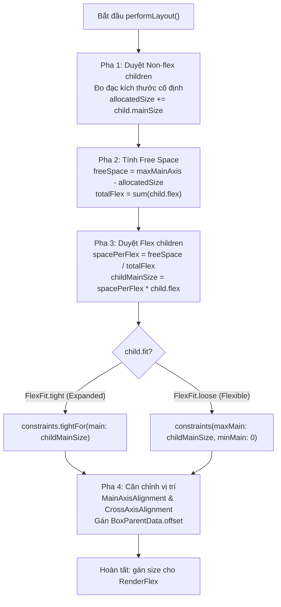

# Bài 4.3 — Flex Layouts: Row, Column, Expanded & Flexible Internals

## Phần 1 — Khái Niệm & Ràng Buộc Kiến Trúc (Architecture & Design Philosophy)

### 1.1 — Mô hình phân phối không gian tuyến tính một chiều (1D Linear Space Distribution)

Trong Flutter, việc bố trí các phần tử giao diện nối tiếp nhau theo một chiều không gian được trừu tượng hóa thông qua lớp cơ sở duy nhất: `Flex` (ở tầng Widget) và `RenderFlex` (ở tầng RenderObject). Hai widget phổ biến nhất là `Row` và `Column` thực chất là các lớp con cấu hình chuyên biệt của `Flex`:

$$\text{Row} \equiv \text{Flex}(\text{direction: Axis.horizontal})$$

$$\text{Column} \equiv \text{Flex}(\text{direction: Axis.vertical})$$

Cơ chế này vận hành dựa trên hệ tọa độ biến thiên gồm hai trục trực giao:
1. **Trục chính (Main Axis):** Trục chạy dọc theo hướng của bố cục (nằm ngang đối với `Row`, thẳng đứng đối với `Column`). Đây là trục mà thuật toán phân phối không gian (*Flex Algorithm*) diễn ra.
2. **Trục phụ (Cross Axis):** Trục vuông góc với trục chính (thẳng đứng đối với `Row`, nằm ngang đối với `Column`).

```
           TRỤC CHÍNH (Main Axis) của Row ──►
┌───────────────────────────────────────────────────────────────┐
│ [Child 1] (Cố định)  │  [Child 2] (Co giãn)  │  [Child 3]    │ ▲ TRỤC PHỤ
│                      │                       │               │ │ (Cross Axis)
└───────────────────────────────────────────────────────────────┘ ▼ của Row
```

---

### 1.2 — Hợp đồng phân phối tài nguyên không gian (Space Allocation Contract)

Thuật toán `RenderFlex` áp dụng nguyên lý phân xử thứ tự ưu tiên nghiêm ngặt gồm 2 quy tắc bất biến:

1. **Ưu tiên tuyệt đối cho phần tử kích thước cố định (Non-flex children first):**
   - Mọi phần tử con không được bọc bởi `Flexible` hoặc `Expanded` sẽ được đo đạc trước tiên.
   - Các phần tử này có toàn quyền chiếm dụng không gian dọc theo trục chính dựa trên kích thước tự nhiên nội tại của chúng.

2. **Phân phối phần không gian còn lại (Free Space Allocation for Flex children):**
   - Chỉ sau khi tất cả các phần tử kích thước cố định đã nhận đủ không gian, lượng không gian còn thừa trên trục chính mới được gom lại thành **Không gian tự do (Free Space)**.
   - Lượng Free Space này sau đó được chia nhỏ cho các phần tử con có khai báo `Flexible` hoặc `Expanded` dựa trên trọng số tỷ lệ `flex`.

---

## Phần 2 — Cơ Chế Hoạt Động & Mã Nguồn Đối Chiếu (Under the Hood / Deep-Dive)

### 2.1 — Giải phẫu thuật toán 4 pha trong `RenderFlex.performLayout()`

Bên trong `packages/flutter/lib/src/rendering/flex.dart`, phương thức `performLayout()` thực thi một quy trình tính toán tuyến tính chia làm 4 pha riêng biệt:



#### Pha 1: Đo đạc các phần tử kích thước cố định (Non-flex Pass)
`RenderFlex` lặp qua danh sách con liên kết đôi (`RenderBox? child = firstChild`):
```dart
int totalFlex = 0;
double allocatedSize = 0.0;
double crossAxisExtent = 0.0;

RenderBox? child = firstChild;
while (child != null) {
  final FlexParentData childParentData = child.parentData! as FlexParentData;
  final int flex = childParentData.flex ?? 0;

  if (flex > 0) {
    totalFlex += flex;
  } else {
    // Đo đạc con cố định với unbound constraint trên trục chính
    final BoxConstraints innerConstraints = _getInnerConstraints(constraints);
    child.layout(innerConstraints, parentUsesSize: true);
    allocatedSize += _getMainSize(child.size);
    crossAxisExtent = math.max(crossAxisExtent, _getCrossSize(child.size));
  }
  child = childParentData.nextSibling;
}
```

#### Pha 2: Tính toán không gian tự do (Free Space Calculation)
Sau khi trừ đi toàn bộ không gian của non-flex children:
```dart
final double actualMaxMainAxis = _canFlex ? maxMainAxis : 0.0;
final double freeSpace = math.max(0.0, actualMaxMainAxis - allocatedSize);
final double spacePerFlex = totalFlex > 0 ? (freeSpace / totalFlex) : 0.0;
```

#### Pha 3: Phân bổ không gian cho các phần tử co giãn (Flex Pass)
`RenderFlex` thực hiện lượt duyệt thứ hai dành riêng cho các phần tử có `flex > 0`:
```dart
child = firstChild;
while (child != null) {
  final FlexParentData childParentData = child.parentData! as FlexParentData;
  final int flex = childParentData.flex ?? 0;

  if (flex > 0) {
    final double maxChildExtent = spacePerFlex * flex;
    late final BoxConstraints innerConstraints;

    if (childParentData.fit == FlexFit.tight) {
      // Expanded: Khóa cứng kích thước trục chính đúng bằng phần chia
      innerConstraints = _createTightConstraints(maxChildExtent, crossAxisExtent);
    } else {
      // Flexible: Cho phép con co nhỏ hơn phần chia (tối đa bằng maxChildExtent)
      innerConstraints = _createLooseConstraints(maxChildExtent, crossAxisExtent);
    }

    child.layout(innerConstraints, parentUsesSize: true);
    allocatedSize += _getMainSize(child.size);
    crossAxisExtent = math.max(crossAxisExtent, _getCrossSize(child.size));
  }
  child = childParentData.nextSibling;
}
```

#### Pha 4: Định vị tọa độ và căn chỉnh lề (Positioning Pass)
Sau khi tất cả các con đã xác định xong kích thước, `RenderFlex` căn cứ vào các thuộc tính:
- `mainAxisSize`: Nếu là `MainAxisSize.max`, kích thước trục chính của `RenderFlex` lấy bằng cận trên của constraints. Nếu là `MainAxisSize.min`, nó co lại bằng đúng `allocatedSize`.
- `mainAxisAlignment`: Tính toán khoảng cách offset giữa các con (ví dụ: `spaceAround`, `spaceBetween`, `center`).
- `crossAxisAlignment`: Căn chỉnh vị trí con trên trục phụ (ví dụ: `start`, `center`, `end`, `stretch`).

---

### 2.2 — So sánh mã nguồn `Expanded` vs `Flexible`

Trong mã nguồn `packages/flutter/lib/src/widgets/basic.dart`, class `Expanded` thực chất chỉ là một lớp kế thừa trực tiếp từ `Flexible` với tham số cấu hình mặc định:

```dart
class Flexible extends ParentDataWidget<FlexParentData> {
  const Flexible({
    super.key,
    this.flex = 1,
    this.fit = FlexFit.loose, // MẶC ĐỊNH LÀ LOOSE
    required super.child,
  });
  // ...
}

class Expanded extends Flexible {
  const Expanded({
    super.key,
    super.flex = 1,
    required super.child,
  }) : super(fit: FlexFit.tight); // ÉP KIỂU TIGHT
}
```

| Tiêu chí | `Flexible(fit: FlexFit.loose)` | `Expanded` (tức `Flexible(fit: FlexFit.tight)`) |
| :--- | :--- | :--- |
| **Ràng buộc truyền xuống con** | Loose: $\min = 0.0, \max = \text{flexShare}$ | Tight: $\min = \max = \text{flexShare}$ |
| **Hành vi kích thước của con** | Con tự do co nhỏ nếu nội dung ít hơn `flexShare`. | Con bắt buộc phải phình to chiếm trọn vẹn `flexShare`. |
| **Không gian dư thừa** | Trở thành khoảng trống không sử dụng (Wasted Space) trong Flex. | Không có khoảng trống dư thừa. |

---

### 2.3 — Chi phí hiệu năng của `CrossAxisAlignment.baseline`

Khi sử dụng `CrossAxisAlignment.baseline`, `RenderFlex` buộc phải căn chỉnh các phần tử dựa trên đường cơ sở của phông chữ văn bản. Bất biến này đòi hỏi:
1. Thuộc tính `textBaseline` bắt buộc phải được khai báo (`TextBaseline.alphabetic` hoặc `TextBaseline.ideographic`), nếu không framework sẽ ném assertion runtime.
2. `RenderFlex` phải gọi phương thức đo đạc font metrics: `child.getDistanceToBaseline()`.
3. Nếu một phần tử con là một subtree phức tạp, lời gọi này sẽ duyệt đệ quy xuống tầng sâu nhất để tìm kiếm node văn bản (`RenderParagraph`), làm tăng đáng kể thời gian xử lý trong Layout Pass.

---

## Phần 3 — Hướng Dẫn Thực Hành Chuẩn (Production-Ready Implementations)

### 3.1 — Thiết kế bố cục Card đa tầng chịu tải nội dung biến thiên

Dưới đây là kiến trúc một ListItem hiển thị thông tin sản phẩm chuẩn production, giải quyết triệt để bài toán tràn văn bản và phân bổ không gian tối ưu:

```dart
import 'package:flutter/material.dart';

class ProductListItem extends StatelessWidget {
  final String title;
  final String subtitle;
  final String price;
  final String tag;
  final VoidCallback onTap;

  const ProductListItem({
    super.key,
    required this.title,
    required this.subtitle,
    required this.price,
    required this.tag,
    required this.onTap,
  });

  @override
  Widget build(BuildContext context) {
    return InkWell(
      onTap: onTap,
      child: Padding(
        padding: const EdgeInsets.symmetric(horizontal: 16.0, vertical: 12.0),
        child: Row(
          crossAxisAlignment: CrossAxisAlignment.center,
          children: [
            // Phần tử 1: Hình ảnh cố định kích thước (Non-flex)
            Container(
              width: 56.0,
              height: 56.0,
              decoration: BoxDecoration(
                color: Theme.of(context).colorScheme.primaryContainer,
                borderRadius: BorderRadius.circular(8.0),
              ),
              child: const Icon(Icons.inventory_2, size: 28.0),
            ),
            const SizedBox(width: 16.0),

            // Phần tử 2: Khối thông tin văn bản co giãn (Flex child chiếm toàn bộ Free Space)
            Expanded(
              child: Column(
                crossAxisAlignment: CrossAxisAlignment.start,
                mainAxisSize: MainAxisSize.min,
                children: [
                  Row(
                    children: [
                      // Tiêu đề co giãn linh hoạt
                      Flexible(
                        child: Text(
                          title,
                          style: Theme.of(context).textTheme.titleMedium,
                          maxLines: 1,
                          overflow: TextOverflow.ellipsis,
                        ),
                      ),
                      const SizedBox(width: 8.0),
                      // Tag cố định không bị đè nén
                      Container(
                        padding: const EdgeInsets.symmetric(horizontal: 6.0, vertical: 2.0),
                        decoration: BoxDecoration(
                          color: Theme.of(context).colorScheme.secondaryContainer,
                          borderRadius: BorderRadius.circular(4.0),
                        ),
                        child: Text(
                          tag,
                          style: Theme.of(context).textTheme.labelSmall,
                        ),
                      ),
                    ],
                  ),
                  const SizedBox(height: 4.0),
                  Text(
                    subtitle,
                    style: Theme.of(context).textTheme.bodyMedium?.copyWith(
                          color: Theme.of(context).colorScheme.onSurfaceVariant,
                        ),
                    maxLines: 2,
                    overflow: TextOverflow.ellipsis,
                  ),
                ],
              ),
            ),
            const SizedBox(width: 16.0),

            // Phần tử 3: Giá tiền cố định không cho phép co nhỏ (Non-flex)
            Text(
              price,
              style: Theme.of(context).textTheme.titleMedium?.copyWith(
                    fontWeight: FontWeight.bold,
                    color: Theme.of(context).colorScheme.primary,
                  ),
            ),
          ],
        ),
      ),
    );
  }
}
```

---

### 3.2 — Kỹ thuật phối hợp `Spacer` và tỷ lệ Flex

`Spacer` thực chất là một `Expanded` bọc một `SizedBox.shrink()`. Phối hợp các giá trị `flex` khác nhau giúp thiết lập bố cục tỷ lệ chuẩn xác mà không cần hardcode khoảng cách pixel:

```dart
Row(
  children: [
    const Icon(Icons.star),
    const Spacer(flex: 1), // Chiếm 1 phần khoảng trống
    const Text('Tùy chọn A'),
    const Spacer(flex: 2), // Chiếm gấp đôi khoảng trống
    const Text('Tùy chọn B'),
  ],
)
```

---

## Phần 4 — Lỗi Thường Gặp & Giải Pháp Khắc Phục (Anti-Patterns & Pitfalls)

### 4.1 — Lồng `Expanded` bên trong `Column` có `mainAxisSize: MainAxisSize.min`

#### Mô tả lỗi:
Chương trình sụp đổ với thông báo:
```
RenderFlex children have non-zero flex but incoming height constraints are unbounded.
```

```dart
// SAI LẦM PHỔ BIẾN
Dialog(
  child: Column(
    mainAxisSize: MainAxisSize.min, // Cố gắng thu nhỏ theo nội dung
    children: [
      const Text('Header'),
      Expanded( // LỖI CRASH: Không thể chia Free Space khi chiều cao tự do
        child: Container(color: Colors.blue),
      ),
    ],
  ),
)
```

#### Nguyên nhân kỹ thuật:
Khi `mainAxisSize` được đặt là `MainAxisSize.min`, `RenderFlex` báo cáo rằng nó muốn co kích thước về bằng đúng tổng kích thước của các phần tử con. 
Tuy nhiên, `Expanded` lại là phần tử đòi hỏi phải tính toán `freeSpace` dựa trên cận trên khả dụng (`maxHeight`). Hai yêu cầu này mâu thuẫn hình học triệt để: Không thể đồng thời vừa thu nhỏ vô hạn theo con, vừa mở rộng con theo không gian tối đa.

#### Giải pháp:
1. Bỏ `Expanded` và thay bằng các widget có kích thước xác định (`SizedBox(height: ...)`).
2. Hoặc bọc `Column` bằng một container có chiều cao hữu hạn xác định.

---

### 4.2 — Sử dụng `Expanded` ngoài phạm vi của `Flex`

#### Mô tả lỗi:
Gặp lỗi biên dịch hoặc runtime assertion:
```
Incorrect use of ParentDataWidget.
Expanded widgets must be placed directly inside a Flex widget (Row, Column, or Flex).
```

#### Nguyên nhân kỹ thuật:
`Expanded` kế thừa từ `ParentDataWidget<FlexParentData>`. Trách nhiệm duy nhất của nó là can thiệp và gán thuộc tính `flex` vào cấu trúc `ParentData` của RenderObject ngay trên nó. Nếu widget cha trực tiếp không phải là `RenderFlex` (ví dụ: đặt `Expanded` bên trong `Stack`, `Container`, hoặc `ListView`), `RenderObject` của cha sẽ sử dụng kiểu `ParentData` khác (ví dụ `StackParentData`), dẫn đến hiện tượng sai lệch cấu trúc bộ nhớ và framework ném ngoại lệ bảo vệ.

---

## Phần 5 — Câu Hỏi Kiểm Tra Kiến Thức Chuyên Sâu & Bài Tập Phân Tích Mã Nguồn (Technical Assessment & Code Tracing)

### 5.1 — Câu hỏi khảo sát kiến trúc

#### Câu 1: Cơ chế tái phân phối không gian trong `FlexFit.loose`
*Đề bài:* Giả sử một `Row` có chiều rộng $400px$, chứa một `Flexible(flex: 1, fit: FlexFit.loose)` bọc một `Container(width: 50px)`. Biết rằng `totalFlex = 1` và `freeSpace = 400px`. Phần không gian $350px$ còn lại chưa sử dụng sẽ được xử lý như thế nào? Nó có được dồn cho các phần tử khác không?

*Phân tích kỹ thuật:*
1. Trong Pha 3 của `RenderFlex.performLayout()`:
   $$\text{flexShare} = 400 \times \frac{1}{1} = 400px$$
2. `Flexible` nhận `FlexFit.loose`, truyền cho child một loose constraint: `BoxConstraints(minW: 0.0, maxW: 400.0)`.
3. `Container(width: 50px)` chọn kích thước $50px$ và báo cáo lên.
4. Lượng không gian dư thừa $350px$ **hoàn toàn không được tái phân phối**.
5. Trong Pha 4, `RenderFlex` coi $350px$ đó là khoảng trống và tiến hành căn chỉnh vị trí của các con theo `MainAxisAlignment`. Nếu `mainAxisAlignment == MainAxisAlignment.start`, toàn bộ $350px$ dồn về bên phải của `Row`.

---

#### Câu 2: Thuật toán Intrinsic Measurements và bẫy suy giảm hiệu năng trong Flex
*Đề bài:* Tại sao việc lồng ghép `Row` bên trong `IntrinsicWidth` lại biến thuật toán bố cục tuyến tính $O(N)$ thành $O(N^2)$?

*Phân tích kỹ thuật:*
1. Để xác định chiều rộng nội tại tối thiểu (`getMinIntrinsicWidth()`), `RenderFlex` buộc phải giả lập việc layout bằng cách hỏi từng child về `getMinIntrinsicWidth()`.
2. Nếu trong các con lại chứa các widget `Flex` khác, mỗi node con lại thực hiện một chu kỳ hỏi đệ quy tương tự lên các con của nó.
3. Khi lồng nhau $k$ tầng, số phép tính tăng theo hàm mũ $O(N^k)$, phá vỡ hoàn toàn nguyên lý Single-Pass Layout của Flutter và gây hiện tượng drop khung hình nghiêm trọng.

---

### 5.2 — Bài tập phân tích luồng thực thi (Code Tracing)

#### Đề bài:
Cho cấu trúc `Row` sau đây đặt trong một vùng chứa có chiều rộng chính xác **$500px$** (Tight constraint: $w = 500..500$):

```dart
Row(
  children: [
    const SizedBox(width: 80.0),                          // (Phần tử 1)
    Expanded(                                             // (Phần tử 2)
      flex: 1,
      child: Container(color: Colors.red),
    ),
    const SizedBox(width: 20.0),                          // (Phần tử 3)
    Flexible(                                             // (Phần tử 4)
      flex: 2,
      child: SizedBox(
        width: 100.0,
        child: Container(color: Colors.blue),
      ),
    ),
    Expanded(                                             // (Phần tử 5)
      flex: 1,
      child: Container(color: Colors.green),
    ),
  ],
)
```

Hãy thực hiện lần vết thuật toán `RenderFlex.performLayout()` để tính toán:
1. Tổng không gian đã cấp phát trong Pha 1 (`allocatedSize`) và lượng `freeSpace` khả dụng cho các flex children.
2. Không gian tối đa (`flexShare`) được phân bổ theo lý thuyết cho Phần tử 2, Phần tử 4 và Phần tử 5.
3. Kích thước chiều rộng thực tế (`actual width`) được ghi nhận của cả 5 phần tử con sau khi layout hoàn thành.

---

#### Đáp án phân tích:

**1. Pha 1 — Tính toán Non-flex Children:**
- Phần tử 1: `SizedBox(width: 80.0)` $\to$ Chiếm $80px$.
- Phần tử 3: `SizedBox(width: 20.0)` $\to$ Chiếm $20px$.
- Tổng `allocatedSize` sau Pha 1: $80 + 20 = 100px$.
- Lượng `freeSpace` còn lại:
  $$\text{freeSpace} = 500px - 100px = 400px$$
- Tổng trọng số flex:
  $$\text{totalFlex} = \text{flex}_2 (1) + \text{flex}_4 (2) + \text{flex}_5 (1) = 4$$
- Giá trị không gian trên mỗi đơn vị flex:
  $$\text{spacePerFlex} = \frac{400px}{4} = 100px/\text{flex}$$

**2. Pha 2 — Tính toán FlexShare theo lý thuyết:**
- Phần tử 2 (`Expanded, flex: 1`):
  $$\text{flexShare}_2 = 100px \times 1 = 100px$$
- Phần tử 4 (`Flexible, flex: 2`):
  $$\text{flexShare}_4 = 100px \times 2 = 200px$$
- Phần tử 5 (`Expanded, flex: 1`):
  $$\text{flexShare}_5 = 100px \times 1 = 100px$$

**3. Pha 3 — Xác định kích thước chiều rộng thực tế:**
- **Phần tử 1:** $80px$ (Cố định).
- **Phần tử 2 (`Expanded`):** Nhận Tight constraint $100..100$ $\to$ Kích thước thực tế = **$100px$**.
- **Phần tử 3:** $20px$ (Cố định).
- **Phần tử 4 (`Flexible, fit: loose`):** Nhận Loose constraint $0..200$. Con bên trong là `SizedBox(width: 100.0)`. Con chọn kích thước tự nhiên của nó trong phạm vi cho phép $\to$ Kích thước thực tế = **$100px$** (Dư $100px$ không dùng đến).
- **Phần tử 5 (`Expanded`):** Nhận Tight constraint $100..100$ $\to$ Kích thước thực tế = **$100px$**.

*Tổng chiều rộng thực tế của 5 con:* $80 + 100 + 20 + 100 + 100 = 400px$. Khoảng trống $100px$ còn lại của `Row` được bố trí ở đuôi hoặc chia đều tùy thuộc vào thuộc tính `mainAxisAlignment`.
