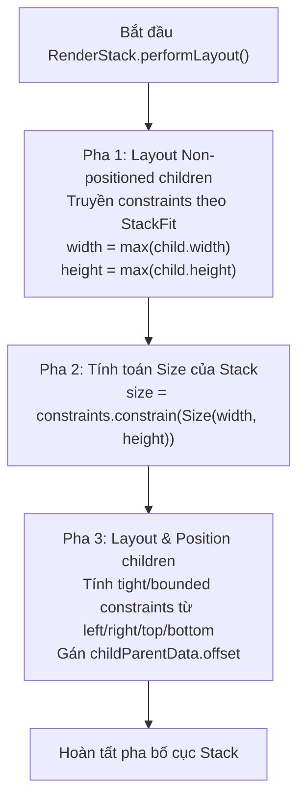

# Bài 4.4 — Stack, Positioned & Overlay Architecture Internals

## Phần 1 — Khái Niệm & Ràng Buộc Kiến Trúc (Architecture & Design Philosophy)

### 1.1 — Mô hình phân lớp không gian ba chiều và thuật toán Painter's Algorithm

Trong khi `Row` và `Column` phân phối không gian theo một chiều tuyến tính (1D), `Stack` mở rộng khả năng bố cục sang không gian lớp ba chiều bằng cách xếp chồng các phần tử con lên nhau dọc theo trục ảo $Z$. 

Hệ thống kết xuất của Flutter áp dụng **Thuật toán của người thợ vẽ (Painter's Algorithm)** cho `Stack`:
- Các phần tử con được khai báo trước trong mảng `children` sẽ được tính toán và vẽ lên canvas trước, nằm ở lớp đáy.
- Các phần tử con khai báo sau sẽ được vẽ đè lên trên các phần tử trước đó.
- Điểm gốc tọa độ $(0, 0)$ của `Stack` mặc định nằm tại góc trên cùng bên trái (Top-Left), tương ứng với quy ước hệ tọa độ màn hình chuẩn.

```
       TRỤC Z (Thứ tự khai báo trong children)
         ▲
         │   [Layer 3: Positioned Badge]   ──► Vẽ sau cùng, nằm trên cùng
         │   [Layer 2: Positioned PlayBtn]
         │   [Layer 1: Non-positioned Image]──► Vẽ đầu tiên, nằm ở đáy
         └─────────────────────────────────────
```

---

### 1.2 — Phân định hai nhóm phần tử trong Stack

Kiến trúc của `RenderStack` phân tách tất cả các phần tử con thành hai tập hợp có vai trò hình học hoàn toàn đối lập:

1. **Nhóm phần tử không định vị (Non-positioned children):**
   - Là các widget con **không** được bọc bởi `Positioned`.
   - Đóng vai trò là **cột trụ xác lập kích thước (Sizing Pillars)** cho toàn bộ `Stack`. Kích thước của `Stack` được tính toán dựa trên bounding box bao trọn phần tử không định vị lớn nhất.
2. **Nhóm phần tử định vị (Positioned children):**
   - Là các widget con được bọc trực tiếp bởi `Positioned` hoặc `PositionedDirectional`.
   - Hoàn toàn **không tham gia** vào việc quyết định kích thước của `Stack`. Kích thước và tọa độ của chúng được tính toán dựa trên kích thước của `Stack` sau khi `Stack` đã hoàn tất việc đo đạc các phần tử không định vị.

---

## Phần 2 — Cơ Chế Hoạt Động & Mã Nguồn Đối Chiếu (Under the Hood / Deep-Dive)

### 2.1 — Giải phẫu thuật toán đo đạc trong `RenderStack.performLayout()`

Bên trong `packages/flutter/lib/src/rendering/stack.dart`, phương thức `performLayout()` vận hành qua ba pha xử lý nghiêm ngặt:



#### Pha 1: Đo đạc các phần tử không định vị (Non-positioned Pass)
`RenderStack` xác định ràng buộc truyền cho các con không định vị căn cứ vào thuộc tính `fit`:

```dart
// Trích đoạn mã nguồn trong RenderStack.performLayout()
bool hasNonPositionedChildren = false;
double width = 0.0;
double height = 0.0;

BoxConstraints nonPositionedConstraints;
switch (fit) {
  case StackFit.loose:
    nonPositionedConstraints = constraints.loosen();
    break;
  case StackFit.expand:
    nonPositionedConstraints = BoxConstraints.tight(constraints.biggest);
    break;
  case StackFit.passthrough:
    nonPositionedConstraints = constraints;
    break;
}

RenderBox? child = firstChild;
while (child != null) {
  final StackParentData childParentData = child.parentData! as StackParentData;

  if (!childParentData.isPositioned) {
    hasNonPositionedChildren = true;
    child.layout(nonPositionedConstraints, parentUsesSize: true);
    width = math.max(width, child.size.width);
    height = math.max(height, child.size.height);
  }
  child = childParentData.nextSibling;
}
```

#### Pha 2: Xác định kích thước tự thân của Stack
Sau khi đã quét hết các phần tử không định vị:
```dart
if (hasNonPositionedChildren) {
  size = constraints.constrain(Size(width, height));
} else {
  // Nếu KHÔNG CÓ non-positioned child nào:
  size = constraints.biggest;
}
```

> [!CAUTION]
> **Cái bẫy kích thước sụp đổ $0 \times 0$ (The Zero-Size Collapse Trap):**
> Nếu một `Stack` chỉ chứa toàn các widget `Positioned` (không có non-positioned child nào), và `Stack` đó được đặt bên trong một môi trường Loose Constraint (ví dụ: bên trong `Center`, `UnconstrainedBox`, hoặc `ListView`), thì `constraints.biggest` sẽ trả về `Size(0.0, 0.0)` hoặc giá trị cực tiểu. 
> Toàn bộ `Stack` bị sụp đổ kích thước về $(0, 0)$. Mặc dù các con `Positioned` vẫn có thể vẽ tràn ra ngoài nếu `clipBehavior: Clip.none`, nhưng chúng sẽ **hoàn toàn không thể nhận được sự kiện chạm (touch/click)** vì cơ chế Hit-Testing sẽ dừng lại tại ranh giới $(0, 0)$ của `Stack`.

#### Pha 3: Đo đạc và định vị các phần tử `Positioned`
Sau khi `Stack` đã có `size` cụ thể, nó duyệt qua các phần tử `Positioned` để thiết lập tọa độ và ràng buộc hình học:
```dart
child = firstChild;
while (child != null) {
  final StackParentData childParentData = child.parentData! as StackParentData;

  if (childParentData.isPositioned) {
    // Giải mã ràng buộc dựa trên bộ 6 tham số: left, right, top, bottom, width, height
    final BoxConstraints childConstraints = _computePositionedConstraints(childParentData);
    child.layout(childConstraints, parentUsesSize: true);

    // Tính toán offset tương đối so với góc Top-Left của Stack
    final double x = _computeChildHorizontalOffset(childParentData, child.size.width);
    final double y = _computeChildVerticalOffset(childParentData, child.size.height);
    childParentData.offset = Offset(x, y);
  }
  child = childParentData.nextSibling;
}
```

---

### 2.2 — Kiến trúc `Overlay`, `OverlayEntry` và `LayerLink`

Trong các ứng dụng phức tạp, nhu cầu hiển thị các thành phần nổi trên bề mặt của toàn bộ ứng dụng (như Dropdown menu, Tooltip, Toast, BottomSheet) được quản lý bởi kiến trúc **Overlay**.

1. **Bản chất của `Overlay`:**
   `Overlay` thực chất là một `Stack` toàn cục được nhúng ngay phía trên cây điều hướng của `Navigator`. Mỗi một Route màn hình thực chất được đặt vào bên trong một `OverlayEntry` của `Overlay` này.
2. **`OverlayEntry`:**
   Đại diện cho một lớp hiển thị độc lập. Khi gọi `overlayState.insert(entry)`, framework chỉ gắn thêm một phần tử vào `Stack` của `Overlay` mà không kích hoạt rebuild các màn hình bên dưới.
3. **Cơ chế liên kết tọa độ không xâm lấn (`LayerLink`):**
   Thay vì phải thực hiện các phép tính chuyển đổi tọa độ toàn cục phức tạp (`localToGlobal`) gây kích hoạt layout lại, Flutter cung cấp bộ đôi:
   - `CompositedTransformTarget`: Gắn một điểm neo `LayerLink` vào RenderObject đích trên màn hình.
   - `CompositedTransformFollower`: Nhận `LayerLink` đó bên trong `OverlayEntry`. Trong pha Paint Pass, Render Tree sẽ tự động gắn kết ma trận biến đổi (Matrix4 transform) của Target vào Follower ở tầng GPU Compositing, đạt hiệu năng 120 FPS mà **hoàn toàn không gây ra Relayout Pass**.

---

### 2.3 — Ảnh hưởng của `Clip` và cơ chế Hit-Testing

Một trong những nguồn phát sinh lỗi phổ biến nhất trong `Stack` liên quan đến tương tác chạm:

```dart
Stack(
  clipBehavior: Clip.none, // Cho phép vẽ tràn ra ngoài ranh giới của Stack
  children: [
    Container(width: 100, height: 100, color: Colors.blue),
    Positioned(
      right: -40, // Tràn ra ngoài 40px
      top: 0,
      child: GestureDetector(
        onTap: () => debugPrint('Tapped!'),
        child: Container(width: 50, height: 50, color: Colors.red),
      ),
    ),
  ],
)
```

#### Nguyên nhân kỹ thuật tại sao phần tràn ra ngoài không thể nhận sự kiện chạm:
Cơ chế Hit-Testing trong Flutter duyệt đệ quy từ gốc Render Tree xuống các lá:
```dart
// Trong RenderBox.hitTest()
bool hitTest(BoxHitTestResult result, { required Offset position }) {
  if (_size!.contains(position)) { // KIỂM TRA ĐIỀU KIỆN TIÊN QUYẾT
    if (hitTestChildren(result, position: position) || hitTestSelf(position)) {
      result.add(BoxHitTestEntry(this, position));
      return true;
    }
  }
  return false;
}
```
Khi người dùng chạm vào phần hộp đỏ nằm ngoài phạm vi $100 \times 100$ của `Stack`:
1. Framework gọi `stack.hitTest(position)`.
2. Biểu thức `_size!.contains(position)` đánh giá là **`false`** vì điểm chạm nằm ngoài vùng kích thước hình học của `Stack`.
3. `Stack` lập tức trả về `false` và **hoàn toàn không gọi xuống `hitTestChildren()`**.
4. Sự kiện chạm bị bỏ qua hoàn toàn dù mắt người dùng vẫn nhìn thấy hộp màu đỏ hiển thị bình thường.

---

## Phần 3 — Hướng Dẫn Thực Hành Chuẩn (Production-Ready Implementations)

### 3.1 — Xây dựng Floating Dropdown / Tooltip chuẩn với `LayerLink` và `OverlayEntry`

Mô hình thiết kế chuẩn mực để tạo một menu nổi tự động bám theo nút bấm mà không bị che khuất bởi các widget cha và không bị lỗi kích thước:

```dart
import 'package:flutter/material.dart';

class CustomFloatingDropdown extends StatefulWidget {
  final Widget child;
  final Widget dropdownContent;

  const CustomFloatingDropdown({
    super.key,
    required this.child,
    required this.dropdownContent,
  });

  @override
  State<CustomFloatingDropdown> createState() => _CustomFloatingDropdownState();
}

class _CustomFloatingDropdownState extends State<CustomFloatingDropdown> {
  final LayerLink _layerLink = LayerLink();
  OverlayEntry? _overlayEntry;
  bool _isOpen = false;

  void _toggleDropdown() {
    if (_isOpen) {
      _closeDropdown();
    } else {
      _openDropdown();
    }
  }

  void _openDropdown() {
    _overlayEntry = _createOverlayEntry();
    Overlay.of(context).insert(_overlayEntry!);
    setState(() => _isOpen = true);
  }

  void _closeDropdown() {
    _overlayEntry?.remove();
    _overlayEntry = null;
    setState(() => _isOpen = false);
  }

  OverlayEntry _createOverlayEntry() {
    return OverlayEntry(
      builder: (context) => Stack(
        children: [
          // Lớp rào cản trong suốt bắt sự kiện đóng khi bấm ra ngoài
          Positioned.fill(
            child: GestureDetector(
              behavior: HitTestBehavior.translucent,
              onTap: _closeDropdown,
            ),
          ),
          // Khối nội dung dropdown bám dính vào nút bấm
          Positioned(
            width: 200.0,
            child: CompositedTransformFollower(
              link: _layerLink,
              showWhenUnlinked: false,
              offset: const Offset(0.0, 48.0), // Hiển thị ngay bên dưới nút
              child: Material(
                elevation: 8.0,
                borderRadius: BorderRadius.circular(8.0),
                child: widget.dropdownContent,
              ),
            ),
          ),
        ],
      ),
    );
  }

  @override
  void dispose() {
    _overlayEntry?.remove();
    _overlayEntry = null;
    super.dispose();
  }

  @override
  Widget build(BuildContext context) {
    return CompositedTransformTarget(
      link: _layerLink,
      child: InkWell(
        onTap: _toggleDropdown,
        child: widget.child,
      ),
    );
  }
}
```

---

### 3.2 — Thiết kế Badge thông báo an toàn không làm vỡ ranh giới Hit-Test

Để đặt badge thông báo ở góc avatar mà không bị lỗi hit-test khi badge tràn ra ngoài:

```dart
import 'package:flutter/material.dart';

class NotificationBadgeAvatar extends StatelessWidget {
  final Widget avatar;
  final int count;

  const NotificationBadgeAvatar({
    super.key,
    required this.avatar,
    required this.count,
  });

  @override
  Widget build(BuildContext context) {
    return Stack(
      alignment: Alignment.center,
      clipBehavior: Clip.none,
      children: [
        // Non-positioned child xác lập kích thước cho toàn bộ Stack
        avatar,
        
        // Positioned định vị tại góc trên bên phải
        if (count > 0)
          Positioned(
            top: -4.0,
            right: -4.0,
            child: Container(
              padding: const EdgeInsets.all(4.0),
              decoration: const BoxDecoration(
                color: Colors.red,
                shape: BoxShape.circle,
              ),
              constraints: const BoxConstraints(
                minWidth: 18.0,
                minHeight: 18.0,
              ),
              child: Center(
                child: Text(
                  count > 99 ? '99+' : '$count',
                  style: const TextStyle(
                    color: Colors.white,
                    fontSize: 10.0,
                    fontWeight: FontWeight.bold,
                  ),
                ),
              ),
            ),
          ),
      ],
    );
  }
}
```

---

## Phần 4 — Lỗi Thường Gặp & Giải Pháp Khắc Phục (Anti-Patterns & Pitfalls)

### 4.1 — Stack chỉ chứa widget Positioned bị teo nhỏ về $0 \times 0$

#### Mô tả lỗi:
Lập trình viên tạo một `Stack` chỉ có các phần tử `Positioned`, đặt bên trong một layout có loose constraints, dẫn đến việc giao diện biến mất hoặc không thể bấm được.

```dart
// SAI LẦM: Toàn bộ Stack bị sụp đổ kích thước
Center(
  child: Stack(
    children: [
      Positioned(
        left: 0,
        top: 0,
        width: 100,
        height: 100,
        child: Container(color: Colors.red),
      ),
    ],
  ),
)
```

#### Nguyên nhân kỹ thuật:
`Center` truyền `constraints.loosen()` ($\min W = 0, \min H = 0$). `Stack` không tìm thấy bất kỳ một non-positioned child nào để lấy kích thước. Căn cứ vào mã nguồn `RenderStack.performLayout()`, khi không có non-positioned child, kích thước của `Stack` sẽ lấy theo `constraints.smallest` hoặc `constraints.biggest` của loose constraints, dẫn đến kích thước bằng $(0, 0)$.

#### Giải pháp:
1. Thêm một phần tử không định vị vô hình để xác lập không gian:
   ```dart
   SizedBox(width: 100, height: 100) // Đặt làm child đầu tiên
   ```
2. Hoặc bọc `Stack` bằng một widget áp đặt kích thước cố định (`SizedBox(width: 100, height: 100, child: Stack(...))`).

---

### 4.2 — Quên hủy `OverlayEntry` trong `dispose()` gây rò rỉ bộ nhớ (Memory Leak)

#### Mô tả lỗi:
Màn hình đã bị pop khỏi Navigator nhưng các phần tử Tooltip hoặc Dialog tự chế bằng `OverlayEntry` vẫn còn treo lơ lửng trên màn hình mới.

#### Giải pháp:
Bắt buộc phải lưu trữ tham chiếu `OverlayEntry` trong `State` và gọi `_overlayEntry?.remove()` bên trong phương thức `dispose()` trước khi gọi `super.dispose()`.

---

## Phần 5 — Câu Hỏi Kiểm Tra Kiến Thức Chuyên Sâu & Bài Tập Phân Tích Mã Nguồn (Technical Assessment & Code Tracing)

### 5.1 — Câu hỏi khảo sát kiến trúc

#### Câu 1: Cơ chế bảo vệ Hit-Testing của `RenderStack`
*Đề bài:* Tại sao Flutter lại thiết kế để `RenderBox.hitTest()` kiểm tra `_size!.contains(position)` ở node cha trước khi duyệt đến các con? Việc cho phép sự kiện chạm vượt ra ngoài biên giới hạn của cha tiềm ẩn nguy cơ kiến trúc gì?

*Phân tích kỹ thuật:*
1. **Tối ưu hóa hiệu năng $O(N)$:** Nếu không kiểm tra bounding box của node cha, mỗi lần người dùng chạm vào màn hình, framework sẽ buộc phải duyệt đệ quy toàn bộ mọi node trên cây giao diện (kể cả các node nằm ngoài màn hình hoặc cách xa hàng nghìn pixel) để kiểm tra xem có node con nào vẽ tràn ra vị trí đó không.
2. **Bảo toàn tính đóng gói hình học (Geometric Encapsulation):** Một container phải chịu trách nhiệm về không gian mà nó chiếm giữ. Việc cho phép một node con nhận touch event bên ngoài phạm vi của cha sẽ phá vỡ tính dự đoán được của hệ thống giao diện, gây hiện tượng tranh chấp sự kiện không mong muốn với các widget láng giềng.

---

#### Câu 2: Tương tác giữa `StackFit.expand` và `Positioned.fill`
*Đề bài:* Khi một `Stack` có `fit: StackFit.expand`, một phần tử con thông thường (không có `Positioned`) và một phần tử con `Positioned.fill` sẽ nhận được `BoxConstraints` giống hay khác nhau?

*Phân tích kỹ thuật:*
1. Khi `fit: StackFit.expand`:
   `RenderStack` biến đổi constraints của các non-positioned children thành Tight Constraint tối đa:
   $$\mathbb{C}_{nonPositioned} = \text{BoxConstraints.tight}(constraints.biggest)$$
2. Với phần tử `Positioned.fill()`:
   Phương thức `_computePositionedConstraints()` nhận thấy `left: 0, right: 0, top: 0, bottom: 0`. Nó tính toán ràng buộc cho child:
   $$\mathbb{C}_{positioned} = \text{BoxConstraints.tight}(stack.size)$$
3. Do `stack.size` trong trường hợp này cũng chính là `constraints.biggest`, cả hai phần tử con đều nhận được **chính xác cùng một Tight Constraint** chiếm trọn vẹn diện tích của `Stack`.

---

### 5.2 — Bài tập phân tích luồng thực thi (Code Tracing)

#### Đề bài:
Cho cấu trúc `Stack` đặt trong một vùng chứa có kích thước cố định **$300 \times 300$**:

```dart
Stack(
  alignment: Alignment.center,
  children: [
    Container(width: 200, height: 100, color: Colors.grey), // (Child 1)
    Positioned(                                              // (Child 2)
      left: 20.0,
      right: 20.0,
      height: 50.0,
      child: Container(color: Colors.blue),
    ),
    Positioned(                                              // (Child 3)
      top: 10.0,
      width: 80.0,
      bottom: 10.0,
      child: Container(color: Colors.red),
    ),
  ],
)
```

Hãy tính toán chính xác:
1. Kích thước tự thân (`size`) của `Stack`.
2. Kích thước (`size`) và tọa độ `offset` $(x, y)$ của Child 2.
3. Kích thước (`size`) và tọa độ `offset` $(x, y)$ của Child 3.

---

#### Đáp án phân tích:

**1. Kích thước tự thân của `Stack`:**
- Child 1 là phần tử không định vị (Non-positioned child) duy nhất.
- `Stack` nhận Bounded Constraint $300 \times 300$. Mặc định `fit: StackFit.loose`, nó truyền cho Child 1: `BoxConstraints(0..300, 0..300)`.
- Child 1 chọn kích thước: $200 \times 100$.
- Kích thước của `Stack` được tính toán:
  $$\text{size} = \text{constraints.constrain}(Size(200.0, 100.0)) = Size(200.0, 100.0)$$
*(Lưu ý: Mặc dù cha cho phép tối đa $300 \times 300$, Stack co lại vừa khít với Child 1 là $200 \times 100$).*

**2. Kích thước và Tọa độ của Child 2:**
- Child 2 khai báo: `left: 20.0`, `right: 20.0`, `height: 50.0`.
- Chiều rộng của Child 2:
  $$\text{width}_2 = \text{stack.width} - \text{left} - \text{right} = 200.0 - 20.0 - 20.0 = 160.0px$$
- Chiều cao của Child 2: Được ấn định rõ ràng là $50.0px$.
- Kích thước Child 2: **$Size(160.0, 50.0)$**.
- Tọa độ $x$: $left = 20.0px$.
- Tọa độ $y$: Do không khai báo `top` hay `bottom`, Child 2 được căn chỉnh theo `alignment: Alignment.center`:
  $$y = \frac{\text{stack.height} - \text{child.height}}{2} = \frac{100.0 - 50.0}{2} = 25.0px$$
- Tọa độ `offset` của Child 2: **$Offset(20.0, 25.0)$**.

**3. Kích thước và Tọa độ của Child 3:**
- Child 3 khai báo: `top: 10.0`, `bottom: 10.0`, `width: 80.0`.
- Chiều cao của Child 3:
  $$\text{height}_3 = \text{stack.height} - \text{top} - \text{bottom} = 100.0 - 10.0 - 10.0 = 80.0px$$
- Chiều rộng của Child 3: Được ấn định rõ ràng là $80.0px$.
- Kích thước Child 3: **$Size(80.0, 80.0)$**.
- Tọa độ $y$: $top = 10.0px$.
- Tọa độ $x$: Căn giữa theo trục hoành:
  $$x = \frac{\text{stack.width} - \text{child.width}}{2} = \frac{200.0 - 80.0}{2} = 60.0px$$
- Tọa độ `offset` của Child 3: **$Offset(60.0, 10.0)$**.
