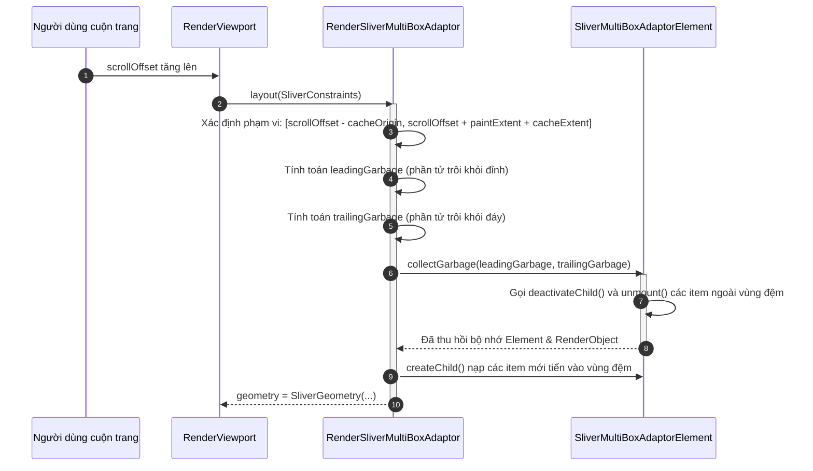

# Bài 4.5 — Scrollables, Virtualization & Tối Ưu Hiệu Suất Danh Sách Dài: Sliver Architecture Deep Dive

## Phần 1 — Khái Niệm & Ràng Buộc Kiến Trúc (Architecture & Design Philosophy)

### 1.1 — Nghịch lý không gian và Bản chất của Virtualization

Trong lập trình ứng dụng di động, giao diện thường xuyên phải đối mặt với các tập dữ liệu có quy mô rất lớn hoặc không giới hạn kích thước ($N \to \infty$, ví dụ: bảng tin mạng xã hội, danh mục thương mại điện tử, danh bạ cuộc gọi). Trong khi đó, không gian hiển thị của màn hình vật lý (**Viewport**) luôn luôn hữu hạn và cố định tại một thời điểm (thường có chiều cao từ 600px đến 1000px).

Nếu áp dụng mô hình bố cục hộp thông thường (Eager Layout - ví dụ `SingleChildScrollView` bọc một `Column` chứa 2.000 phần tử):
1. **Cạn kiệt bộ nhớ Heap (OOM - Out of Memory):** Cả 2.000 widget con đều được nạp (inflate) đồng thời thành 2.000 `Element` trên Element Tree và 2.000 `RenderObject` trên Render Tree.
2. **Nghẽn CPU / GPU Pipeline:** CPU phải đo đạc (measure) và tính toán tọa độ cho toàn bộ 2.000 phần tử ngay trong một khung hình khởi tạo duy nhất.
3. **Nghẽn bộ thu gom rác (Garbage Collector Thrashing):** Khi người dùng tương tác, số lượng object khổng lồ nằm trên Heap khiến GC phải quét liên tục, gây tụt khung hình nghiêm trọng (Jank, frame drop dưới 60/120 FPS).

Flutter giải quyết nghịch lý này bằng kiến trúc **Ảo hóa phần tử (Virtualization / Windowing)**:
- Framework chỉ khởi tạo, giữ trong bộ nhớ và kết xuất các phần tử đang nằm trong **Viewport** (vùng người dùng nhìn thấy) cộng thêm một **Vùng đệm dự phòng (Cache Extent)**.
- Khi một phần tử bị cuộn trôi ra ngoài vùng đệm, `RenderObject` và `Element` của nó sẽ lập tức bị thu hồi hoặc hủy bỏ để tái phân bổ bộ nhớ.

---

### 1.2 — Các mô hình hiển thị danh sách dài thường gặp trong Flutter

Tùy thuộc vào quy mô dữ liệu và hành vi cuộn, Flutter cung cấp nhiều giải pháp khác nhau:

```
┌──────────────────────────────────────────────────────────────────────────────────┐
│ CÁC GIẢI PHÁP HIỂN THỊ DANH SÁCH TRONG FLUTTER                                   │
├────────────────────────────────┬─────────────────────────────────────────────────┤
│ 1. SingleChildScrollView + Col │ Eager Build • Không ảo hóa • Dành cho Form tĩnh │
├────────────────────────────────┼─────────────────────────────────────────────────┤
│ 2. ListView(children: [...])   │ Eager Build • Tiện dụng • Dưới 20 phần tử       │
├────────────────────────────────┼─────────────────────────────────────────────────┤
│ 3. ListView.builder            │ Lazy Virtualization • Tối ưu danh sách lớn      │
├────────────────────────────────┼─────────────────────────────────────────────────┤
│ 4. ListView.separated          │ Lazy Virtualization • Tích hợp phân cách tự động│
├────────────────────────────────┼─────────────────────────────────────────────────┤
│ 5. ListView + itemExtent       │ Lazy Virtualization • O(1) Layout Calculation   │
├────────────────────────────────┼─────────────────────────────────────────────────┤
│ 6. CustomScrollView + Slivers  │ Ghép nối đa dạng hiệu ứng cuộn trong 1 Viewport │
└────────────────────────────────┴─────────────────────────────────────────────────┘
```

#### 1. `SingleChildScrollView` + `Column` (Eager Layout)
- **Cơ chế:** Khởi tạo và layout toàn bộ danh sách ngay khi màn hình xuất hiện.
- **Khi nào nên dùng:** Dùng khi nội dung là một biểu mẫu (form) cố định, giao diện profile ngắn, hoặc danh sách đảm bảo chắc chắn có ít hơn $15 - 20$ phần tử. Cần cuộn để tránh lỗi tràn màn hình (`RenderFlex overflowed`) trên các thiết bị màn hình nhỏ.
- **Khi nào là thảm họa:** Với danh sách dài hoặc vô hạn. Khởi tạo hàng trăm widget sẽ làm đóng băng giao diện lúc mở màn hình (Cold-start Jank) và làm tăng vọt mức tiêu thụ RAM.

#### 2. `ListView(children: [...])` (Default Constructor)
- **Cơ chế:** Mặc dù trả về một `ListView`, nhưng constructor mặc định nhận một mảng `List<Widget> children`. Điều này đồng nghĩa với việc toàn bộ mảng Widget đã được khởi tạo trước khi chuyển vào `ListView`.
- **Đặc điểm:** Không kích hoạt cơ chế Lazy-loading đúng nghĩa. Thích hợp cho danh sách ngắn cố định vài chục item.

#### 3. `ListView.builder` (Lazy Virtualization)
- **Cơ chế:** Sử dụng `SliverChildBuilderDelegate`. Phương thức `itemBuilder(BuildContext context, int index)` chỉ được gọi khi phần tử tại `index` đó chuẩn bị tiến vào vùng hiển thị hoặc vùng đệm (`cacheExtent`).
- **Khi nào nên dùng:** Tiêu chuẩn vàng cho mọi danh sách động, danh sách tải từ API, có từ hàng trăm đến hàng chục nghìn phần tử.

#### 4. `ListView.separated` (Lazy Virtualization kèm Separator)
- **Cơ chế:** Hoạt động tương tự `ListView.builder` nhưng tích hợp thêm `separatorBuilder(BuildContext context, int index)`.
- **Lợi ích kiến trúc:** Tách bạch hoàn toàn phần tử dữ liệu chính và đường kẻ phân cách (`Divider`). Không cần nhồi nhét `Divider` vào bên trong widget item hoặc xử lý logic ẩn divider cho item cuối cùng một cách thủ công.

#### 5. `ListView` với `itemExtent` hoặc `prototypeItem` (Fixed Extent $O(1)$)
- **Cơ chế:** Báo trước cho Scroll Engine biết chính xác chiều dài theo trục chính của mỗi item (ví dụ: mọi item đều cao cố định $72.0px$).
- **Lợi thế hiệu năng:** Triệt tiêu hoàn toàn bước đo lường layout động của các phần tử con. Framework tính toán vị trí cuộn của phần tử thứ 1.000 bằng một phép nhân toán học tức thì ($1.000 \times 72.0px$) thay vì phải lần lượt đo 999 phần tử trước đó.

#### 6. `CustomScrollView` + `SliverList` / `SliverGrid` / `SliverFixedExtentList`
- **Cơ chế:** Cho phép kết hợp nhiều danh sách, lưới và các thành phần cuộn đặc biệt (`SliverAppBar`, `SliverPersistentHeader`) trong **cùng một Viewport duy nhất**.
- **Lợi ích kiến trúc:** Tránh được lỗi nghiêm trọng lồng `ListView` bên trong `ListView` (gây xung đột cuộn) và mang lại hiệu năng cao nhất cho các màn hình có layout phức tạp.

---

### 1.3 — Bảng so sánh tổng quan các kỹ thuật hiển thị danh sách

| Tiêu Chí Kỹ Thuật | `SingleChildScrollView + Column` | `ListView(children: [...])` | `ListView.builder` | `ListView + itemExtent` | `CustomScrollView + Slivers` |
| :--- | :--- | :--- | :--- | :--- | :--- |
| **Cơ Chế Khởi Tạo** | Eager (Tất cả lập tức) | Eager (Tất cả lập tức) | Lazy (Theo nhu cầu) | Lazy (Theo nhu cầu) | Lazy (Theo nhu cầu) |
| **Ảo Hóa (Virtualization)** | ❌ Không | ❌ Không | ✅ Có | ✅ Có | ✅ Có |
| **Độ Phức Tạp Layout** | $O(N)$ (Toàn bộ) | $O(N)$ (Toàn bộ) | $O(K)$ ($K$ trong Viewport) | $\mathbf{O(1)}$ (Toán học) | $O(K)$ hoặc $O(1)$ |
| **Tiêu Thụ RAM** | Tỷ lệ thuận với $N$ (Cao) | Tỷ lệ thuận với $N$ (Cao) | Cố định theo Viewport (Thấp)| Cố định theo Viewport (Tối ưu nhất) | Tối ưu hóa đa Sliver |
| **Hỗ Trợ Kích Thước Biến Động**| ✅ Có | ✅ Có | ✅ Có | ❌ Chỉ kích thước cố định | ✅ Có (SliverList / Grid) |
| **Phù Hợp Quy Mô** | Tĩnh $\le 20$ items | Tĩnh $\le 50$ items | Động $100 \to 100.000+$ items | Động $100 \to 100.000+$ items | Màn hình đa thành phần phức tạp |

---

### 1.4 — Sự đối lập kiến trúc giữa 2D Box Protocol và 1D Sliver Protocol

Để hỗ trợ khả năng ảo hóa cuộn mượt mà ở tần số 120 FPS, Flutter tách biệt hoàn toàn hai giao thức bố cục trên Render Tree:

```
┌────────────────────────────────────────────────────────────────────────┐
│ 2D BOX PROTOCOL (Áp dụng cho Layout thông thường: Container, Row, v.v.)│
│   • Ràng buộc: BoxConstraints (minW, maxW, minH, maxH)                 │
│   • Kết quả:   Size(width, height)                                     │
│   • Bản chất:  Không gian tĩnh 2 chiều trực giao (Cartesian 2D)        │
└───────────────────────────────────┬────────────────────────────────────┘
                                    │
                     Chuyển đổi qua │ RenderViewport
                                    ▼
┌────────────────────────────────────────────────────────────────────────┐
│ 1D SLIVER PROTOCOL (Áp dụng cho Cuộn & Ảo hóa: SliverList, Grid, v.v.) │
│   • Ràng buộc: SliverConstraints (scrollOffset, remainingPaintExtent...)│
│   • Kết quả:   SliverGeometry (scrollExtent, paintExtent, layoutExtent)│
│   • Bản chất:  Không gian động 1 chiều dọc theo trục cuộn (Scroll Axis)│
└────────────────────────────────────────────────────────────────────────┘
```

---

## Phần 2 — Cơ Chế Tái Chế, Ảo Hóa & Gom Rác (Under the Hood / Deep-Dive)

### 2.1 — Đối chiếu chuyên sâu: Android `RecyclerView` vs Flutter `SliverList`

Khi chuyển từ Android Native sang Flutter, một trong những câu hỏi cốt lõi là: **"Flutter có cơ chế tái chế View (RecycledViewPool) giống như `RecyclerView` của Android hay không?"**

Câu trả lời bản chất là: **Hai framework sử dụng hai triết lý kiến trúc hoàn toàn khác nhau để giải quyết cùng một bài toán hiệu năng.**

```
MÔ HÌNH 1: ANDROID RECYCLERVIEW (OBJECT POOL PATTERN)
┌────────────────┐  Item trượt khỏi màn hình   ┌─────────────────────┐
│ ViewHolder     │ ──────────────────────────► │ RecycledViewPool    │
│ (Chứa View Nặng)│                             │ (Giữ lại Instance)  │
└────────────────┘                             └──────────┬──────────┘
                                                          │ Tái sử dụng
                                                          ▼
                                               ┌─────────────────────┐
                                               │ onBindViewHolder()  │
                                               │ (Chỉ đắp data mới)  │
                                               └─────────────────────┘

MÔ HÌNH 2: FLUTTER VIRTUALIZED LIST (IMMUTABLE BLUEPRINT & GENERATIONAL GC)
┌────────────────┐  Item trượt khỏi CacheExtent ┌─────────────────────┐
│ Widget /       │ ──────────────────────────► │ collectGarbage()    │
│ Element /      │                             │ Hủy Element, giải   │
│ RenderObject   │                             │ phóng cho Dart GC   │
└────────────────┘                             └─────────────────────┘
                                                          
                                               Cần item mới:
                                               ┌─────────────────────┐
                                               │ Cấp phát mới Gen0   │
                                               │ (Chi phí ~ 0 trong  │
                                               │ Dart Nursery Heap)  │
                                               └─────────────────────┘
```

#### 1. Bản chất kiến trúc `RecyclerView` của Android
- Trong Android Native, `View` là một đối tượng rất "nặng" (Heavyweight object). Mỗi `View` gắn liền với tài nguyên bộ nhớ hệ điều hành, cây phân cấp Java/Kotlin phức tạp và chi phí phân tích XML Layout (`LayoutInflater.inflate`) cực kỳ đắt đỏ.
- Do đó, Android bắt buộc phải áp dụng mẫu thiết kế **Object Pool Pattern**:
  - Khi một hàng trôi khỏi đỉnh màn hình, `ViewHolder` chứa `View` đó **không bị hủy**.
  - Nó được đưa vào `RecyclerView.RecycledViewPool`.
  - Khi một hàng mới chuẩn bị xuất hiện ở đáy màn hình, `RecyclerView` lấy instance `ViewHolder` cũ ra khỏi Pool, bỏ qua công đoạn `inflate` view mới, và chỉ gọi `onBindViewHolder()` để gán dữ liệu mới lên view có sẵn.

#### 2. Bản chất kiến trúc `SliverList` của Flutter
- Trong Flutter, `Widget` không phải là View thật; nó chỉ là một **Bản thiết kế bất biến (Immutable Blueprint)** siêu nhẹ. Chi phí cấp phát một Widget mới trong Dart chỉ tương đương việc khởi tạo một cấu trúc dữ liệu vài chục bytes trên bộ nhớ RAM.
- Do đó, Flutter **không duy trì một Pool để tái sử dụng Widget**.
- Thay vào đó, Flutter thực hiện ảo hóa thông qua cặp đôi `SliverMultiBoxAdaptorElement` và `RenderSliverMultiBoxAdaptor`:
  - Khi item trôi ra ngoài vùng Viewport và vượt quá vùng đệm `cacheExtent`, Flutter gọi phương thức `collectGarbage()`.
  - `Element` và `RenderObject` của item đó sẽ bị tháo rời khỏi cây (`deactivateChild` $\to$ `unmount`) và đưa vào danh sách thu gom rác.
  - Bộ nhớ của chúng được trả về cho bộ thu gom rác thế hệ trẻ (**Dart Generational Garbage Collector**) giải phóng cực nhanh.

#### Bảng so sánh toàn diện: Android `RecyclerView` vs Flutter `SliverList`

| Tiêu Chí Kiến Trúc | Android `RecyclerView` | Flutter Virtualized List (`SliverList`) |
| :--- | :--- | :--- |
| **Đơn Vị Quản Lý** | `ViewHolder` bọc Native `View` | `SliverMultiBoxAdaptorElement` + `RenderBox` |
| **Triết Lý Bộ Nhớ** | **Object Pool Pattern**: Tái sử dụng instance view cũ | **Virtualization + Generational GC**: Hủy và cấp phát mới tức thời |
| **Chi Phí Khởi Tạo Item** | Rất đắt đỏ nếu tạo mới (XML Inflation + JNI calls) | Cực kỳ rẻ với Widget; Vừa phải với Element & RenderObject |
| **Xử Lý Khi Trượt Khỏi Màn Hình**| Đưa vào `ScrapView` hoặc `RecycledViewPool` | Gọi `collectGarbage()`, unmount Element & RenderObject |
| **Xử Lý Khi Item Mới Tiến Vào** | Lấy từ Pool ra, gọi `onBindViewHolder()` để cập nhật | Gọi `itemBuilder()`, nạp Widget mới, mount Element & RenderObject mới |
| **Giữ Lại Trạng Thái Nhánh** | Tự quản lý trong `ViewHolder` hoặc Model State | Sử dụng `AutomaticKeepAliveClientMixin` đưa vào `_keepAliveBucket` |
| **Cố Định Kích Thước Trục Chính**| `recyclerView.setHasFixedSize(true)` | Chỉ định `itemExtent` hoặc `prototypeItem` |
| **Định Danh Phần Tử Khi Biến Động**| `adapter.setHasStableIds(true)` + `getItemId()` | Gắn `Key` (`ValueKey`) + cung cấp `findChildIndexCallback` |
| **Thuật Toán So Sánh Biến Động** | `DiffUtil` / `AsyncListDiffer` trên luồng phụ | Cơ chế Reconciliation của Element Tree + Bloc/State updates |

---

### 2.2 — Cơ chế Thu Gom Rác (Dart Generational GC) & Hiện Tượng GC Pressure

Mặc dù việc khởi tạo Widget trong Dart là rất rẻ, việc cuộn một danh sách dài với tốc độ cao (Fling Gesture) vẫn có thể gây ra hiện tượng sụt giảm khung hình nếu lập trình viên không hiểu rõ cách hoạt động của **Dart Garbage Collector (GC)**.

#### 1. Mô hình bộ nhớ thế hệ (Generational Memory Model) của Dart VM
Bộ nhớ Heap của Dart được chia thành hai phân vùng chính:
1. **Young Generation (Nursery Space):**
   - Vùng không gian chứa tất cả các đối tượng vừa mới được khởi tạo (`new Widget`, `new String`, closure, ephemeral instances).
   - Được dọn dẹp bằng thuật toán **Scavenging** (sao chép các đối tượng còn sống sang một nửa bán cầu nhớ khác).
   - Tốc độ cực nhanh (thường dưới $1 - 2\text{ms}$), chạy ngầm mà không làm dừng ứng dụng quá lâu.
   - Nếu một đối tượng sống sót qua 2 chu kỳ Scavenging, nó sẽ được thăng hạng (promoted) chuyển sang **Old Generation**.
2. **Old Generation:**
   - Chứa các đối tượng có vòng đời dài (ví dụ: Singleton Services, Bloc, Riverpod providers, App State, Bitmap hình ảnh lớn).
   - Được dọn dẹp bằng thuật toán **Mark-Sweep** hoặc **Mark-Compact**. Quá trình này tốn nhiều tài nguyên CPU hơn đáng kể.

```
┌────────────────────────────────────────────────────────────────────────┐
│ DART GENERATIONAL HEAP                                                 │
│                                                                        │
│ ┌───────────────────────────────────────┐  Promote   ┌───────────────┐ │
│ │ YOUNG GENERATION (NURSERY)            │ ─────────► │ OLD GENERATION│ │
│ │  • Cấp phát Widget trong itemBuilder │ (Sống sót  │ • Singletons  │ │
│ │  • Scavenger dọn cực nhanh (<2ms)     │  qua 2 GC) │ • Cache Image │ │
│ └───────────────────────────────────────┘            │ • Services    │ │
│                                                      └───────────────┘ │
└────────────────────────────────────────────────────────────────────────┘
```

#### 2. Hiện tượng GC Spikes và GC Thrashing khi cuộn danh sách
Trong một chu kỳ khung hình ở màn hình 60Hz, CPU và GPU chỉ có **16.6ms** (với màn hình 120Hz Promotion, con số này chỉ còn **8.33ms**).

Khi người dùng vuốt danh sách với tốc độ cao:
- `itemBuilder` được gọi hàng chục lần mỗi giây.
- Nếu bên trong `itemBuilder`, lập trình viên vô tình khởi tạo các object không cần thiết:
  ```dart
  // CẠM BẪY HIỆU NĂNG: Cấp phát hàng loạt object mới trong từng frame cuộn
  itemBuilder: (context, index) {
    final padding = EdgeInsets.symmetric(horizontal: 16.0); // Cấp phát mới!
    final style = TextStyle(fontSize: 14.0, color: Colors.black); // Cấp phát mới!
    final decoration = BoxDecoration(color: Colors.white, borderRadius: BorderRadius.circular(8));
    return Container(padding: padding, decoration: decoration, child: Text('$index', style: style));
  }
  ```
- **Hậu quả:** Hàng ngàn instance nhỏ này làm đầy Nursery Space cực nhanh, kích hoạt **Scavenging GC liên tục (GC Thrashing)**.
- Khi GC bị kích hoạt đúng lúc framework đang thực hiện `layout()` hoặc `paint()`, thời gian render vượt quá ngân sách $16.6ms$ (hoặc $8.33ms$) $\to$ **Khung hình bị rơi (Dropped Frame), sinh ra hiện tượng Jank**.

#### 3. Giải pháp triệt tiêu GC Pressure:
1. **Sử dụng `const` Constructor tối đa:** Biến đối tượng thành hằng số tĩnh tại compile-time, không tiêu tốn một byte cấp phát nào trên Nursery Heap trong lúc cuộn:
   ```dart
   padding: const EdgeInsets.symmetric(horizontal: 16.0),
   ```
2. **Tách thành các `StatelessWidget` độc lập:** Khi một item được tách thành component riêng với constructor `const`, Flutter có thể so sánh con trỏ danh tính (`identical(oldWidget, newWidget)`) để bỏ qua hoàn toàn việc gọi lại hàm `build()`.

---

### 2.3 — Cấu trúc dữ liệu `SliverConstraints` và `SliverGeometry`

Để hiểu cách `RenderSliverMultiBoxAdaptor` điều phối layout và thu gom rác, cần nắm rõ hợp đồng giao tiếp giữa `RenderViewport` và các `RenderSliver`.

#### Cấu trúc dữ liệu `SliverConstraints`
Được định nghĩa trong `packages/flutter/lib/src/rendering/sliver.dart`, mô tả trạng thái không gian của cửa sổ cuộn:

```dart
class SliverConstraints extends Constraints {
  final AxisDirection axisDirection;         // Hướng cuộn (down, up, right, left)
  final GrowthDirection growthDirection;     // Hướng mở rộng nội dung (forward, reverse)
  final ScrollDirection userScrollDirection; // Hướng ngón tay người dùng đang vuốt
  final double scrollOffset;                 // Khoảng cách từ đầu Sliver đến đỉnh Viewport
  final double predecessorScrollOffset;      // Tổng scroll offset của các sliver phía trước
  final double remainingPaintExtent;         // Khoảng trống khả dụng còn lại trên Viewport để vẽ
  final double crossAxisExtent;              // Kích thước của Viewport trên trục phụ
  final double viewportMainAxisExtent;       // Tổng chiều dài của toàn bộ Viewport trên trục chính
  final double cacheOrigin;                  // Điểm bắt đầu của vùng đệm ảo hóa
  final double cacheExtent;                  // Độ dài của vùng đệm ảo hóa (mặc định 250px)
  // ...
}
```

#### Cấu trúc dữ liệu `SliverGeometry`
Mỗi `RenderSliver` khi nhận `SliverConstraints` sẽ thực thi phương thức `performLayout()` và gán kết quả vào thuộc tính `geometry` kiểu `SliverGeometry`:

```dart
class SliverGeometry extends Diagnosticable {
  final double scrollExtent;        // Tổng chiều dài ảo của toàn bộ nội dung mà sliver quản lý
  final double paintExtent;         // Kích thước thực tế mà sliver chiếm dụng trên màn hình hiện tại
  final double layoutExtent;        // Khoảng cách sliver này chiếm để đẩy sliver tiếp theo lùi xuống
  final double maxPaintExtent;     // Kích thước tối đa sliver có thể vẽ khi chưa bị cuộn
  final double hitTestExtent;      // Vùng mà sliver có thể nhận tương tác chạm
  final bool visible;              // Cờ đánh dấu sliver có đang hiển thị hay không
  final bool hasVisualOverflow;    // Cờ đánh dấu sliver có nội dung vẽ tràn cần clip hay không
  // ...
}
```

#### Phân biệt bản chất giữa `paintExtent` và `layoutExtent`:
- `paintExtent`: Là diện tích pixel thực tế mà `Sliver` sẽ vẽ lên Canvas của khung hình hiện tại. Luôn thỏa mãn:
  $$0.0 \le \text{paintExtent} \le \text{remainingPaintExtent}$$
- `layoutExtent`: Là khoảng cách mà `Sliver` tiêu tốn trên trục cuộn để **đẩy các Sliver phía sau nó đi xuống**. 
- *Hiện tượng bất đối xứng:* Trong trường hợp `SliverAppBar(pinned: true)` bị cuộn lên đỉnh màn hình, thanh toolbar vẫn được ghim lại để vẽ ($\text{paintExtent} = 56.0$), nhưng nó không còn đẩy nội dung danh sách bên dưới lùi xuống nữa ($\text{layoutExtent} = 0.0$).

---

### 2.4 — Cầu nối chuyển đổi giao thức của `RenderViewport`

`RenderViewport` là RenderObject đặc biệt đóng vai trò **cầu nối (Bridge)** giữa hai thế giới Box và Sliver:
1. Phía trên, `RenderViewport` giao tiếp với các widget cha (như `Scaffold.body` hoặc `Expanded`) bằng **Box Protocol**. Nó nhận `BoxConstraints` và trả về `Size`.
2. Phía dưới, `RenderViewport` quản lý danh sách con là các `RenderSliver`:
   - Đọc `BoxConstraints` từ cha để tính toán `viewportMainAxisExtent` và `crossAxisExtent`.
   - Khởi tạo `SliverConstraints` và lần lượt gọi `layout()` trên từng `RenderSliver` con.
   - Khi một `RenderSliver` báo cáo `SliverGeometry`, `RenderViewport` trừ dần `layoutExtent` vào quỹ không gian để truyền `remainingPaintExtent` còn lại cho `RenderSliver` tiếp theo.

---

### 2.5 — Thuật toán thu gom rác (`collectGarbage`) trong `RenderSliverMultiBoxAdaptor`

Các danh sách ảo hóa như `ListView.builder` và `GridView.builder` được điều khiển bởi cặp đôi:
- Widget / Element: `SliverMultiBoxAdaptorWidget` và `SliverMultiBoxAdaptorElement`.
- RenderObject: `RenderSliverMultiBoxAdaptor`.



#### Vòng đời 4 trạng thái của một phần tử danh sách:
1. **Uncreated (Chưa tồn tại):** Item chỉ tồn tại dưới dạng chỉ số index trong `itemBuilder`. Chưa có Widget, Element hay RenderObject nào được cấp phát trên bộ nhớ Heap.
2. **Cached (Vùng đệm tiền nạp):** Item nằm trong phạm vi `cacheExtent` (mặc định trước và sau màn hình $250px$). Item đã được tạo Widget, Element và thực thi Layout, nhưng **chưa được Paint** lên màn hình.
3. **Active (Vùng hiển thị):** Item nằm hoàn toàn trong Viewport. Item tham gia đầy đủ vào cả Layout Pass và Paint Pass.
4. **Garbage Collected (Thu hồi):** Khi người dùng cuộn item vượt quá khoảng cách $250px$ so với mép màn hình, `collectGarbage()` kích hoạt, thu hồi Element và RenderObject của nó về bộ nhớ rác (trừ khi có cơ chế `KeepAlive`).

---

## Phần 3 — Các Kỹ Thuật Tối Ưu Hiệu Suất Đỉnh Cao (Performance Engineering)

### 3.1 — Kỹ thuật 1: Triệt tiêu Layout Pass với `itemExtent` và `prototypeItem`

#### Vấn đề của Dynamic Extent (Đo lường động):
Mặc định, trong một `ListView.builder`, các phần tử có thể có chiều cao khác nhau. Để biết được vị trí chính xác của phần tử thứ $N$, RenderSliver buộc phải lần lượt gọi `layout()` trên từng phần tử từ $0$ đến $N-1$. Thao tác này tiêu tốn độ phức tạp thời gian là $O(N)$.

#### Giải pháp Tối Ưu Hóa:
Nếu tất cả các hàng trong danh sách có chiều cao bằng nhau, hãy cung cấp `itemExtent` hoặc `prototypeItem`:

```dart
// CÁCH 1: Chỉ định trực tiếp pixel cố định
ListView.builder(
  itemCount: 10000,
  itemExtent: 72.0, // Mọi phần tử đều cao đúng 72px
  itemBuilder: (context, index) => TransactionTile(index: index),
)

// CÁCH 2: Dùng prototypeItem (Framework tự lấy chiều cao của widget mẫu)
ListView.builder(
  itemCount: 10000,
  prototypeItem: const TransactionTile(index: 0), // Đo 1 lần duy nhất lúc khởi tạo
  itemBuilder: (context, index) => TransactionTile(index: index),
)
```

#### Cơ chế hoạt động dưới tầng lõi:
Khi có `itemExtent`:
1. `RenderSliverFixedExtentList` thay thế cho `RenderSliverList`.
2. Vị trí bắt đầu của bất kỳ item nào được tính trực tiếp:
   $$\text{itemOffset} = \text{index} \times \text{itemExtent}$$
3. Chỉ số phần tử đầu tiên cần hiển thị được tìm trong độ phức tạp $\mathbf{O(1)}$:
   $$\text{startIndex} = \lfloor \text{scrollOffset} / \text{itemExtent} \rfloor$$
4. Toàn bộ chu kỳ tính toán layout trở thành tức thời, loại bỏ triệt để hiện tượng giật khi cuộn nhanh (Flinging) trên danh sách hàng chục ngàn item.

---

### 3.2 — Kỹ thuật 2: Cân bằng bộ nhớ và trải nghiệm cuộn với `cacheExtent`

Tham số `cacheExtent` quy định khoảng cách (tính bằng pixel) mà danh sách sẽ tiền nạp trước và duy trì sau Viewport. Giá trị mặc định trong Flutter là **`250.0px`**.

```dart
ListView.builder(
  cacheExtent: 500.0, // Tăng vùng đệm lên 500px trước và sau
  itemCount: 1000,
  itemBuilder: (context, index) => ComplexCard(index: index),
)
```

#### Ma trận đánh đổi (Trade-Off Matrix):
- **Tăng `cacheExtent` (ví dụ: `500px` - `800px`):**
  - *Ưu điểm:* Khi người dùng vuốt rất nhanh, các item đã được chuẩn bị sẵn Layout và decode hình ảnh từ trước, loại bỏ hiện tượng "khoảng trắng nhấp nháy" (Blank flashing).
  - *Nhược điểm:* Giữ nhiều `Element` và `RenderObject` hơn trong bộ nhớ RAM, tăng áp lực lên bộ nhớ thiết bị.
- **Giảm `cacheExtent` hoặc đặt bằng `0.0`:**
  - *Ưu điểm:* Tiết kiệm RAM tối đa, phù hợp cho thiết bị cấu hình siêu yếu (Low-end devices).
  - *Nhược điểm:* Dễ thấy hiện tượng giật cục khi lướt nhanh vì framework không kịp khởi tạo item mới.

---

### 3.3 — Kỹ thuật 3: Kiểm soát `addRepaintBoundaries` và `addAutomaticKeepAlives`

Constructor của `ListView.builder` và `SliverChildBuilderDelegate` cung cấp 2 cờ cấu hình quan trọng có giá trị mặc định là `true`:

```dart
ListView.builder(
  addRepaintBoundaries: true,   // Mặc định là true
  addAutomaticKeepAlives: false, // Tắt nếu không cần giữ state
  itemCount: 1000,
  itemBuilder: (context, index) => SimpleTextTile(index: index),
)
```

#### 1. `addRepaintBoundaries` (Mặc định `true`)
- Framework tự động bọc mỗi phần tử con trong một `RepaintBoundary`.
- **Mục đích:** Khi một phần tử trong danh sách bị rebuild và repaint (ví dụ: một nút bấm đổi màu hoặc một icon đang xoay animation), thao tác vẽ lại được cô lập hoàn toàn bên trong Layer của item đó, **không làm repaint lại toàn bộ danh sách**.
- **Khi nào nên tắt (`false`):** Khi các phần tử danh sách cực kỳ đơn giản (chỉ gồm 1 dòng Text tĩnh, không có ảnh, không có animation). Việc tạo ra hàng chục `RenderRepaintBoundary` sẽ tiêu tốn thêm các Layer Texture thừa thãi trên bộ nhớ GPU của Skia/Impeller.

#### 2. `addAutomaticKeepAlives` (Mặc định `true`)
- Cho phép các item con sử dụng `AutomaticKeepAliveClientMixin` để tự bảo vệ mình không bị hủy khi cuộn ra khỏi vùng đệm.
- **Khi nào nên tắt (`false`):** Khi danh sách hoàn toàn là dữ liệu hiển thị một chiều (read-only list), không chứa `TextField`, không có video đang phát dở hoặc tab con. Tắt cờ này giúp framework giảm bớt chi phí đăng ký và kiểm tra Notification trên mỗi khung hình cuộn.

---

### 3.4 — Kỹ thuật 4: Xử lý biến động danh sách mượt mà với `Key` và `findChildIndexCallback`

Khi danh sách dữ liệu có các thao tác biến động (thêm, xóa, sắp xếp, lọc danh mục):
Nếu chỉ dựa vào `index`, `SliverMultiBoxAdaptorElement` sẽ so sánh sai lệch giữa Widget mới và Element cũ, dẫn đến việc tái sử dụng nhầm State của phần tử khác hoặc kích hoạt rebuild toàn bộ danh sách.

```dart
class ManagedProductList extends StatelessWidget {
  final List<Product> products;

  const ManagedProductList({super.key, required this.products});

  @override
  Widget build(BuildContext context) {
    return ListView.custom(
      childrenDelegate: SliverChildBuilderDelegate(
        (context, index) {
          final product = products[index];
          return ProductCard(
            // 1. Gắn Key duy nhất theo định danh dữ liệu
            key: ValueKey(product.id),
            product: product,
          );
        },
        childCount: products.length,
        // 2. Cung cấp callback tìm kiếm index nhanh O(1)
        findChildIndexCallback: (Key key) {
          final ValueKey<String> valueKey = key as ValueKey<String>;
          final String id = valueKey.value;
          final int index = products.indexWhere((p) => p.id == id);
          return index == -1 ? null : index;
        },
      ),
    );
  }
}
```

#### Vai trò của `findChildIndexCallback`:
Khi một phần tử ở đầu danh sách bị xóa:
- Không có `findChildIndexCallback`: Flutter tưởng rằng phần tử tại `index = 0` bị thay đổi dữ liệu, nó sẽ cố gắng tái sử dụng Element số 0 cho phần tử mới, gây sai lệch trạng thái nội tại (như text đang gõ dở, checkbox đang tích).
- Có `findChildIndexCallback`: Framework hỏi lại vị trí mới của từng Key. Nó lập tức nhận diện đúng phần tử nào vừa bị xóa để gọi `deactivateChild()`, và giữ nguyên liên kết Element - RenderObject cho các phần tử còn lại.

---

### 3.5 — Kỹ thuật 5: Quản lý bộ nhớ hình ảnh (Image Memory Eviction & Resizing)

Nguyên nhân phổ biến nhất gây sập ứng dụng (OOM Crash) khi cuộn danh sách dài là **giải mã hình ảnh độ phân giải gốc**.

Ví dụ: Bạn tải một bức ảnh từ máy chủ có độ phân giải $4000 \times 3000\text{px}$ ($12\text{MP}$), nhưng trên giao diện danh sách bạn chỉ hiển thị nó trong một `CircleAvatar` có kích thước $50 \times 50\text{px}$.
- Bộ nhớ Bitmap chưa nén mà bức ảnh chiếm dụng trên RAM:
  $$\text{RAM} = 4000 \times 3000 \times 4\text{ bytes (RGBA\_8888)} = \mathbf{48\text{ MB RAM!}}$$
- Chỉ cần cuộn qua 10 bức ảnh như vậy, ứng dụng sẽ nuốt trọn gần $500\text{MB}$ RAM và bị hệ điều hành tắt tức thì.

#### Giải pháp Tối Ưu Chuẩn Production:
Bắt buộc sử dụng thuộc tính `cacheWidth` hoặc `cacheHeight` trên `ResizeImage` (hoặc cấu hình tương đương trên `cached_network_image`):

```dart
Image.network(
  product.imageUrl,
  // Giới hạn kích thước decode trong bộ nhớ RAM đúng bằng kích thước hiển thị vật lý
  cacheWidth: (50 * MediaQuery.devicePixelRatioOf(context)).round(),
  fit: BoxFit.cover,
)
```

Bằng cách này, engine chỉ giải mã bức ảnh về kích thước $150 \times 150\text{px}$ (với màn hình @3x), tiêu tốn chưa đến **$90\text{ KB}$ RAM** thay vì $48\text{ MB}$.

---

### 3.6 — Kiến trúc Parallax Collapsible Header với `CustomScrollView`

Dưới đây là một triển khai hoàn chỉnh kết hợp giữa Pinned Header, Dynamic Content và Danh sách ảo hóa hiệu năng cao:

```dart
import 'package:flutter/material.dart';

class ParallaxPerformanceScreen extends StatelessWidget {
  const ParallaxPerformanceScreen({super.key});

  @override
  Widget build(BuildContext context) {
    return Scaffold(
      body: CustomScrollView(
        physics: const BouncingScrollPhysics(
          parent: AlwaysScrollableScrollPhysics(),
        ),
        slivers: [
          // 1. SliverAppBar co giãn hiệu năng cao
          SliverAppBar(
            expandedHeight: 220.0,
            floating: false,
            pinned: true,
            stretch: true,
            flexibleSpace: FlexibleSpaceBar(
              title: const Text('Danh Sách Giao Dịch'),
              centerTitle: true,
              background: Image.network(
                'https://picsum.photos/800/600',
                fit: BoxFit.cover,
                cacheWidth: 800,
              ),
            ),
          ),

          // 2. Thanh tiêu đề phụ cố định (Pinned Header)
          SliverPersistentHeader(
            pinned: true,
            delegate: _FixedSectionHeaderDelegate(
              title: 'Lịch sử tháng hiện tại',
              height: 44.0,
            ),
          ),

          // 3. Danh sách ảo hóa tối ưu với kích thước cố định
          SliverFixedExtentList.builder(
            itemExtent: 68.0, // O(1) Layout Calculation
            itemCount: 5000,
            itemBuilder: (BuildContext context, int index) {
              return _TransactionTileItem(index: index);
            },
          ),
        ],
      ),
    );
  }
}

// Widget con được tách riêng và dùng const để tối ưu hóa GC và Rebuild
class _TransactionTileItem extends StatelessWidget {
  final int index;

  const _TransactionTileItem({required this.index});

  @override
  Widget build(BuildContext context) {
    return ListTile(
      leading: CircleAvatar(
        backgroundColor: Colors.blueGrey.shade100,
        child: Text('${index % 99}'),
      ),
      title: Text('Mã giao dịch #$index'),
      subtitle: const Text('Chuyển tiền nội bộ • Thành công'),
      trailing: const Text(
        '- 250.000 đ',
        style: TextStyle(
          color: Colors.redAccent,
          fontWeight: FontWeight.bold,
        ),
      ),
    );
  }
}

class _FixedSectionHeaderDelegate extends SliverPersistentHeaderDelegate {
  final String title;
  final double height;

  _FixedSectionHeaderDelegate({required this.title, required this.height});

  @override
  double get minExtent => height;

  @override
  double get maxExtent => height;

  @override
  Widget build(BuildContext context, double shrinkOffset, bool overlapsContent) {
    return Container(
      height: height,
      color: Theme.of(context).colorScheme.surfaceVariant,
      padding: const EdgeInsets.symmetric(horizontal: 16.0),
      alignment: Alignment.centerLeft,
      child: Text(
        title,
        style: Theme.of(context).textTheme.labelLarge?.copyWith(fontWeight: FontWeight.bold),
      ),
    );
  }

  @override
  bool shouldRebuild(covariant _FixedSectionHeaderDelegate oldDelegate) {
    return oldDelegate.title != title || oldDelegate.height != height;
  }
}
```

---

## Phần 4 — Lỗi Thường Gặp & Giải Pháp Khắc Phục (Anti-Patterns & Pitfalls)

### 4.1 — Lạm dụng `shrinkWrap: true` trên danh sách dữ liệu lớn

#### Mô tả lỗi:
Lập trình viên đặt `ListView` bên trong một `Column` và thấy lỗi báo tràn không gian hoặc `unbounded height`. Để sửa nhanh, họ thêm `shrinkWrap: true`:

```dart
// NGUY HIỂM VỀ HIỆU NĂNG - ANTI-PATTERN
Column(
  children: [
    const HeaderWidget(),
    ListView.builder(
      shrinkWrap: true, // VÔ HIỆU HÓA TOÀN BỘ ẢO HÓA
      physics: const NeverScrollableScrollPhysics(),
      itemCount: 2000,
      itemBuilder: (context, i) => ProductCard(i),
    ),
  ],
)
```

#### Nguyên nhân kỹ thuật:
- `Column` yêu cầu các con của nó phải báo cáo chiều cao cụ thể (`BoxConstraints.unconstrained` trên trục dọc).
- Khi `shrinkWrap: true`, `RenderViewport` buộc phải tính toán chính xác tổng chiều cao thực tế của toàn bộ 2.000 phần tử để báo cáo một `Size` hữu hạn cho `Column`.
- Để đo được tổng chiều cao này, framework buộc phải **khởi tạo Widget, Element và thực thi Layout cho toàn bộ 2.000 phần tử ngay trong một frame duy nhất**.
- Toàn bộ cơ chế Virtualization và Garbage Collection bị vô hiệu hóa hoàn toàn $\to$ Ứng dụng đơ cứng trong 1-2 giây và có thể bị văng vì OOM.

#### Giải pháp Chuẩn Xác:
1. **Giải pháp 1:** Bọc `ListView` trong một `Expanded` (nếu `Column` nằm trong một vùng chứa có chiều cao hữu hạn).
2. **Giải pháp 2:** Chuyển đổi toàn bộ màn hình sang `CustomScrollView` với `SliverToBoxAdapter` cho phần Header và `SliverList` cho phần danh sách.

---

### 4.2 — Khởi tạo Anonymous Function và Object nặng trong `itemBuilder`

#### Mô tả lỗi:
Tạo mới các instance không đổi hoặc các hàm xử lý trực tiếp trong `itemBuilder`:

```dart
// SAI LẦM: Sinh rác liên tục trong từng frame cuộn
itemBuilder: (context, index) {
  return InkWell(
    onTap: () {
      Navigator.push(context, MaterialPageRoute(builder: (_) => DetailScreen(index)));
    },
    child: Container(
      decoration: BoxDecoration(color: Colors.white), // Cấp phát mới
      child: Text('Item $index'),
    ),
  );
}
```

#### Giải pháp:
- Sử dụng `const` cho các đối tượng tĩnh (`const BoxDecoration(...)`, `const EdgeInsets(...)`).
- Tách item thành một `StatelessWidget` con riêng biệt và truyền callback hoặc index.

---

### 4.3 — Lồng `ListView` bên trong `ListView` gây xung đột Gesture Arena

#### Mô tả lỗi:
Cử chỉ vuốt của người dùng bị giật hoặc danh sách con nằm ngang bên trong danh sách dọc bị nuốt mất cử chỉ vuốt, khiến thao tác cuộn không mượt mà.

#### Giải pháp:
- Chỉ định rõ ràng `physics: const ClampingScrollPhysics()` hoặc `NeverScrollableScrollPhysics()`.
- Hoặc sử dụng `NestedScrollView` để điều phối đồng thời cả Outer Scroll Controller và Inner Scroll Controller một cách nhịp nhàng.

---

### 4.4 — Rò rỉ bộ nhớ (Memory Leak) do lạm dụng `AutomaticKeepAliveClientMixin`

#### Mô tả lỗi:
Sử dụng `AutomaticKeepAliveClientMixin` trên toàn bộ các hàng của một danh sách 5.000 phần tử để giữ trạng thái:

```dart
class _ItemState extends State<ItemWidget> with AutomaticKeepAliveClientMixin {
  @override
  bool get wantKeepAlive => true; // GIỮ VĨNH VIỄN TOÀN BỘ ITEM TRONG BỘ NHỚ!
  // ...
}
```

#### Nguyên nhân kỹ thuật:
Khi `wantKeepAlive = true`, `collectGarbage()` không thể giải phóng `Element` và `State` của item. Toàn bộ 5.000 item khi đã được cuộn qua đều bị giữ chặt trong `_keepAliveBucket` trên RAM.

#### Giải pháp:
- Chỉ kích hoạt `wantKeepAlive = true` khi phần tử thực sự có dữ liệu đang nhập dở (ví dụ: người dùng đang gõ text hoặc upload dở một file).
- Khi người dùng hoàn thành nhập liệu, lập tức cập nhật `wantKeepAlive = false` và gọi `updateKeepAlive()` để framework có thể thu gom rác bình thường.

---

## Phần 5 — Khảo Sát Kỹ Thuật Chuyên Sâu & Bài Tập Phân Tích Mã Nguồn (Technical Assessment & Code Tracing)

### 5.1 — Bộ câu hỏi kỹ thuật chuyên sâu (Deep-Dive Q&A)

#### Câu 1: Tại sao Flutter không áp dụng mô hình `ViewHolder Pool` như `RecyclerView` của Android?
*Phân tích bản chất:*
1. **Sự khác biệt về chi phí cấp phát:** `View` của Android gắn liền với bộ nhớ Native và chi phí inflate XML đắt đỏ, nên việc duy trì một Pool để tái sử dụng instance là bắt buộc. Ngược lại, `Widget` của Flutter chỉ là immutable config class siêu nhẹ được cấp phát trên Dart Nursery Heap với chi phí tiệm cận zero.
2. **Cơ chế phân tách 3 cây:** Flutter không cần pool ở tầng Widget vì việc tái sử dụng nằm ở cơ chế **Reconciliation** giữa `Element` và `RenderObject`. `RenderSliverMultiBoxAdaptor` trực tiếp điều phối việc mount/unmount các node này dựa trên tọa độ Viewport mà không cần lập trình viên phải tự quản lý logic rebind dữ liệu phức tạp như trong `onBindViewHolder`.

---

#### Câu 2: So sánh sự khác nhau về bản chất giữa `itemExtent`, `prototypeItem` và Dynamic Measurement Pass?
*Phân tích bản chất:*
1. **Dynamic Measurement:** Framework phải layout từng con tuần tự để cộng dồn kích thước ($O(N)$). Đây là lựa chọn linh hoạt nhất nhưng tốn CPU nhất.
2. **`itemExtent`:** Lập trình viên cung cấp giá trị số cố định (ví dụ `72.0px`). Engine chuyển sang `RenderSliverFixedExtentList`, tính toán vị trí bằng phép nhân số học ($O(1)$).
3. **`prototypeItem`:** Lập trình viên truyền một Widget mẫu. Engine tiến hành đo đạc Widget mẫu này **duy nhất một lần** trong frame đầu tiên để lấy ra chiều cao, sau đó áp dụng chiều cao này như một `itemExtent` cho toàn bộ danh sách. Thích hợp khi chiều cao phụ thuộc vào font chữ hệ thống hoặc theme của người dùng nhưng đồng nhất giữa các hàng.

---

#### Câu 3: Điều gì diễn ra ở tầng Dart VM Garbage Collector khi người dùng vuốt cuộn tốc độ cao (Fling)?
*Phân tích bản chất:*
1. Trong lúc Fling, hàng chục khung hình được kích hoạt liên tục. `itemBuilder` được gọi liên tục để nạp các item mới, sinh ra lượng lớn đối tượng ngắn hạn trong **Young Generation (Nursery Space)**.
2. Đồng thời, `collectGarbage()` ngắt kết nối các item cũ, biến chúng thành rác.
3. Bộ thu gom rác **Scavenger** sẽ chạy ngầm để dọn Nursery Space. Nếu ứng dụng lạm dụng cấp phát đối tượng mới không dùng `const`, Scavenger bị kích hoạt quá dày đặc (**GC Thrashing**). Nếu một chu kỳ Scavenger kéo dài vượt quá ngân sách khung hình ($16.6ms$ hoặc $8.33ms$), khung hình đó sẽ bị rớt (dropped frame), dẫn đến hiện tượng Jank thị giác.

---

#### Câu 4: `AutomaticKeepAliveClientMixin` lưu trữ Element ở đâu trong bộ nhớ? Khi nào nó gây ra Out-of-Memory (OOM)?
*Phân tích bản chất:*
1. Khi `wantKeepAlive = true`, State gửi `KeepAliveNotification`. `SliverMultiBoxAdaptorElement` bắt được và cấp phát một `KeepAliveHandle`.
2. Khi item trôi ra ngoài vùng `cacheExtent`, phương thức `collectGarbage()` của `RenderSliverMultiBoxAdaptor` phát hiện item có `KeepAliveHandle` nên không gọi `unmount()`.
3. Thay vào đó, RenderObject của item được tách khỏi Render Tree hiển thị và đưa vào danh sách **`_keepAliveBucket`**.
4. Toàn bộ `Element` và `State` cùng các tài nguyên tham chiếu vẫn tồn tại trên bộ nhớ Heap. Nếu danh sách có hàng ngàn phần tử và tất cả đều bật keep-alive, mức tiêu thụ RAM sẽ tăng tuyến tính theo số lượng phần tử đã cuộn qua, dẫn đến việc ứng dụng bị hệ điều hành tiêu diệt vì OOM.

---

#### Câu 5: Tại sao `findChildIndexCallback` là bắt buộc khi xử lý danh sách động có thể thêm/xóa phần tử?
*Phân tích bản chất:*
1. Mặc định, `SliverChildBuilderDelegate` ánh xạ các `Element` con theo thứ tự chỉ số nguyên (`index = 0, 1, 2...`).
2. Khi một phần tử ở vị trí đầu danh sách bị xóa, phần tử thứ 1 trước đây giờ trở thành phần tử thứ 0. Nếu không có định danh, Flutter sẽ cập nhật dữ liệu của phần tử 1 vào `Element` cũ của phần tử 0 (Reconciliation by runtimeType). Nếu các phần tử này có chứa local state nội tại (như `TextEditingController`, animation progress), trạng thái cũ sẽ bị hiển thị sai lên dữ liệu mới.
3. Cung cấp `findChildIndexCallback` kết hợp với `ValueKey` cho phép `SliverMultiBoxAdaptorElement` tìm kiếm ngược lại chỉ số index mới của Key trong $O(1)$. Từ đó framework xác định chính xác Element nào cần bị unmount và Element nào cần được giữ nguyên, đảm bảo tính toàn vẹn tuyệt đối của dữ liệu.

---

### 5.2 — Bài tập phân tích luồng thực thi và tính toán không gian bộ nhớ (Code Tracing)

#### Đề bài:
Một màn hình sử dụng `CustomScrollView` có chiều cao Viewport là **$800px$** (`viewportMainAxisExtent = 800.0`, `cacheExtent = 250.0`). Danh sách chứa:
1. `Sliver 1`: Một `SliverAppBar(pinned: true, expandedHeight: 250.0, toolbarHeight: 70.0)`.
2. `Sliver 2`: Một `SliverFixedExtentList` có 200 phần tử, mỗi phần tử có chiều cao cố định đúng **$100.0px$** (`itemExtent = 100.0`).

Giả sử người dùng cuộn danh sách xuống một khoảng **$150.0px$** (`scrollOffset = 150.0`).

Hãy tính toán chính xác:
1. Chiều cao hiển thị thực tế (`paintExtent`) và lượng không gian đẩy sliver sau (`layoutExtent`) của `Sliver 1`.
2. Khoảng không gian vẽ khả dụng (`remainingPaintExtent`) mà `Sliver 2` nhận được.
3. Chỉ số bắt đầu (`startIndex`) và chỉ số kết thúc (`endIndex`) của các phần tử trong `Sliver 2` được cấp phát `Element` trong bộ nhớ RAM (bao gồm cả vùng `cacheExtent`).

---

#### Đáp án phân tích:

**1. Tính toán cho Sliver 1 (`SliverAppBar`):**
- Khi chưa cuộn, `Sliver 1` cao tối đa $250.0px$.
- Người dùng cuộn một đoạn $150.0px$. Chiều cao hiện tại của SliverAppBar:
  $$\text{currentHeight} = \max(70.0, 250.0 - 150.0) = \max(70.0, 100.0) = 100.0px$$
- Do $100.0px > 70.0px$ (`toolbarHeight`), thanh app bar chưa bị nén hết mức.
- `paintExtent` của `Sliver 1` báo cáo: **$100.0px$**.
- `layoutExtent` của `Sliver 1` báo cáo: **$100.0px$**.

**2. Tính toán cho Sliver 2 (`SliverFixedExtentList`):**
- Viewport có tổng chiều cao $800.0px$.
- `Sliver 1` đã chiếm dụng $100.0px$ `layoutExtent`. Lượng không gian còn lại khả dụng trên Viewport để vẽ `Sliver 2`:
  $$\text{remainingPaintExtent}_2 = 800.0px - 100.0px = \mathbf{700.0px}$$

**3. Xác định phạm vi phần tử của Sliver 2 được cấp phát trong RAM:**
- `Sliver 2` bắt đầu tại vị trí ngay dưới `Sliver 1`. Do `Sliver 1` chưa bị cuộn qua hết nên `scrollOffset` tác động lên phần đầu của `Sliver 2` là $0.0px$.
- Vùng không gian hiển thị trực tiếp trên màn hình:
  $$\text{Visible Range} = [0.0px, 700.0px]$$
- Vùng không gian đệm cần duy trì trong RAM bao gồm cả `cacheExtent = 250.0px` về phía sau:
  $$\text{Allocated Range} = [0.0px, 700.0px + 250.0px] = [0.0px, 950.0px]$$
- Với mỗi phần tử cao cố định $100.0px$:
  - Chỉ số bắt đầu: $\text{startIndex} = \lfloor 0.0 / 100.0 \rfloor = \mathbf{0}$.
  - Chỉ số kết thúc: $\text{endIndex} = \lfloor 950.0 / 100.0 \rfloor = \mathbf{9}$.
- **Kết luận:** Tổng cộng có **10 phần tử** (từ `index = 0` đến `index = 9`) được cấp phát `Element` và `RenderObject` trong bộ nhớ Heap. Các phần tử từ `index = 10` trở đi hoàn toàn chưa được khởi tạo, giữ cho mức tiêu thụ RAM luôn ở mức tối thiểu.
