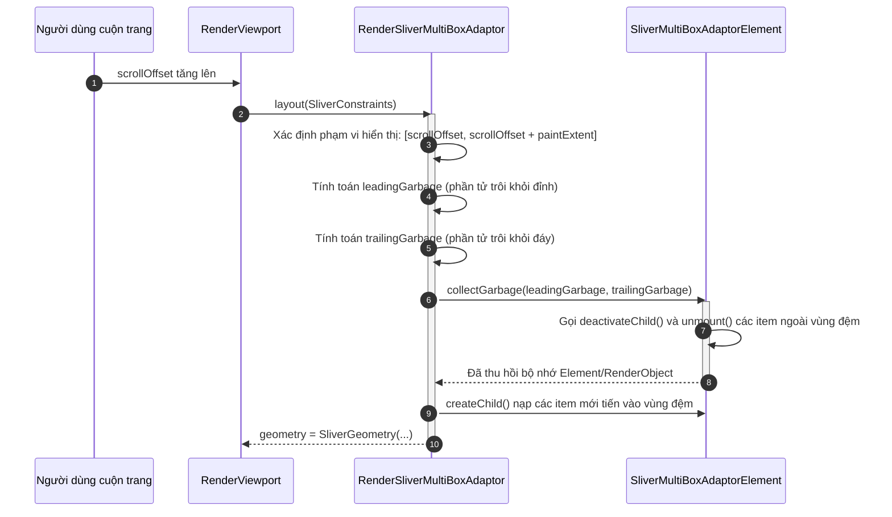

# Bài 4.5 — Scrollables & Virtualization: Sliver Protocol Architecture

## Phần 1 — Khái Niệm & Ràng Buộc Kiến Trúc (Architecture & Design Philosophy)

### 1.1 — Nghịch lý không gian và Bản chất của Virtualization

Trong thiết kế giao diện ứng dụng, lập trình viên thường xuyên phải xử lý các tập dữ liệu có quy mô rất lớn hoặc không giới hạn kích thước (vô hạn phần tử $N \to \infty$, ví dụ như bảng tin mạng xã hội, danh mục sản phẩm). Trong khi đó, không gian hiển thị của màn hình vật lý (**Viewport**) luôn luôn hữu hạn và cố định tại một thời điểm.

Nếu áp dụng mô hình bố cục hộp thông thường (`SingleChildScrollView` bọc `Column` chứa 1.000 phần tử):
- Cả 1.000 widget con đều được nạp (inflate) thành 1.000 `Element` trên Element Tree.
- 1.000 `RenderObject` được tạo ra trong bộ nhớ Heap, thực thi toàn bộ quy trình layout và giữ các bản ghi Paint.
- Hậu quả: Tiêu tốn hàng trăm megabyte RAM, gây áp lực nghẽn bộ thu gom rác (Garbage Collector Thrashing) và tụt khung hình nghiêm trọng (Jank).

Flutter giải quyết nghịch lý này bằng kiến trúc **Ảo hóa phần tử (Virtualization)**:
- Framework chỉ khởi tạo, giữ trong bộ nhớ và kết xuất các phần tử đang nằm trong **Viewport** (vùng mắt người dùng nhìn thấy) cộng thêm một **Vùng đệm dự phòng (Cache Extent)**.
- Khi một phần tử bị cuộn trôi ra ngoài vùng đệm, `RenderObject` và `Element` của nó sẽ lập tức bị thu hồi hoặc hủy bỏ để tái phân bổ bộ nhớ.

---

### 1.2 — Sự đối lập kiến trúc giữa 2D Box Protocol và 1D Sliver Protocol

Để hỗ trợ khả năng ảo hóa cuộn mượt mà ở tần số 120 FPS, Flutter tách biệt hoàn toàn hai giao thức bố cục trên Render Tree:

```
┌────────────────────────────────────────────────────────────────────────┐
│ 2D BOX PROTOCOL (Áp dụng cho Layout thông thường: Container, Row, v.v.)│
│   • Ràng buộc: BoxConstraints (minW, maxW, minH, maxH)                 │
│   • Kết quả:   Size(width, height)                                     │
│   • Bản chất:  Không gian tĩnh 2 chiều trực giao (Cartesian 2D)        │
└────────────────────────────────────────────────────────────────────────┘
                                   │
                    Chuyển đổi qua │ RenderViewport
                                   ▼
┌────────────────────────────────────────────────────────────────────────┐
│ 1D SLIVER PROTOCOL (Áp dụng cho Cuộn & Ảo hóa: SliverList, Grid, v.v.) │
│   • Ràng buộc: SliverConstraints (scrollOffset, remainingPaintExtent...)│
│   • Kết quả:   SliverGeometry (scrollExtent, paintExtent, layoutExtent)│
│   • Bản chất:  Không gian động 1 chiều dọc theo trục cuộn (Scroll Axis)│
└────────────────────────────────────────────────────────────────────────┘
```

---

## Phần 2 — Cơ Chế Hoạt Động & Mã Nguồn Đối Chiếu (Under the Hood / Deep-Dive)

### 2.1 — Cấu trúc dữ liệu `SliverConstraints`

Khác với `BoxConstraints` chỉ gồm 4 giá trị số thực, `SliverConstraints` (trong `packages/flutter/lib/src/rendering/sliver.dart`) mô tả trạng thái động phức tạp của cửa sổ cuộn:

```dart
class SliverConstraints extends Constraints {
  final AxisDirection axisDirection;         // Hướng cuộn (down, up, right, left)
  final GrowthDirection growthDirection;     // Hướng mở rộng nội dung (forward, reverse)
  final ScrollDirection userScrollDirection; // Hướng ngón tay người dùng đang vuốt
  final double scrollOffset;                 // Khoảng cách từ đầu Sliver đến đỉnh Viewport
  final double predecessorScrollOffset;      // Tổng scroll offset của các sliver phía trước
  final double remainingPaintExtent;         // Khoảng trống khả dụng còn lại trên Viewport để vẽ
  final double crossAxisExtent;              // Kích thước của Viewport trên trục phụ
  final double viewportMainAxisExtent;       // Tổng chiều dài của toàn bộ Viewport trên trục chính
  final double cacheOrigin;                  // Điểm bắt đầu của vùng đệm ảo hóa
  final double cacheExtent;                  // Độ dài của vùng đệm ảo hóa (mặc định 250px)
  // ...
}
```

---

### 2.2 — Cấu trúc dữ liệu `SliverGeometry`

Mỗi `RenderSliver` khi nhận `SliverConstraints` sẽ thực thi phương thức `performLayout()` và gán kết quả vào thuộc tính `geometry` kiểu `SliverGeometry`:

```dart
class SliverGeometry extends Diagnosticable {
  final double scrollExtent;        // Tổng chiều dài ảo của toàn bộ nội dung mà sliver quản lý
  final double paintExtent;         // Kích thước thực tế mà sliver chiếm dụng trên màn hình hiện tại
  final double layoutExtent;        // Khoảng cách sliver này chiếm để đẩy sliver tiếp theo lùi xuống
  final double maxPaintExtent;     // Kích thước tối đa sliver có thể vẽ khi chưa bị cuộn
  final double hitTestExtent;      // Vùng mà sliver có thể nhận tương tác chạm
  final bool visible;              // Cờ đánh dấu sliver có đang hiển thị hay không
  final bool hasVisualOverflow;    // Cờ đánh dấu sliver có nội dung vẽ tràn cần clip hay không
  // ...
}
```

#### Phân biệt bản chất giữa `paintExtent` và `layoutExtent`:
- `paintExtent`: Là diện tích pixel thực tế mà `Sliver` sẽ vẽ lên Canvas của khung hình hiện tại. Luôn thỏa mãn:
  $$0.0 \le \text{paintExtent} \le \text{remainingPaintExtent}$$
- `layoutExtent`: Là khoảng cách mà `Sliver` tiêu tốn trên trục cuộn để **đẩy các Sliver phía sau nó đi xuống**. 
- *Hiện tượng bất đối xứng:* Trong trường hợp `SliverAppBar(pinned: true)` bị cuộn lên đỉnh màn hình, thanh toolbar vẫn được ghim lại để vẽ ($\text{paintExtent} = 56.0$), nhưng nó không còn đẩy nội dung danh sách bên dưới lùi xuống nữa ($\text{layoutExtent} = 0.0$).

---

### 2.3 — Cầu nối chuyển đổi giao thức của `RenderViewport`

`RenderViewport` là RenderObject đặc biệt đóng vai trò **cầu nối (Bridge)** giữa hai thế giới Box và Sliver:
1. `RenderViewport` kế thừa từ `RenderBox`: Phía trên nó giao tiếp với các widget cha (như `Scaffold.body` hoặc `Expanded`) bằng **Box Protocol**. Nó nhận `BoxConstraints` và trả về `Size`.
2. Phía dưới, `RenderViewport` quản lý danh sách con là các `RenderSliver`:
   - Nó đọc `BoxConstraints` từ cha để tính toán `viewportMainAxisExtent` và `crossAxisExtent`.
   - Nó khởi tạo `SliverConstraints` và lần lượt gọi `layout()` trên từng `RenderSliver` con.
   - Khi một `RenderSliver` báo cáo `SliverGeometry`, `RenderViewport` trừ dần `layoutExtent` vào quỹ không gian để truyền `remainingPaintExtent` còn lại cho `RenderSliver` tiếp theo.

---

### 2.4 — Thuật toán thu gom rác (Garbage Collection) trong `RenderSliverMultiBoxAdaptor`

Các danh sách ảo hóa như `ListView.builder` và `GridView.builder` được điều khiển bởi cặp đôi:
- Widget / Element: `SliverMultiBoxAdaptorWidget` và `SliverMultiBoxAdaptorElement`.
- RenderObject: `RenderSliverMultiBoxAdaptor`.



#### Vòng đời 4 trạng thái của một phần tử danh sách:
1. **Uncreated (Chưa tồn tại):** Item chỉ tồn tại dưới dạng chỉ số index trong `itemBuilder`. Chưa có Widget, Element hay RenderObject nào được cấp phát trên bộ nhớ Heap.
2. **Cached (Vùng đệm tiền nạp):** Item nằm trong phạm vi `cacheExtent` (mặc định trước và sau màn hình $250px$). Item đã được tạo Widget, Element và thực thi Layout, nhưng **chưa được Paint** lên màn hình.
3. **Active (Vùng hiển thị):** Item nằm hoàn toàn trong Viewport. Item tham gia đầy đủ vào cả Layout Pass và Paint Pass.
4. **Garbage Collected (Thu hồi):** Khi người dùng cuộn item vượt quá khoảng cách $250px$ so với mép màn hình, `collectGarbage()` kích hoạt, thu hồi Element và RenderObject của nó về bộ nhớ rác.

---

## Phần 3 — Hướng Dẫn Thực Hành Chuẩn (Production-Ready Implementations)

### 3.1 — Kiến trúc Parallax Collapsible Header với `CustomScrollView`

Triển khai cấu trúc màn hình chi tiết chuyên nghiệp kết hợp giữa Pinned Header, Floating App Bar và Danh sách ảo hóa hiệu năng cao:

```dart
import 'package:flutter/material.dart';

class ParallaxProfileScreen extends StatelessWidget {
  const ParallaxProfileScreen({super.key});

  @override
  Widget build(BuildContext context) {
    return Scaffold(
      body: CustomScrollView(
        physics: const BouncingScrollPhysics(
          parent: AlwaysScrollableScrollPhysics(),
        ),
        slivers: [
          // 1. SliverAppBar co giãn với hiệu ứng Parallax
          SliverAppBar(
            expandedHeight: 240.0,
            floating: false,
            pinned: true, // Ghim toolbar trên đỉnh khi cuộn
            stretch: true, // Hỗ trợ hiệu ứng kéo giãn overscroll
            flexibleSpace: FlexibleSpaceBar(
              title: const Text('Thông Tin Tài Khoản'),
              centerTitle: true,
              background: Image.network(
                'https://picsum.photos/800/600',
                fit: BoxFit.cover,
              ),
              stretchModes: const [
                StretchMode.zoomBackground,
                StretchMode.blurBackground,
              ],
            ),
          ),

          // 2. Tiêu đề mục đính kèm (Pinned Section Header)
          SliverPersistentHeader(
            pinned: true,
            delegate: _SectionHeaderDelegate(
              title: 'Danh sách giao dịch gần đây',
              height: 48.0,
            ),
          ),

          // 3. Danh sách ảo hóa Lazy-Loading
          SliverList.builder(
            itemCount: 500,
            itemBuilder: (BuildContext context, int index) {
              return ListTile(
                leading: CircleAvatar(child: Text('$index')),
                title: Text('Mã giao dịch #$index'),
                subtitle: const Text('Thành công • 12/08/2026'),
                trailing: const Text(
                  '+ 150.000 đ',
                  style: TextStyle(color: Colors.green, fontWeight: FontWeight.bold),
                ),
              );
            },
          ),
        ],
      ),
    );
  }
}

class _SectionHeaderDelegate extends SliverPersistentHeaderDelegate {
  final String title;
  final double height;

  _SectionHeaderDelegate({required this.title, required this.height});

  @override
  double get minExtent => height;

  @override
  double get maxExtent => height;

  @override
  Widget build(BuildContext context, double shrinkOffset, bool overlapsContent) {
    return Container(
      height: height,
      color: Theme.of(context).colorScheme.surfaceVariant,
      padding: const EdgeInsets.symmetric(horizontal: 16.0),
      alignment: Alignment.centerLeft,
      child: Text(
        title,
        style: Theme.of(context).textTheme.titleSmall?.copyWith(fontWeight: FontWeight.bold),
      ),
    );
  }

  @override
  bool shouldRebuild(covariant _SectionHeaderDelegate oldDelegate) {
    return oldDelegate.title != title || oldDelegate.height != height;
  }
}
```

---

### 3.2 — Kỹ thuật kiểm soát Infinite Scrolling với `ScrollController`

```dart
import 'package:flutter/material.dart';

class InfinitePaginationView extends StatefulWidget {
  const InfinitePaginationView({super.key});

  @override
  State<InfinitePaginationView> createState() => _InfinitePaginationViewState();
}

class _InfinitePaginationViewState extends State<InfinitePaginationView> {
  final ScrollController _scrollController = ScrollController();
  final List<String> _items = List.generate(20, (i) => 'Dữ liệu #$i');
  bool _isLoading = false;

  @override
  void initState() {
    super.initState();
    _scrollController.addListener(_onScroll);
  }

  void _onScroll() {
    // Kích hoạt nạp thêm khi người dùng cuộn tới 80% chiều dài danh sách
    final double maxScroll = _scrollController.position.maxScrollExtent;
    final double currentScroll = _scrollController.position.pixels;
    
    if (currentScroll >= (maxScroll * 0.8) && !_isLoading) {
      _loadMoreData();
    }
  }

  Future<void> _loadMoreData() async {
    setState(() => _isLoading = true);
    await Future.delayed(const Duration(seconds: 1)); // Giả lập Network API
    setState(() {
      _items.addAll(List.generate(20, (i) => 'Dữ liệu nạp thêm #${_items.length + i}'));
      _isLoading = false;
    });
  }

  @override
  void dispose() {
    _scrollController.dispose();
    super.dispose();
  }

  @override
  Widget build(BuildContext context) {
    return ListView.builder(
      controller: _scrollController,
      itemCount: _items.length + (_isLoading ? 1 : 0),
      itemBuilder: (context, index) {
        if (index == _items.length) {
          return const Center(
            child: Padding(
              padding: EdgeInsets.all(16.0),
              child: CircularProgressIndicator(),
            ),
          );
        }
        return ListTile(title: Text(_items[index]));
      },
    );
  }
}
```

---

## Phần 4 — Lỗi Thường Gặp & Giải Pháp Khắc Phục (Anti-Patterns & Pitfalls)

### 4.1 — Lạm dụng `shrinkWrap: true` trên danh sách dữ liệu lớn

#### Mô tả lỗi:
Lập trình viên bật `shrinkWrap: true` để giải quyết lỗi tràn `Column` khi đặt `ListView` bên trong:

```dart
// NGUY HIỂM VỀ HIỆU NĂNG
ListView.builder(
  shrinkWrap: true, // VÔ HIỆU HÓA TÍNH NĂNG ẢO HÓA
  physics: const NeverScrollableScrollPhysics(),
  itemCount: 1000,
  itemBuilder: (context, i) => ProductItem(i),
)
```

#### Nguyên nhân kỹ thuật:
Khi `shrinkWrap: true`, `RenderViewport` buộc phải tính toán chính xác tổng chiều cao thực tế của toàn bộ 1.000 phần tử để báo cáo một `Size` hữu hạn cho `Column`. Để đo được tổng chiều cao này, framework buộc phải **khởi tạo và layout toàn bộ 1.000 phần tử ngay trong một khung hình duy nhất**. 
Toàn bộ cơ chế Virtualization và Garbage Collection bị vô hiệu hóa hoàn toàn, làm ứng dụng bị đơ giật nghiêm trọng.

#### Giải pháp:
Không bao giờ dùng `shrinkWrap: true` cho danh sách không xác định số lượng hoặc vượt quá 20 phần tử. Bọc `ListView` trong `Expanded`, hoặc chuyển đổi sang `CustomScrollView` với `SliverList`.

---

### 4.2 — Lồng `ListView` bên trong `ListView` gây xung đột Gesture Arena

#### Mô tả lỗi:
Cử chỉ vuốt của người dùng bị giật hoặc danh sách bên trong bị nuốt mất cử chỉ cuộn của danh sách bên ngoài.

#### Giải pháp:
Chỉ định rõ ràng `physics: const ClampingScrollPhysics()` hoặc `NeverScrollableScrollPhysics()` cho danh sách con, hoặc sử dụng `NestedScrollView` để điều phối đồng thời cả Outer Scroll Controller và Inner Scroll Controller.

---

## Phần 5 — Câu Hỏi Kiểm Tra Kiến Thức Chuyên Sâu & Bài Tập Phân Tích Mã Nguồn (Technical Assessment & Code Tracing)

### 5.1 — Câu hỏi khảo sát kiến trúc

#### Câu 1: Tương tác giữa `AutomaticKeepAliveClientMixin` và Garbage Collection
*Đề bài:* Khi một phần tử trong `ListView.builder` cuộn ra ngoài Viewport và ra ngoài cả vùng `cacheExtent`, làm thế nào `AutomaticKeepAliveClientMixin` có thể ngăn chặn Element của nó bị hủy bỏ mà không làm phá vỡ thuật toán layout của `RenderSliverMultiBoxAdaptor`?

*Phân tích kỹ thuật:*
1. Khi State kích hoạt `wantKeepAlive = true`, nó gửi một `KeepAliveNotification` lên cây.
2. `SliverMultiBoxAdaptorElement` bắt giữ notification và cấp phát một `KeepAliveHandle`.
3. Trong phương thức `collectGarbage()`, `RenderSliverMultiBoxAdaptor` kiểm tra danh sách con: Nếu node con có gắn cờ KeepAlive, thay vì gọi `unmount()`, framework chuyển RenderObject của nó vào danh sách `_keepAliveBucket`.
4. RenderObject này được tách khỏi Render Tree hiển thị (không tham gia vào Paint Pass và Hit-Testing), nhưng đối tượng `Element` và `State` (bao gồm vị trí cuộn dở hoặc text đang nhập) vẫn được lưu giữ an toàn trên bộ nhớ Heap.

---

#### Câu 2: Ý nghĩa của `predecessorScrollOffset` và tính toán ghim vị trí (Pinned Header)
*Đề bài:* Trong `SliverConstraints`, tham số `predecessorScrollOffset` có vai trò gì trong việc xác định thời điểm một `SliverPersistentHeader` bắt đầu ghim chặt lên đỉnh màn hình?

*Phân tích kỹ thuật:*
1. `predecessorScrollOffset` lưu trữ tổng độ dài `scrollExtent` của tất cả các `Sliver` nằm trước nó trên cây cuộn.
2. Nhờ tham số này, một Sliver ở vị trí thứ $k$ có thể biết chính xác khi nào nó chạm tới cạnh trên của Viewport bằng phép so sánh:
   $$\text{hasReachedTop} = (\text{scrollOffset} \ge 0)$$
3. Khi `pinned: true`, dù người dùng tiếp tục cuộn xuống, `Sliver` sẽ giữ nguyên vị trí vẽ bằng cách bù trừ `paintExtent` vào phần `scrollOffset` bị âm, tạo ra hiệu ứng cố định thanh tiêu đề trên đỉnh màn hình.

---

### 5.2 — Bài tập phân tích luồng thực thi (Code Tracing)

#### Đề bài:
Một `CustomScrollView` có chiều cao Viewport là **$600px$** (`viewportMainAxisExtent = 600.0`, `cacheExtent = 250.0`), chứa hai sliver liên tiếp:
1. `Sliver 1`: Một `SliverAppBar(pinned: true, expandedHeight: 200.0, toolbarHeight: 60.0)`.
2. `Sliver 2`: Một `SliverList` có 100 phần tử, mỗi phần tử cao cố định $50.0px$ (`scrollExtent = 5000.0`).

Giả sử người dùng cuộn danh sách xuống một khoảng **$120px$** (`scrollOffset = 120.0`).

Hãy tính toán chính xác:
1. Giá trị `SliverConstraints.scrollOffset` và `SliverGeometry.paintExtent` của `Sliver 1`.
2. Giá trị `SliverGeometry.layoutExtent` của `Sliver 1`.
3. Giá trị `SliverConstraints.remainingPaintExtent` mà `Sliver 2` nhận được từ `RenderViewport`.

---

#### Đáp án phân tích:

**1. Tính toán cho Sliver 1 (`SliverAppBar`):**
- Khi chưa cuộn, `Sliver 1` cao tối đa $200px$.
- Người dùng cuộn một đoạn $120px$ $\to$ Chiều cao co lại:
  $$\text{currentHeight} = \max(60.0, 200.0 - 120.0) = \max(60.0, 80.0) = 80.0px$$
- Do `Sliver 1` vẫn còn cao hơn `toolbarHeight` ($80px > 60px$), nó chưa rơi vào trạng thái ghim cố định.
- `SliverConstraints.scrollOffset` nhận được: **$120.0px$**.
- `SliverGeometry.paintExtent` báo cáo: **$80.0px$**.

**2. Tính toán `layoutExtent` của Sliver 1:**
- Vì chưa bị nén vượt quá `toolbarHeight`, lượng không gian mà `Sliver 1` chiếm dụng để đẩy `Sliver 2` lùi xuống bằng chính kích thước vẽ của nó:
  $$\text{layoutExtent} = \mathbf{80.0px}$$

**3. Tính toán ràng buộc cho Sliver 2 (`SliverList`):**
- `RenderViewport` có tổng không gian là $600px$.
- Sau khi `Sliver 1` chiếm $80px$ `layoutExtent`, lượng không gian còn lại khả dụng trên Viewport để vẽ `Sliver 2`:
  $$\text{remainingPaintExtent}_2 = 600.0px - 80.0px = \mathbf{520.0px}$$
- `Sliver 2` nhận `SliverConstraints` với `remainingPaintExtent = 520.0px` và bắt đầu bố trí các phần tử con của nó để lấp đầy không gian $520px$ này (tương đương với khoảng 11 phần tử hiển thị trực tiếp).
