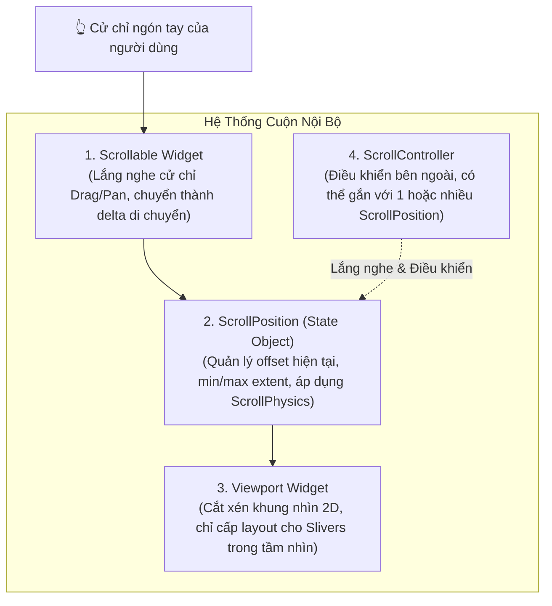

# Chuyên Đề 04 - Bài 01: Kiến Trúc Cuộn, ScrollController, NotificationListener & ScrollPhysics

> **Trọng tâm**: 4 trụ cột kiến trúc cuộn trong Flutter (`Scrollable`, `Viewport`, `ScrollPosition`, `ScrollController`), Xử lý an toàn với `hasClients`, Đối chiếu `ScrollController.addListener` vs `NotificationListener<ScrollNotification>`, Cơ chế kết hợp vật lý cuộn với `ScrollPhysics.applyTo()`, và bộ câu hỏi thẩm định năng lực kỹ thuật chuyên sâu.

---

## 1. Bốn Trụ Cột Kiến Trúc Của Hệ Thống Cuộn Flutter

Hệ thống cuộn trong Flutter được tách biệt rất rõ ràng theo nguyên lý Đơn nhiệm (Single Responsibility Principle):



### Chi tiết chức năng từng trụ cột:
1. **`Scrollable`**: Là một widget quản lý cử chỉ (`RawGestureDetector`). Nhiệm vụ của nó là lắng nghe các sự kiện kéo vuốt của ngón tay hoặc con lăn chuột và chuyển đổi chúng thành các bước dịch chuyển (scroll delta).
2. **`ScrollPosition`**: Đối tượng lưu trữ trạng thái thực tế của vị trí cuộn: tọa độ pixel hiện tại (`pixels`), giới hạn tối thiểu/tối đa (`minScrollExtent`, `maxScrollExtent`), và thực thi thuật toán giảm tốc quán tính thông qua `ScrollPhysics`.
3. **`Viewport`**: Nhận ràng buộc không gian và vị trí cuộn từ `ScrollPosition`, sau đó chỉ định vị trí và cấp phát layout cho các `RenderSliver` nằm trong phạm vi hiển thị.
4. **`ScrollController`**: Cầu nối đối ngoại cho phép code ứng dụng tương tác với `ScrollPosition`. Lưu ý quan trọng: Một `ScrollController` lưu trữ một danh sách `positions` (dạng mảng), nghĩa là **một controller có thể đồng bộ vị trí cuộn cho nhiều danh sách cùng một lúc**!

---

## 2. Làm Chủ `ScrollController` & Cạm Bẫy `hasClients`

### Code thực chiến: Back-to-Top, Infinite Pagination & Safe Disposal

```dart
class ProductFeedScreen extends StatefulWidget {
  const ProductFeedScreen({super.key});

  @override
  State<ProductFeedScreen> createState() => _ProductFeedScreenState();
}

class _ProductFeedScreenState extends State<ProductFeedScreen> {
  late final ScrollController _scrollController;
  bool _showBackToTop = false;
  bool _isLoadingMore = false;

  @override
  void initState() {
    super.initState();
    _scrollController = ScrollController();
    _scrollController.addListener(_onScrollChanged);
  }

  void _onScrollChanged() {
    // ⚠️ QUY TẮC SỐNG CÒN: Luôn kiểm tra hasClients trước khi đọc offset!
    if (!_scrollController.hasClients) return;

    final currentOffset = _scrollController.offset;
    final maxExtent = _scrollController.position.maxScrollExtent;

    // 1. Kiểm soát nút Back-to-Top (Cuộn quá 300px thì hiện)
    if (currentOffset >= 300 && !_showBackToTop) {
      setState(() => _showBackToTop = true);
    } else if (currentOffset < 300 && _showBackToTop) {
      setState(() => _showBackToTop = false);
    }

    // 2. Logic Infinite Pagination: Kích hoạt khi cách đáy danh sách 200px
    if (currentOffset >= maxExtent - 200 && !_isLoadingMore) {
      _loadMoreProducts();
    }
  }

  Future<void> _loadMoreProducts() async {
    setState(() => _isLoadingMore = true);
    // Giả lập gọi API nạp trang tiếp theo...
    await Future.delayed(const Duration(seconds: 1));
    if (mounted) {
      setState(() => _isLoadingMore = false);
    }
  }

  void _scrollToTop() {
    if (_scrollController.hasClients) {
      _scrollController.animateTo(
        0.0,
        duration: const Duration(milliseconds: 500),
        curve: Curves.easeOutCubic,
      );
    }
  }

  @override
  void dispose() {
    // ⚠️ Hủy listener và dispose controller để tránh Memory Leak
    _scrollController.removeListener(_onScrollChanged);
    _scrollController.dispose();
    super.dispose();
  }

  @override
  Widget build(BuildContext context) {
    return Scaffold(
      appBar: AppBar(title: const Text('Danh Sách Sản Phẩm')),
      body: ListView.builder(
        controller: _scrollController,
        itemCount: 40,
        itemBuilder: (context, index) => ListTile(title: Text('Sản phẩm #$index')),
      ),
      floatingActionButton: _showBackToTop
          ? FloatingActionButton(
              onPressed: _scrollToTop,
              child: const Icon(Icons.arrow_upward),
            )
          : null,
    );
  }
}
```

---

## 3. Đối Chiếu: `ScrollController.addListener` vs `NotificationListener<ScrollNotification>`

| Tiêu Chí Đánh Giá | `ScrollController.addListener()` | `NotificationListener<ScrollNotification>` |
| :--- | :--- | :--- |
| **Bản chất kỹ thuật** | Lắng nghe trực tiếp từ đối tượng `ChangeNotifier` của `ScrollPosition`. | Sử dụng cơ chế **Notification Bubbling** (sự kiện nổi bọt ngược lên cây widget). |
| **Phụ thuộc đối tượng** | Buộc phải khởi tạo và truyền instance của `ScrollController` qua lại. | **Không cần tham chiếu đến ScrollController**. Bọc ở bất kỳ đâu trên cây cũng bắt được. |
| **Tránh Rebuild thừa** | Thường phải kết hợp với `setState()` hoặc `ValueNotifier`. | Rất lý tưởng khi kết hợp với `ValueNotifier` cục bộ để cập nhật thanh tiến trình cuộn mà **không rebuild danh sách**. |
| **Phân loại sự kiện** | Chỉ biết vị trí thay đổi (offset chung chung). | Phân biệt rõ ràng: Bắt đầu cuộn (`ScrollStart`), đang cuộn (`ScrollUpdate`), kết thúc cuộn (`ScrollEnd`), người dùng chạm tay (`UserScroll`). |

### Ứng dụng: Thanh Tiến Trình Đọc Bài Viết (Reading Progress Bar) Không Gây Rebuild

```dart
class ReadingProgressScreen extends StatelessWidget {
  const ReadingProgressScreen({super.key});

  @override
  Widget build(BuildContext context) {
    final progressNotifier = ValueNotifier<double>(0.0);

    return Scaffold(
      appBar: AppBar(
        title: const Text('Báo Mới'),
        bottom: PreferredSize(
          preferredSize: const Size.fromHeight(4),
          // ✅ Chỉ rebuild thanh tiến trình 4px siêu nhẹ, danh sách 10,000 từ bên dưới KHÔNG bị ảnh hưởng!
          child: ValueListenableBuilder<double>(
            valueListenable: progressNotifier,
            builder: (context, progress, _) => LinearProgressIndicator(
              value: progress,
              backgroundColor: Colors.transparent,
              valueColor: const AlwaysStoppedAnimation(Colors.orange),
            ),
          ),
        ),
      ),
      body: NotificationListener<ScrollNotification>(
        onNotification: (ScrollNotification notification) {
          if (notification.metrics.maxScrollExtent > 0) {
            // Tính toán tỷ lệ phần trăm đã đọc (0.0 -> 1.0)
            final percent = notification.metrics.pixels / 
                            notification.metrics.maxScrollExtent;
            progressNotifier.value = percent.clamp(0.0, 1.0);
          }
          return false; // Cho phép sự kiện tiếp tục nổi bọt lên các cha cao hơn
        },
        child: ListView.builder(
          itemCount: 100,
          itemBuilder: (context, index) => Padding(
            padding: const EdgeInsets.all(16.0),
            child: Text('Đoạn văn phân tích chuyên sâu số #$index...'),
          ),
        ),
      ),
    );
  }
}
```

---

## 4. Làm Chủ `ScrollPhysics` & Kỹ Thuật Kết Hợp Với `.applyTo()`

Flutter cung cấp các bộ mô phỏng vật lý có sẵn:
- **`ClampingScrollPhysics`**: Hành vi mặc định trên Android. Danh sách dừng khựng khi chạm biên, kèm hiệu ứng phát sáng mép (Glow/Stretch).
- **`BouncingScrollPhysics`**: Hành vi mặc định trên iOS. Danh sách có độ nảy đàn hồi (Over-scroll bounce) khi vuốt quá biên.
- **`NeverScrollableScrollPhysics`**: Khóa hoàn toàn cử chỉ cuộn của danh sách con.
- **`AlwaysScrollableScrollPhysics`**: Luôn cho phép vuốt ngay cả khi danh sách quá ngắn không phủ kín màn hình (bắt buộc khi dùng với `RefreshIndicator`).

### Kỹ thuật kết hợp Physics:
Bạn muốn danh sách trên Android vẫn có hiệu ứng kéo nảy đàn hồi như iOS, **đồng thời** vẫn phải luôn cuộn được dù chỉ có 1 item để kéo RefreshIndicator?  
👉 **Hãy dùng `applyTo()`**:

```dart
RefreshIndicator(
  onRefresh: () async => fetchData(),
  child: ListView.builder(
    // ✅ Kết hợp: Luôn cuộn được + Độ nảy đàn hồi kiểu iOS trên mọi nền tảng!
    physics: const AlwaysScrollableScrollPhysics(
      parent: BouncingScrollPhysics(),
    ),
    itemCount: 1, // Dù chỉ có 1 item vẫn kéo nảy để Refresh mượt mà!
    itemBuilder: (context, index) => const ListTile(title: Text('Duy nhất 1 item')),
  ),
)
```

---

## 🎯 Thẩm Định Năng Lực & Phân Tích Chuyên Sâu (Technical Competency & Deep Dive)

### Câu hỏi 1: Hãy phân tích 4 trụ cột kiến trúc của hệ thống cuộn trong Flutter (`Scrollable`, `Viewport`, `ScrollPosition`, `ScrollController`). Tại sao một `ScrollController` lại có thể gắn vào nhiều widget cuộn cùng lúc?

#### 🎯 Điểm Đánh Giá Benchmark 10/10:
1. **Phân tích 4 trụ cột**:
   - `Scrollable`: Là widget lắng nghe tương tác người dùng (`RawGestureDetector`), bắt các thao tác ngón tay kéo/vuốt và tính toán delta di chuyển.
   - `ScrollPosition`: Lưu giữ trạng thái động của vị trí cuộn (`pixels`, `minScrollExtent`, `maxScrollExtent`), tích hợp logic vật lý `ScrollPhysics` (tính quán tính và ma sát sau khi thả tay).
   - `Viewport`: Widget điều phối không gian 2D, nhận diện các Slivers nào đang nằm trong khung nhìn hiển thị để thực hiện layout và paint, cắt bỏ phần dư thừa.
   - `ScrollController`: Bộ điều khiển đối ngoại, cung cấp API cho lập trình viên (`jumpTo`, `animateTo`, `offset`).
2. **Khả năng gắn vào nhiều widget cuộn cùng lúc**:
   - Bên trong `ScrollController`, danh sách các vị trí cuộn được quản lý bằng một mảng `final List<ScrollPosition> _positions = <ScrollPosition>[]`.
   - Khi một `Scrollable` được build, nó gọi `controller.attach(position)`. Khi dispose, nó gọi `controller.detach(position)`.
   - Do đó, một controller có thể quản lý nhiều `ScrollPosition`.
   - **Lưu ý thực chiến**: Nếu một controller gắn vào nhiều hơn 1 scroll view, việc gọi `_scrollController.offset` hoặc `_scrollController.position` sẽ ném ngoại lệ `ScrollController attached to multiple scroll views`. Khi đó, nếu muốn đọc offset, bạn phải duyệt qua mảng `_scrollController.positions`.

---

### Câu hỏi 2: Khi nào nên sử dụng `NotificationListener<ScrollNotification>` thay vì gọi `ScrollController.addListener()`? So sánh ưu nhược điểm về mặt kiến trúc và hiệu năng giữa 2 phương pháp.

#### 🎯 Điểm Đánh Giá Benchmark 10/10:
1. **Trường hợp nên dùng `NotificationListener`**:
   - Khi bạn muốn lắng nghe sự kiện cuộn từ một widget con ở xa (Decoupled Architecture) mà không muốn truyền `ScrollController` thủ công qua nhiều tầng widget (Prop Drilling).
   - Khi cần phân biệt chính xác các trạng thái động của quá trình cuộn: người dùng bắt đầu chạm tay (`ScrollStartNotification`), đang di chuyển ngón tay (`UserScrollNotification`), hay quán tính đang tự trôi (`ScrollUpdateNotification`).
   - Khi cần tối ưu hiệu năng: Bắt sự kiện cuộn để cập nhật thanh trạng thái đọc bài hoặc làm ẩn hiện AppBar mà không cần gọi `setState()` ở cấp độ toàn màn hình.
2. **So sánh ưu/nhược điểm**:
   - **`ScrollController`**:
     - *Ưu điểm*: Cho phép cả **đọc (read)** và **ghi (write)** (có thể ra lệnh `animateTo` để cuộn ngược lại).
     - *Nhược điểm*: Đòi hỏi khởi tạo trong `StatefulWidget`, quản lý vòng đời `dispose()`, và dễ gây rebuild thừa toàn màn hình nếu kết hợp sai với `setState()`.
   - **`NotificationListener`**:
     - *Ưu điểm*: Hoàn toàn là cơ chế hướng sự kiện một chiều (Unidirectional Event Bubbling), dùng được trong cả `StatelessWidget`, không cần dọn dẹp bộ nhớ (no dispose needed), tính độc lập cao.
     - *Nhược điểm*: Chỉ là kênh **chỉ đọc (read-only)**, không thể ra lệnh ngược lại cho danh sách cuộn tới vị trí mong muốn.

---

### Câu hỏi 3: Tại sao việc gọi `_scrollController.offset` hoặc `_scrollController.animateTo()` bên trong phương thức `initState()` lại làm ứng dụng bị crash với ngoại lệ `ScrollController not attached to any scroll views`? Cách xử lý chuẩn xác là gì?

#### 🎯 Điểm Đánh Giá Benchmark 10/10:
1. **Nguyên nhân gốc rễ**:
   - Vòng đời `initState()` diễn ra khi đối tượng `State` vừa được tạo, cây Widget con bên trong hàm `build()` **chưa hề được thực thi**.
   - Widget cuộn (`ListView`, `SingleChildScrollView`) chỉ khởi tạo và gắn đối tượng `ScrollPosition` vào `ScrollController` thông qua phương thức `attach()` khi phương thức `build()` chạy và RenderObject tương ứng được đưa vào RenderTree.
   - Do đó, trong `initState()`, thuộc tính `_scrollController.hasClients` vẫn đang là `false`. Việc truy cập `.offset` kích hoạt assertion: `assert(_positions.isNotEmpty, 'ScrollController not attached to any scroll views.')`.
2. **Cách xử lý chuẩn xác**:
   - **Cách 1 (Sử dụng `WidgetsBinding.instance.addPostFrameCallback`)**: Trì hoãn việc gọi lệnh cuộn cho đến khi frame hình đầu tiên đã được dựng xong và RenderObject đã gắn kết hoàn tất:
     ```dart
     @override
     void initState() {
       super.initState();
       _scrollController = ScrollController();
       WidgetsBinding.instance.addPostFrameCallback((_) {
         if (_scrollController.hasClients) {
           _scrollController.jumpTo(150.0);
         }
       });
     }
     ```
   - **Cách 2 (Sử dụng tham số `initialScrollOffset`)**: Khởi tạo ngay từ đầu trong constructor của `ScrollController(initialScrollOffset: 150.0)`. Đây là cách sạch nhất vì nó gán vị trí cuộn ban đầu ngay trước cả frame đầu tiên, loại bỏ hoàn toàn hiện tượng nhấp nháy khung hình.
