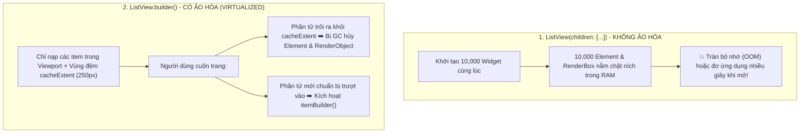

# Chuyên Đề 04 - Bài 02: Ảo Hóa Viewport Với ListView & GridView Chuyên Sâu

> **Trọng tâm**: Bản chất thuật toán ảo hóa khung nhìn (`RenderSliverList` & `SliverMultiBoxAdaptorElement`), Vai trò của vùng đệm `cacheExtent`, Bí mật tối ưu hóa $O(1)$ với `itemExtent`, `itemExtentBuilder` & `prototypeItem`, Giải mã 3 lá cờ hiệu năng (`addRepaintBoundaries`, `addAutomaticKeepAlives`, `addSemanticIndexes`), và bộ câu hỏi phỏng vấn tuyển dụng top tech.

---

## 1. Cơ Chế Ảo Hóa Khung Nhìn (Viewport Virtualization)

Hãy so sánh sự khác biệt bản chất giữa cách render ngây thơ và kiến trúc ảo hóa chuẩn Google:



### 1.1. `cacheExtent` Hoạt Động Như Thế Nào?
- Mặc định, `cacheExtent` có giá trị là **`250.0` logical pixels**.
- Nó tạo ra một vùng đệm (buffer) nằm **phía trước** và **phía sau** khung nhìn hiển thị thực tế của thiết bị:
  $$\text{Tổng vùng đệm kích hoạt} = \text{Chiều cao màn hình} + 2 \times \text{cacheExtent}$$
- Mục đích: Các item được build và layout trước khi người dùng kịp nhìn thấy, giúp thao tác vuốt nhanh không bị hiện tượng lộ khoảng trắng (blank canvas).
- Nếu danh sách của bạn chứa nhiều ảnh mạng nặng, việc tăng nhẹ `cacheExtent: 500` sẽ giúp trải nghiệm cuộn mượt hơn, nhưng đổi lại sẽ tiêu tốn thêm một phần RAM.

---

## 2. Bí Quyết Tối Ưu Tốc Độ Tuyệt Đối: `itemExtent` vs `prototypeItem`

### 2.1. Vấn đề khi không có `itemExtent`:
Mặc định, các item trong `ListView.builder` có chiều cao động. Để biết được toàn bộ danh sách dài bao nhiêu pixel và tính toán thanh cuộn, Flutter bắt buộc phải **đo đạc kích thước từng phần tử một khi chúng được cuộn tới**.  
$\rightarrow$ Hậu quả: Khi bạn ra lệnh nhảy đến phần tử thứ 5,000 (`jumpTo(5000 * height)`), Flutter không thể nhảy tức thì vì nó chưa từng đo lường các phần tử từ 0 đến 4,999!

### 2.2. Nhảy Vị Trí $O(1)$ Tức Thì Với `itemExtent`:
Nếu tất cả các item trong danh sách của bạn có chung một chiều cao cố định (ví dụ: `72.0px` cho mỗi dòng `ListTile`):

```dart
ListView.builder(
  itemCount: 10000,
  // ✅ TỐI ƯU CỰC ĐẠI: Flutter bỏ qua hoàn toàn bước layout đo đạc chiều cao!
  itemExtent: 72.0, 
  itemBuilder: (context, index) => ListTile(
    leading: const CircleAvatar(child: Icon(Icons.person)),
    title: Text('Người dùng số #$index'),
  ),
)
```

$$\text{Tọa độ item } i = i \times \text{itemExtent}$$

Với công thức toán học $O(1)$ này, Flutter tính toán vị trí cuộn và phân bổ viewport trong $0\text{ms}$, cho phép nhảy đến bất kỳ vị trí nào mà không bị giật lag!

### 2.3. Các Giải Pháp Thay Thế:
- **`prototypeItem`**: Nếu bạn không muốn hardcode con số `72.0` vì muốn chiều cao tự co giãn theo cỡ chữ hệ thống của người dùng, hãy dùng `prototypeItem`. Flutter sẽ chỉ đo đạc widget mẫu này **đúng 1 lần duy nhất**, rồi dùng kích thước đó áp dụng cho toàn bộ các item còn lại!
- **`itemExtentBuilder` (Flutter 3.16+)**: Dùng khi các item có chiều cao khác nhau nhưng bạn có thể tính toán trước bằng toán học dựa vào index mà không cần render thử (ví dụ: hàng chẵn cao 60px, hàng lẻ cao 90px).

```dart
ListView.builder(
  itemCount: 1000,
  // ✅ Đo mẫu 1 lần duy nhất, tái sử dụng kích thước cho toàn bộ danh sách:
  prototypeItem: const ListTile(
    leading: CircleAvatar(),
    title: Text('Prototype Item'),
  ),
  itemBuilder: (context, index) => ListTile(
    leading: const CircleAvatar(),
    title: Text('Item thực tế #$index'),
  ),
)
```

---

## 3. Giải Mã 3 Cờ Hiệu Năng Trong `ListView.builder`

Bên dưới `ListView.builder`, Flutter sử dụng `SliverChildBuilderDelegate`. Hàm dựng này có 3 cờ quan trọng mà 95% lập trình viên bỏ qua:

```dart
ListView.builder(
  addAutomaticKeepAlives: true,   // Mặc định: true
  addRepaintBoundaries: true,     // Mặc định: true
  addSemanticIndexes: true,       // Mặc định: true
  itemCount: items.length,
  itemBuilder: (context, index) => ItemWidget(items[index]),
)
```

| Cờ Cấu Hình | Bản Chất Chức Năng | Khi Nào Nên Tắt (`false`) Để Tối Ưu RAM/CPU? |
| :--- | :--- | :--- |
| **`addRepaintBoundaries`** | Tự động bọc mỗi item trong một `RepaintBoundary` để cô lập việc vẽ lại của từng dòng. | **Nên tắt khi**: Các item trong danh sách cực kỳ đơn giản (ví dụ chỉ có 1 dòng Text ngắn). Việc tạo hàng trăm layer `RepaintBoundary` không cần thiết sẽ làm tốn bộ nhớ GPU và chi phí quản lý RenderLayer! |
| **`addAutomaticKeepAlives`** | Tự động bọc mỗi item trong `AutomaticKeepAlive` để giữ trạng thái nếu item có dùng mixin. | **Nên tắt khi**: Danh sách thuần túy hiển thị dữ liệu tĩnh, không chứa ô nhập liệu TextField, checkbox hay widget nào cần giữ state. Giúp tiết kiệm việc tạo các Element bao bọc. |
| **`addSemanticIndexes`** | Đánh số thứ tự ngữ nghĩa để phục vụ công cụ đọc màn hình cho người khiếm thị (TalkBack / VoiceOver). | Giữ `true` để đảm bảo chuẩn tiếp cận Accessibility, trừ khi danh sách chỉ dùng làm hiệu ứng nền trang trí. |

---

## 4. Làm Chủ `GridView.builder` & Phân Biệt 2 Grid Delegates

Khi hiển thị bố cục dạng lưới, việc chia cột và tỷ lệ được điều khiển bởi `gridDelegate`:

### 4.1. `SliverGridDelegateWithFixedCrossAxisCount` (Cố Định Số Cột)
- Thích hợp khi bạn muốn khóa cứng số cột trên màn hình (ví dụ: luôn luôn là 2 cột trên điện thoại).

```dart
GridView.builder(
  itemCount: products.length,
  gridDelegate: const SliverGridDelegateWithFixedCrossAxisCount(
    crossAxisCount: 2,          // Luôn hiển thị đúng 2 cột
    mainAxisSpacing: 12.0,      // Khoảng cách dọc giữa các hàng
    crossAxisSpacing: 12.0,     // Khoảng cách ngang giữa các cột
    childAspectRatio: 0.7,      // Tỷ lệ = Chiều rộng / Chiều cao (Width / Height)
  ),
  itemBuilder: (context, i) => ProductCard(product: products[i]),
)
```

> [!CAUTION]
> **Hiểu đúng về `childAspectRatio`**:  
> `childAspectRatio = Width / Height`.  
> - Nếu `childAspectRatio = 1.0` $\rightarrow$ Item có hình vuông.  
> - Nếu `childAspectRatio > 1.0` $\rightarrow$ Item có chiều ngang rộng hơn chiều dọc (Hình chữ nhật nằm ngang).  
> - Nếu `childAspectRatio < 1.0` (VD: 0.7) $\rightarrow$ Item cao hơn rộng (Hình chữ nhật đứng, phổ biến cho thẻ sản phẩm thương mại điện tử).

### 4.2. `SliverGridDelegateWithMaxCrossAxisExtent` (Tự Thích Ứng Màn Hình Đa Thiết Bị)
- Đây là vũ khí thiết kế Responsive tuyệt đỉnh. Bạn không chỉ định số cột, mà bạn chỉ định **chiều rộng tối đa cho phép của mỗi item** (`maxCrossAxisExtent`):

```dart
GridView.builder(
  itemCount: products.length,
  gridDelegate: const SliverGridDelegateWithMaxCrossAxisExtent(
    maxCrossAxisExtent: 200.0,  // Mỗi thẻ sản phẩm rộng tối đa 200px
    mainAxisSpacing: 12.0,
    crossAxisSpacing: 12.0,
    childAspectRatio: 0.75,
  ),
  itemBuilder: (context, i) => ProductCard(product: products[i]),
)
```

- **Trên điện thoại nhỏ (rộng 360px)**: $360 / 200 = 1.8 \rightarrow$ Tự động chia làm **2 cột**.
- **Trên điện thoại to (rộng 430px)**: $430 / 200 = 2.15 \rightarrow$ Tự động chia làm **3 cột**.
- **Trên máy tính bảng (rộng 900px)**: $900 / 200 = 4.5 \rightarrow$ Tự động chia làm **5 cột**!

---

## 🎯 Góc Phỏng Vấn Tuyển Dụng (Google & Top Tech Interview Q&A)

### Câu hỏi 1: Hãy giải thích chi tiết cơ chế ảo hóa (Virtualization) của `ListView.builder`. `cacheExtent` đóng vai trò gì và điều gì xảy ra với các Element / RenderObject khi một item cuộn trôi hoàn toàn ra khỏi vùng đệm này?

#### 🎯 Điểm Đánh Giá Benchmark 10/10:
1. **Bản chất ảo hóa trong `RenderSliverList`**:
   - `ListView.builder` không tạo trước toàn bộ danh sách. Nó sử dụng `SliverMultiBoxAdaptorElement` kết hợp với `RenderSliverList`.
   - Trong quá trình layout, `RenderSliverList` tính toán khoảng không gian hiển thị của Viewport và chỉ yêu cầu hàm `itemBuilder(context, index)` sinh ra các widget nằm trong phạm vi hiển thị cộng thêm vùng đệm `cacheExtent`.
2. **Vai trò của `cacheExtent`**:
   - `cacheExtent` (mặc định 250px) là vùng đệm vô hình nằm ở cả hai đầu của Viewport.
   - Các item bước vào `cacheExtent` sẽ được khởi tạo trước về Element và RenderObject, layout và rasterize trước để đảm bảo khi người dùng cuộn ngón tay với tốc độ cao, khung hình không bao giờ bị lộ ra các vệt trắng chưa kịp vẽ.
3. **Vòng đời của Element/RenderObject khi trôi khỏi `cacheExtent`**:
   - Khi một item trôi ra khỏi `cacheExtent`, `RenderSliverList` sẽ gọi phương thức hủy bỏ (garbage collect) item đó.
   - Element tương ứng bị tách khỏi cây (unmounted) và đưa vào danh sách chờ hủy, RenderObject bị gỡ khỏi RenderTree để giải phóng bộ nhớ.
   - **Ngoại lệ duy nhất**: Nếu widget con đó có đăng ký giữ trạng thái (sử dụng `AutomaticKeepAliveClientMixin` với `wantKeepAlive = true`), Element và State của nó sẽ được giữ lại trong một danh sách riêng biệt mà không bị tiêu hủy, giúp giữ nguyên nội dung ô text hoặc vị trí cuộn con.

---

### Câu hỏi 2: Tại sao việc khai báo `itemExtent` lại giúp `ListView.builder` tăng tốc hiệu năng cuộn và nhảy cóc (`jumpTo`) gấp nhiều lần? Flutter làm thế nào để xác định vị trí của một item khi KHÔNG có `itemExtent`?

#### 🎯 Điểm Đánh Giá Benchmark 10/10:
1. **Khi KHÔNG có `itemExtent`**:
   - Các item có chiều cao không xác định (biến thiên theo nội dung).
   - Flutter buộc phải thực hiện đo lường động (Dynamic Layout) cho từng item theo thứ tự tuần tự từ đầu để cộng dồn chiều cao.
   - Khi gọi `controller.jumpTo(offset)` tới một vị trí rất xa, Flutter không thể tính toán ngay lập tức cần render từ index nào, mà nó phải ước lượng hoặc duyệt tuần tự qua các node để dò tìm vị trí offset tương ứng. Điều này gây tốn CPU và độ trễ khung hình rõ rệt.
2. **Khi CÓ `itemExtent`**:
   - Chiều cao mọi item là một hằng số $E$.
   - Khi người dùng cuộn đến offset $O$, Flutter sử dụng phép chia toán học nguyên tử với độ phức tạp $O(1)$:
     $$\text{First Index} = \lfloor \frac{O}{E} \rfloor$$
     $$\text{Target Position} = \text{index} \times E$$
   - Flutter bỏ qua hoàn toàn toàn bộ giai đoạn layout đo đạc chiều cao (`performLayout` không cần query intrinsic height của con). Quá trình tính toán offset, cập nhật thanh cuộn scrollbar và nhảy tới bất kỳ vị trí nào (dù là phần tử thứ 1,000,000) đều diễn ra tức thì trong $0\text{ms}$.

---

### Câu hỏi 3: Trong `ListView.builder`, các thuộc tính `addRepaintBoundaries` và `addAutomaticKeepAlives` có ý nghĩa gì? Trong tình huống thực tế nào bạn nên chủ động tắt (`false`) chúng đi để tối ưu hóa tài nguyên?

#### 🎯 Điểm Đánh Giá Benchmark 10/10:
1. **Ý nghĩa của `addRepaintBoundaries` (Mặc định: `true`)**:
   - Tự động bọc mỗi item được trả về từ `itemBuilder` bằng một widget `RepaintBoundary`.
   - Mục đích: Tạo ra một lớp vẽ riêng (separate display list / layer) cho từng dòng trong danh sách. Khi một dòng bị vẽ lại (ví dụ có hiệu ứng nhấp nháy hoặc loading), chỉ duy nhất dòng đó bị repaint trên GPU mà không làm repaint toàn bộ các dòng khác.
   - **Khi nào nên tắt (`false`)**: Khi danh sách chứa các item cực kỳ tĩnh và đơn giản (ví dụ: Danh bạ điện thoại chỉ có 1 dòng chữ và 1 icon cố định). Việc duy trì hàng trăm layer `RepaintBoundary` không cần thiết sẽ làm tiêu tốn đáng kể bộ nhớ đệm đồ họa (Layer Tree memory) của thiết bị.
2. **Ý nghĩa của `addAutomaticKeepAlives` (Mặc định: `true`)**:
   - Tự động bọc mỗi item bên trong widget `AutomaticKeepAlive`.
   - Mục đích: Lắng nghe thông điệp `KeepAliveNotification` từ các widget con (thường là các ô nhập liệu `TextField`, danh sách con, hoặc video player) để không tiêu hủy chúng khi cuộn khỏi Viewport.
   - **Khi nào nên tắt (`false`)**: Khi danh sách thuần túy là danh sách hiển thị chỉ đọc (Read-Only Data List) không có bất kỳ trạng thái tương tác nhập liệu nào. Tắt cờ này sẽ loại bỏ một tầng Element bao bọc trung gian cho mỗi item, giúp giảm thiểu chi phí khởi tạo và duyệt cây widget.
