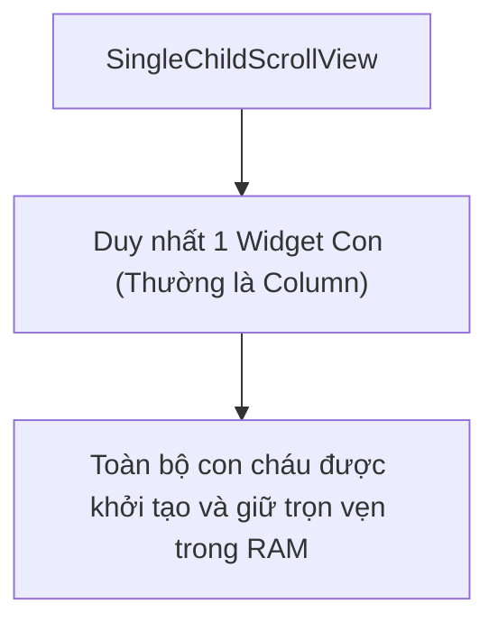
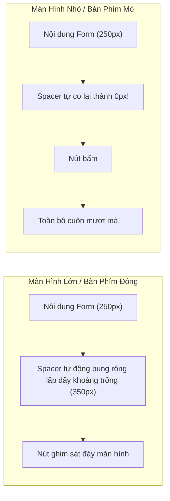

# Chuyên Đề 04 - Bài 03: SingleChildScrollView & Mẫu Thiết Kế Form Cuộn Toàn Trang

> **Trọng tâm**: Bản chất phi ảo hóa (Non-virtualized) của `SingleChildScrollView`, Giải mã toán học bộ ba quyền lực `LayoutBuilder` + `ConstrainedBox` + `IntrinsicHeight` để giải quyết bài toán "Ghim nút bấm đáy màn hình", Tự động cuộn ô input lên tầm nhìn với `Scrollable.ensureVisible()`, và bộ câu hỏi thẩm định năng lực kỹ thuật chuyên sâu.

---

## 1. Bản Chất Kiến Trúc Của `SingleChildScrollView`

Không giống như `ListView`, **`SingleChildScrollView` hoàn toàn không có cơ chế ảo hóa (No Virtualization)**:



> [!CAUTION]
> **Quy tắc phân định kiến trúc**:  
> - **NÊN DÙNG**: Các màn hình có số lượng widget hữu hạn và cố định (Màn hình Đăng ký/Đăng nhập, Cài đặt cá nhân, Chi tiết điều khoản dịch vụ, Form thanh toán).  
> - **TUYỆT ĐỐI TRÁNH**: Danh sách sản phẩm, tin tức, bảng tin mạng xã hội. Việc dùng `SingleChildScrollView(child: Column(children: 1000Item))` sẽ làm đơ giao diện nhiều giây và gây văng app do tràn RAM!

---

## 2. Bài Toán Kinh Điển: Form Ghim Nút Đáy Màn Hình

### Yêu cầu bài toán thực tế:
1. Khi nội dung Form ngắn trên màn hình lớn: Nút bấm "Xác Nhận Đặt Hàng" **phải tự động trôi sát mép đáy màn hình** (không lơ lửng ở giữa khoảng không).
2. Khi người dùng chạm vào ô nhập liệu: Bàn phím ảo trồi lên chiếm 300px $\rightarrow$ Toàn bộ màn hình **tự động trở thành một khung cuộn mượt mà**, người dùng có thể vuốt lên xuống để thấy nút bấm và tất cả các ô nhập liệu!



---

### Giải Mã Toán Học Bộ Ba Quyền Lực Chuẩn Google:

```dart
class StickyBottomCheckoutScreen extends StatefulWidget {
  const StickyBottomCheckoutScreen({super.key});

  @override
  State<StickyBottomCheckoutScreen> createState() => _StickyBottomCheckoutScreenState();
}

class _StickyBottomCheckoutScreenState extends State<StickyBottomCheckoutScreen> {
  final _phoneFieldKey = GlobalKey();

  void _scrollToPhoneField() {
    // Tự động cuộn ô số điện thoại vào giữa màn hình nếu bị che khuất
    Scrollable.ensureVisible(
      _phoneFieldKey.currentContext!,
      duration: const Duration(milliseconds: 400),
      alignment: 0.5, // 0.0: mép trên, 0.5: chính giữa màn hình, 1.0: mép dưới
    );
  }

  @override
  Widget build(BuildContext context) {
    return Scaffold(
      appBar: AppBar(title: const Text('Thanh Toán Đơn Hàng')),
      body: SafeArea(
        // Bước 1: Dùng LayoutBuilder để lấy kích thước chiều cao khả dụng của Viewport (H_viewport)
        child: LayoutBuilder(
          builder: (context, viewportConstraints) {
            return SingleChildScrollView(
              // Tự động ẩn bàn phím khi người dùng vuốt màn hình
              keyboardDismissBehavior: ScrollViewKeyboardDismissBehavior.onDrag,
              child: ConstrainedBox(
                // Bước 2: Ép chiều cao tối thiểu của nội dung phải bằng đúng H_viewport
                constraints: BoxConstraints(
                  minHeight: viewportConstraints.maxHeight,
                ),
                // Bước 3: IntrinsicHeight ép Column tính toán chiều cao tự nhiên
                // giúp Spacer biết chính xác kích thước còn dư để bung ra!
                child: IntrinsicHeight(
                  child: Padding(
                    padding: const EdgeInsets.all(24.0),
                    child: Column(
                      crossAxisAlignment: CrossAxisAlignment.stretch,
                      children: [
                        const Text(
                          'Thông Tin Giao Hàng',
                          style: TextStyle(fontSize: 22, fontWeight: FontWeight.bold),
                        ),
                        const SizedBox(height: 16),
                        const TextField(decoration: InputDecoration(labelText: 'Họ và tên')),
                        const SizedBox(height: 16),
                        const TextField(decoration: InputDecoration(labelText: 'Địa chỉ nhà')),
                        const SizedBox(height: 16),
                        TextField(
                          key: _phoneFieldKey,
                          onTap: _scrollToPhoneField,
                          keyboardType: TextInputType.phone,
                          decoration: const InputDecoration(labelText: 'Số điện thoại'),
                        ),

                        // 🌟 Spacer ma thuật:
                        // Chiều cao Spacer = max(0, H_viewport - Tổng chiều cao các widget khác)
                        const Spacer(),
                        const SizedBox(height: 24),

                        ElevatedButton(
                          style: ElevatedButton.styleFrom(
                            minimumSize: const Size.fromHeight(50),
                            backgroundColor: Colors.blueAccent,
                          ),
                          onPressed: () {},
                          child: const Text(
                            'HOÀN TẤT ĐẶT HÀNG',
                            style: TextStyle(color: Colors.white, fontWeight: FontWeight.bold),
                          ),
                        ),
                      ],
                    ),
                  ),
                ),
              ),
            );
          },
        ),
      ),
    );
  }
}
```

---

## 3. Các Tính Năng Trải Nghiệm Người Dùng (UX) Đỉnh Cao

### 3.1. Tự Động Cuộn Ô Nhập Liệu Lên Tầm Nhìn (`Scrollable.ensureVisible`)
Khi bàn phím trồi lên, ô nhập liệu ở dưới cùng thường bị che khuất mất một nửa hoặc vừa khít mép bàn phím gây khó nhìn.  
Bằng cách gán một `GlobalKey` vào ô nhập liệu và gọi:

```dart
Scrollable.ensureVisible(
  fieldKey.currentContext!,
  duration: const Duration(milliseconds: 300),
  curve: Curves.easeInOut,
  alignment: 0.5, // Căn chính giữa tầm nhìn của người dùng!
);
```
Flutter sẽ tự động tính toán khoảng cách chênh lệch và cuộn trang đưa ô nhập liệu vào đúng vị trí vàng trên màn hình!

### 3.2. Vuốt Để Ẩn Bàn Phím (`keyboardDismissBehavior`)
Người dùng trên iOS và Android hiện đại luôn có thói quen vuốt nhẹ ngón tay để đóng bàn phím:
```dart
SingleChildScrollView(
  keyboardDismissBehavior: ScrollViewKeyboardDismissBehavior.onDrag,
  // ...
)
```

---

## 🎯 Thẩm Định Năng Lực & Phân Tích Chuyên Sâu (Technical Competency & Deep Dive)

### Câu hỏi 1: Tại sao việc đặt `Column` chứa `Spacer()` hoặc `Expanded()` trực tiếp bên trong `SingleChildScrollView` lại làm sập ứng dụng với màn hình đỏ? Hãy phân tích chi tiết cơ chế khắc phục bằng bộ ba `LayoutBuilder` + `ConstrainedBox` + `IntrinsicHeight`.

#### 🎯 Điểm Đánh Giá Benchmark 10/10:
1. **Bản chất lỗi Crash**:
   - `SingleChildScrollView` cung cấp cho widget con một ràng buộc không giới hạn chiều cao: `BoxConstraints(minHeight: 0, maxHeight: double.infinity)`.
   - `Column` khi nhận ràng buộc này sẽ có chiều cao tối đa là vô cực.
   - Khi gặp `Spacer` (hoặc `Expanded`), widget này đòi hỏi: "Hãy chia cho tôi toàn bộ phần không gian còn dư của cha". Nhưng phần còn dư của vô cực là $\infty$. Phép tính $\infty \times 1 = \infty$ không thể xác định được số pixel cụ thể để rasterize trên màn hình, dẫn đến ngoại lệ `RenderFlex children have non-zero flex but incoming height constraints are unbounded`.
2. **Cơ chế khắc phục của bộ ba**:
   - **`LayoutBuilder`**: Bắt lấy ràng buộc hữu hạn từ cha (`viewportConstraints.maxHeight`), đại diện cho chiều cao thực tế của khung nhìn màn hình.
   - **`ConstrainedBox`**: Áp đặt điều kiện: "Nội dung bên trong tối thiểu phải cao bằng màn hình (`minHeight: viewportConstraints.maxHeight`)". Nếu nội dung dài hơn, nó vẫn được quyền bung ra để cuộn.
   - **`IntrinsicHeight`**: Đây là chìa khóa then chốt. Nó thực hiện một lượt đo đạc thử nghiệm (speculative pass) để xác định chiều cao tự nhiên của toàn bộ các phần tử trong `Column`. Nhờ đó, `Spacer` biết được chính xác chiều cao của tất cả các anh chị em xung quanh để thực hiện phép trừ:
     $$\text{Chiều cao Spacer} = \text{maxHeight của màn hình} - \text{Tổng chiều cao các con khác}$$
     Khi có số pixel cụ thể, `Spacer` bung ra hoàn hảo mà không gặp lỗi vô cực!

---

### Câu hỏi 2: Khi bàn phím ảo xuất hiện làm che khuất một ô `TextFormField` trong một Form dài, làm thế nào để đảm bảo ô nhập liệu đó tự động cuộn lên vị trí trung tâm tầm nhìn của người dùng một cách mượt mà?

#### 🎯 Điểm Đánh Giá Benchmark 10/10:
1. **Sử dụng API chuẩn `Scrollable.ensureVisible()`**:
   - Gán một `GlobalKey` cho widget ô nhập liệu cần theo dõi: `final _inputKey = GlobalKey();`.
   - Trong sự kiện `onTap` hoặc lắng nghe sự kiện focus qua `FocusNode.addListener`:
     ```dart
     if (_focusNode.hasFocus) {
       Scrollable.ensureVisible(
         _inputKey.currentContext!,
         duration: const Duration(milliseconds: 300),
         curve: Curves.easeInOut,
         alignment: 0.5, // 0.5 căn chính giữa Viewport, 0.0 căn mép trên, 1.0 căn mép dưới
       );
     }
     ```
2. **Cơ chế bên dưới Framework**:
   - Phương thức `Scrollable.ensureVisible()` tìm kiếm RenderObject của widget thông qua `BuildContext`, sau đó tra cứu ngược lên cây RenderObject để tìm RenderObject của `RenderViewport` gần nhất.
   - Nó tính toán tọa độ chênh lệch giữa vị trí hiện tại của ô nhập liệu với vùng hiển thị còn lại sau khi bàn phím đã chiếm chỗ (dựa vào `MediaQueryData.viewInsets.bottom`), từ đó phát lệnh cho `ScrollPosition` thực hiện chuyển động hoạt họa cuộn mượt mà (smooth scroll).

---

### Câu hỏi 3: So sánh `SingleChildScrollView(child: Column(...))` và `ListView(...)` khi xây dựng một màn hình hiển thị danh sách tĩnh khoảng 15-20 mục. Những yếu tố nào quyết định việc chọn widget nào?

#### 🎯 Điểm Đánh Giá Benchmark 10/10:
1. **Về mặt ảo hóa và chi phí khởi tạo ban đầu**:
   - `SingleChildScrollView` + `Column`: Không có cơ chế ảo hóa. Tất cả 15-20 widget được build và layout cùng lúc ngay khi màn hình khởi tạo.
   - `ListView(children: [...])`: Bản chất constructor này cũng **không ảo hóa** (chỉ có `ListView.builder` mới ảo hóa).
   - Với số lượng 15-20 item, chi phí tạo Element và RenderObject là cực kỳ nhỏ (vài micro-giây), không gây ra bất kỳ hiện tượng jank nào trên các thiết bị hiện đại.
2. **Yếu tố quyết định lựa chọn**:
   - **Chọn `SingleChildScrollView(child: Column)` khi**:
     - Cần tích hợp các widget điều tiết không gian như `Spacer`, `Expanded` (kết hợp `IntrinsicHeight`) để ghim các phần tử xuống đáy màn hình.
     - Nội dung bên trong có cấu trúc đa dạng, không đồng nhất (Header, Banner, Form, Nút bấm).
   - **Chọn `ListView` (hoặc `ListView.separated`) khi**:
     - Các item có tính chất lặp lại dạng danh sách đồng nhất.
     - Muốn tận dụng tính năng tự động chèn đường kẻ phân cách sạch sẽ với `separatorBuilder`.
     - Dự kiến danh sách có thể mở rộng lên trên 30-50 phần tử trong tương lai $\rightarrow$ Dễ dàng refactor chuyển sang `ListView.builder` để kích hoạt cơ chế ảo hóa bảo vệ bộ nhớ.
