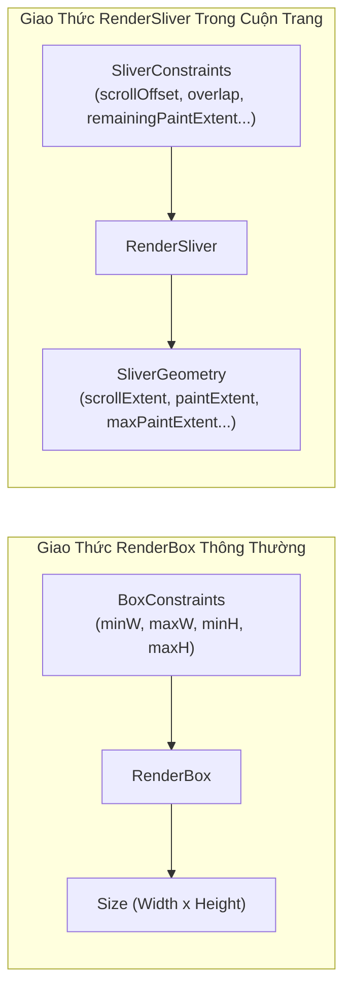
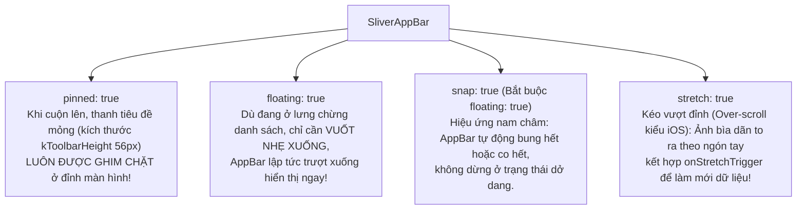

# Chuyên Đề 04 - Bài 04: CustomScrollView & Nghệ Thuật Hiệu Ứng Slivers Chuyên Sâu

> **Trọng tâm**: Giao thức Sliver (`SliverConstraints` vs `SliverGeometry`), Bản chất của `RenderSliver` so với `RenderBox`, Làm chủ `SliverAppBar` với bộ tứ quyền năng (`pinned`, `floating`, `snap`, `stretch`), Tạo Sticky Header chuyên nghiệp với `SliverPersistentHeaderDelegate`, và bộ câu hỏi thẩm định năng lực kỹ thuật chuyên sâu.

---

## 1. Giao Thức Sliver: Bản Chất Khác Biệt Giữa `RenderBox` & `RenderSliver`

Hầu hết các widget trong Flutter (`Container`, `Row`, `Text`) hoạt động trong không gian 2D cố định thông qua giao thức **`RenderBox`**:
- **Đầu vào**: `BoxConstraints` (min/max width, min/max height).
- **Đầu ra**: `Size` (chiều rộng và chiều cao cố định).

Tuy nhiên, khi cuộn trang, một widget có thể chỉ hiển thị một phần (50px lọt vào màn hình, 150px trôi ra ngoài). Giao diện 2D dạng hộp không thể mô tả được trạng thái động này. Đó là lý do Google phát minh ra **Giao thức Sliver (`RenderSliver`)**:



### Các thông số cốt lõi của Giao thức Sliver:
1. **`SliverConstraints` (Cha truyền xuống)**:
   - `scrollOffset`: Vị trí cuộn hiện tại đã trôi qua đầu của Sliver này bao nhiêu pixel.
   - `remainingPaintExtent`: Lượng không gian hiển thị còn lại trong Viewport để Sliver này vẽ.
   - `overlap`: Lượng pixel mà Sliver phía trước đang đè lên (ví dụ do `pinned: true` của AppBar).
2. **`SliverGeometry` (Sliver báo cáo ngược lên)**:
   - `scrollExtent`: Tổng chiều dài mà Sliver này đóng góp vào nội dung toàn trang.
   - `paintExtent`: Chiều dài thực tế mà Sliver này **đang hiển thị trên màn hình ngay lúc này** ($0.0 \le \text{paintExtent} \le \text{remainingPaintExtent}$).

> [!IMPORTANT]
> **Tại sao `CustomScrollView` không nhận `Widget` thông thường?**  
> `CustomScrollView` hoạt động hoàn toàn bằng giao thức `RenderSliver`. Nếu bạn truyền một `Container` vào, cha truyền `SliverConstraints` nhưng `Container` chỉ hiểu `BoxConstraints` $\rightarrow$ Crash ngay lập tức!  
> **`SliverToBoxAdapter`** đóng vai trò là một **Adapter chuyển đổi giao thức**: Nó nhận `SliverConstraints`, biến đổi thành `BoxConstraints` nới lỏng cho `Container`, lấy `Size` của `Container` và đóng gói ngược lại thành `SliverGeometry` báo cho Viewport!

---

## 2. Làm Chủ Toàn Diện `SliverAppBar`

`SliverAppBar` cung cấp 4 thuộc tính cấu hình trạng thái hiển thị đỉnh cao:



### Code Mẫu Thực Chiến Chuẩn Material 3:

```dart
CustomScrollView(
  physics: const BouncingScrollPhysics(parent: AlwaysScrollableScrollPhysics()),
  slivers: [
    SliverAppBar(
      expandedHeight: 240.0,
      pinned: true,
      floating: true,
      snap: true,
      stretch: true,
      onStretchTrigger: () async {
        // Kích hoạt khi người dùng kéo dãn vượt đỉnh quá 100px
        await fetchUpdatedData();
      },
      flexibleSpace: FlexibleSpaceBar(
        stretchModes: const [
          StretchMode.zoomBackground,   // Phóng to ảnh nền khi kéo nảy
          StretchMode.blurBackground,   // Làm mờ ảnh khi kéo nảy
          StretchMode.fadeTitle,        // Làm mờ tiêu đề khi thu nhỏ
        ],
        title: const Text('Chi Tiết Điểm Đến'),
        background: Image.network(
          'https://picsum.photos/800/600',
          fit: BoxFit.cover,
        ),
      ),
    ),

    // Chèn nội dung dạng Box
    const SliverToBoxAdapter(
      child: Padding(
        padding: EdgeInsets.all(16.0),
        child: Text(
          'Trải nghiệm không gian nghỉ dưỡng tuyệt vời...',
          style: TextStyle(fontSize: 16),
        ),
      ),
    ),

    // Danh sách ảo hóa hiệu năng cao
    SliverList.builder(
      itemCount: 40,
      itemBuilder: (context, index) => ListTile(
        leading: CircleAvatar(child: Text('$index')),
        title: Text('Dịch vụ tiện ích #$index'),
      ),
    ),
  ],
)
```

---

## 3. Tạo Sticky Header Hoạt Họa Với `SliverPersistentHeaderDelegate`

Khi bạn muốn tạo một thanh Tab Bar hoặc Tiêu đề mục luôn **dính chặt vào mép trên màn hình khi cuộn qua** (Sticky Header), đồng thời đổi màu hoặc co nhỏ chữ khi bị co lại:

```dart
class AdaptiveStickyHeaderDelegate extends SliverPersistentHeaderDelegate {
  final String title;

  AdaptiveStickyHeaderDelegate({required this.title});

  @override
  double get minExtent => 56.0;  // Chiều cao khi đã ghim vào mép trên

  @override
  double get maxExtent => 100.0; // Chiều cao ban đầu khi mở rộng

  @override
  Widget build(BuildContext context, double shrinkOffset, bool overlapsContent) {
    // 🌟 Tính toán tỷ lệ co dãn: 0.0 (bung hết) -> 1.0 (thu nhỏ hết mức)
    final progress = (shrinkOffset / (maxExtent - minExtent)).clamp(0.0, 1.0);

    return Container(
      color: Color.lerp(Colors.blue[100], Colors.blue[700], progress),
      alignment: Alignment.centerLeft,
      padding: const EdgeInsets.symmetric(horizontal: 16.0),
      child: Row(
        children: [
          Icon(
            Icons.restaurant_menu,
            color: progress > 0.5 ? Colors.white : Colors.blueGrey[900],
          ),
          const SizedBox(width: 8),
          Text(
            title,
            style: TextStyle(
              fontSize: 20 - (4 * progress), // Chữ tự thu nhỏ từ 20 xuống 16
              fontWeight: FontWeight.bold,
              color: progress > 0.5 ? Colors.white : Colors.blueGrey[900],
            ),
          ),
        ],
      ),
    );
  }

  @override
  bool shouldRebuild(covariant AdaptiveStickyHeaderDelegate oldDelegate) {
    return oldDelegate.title != title;
  }
}
```

---

## 🎯 Thẩm Định Năng Lực & Phân Tích Chuyên Sâu (Technical Competency & Deep Dive)

### Câu hỏi 1: Phân biệt sự khác nhau căn bản giữa giao thức `RenderBox` và giao thức `RenderSliver`. Tại sao `CustomScrollView` không thể nhận trực tiếp các `Widget` thông thường mà phải bọc qua `SliverToBoxAdapter`?

#### 🎯 Điểm Đánh Giá Benchmark 10/10:
1. **Sự khác biệt về giao thức (Contract)**:
   - `RenderBox` là hệ quy chiếu hình học 2 chiều tĩnh. Nó nhận `BoxConstraints` (min/max width/height) từ cha và bắt buộc phải trả về một kích thước cố định `Size(width, height)`. RenderBox hoàn toàn không có khái niệm về "cuộn", "vị trí trôi qua mép", hay "phần diện tích bị cắt bớt".
   - `RenderSliver` là hệ quy chiếu của luồng cuộn 1 chiều (theo trục cuộn `AxisDirection`). Nó nhận `SliverConstraints` (bao gồm `scrollOffset`, `remainingPaintExtent`, `overlap`, `viewportMainAxisExtent`) và trả về `SliverGeometry` (bao gồm `scrollExtent`, `paintExtent`, `layoutExtent`, `maxPaintExtent`).
2. **Vai trò của `SliverToBoxAdapter`**:
   - `CustomScrollView` là một `RenderViewport` chỉ chấp nhận các RenderObject con tuân thủ giao thức `RenderSliver`.
   - Nếu truyền một widget `RenderBox` (như `Container`, `Card`) trực tiếp vào mảng `slivers`, quá trình layout sẽ bị lỗi kiểu dữ liệu (Type Mismatch) do `RenderViewport` cố gắng truyền `SliverConstraints` cho một đối tượng chỉ biết xử lý `BoxConstraints`.
   - `SliverToBoxAdapter` chứa một `RenderSliverToBoxAdapter`. Nó đóng vai trò bộ chuyển đổi (Adapter Pattern): Nó nhận `SliverConstraints` từ Viewport, chuyển đổi thành `BoxConstraints` hữu hạn cho RenderBox con, đo lường kích thước thực tế của con, rồi chuyển đổi kết quả thành `SliverGeometry` để báo cáo ngược lại cho Viewport.

---

### Câu hỏi 2: Phân tích sự kết hợp giữa các thuộc tính `pinned`, `floating`, và `snap` trong `SliverAppBar`. Thuộc tính `stretch` hoạt động như thế nào khi kết hợp với `BouncingScrollPhysics`?

#### 🎯 Điểm Đánh Giá Benchmark 10/10:
1. **Phân tích bộ ba `pinned`, `floating`, `snap`**:
   - `pinned: true`: Khi người dùng cuộn lên trên, phần nội dung mở rộng (`expandedHeight`) sẽ co lại, nhưng thanh Toolbar cơ bản (`minExtent`, thường là 56px) sẽ **được giữ cố định ở đỉnh màn hình**, không bao giờ bị cuộn mất.
   - `floating: true`: Khi người dùng đang ở bất kỳ vị trí nào trong danh sách (dù ở rất sâu bên dưới) và thực hiện thao tác vuốt ngược ngón tay xuống dưới, `SliverAppBar` sẽ lập tức trượt xuống hiển thị ngay mà không đòi hỏi phải cuộn ngược về tận đầu trang.
   - `snap: true`: Bắt buộc phải đi kèm với `floating: true`. Nếu người dùng vuốt nhẹ làm AppBar trượt xuống một phần rồi thả tay ra, hiệu ứng hoạt họa nam châm (snapping animation) sẽ tự động kích hoạt để kéo AppBar bung ra hoàn toàn hoặc thu gọn lại hoàn toàn, không bao giờ bị lơ lửng ở trạng thái nửa kín nửa hở.
2. **Cơ chế của thuộc tính `stretch`**:
   - Khi kết hợp với `BouncingScrollPhysics` (hoặc trên iOS), khi người dùng kéo cuộn vượt quá giới hạn đỉnh (`scrollOffset < 0`), cờ `stretch: true` cho phép `SliverAppBar` tăng chiều cao vượt quá `expandedHeight`.
   - Trong `FlexibleSpaceBar`, các hiệu ứng `StretchMode.zoomBackground` sẽ tính toán tỷ lệ kéo quá đà để scale bức ảnh nền lớn lên tương ứng với khoảng cách ngón tay kéo.
   - Hàm callback `onStretchTrigger` được kích hoạt khi khoảng cách kéo dãn vượt qua một ngưỡng nhất định (mặc định 100px), cho phép tạo ra tính năng "Kéo để làm mới" (Pull-to-refresh) với phong cách thiết kế đặc trưng của iOS.

---

### Câu hỏi 3: Trong `SliverPersistentHeaderDelegate`, hai tham số `shrinkOffset` và `overlapsContent` trong phương thức `build()` biểu diễn điều gì? Làm thế nào để làm hiệu ứng biến đổi mượt mà (Fade/Morphing) dựa vào `shrinkOffset`?

#### 🎯 Điểm Đánh Giá Benchmark 10/10:
1. **Ý nghĩa của 2 tham số**:
   - `shrinkOffset`: Là khoảng cách bằng pixel mà Header này đã bị co lại so với kích thước ban đầu:
     $$0.0 \le \text{shrinkOffset} \le (\text{maxExtent} - \text{minExtent})$$
     Khi Header đang mở rộng hoàn toàn, `shrinkOffset = 0.0`. Khi người dùng cuộn danh sách lên và Header co lại chạm mức tối thiểu (`minExtent`), `shrinkOffset` đạt giá trị tối đa là `maxExtent - minExtent`.
   - `overlapsContent`: Giá trị boolean cho biết liệu có phần nội dung nào của các Sliver phía sau đang cuộn trườn xuống bên dưới Header này hay không (rất hữu ích để tự động thêm bóng đổ `elevation` hoặc viền phân cách khi có nội dung cuộn qua mép).
2. **Kỹ thuật nội suy làm hiệu ứng Fade/Morphing**:
   - Chuẩn hóa `shrinkOffset` thành một hệ số tỷ lệ tiến trình từ $0.0$ đến $1.0$:
     ```dart
     final progress = (shrinkOffset / (maxExtent - minExtent)).clamp(0.0, 1.0);
     ```
   - Sử dụng các hàm nội suy tuyến tính (Linear Interpolation) để biến đổi các giá trị thẩm mỹ:
     - **Đổi màu nền**: `Color.lerp(Colors.transparent, Colors.blue, progress)`.
     - **Độ mờ đục của ảnh**: `Opacity(opacity: 1.0 - progress)`.
     - **Thu nhỏ cỡ chữ tiêu đề**: `fontSize: 24.0 - (8.0 * progress)`.
     - **Dịch chuyển vị trí tiêu đề**: Kết hợp với `Alignment.lerp` để chuyển tiêu đề từ giữa màn hình sang góc trái của thanh Toolbar.
