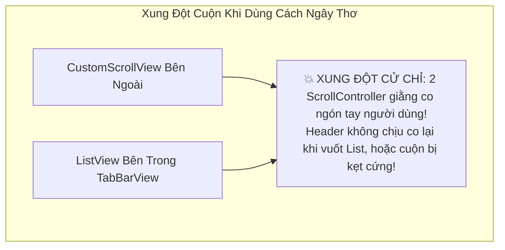
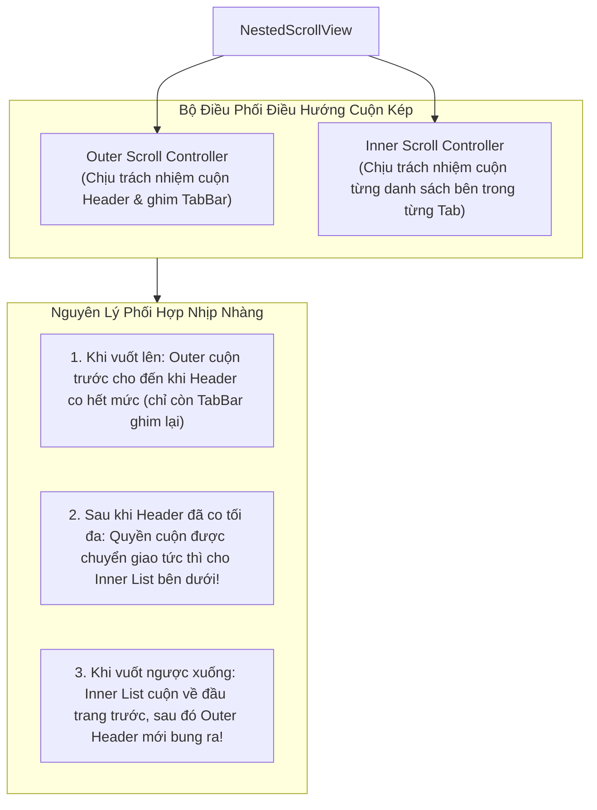
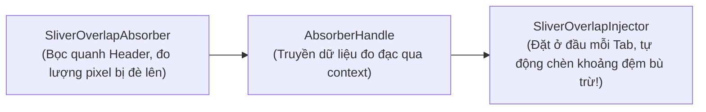

# Chuyên Đề 04 - Bài 05: NestedScrollView & Kỹ Thuật Phối Hợp Cuộn Đa Tầng (SliverOverlapAbsorber)

> **Trọng tâm**: Xử lý xung đột cuộn khi làm màn hình TabBar lồng danh sách cuộn (Profile phong cách Twitter/Shopee), Kiến trúc 2 bộ điều khiển (Outer vs Inner ScrollController), Giải mã cặp bài trùng `SliverOverlapAbsorber` & `SliverOverlapInjector`, và bộ câu hỏi thẩm định năng lực kỹ thuật chuyên sâu.

---

## 1. Bài Toán Kinh Điển: Màn Hình Hồ Sơ (Profile) Có Header Co Giãn & Nhiều Tab Cuộn

Hãy tưởng tượng bạn phải xây dựng màn hình trang cá nhân của Twitter/X hoặc Shopee:
- **Phần trên**: Ảnh bìa, Avatar, Tiểu sử người dùng (Co giãn thu nhỏ khi cuộn lên).
- **Phần giữa**: Một thanh `TabBar` (gồm 3 tab: "Bài viết", "Ảnh/Video", "Đã thích"). Khi cuộn qua, thanh TabBar **phải ghim chặt lại ở đỉnh màn hình**.
- **Phần dưới**: Một `TabBarView`, bên trong mỗi Tab là một danh sách `ListView` riêng biệt dài hàng trăm bài viết có thể cuộn độc lập!



---

## 2. Kiến Trúc Của `NestedScrollView`: Outer vs Inner Controller

Để giải quyết triệt để xung đột trên, Flutter cung cấp widget **`NestedScrollView`**:



---

## 3. Cặp Đôi Cứu Tinh: `SliverOverlapAbsorber` & `SliverOverlapInjector`

### Vấn đề "Bóng Ma Đè Lên Đầu Danh Sách":
Khi thanh `SliverAppBar` được ghim lại (`pinned: true`), nó chiếm một khoảng không gian (ví dụ 56px Toolbar + 48px TabBar = 104px).  
Các danh sách `ListView` bên trong `TabBarView` **hoàn toàn mù tịt về việc Header bên trên đang đè lên bao nhiêu pixel**!  
$\rightarrow$ Kết quả: Phần tử đầu tiên của mỗi danh sách bị che khuất mất một nửa hoặc chìm nghỉm bên dưới thanh TabBar!



---

### Code Mẫu Thực Chiến Chuẩn Google (Production-Grade):

```dart
class ProfileScreen extends StatelessWidget {
  const ProfileScreen({super.key});

  final List<String> _tabs = const ['Bài Viết', 'Ảnh & Video', 'Đã Thích'];

  @override
  Widget build(BuildContext context) {
    return DefaultTabController(
      length: _tabs.length,
      child: Scaffold(
        body: NestedScrollView(
          // 1. Xây dựng phần Header bên ngoài (Outer Slivers)
          headerSliverBuilder: (BuildContext context, bool innerBoxIsScrolled) {
            return <Widget>[
              // 🌟 Bọc SliverAppBar trong SliverOverlapAbsorber để đo đạc độ chồng lấn
              SliverOverlapAbsorber(
                handle: NestedScrollView.sliverOverlapAbsorberHandleFor(context),
                sliver: SliverAppBar(
                  expandedHeight: 200.0,
                  pinned: true,
                  floating: false,
                  forceElevated: innerBoxIsScrolled, // Đổ bóng khi nội dung con cuộn chạm vào
                  flexibleSpace: FlexibleSpaceBar(
                    title: const Text('Trần Văn Dev'),
                    background: Image.network(
                      'https://picsum.photos/800/400',
                      fit: BoxFit.cover,
                    ),
                  ),
                  bottom: TabBar(
                    tabs: _tabs.map((name) => Tab(text: name)).toList(),
                  ),
                ),
              ),
            ];
          },
          
          // 2. Xây dựng nội dung các trang con bên dưới (Inner Views)
          body: TabBarView(
            children: _tabs.map((String tabName) {
              return SafeArea(
                top: false,
                bottom: false,
                child: Builder(
                  builder: (BuildContext context) {
                    return CustomScrollView(
                      // Khóa key để Flutter bảo tồn trạng thái cuộn của từng tab
                      key: PageStorageKey<String>(tabName),
                      slivers: <Widget>[
                        // 🌟 TIÊM KHOẢNG ĐỆM: Bù trừ chính xác chiều cao của Header đang đè lên!
                        SliverOverlapInjector(
                          handle: NestedScrollView.sliverOverlapAbsorberHandleFor(context),
                        ),
                        
                        // Danh sách nội dung thực tế của Tab
                        SliverPadding(
                          padding: const EdgeInsets.all(8.0),
                          sliver: SliverList.builder(
                            itemCount: 30,
                            itemBuilder: (context, index) => Card(
                              child: ListTile(
                                leading: const Icon(Icons.article),
                                title: Text('$tabName: Mục số #$index'),
                              ),
                            ),
                          ),
                        ),
                      ],
                    );
                  },
                ),
              );
            }).toList(),
          ),
        ),
      ),
    );
  }
}
```

---

## 🎯 Thẩm Định Năng Lực & Phân Tích Chuyên Sâu (Technical Competency & Deep Dive)

### Câu hỏi 1: Tại sao việc lồng trực tiếp một `ListView` hoặc `TabBarView` bên trong một `CustomScrollView` thông thường lại dẫn đến lỗi xung đột cuộn (Scroll Conflict)? `NestedScrollView` giải quyết bài toán này bằng kiến trúc nào?

#### 🎯 Điểm Đánh Giá Benchmark 10/10:
1. **Bản chất của xung đột cuộn khi dùng `CustomScrollView`**:
   - `CustomScrollView` là một Scrollable với một `ScrollPosition` riêng.
   - Khi lồng một `TabBarView` (bên trong chứa các `ListView`), mỗi `ListView` lại tự khởi tạo một `Scrollable` và một `ScrollPosition` độc lập khác.
   - Khi cử chỉ ngón tay chạm vào màn hình (`PointerDownEvent`), cả 2 `GestureRecognizers` đều tham gia vào `GestureArena` để tranh giành cử chỉ. Nếu `ListView` con thắng, nó sẽ chặn cử chỉ và tự cuộn một mình, khiến `CustomScrollView` cha không bao giờ cuộn được (Header bị đơ). Ngược lại, nếu cha thắng, con sẽ không thể cuộn được.
2. **Kiến trúc điều phối kép của `NestedScrollView`**:
   - `NestedScrollView` tạo ra một bộ điều phối trung gian gồm 2 tầng:
     - **Outer ScrollController**: Quản lý vị trí cuộn của `headerSliverBuilder` (ảnh bìa, tiêu đề, thanh tab bar).
     - **Inner ScrollController**: Quản lý vị trí cuộn của nội dung bên trong `body` (từng danh sách con).
   - `NestedScrollView` sử dụng một lớp vật lý đặc biệt (`_NestedScrollCoordinator`). Khi ngón tay người dùng vuốt lên, bộ điều phối sẽ bơm toàn bộ delta dịch chuyển vào Outer Controller trước cho đến khi Header đạt tới trạng thái co lại cực đại (`minExtent`). Ngay tại thời điểm đó, nó chuyển tiếp liên tục và không giật cục delta còn lại cho Inner Controller để danh sách con tiếp tục trôi mượt mà trong cùng một lần vuốt.

---

### Câu hỏi 2: Hãy giải thích vai trò của cặp đôi `SliverOverlapAbsorber` và `SliverOverlapInjector` trong `NestedScrollView`. Nếu thiếu chúng, hiện tượng lỗi giao diện nào sẽ xảy ra?

#### 🎯 Điểm Đánh Giá Benchmark 10/10:
1. **Nguyên nhân sinh ra vấn đề**:
   - Khi một `SliverAppBar` có thuộc tính `pinned: true`, phần thanh công cụ ghim lại này tiếp tục chiếm một diện tích hiển thị trên màn hình (`pinned extent`).
   - Tuy nhiên, trong cấu trúc của `NestedScrollView`, các `CustomScrollView` con bên trong `TabBarView` là các Viewport độc lập và nó mặc định coi tọa độ bắt đầu của nó là từ đỉnh của Viewport đó ($y = 0$).
   - Kết quả: Các item đầu tiên của danh sách con sẽ bị thanh `SliverAppBar` đè lấp lên trên, người dùng không thể đọc được nội dung của phần tử đầu tiên nếu không kéo danh sách xuống.
2. **Vai trò của cặp đôi Absorber - Injector**:
   - **`SliverOverlapAbsorber`**: Bọc quanh `SliverAppBar` ở phần Header bên ngoài. Nó tính toán chính xác lượng pixel chồng lấn (`overlap`) mà AppBar đang đè lên không gian của con và lưu trữ vào đối tượng `SliverOverlapAbsorberHandle`.
   - **`SliverOverlapInjector`**: Được đặt ở vị trí đầu tiên của mảng `slivers` bên trong từng trang con của `TabBarView`. Nó đọc giá trị từ `SliverOverlapAbsorberHandle` và tự động sinh ra một khoảng đệm không gian (padding sliver) bằng đúng lượng pixel bị đè.
   - Nhờ đó, phần tử đầu tiên của danh sách con luôn xuất hiện hoàn hảo ngay bên dưới thanh TabBar mà không bao giờ bị che khuất.

---

### Câu hỏi 3: Trong `NestedScrollView`, làm thế nào để đảm bảo rằng khi người dùng cuộn ở Tab 1 rồi chuyển sang Tab 2, trạng thái vị trí cuộn của các danh sách không bị reset về đầu trang?

#### 🎯 Điểm Đánh Giá Benchmark 10/10:
1. **Cơ chế lưu trữ vị trí cuộn với `PageStorage`**:
   - Mặc định, khi một tab trong `TabBarView` bị chuyển đi, nếu nó không được giữ lại trong bộ nhớ, cây widget con sẽ bị hủy và vị trí cuộn của `ScrollPosition` sẽ bị mất.
   - Flutter cung cấp cơ chế lưu trữ tự động thông qua widget **`PageStorage`** (một kho lưu trữ dạng key-value nằm sẵn trong cấu trúc màn hình).
2. **Kỹ thuật triển khai chuẩn**:
   - Gán cho mỗi `CustomScrollView` hoặc `ListView` con một **`PageStorageKey`** duy nhất đại diện cho tab đó:
     ```dart
     CustomScrollView(
       key: PageStorageKey<String>('tab_articles'),
       // ...
     )
     ```
   - Khi widget bị unmount, `ScrollPosition` tự động lưu tọa độ offset hiện tại vào `PageStorageBucket` với định danh của key đó.
   - Khi người dùng chuyển tab quay trở lại, widget được khởi tạo lại và tự động phục hồi chính xác vị trí pixel đã lưu mà không tốn công viết logic quản lý state thủ công.
   - **Kết hợp thêm (Tùy chọn)**: Nếu muốn giữ toàn bộ Widget Tree của các tab trong bộ nhớ RAM để không phải build lại từ đầu, có thể bọc mỗi tab bằng một widget kế thừa `AutomaticKeepAliveClientMixin` với `wantKeepAlive = true`.
