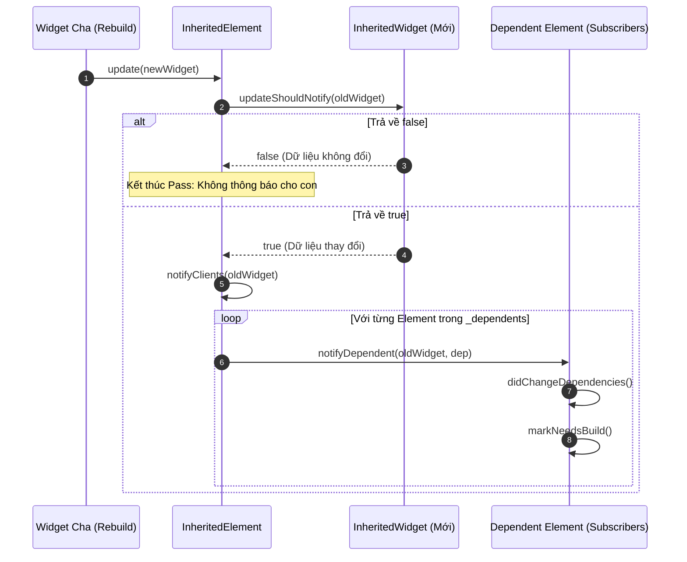

# Bài 5.1 — Prop Drilling & Kiến Trúc Phổ Biến Dữ Liệu: InheritedWidget Internals

## Phần 1 — Khái Niệm & Ràng Buộc Kiến Trúc (Architecture & Design Philosophy)

### 1.1 — Bản chất bài toán Prop Drilling trong Declarative UI

Trong kiến trúc giao diện khai báo (Declarative UI) của Flutter, dữ liệu mặc định được truyền theo chiều dọc từ trên xuống dưới thông qua các tham số constructor của Widget:

```dart
// Prop Drilling: Dữ liệu theme bị ép buộc truyền xuyên qua các tầng trung gian
App(theme) ──► HomePage(theme) ──► ContentSection(theme) ──► ProductCard(theme) ──► PriceLabel(theme)
```

Mô hình này nhanh chóng bộc lộ các khiếm khuyết kiến trúc nghiêm trọng khi ứng dụng mở rộng quy mô:
1. **Ghép nối phụ thuộc chặt chẽ (Tight Coupling):** Các widget trung gian (`HomePage`, `ContentSection`, `ProductCard`) bị biến thành "đường ống dẫn thụ động". Chúng phải khai báo, lưu trữ và nhận các tham số constructor mà bản thân chúng hoàn toàn không có nhu cầu sử dụng.
2. **Phá vỡ tính bao đóng (Encapsulation Violation):** Khi phát sinh nhu cầu bổ sung thêm một tham số cấu hình (ví dụ: `UserLocale` hoặc `AuthToken`), toàn bộ chữ ký constructor của tất cả các widget trên chuỗi phân cấp đều phải bị sửa đổi.
3. **Làm phình to chữ ký constructor (Boilerplate Bloat):** Khiến mã nguồn khó bảo trì và cản trở khả năng tái sử dụng độc lập của từng component.

---

### 1.2 — Mô hình Ambient Property Pattern và Hợp đồng phân phối dữ liệu ngầm định

Để xử lý các dữ liệu mang tính ngữ cảnh môi trường toàn cục (như Theme, Typography, Locale, Media, Authentication Session), Flutter hiện thực hóa mẫu thiết kế **Ambient Property Pattern** thông qua lớp cơ sở: `InheritedWidget`.

```
┌────────────────────────────────────────────────────────────────────────┐
│ INHERITED WIDGET (Broadcast Provider)                                  │
│   • Định vị tại một node tổ tiên trên cây                              │
│   • Phổ biến dữ liệu xuống toàn bộ Subtree ngầm định                   │
└───────────────────────────────────┬────────────────────────────────────┘
                                    │
                                    │ Bỏ qua toàn bộ các tầng trung gian
                                    │ (Không cần truyền qua constructor)
                                    ▼
┌────────────────────────────────────────────────────────────────────────┐
│ DESCENDANT ELEMENT (Consumer)                                          │
│   • Truy xuất trực tiếp dữ liệu với độ phức tạp thời gian O(1)         │
│   • Tự động đăng ký lắng nghe để rebuild khi dữ liệu thay đổi          │
└────────────────────────────────────────────────────────────────────────┘
```

#### Ba đặc tính kiến trúc cốt lõi của `InheritedWidget`:
1. **Tính bất biến tuyệt đối (Immutability):** `InheritedWidget` kế thừa từ `Widget`, do đó được đánh dấu với annotation `@immutable`. Mọi trường dữ liệu bên trong `InheritedWidget` bắt buộc phải là `final`. Khi dữ liệu thay đổi, một instance `InheritedWidget` mới sẽ được tạo ra để thay thế instance cũ.
2. **Tra cứu thời gian thực đạt độ phức tạp $O(1)$:** Nhờ cơ chế kế thừa cấu trúc bảng băm ở tầng Element Tree, việc tìm kiếm `InheritedWidget` gần nhất không phụ thuộc vào độ sâu của cây ($D$).
3. **Phản ứng có chọn lọc (Selective Invalidation):** Khi `InheritedWidget` được cập nhật, framework chỉ kích hoạt việc build lại đối với các `Element` thực sự có đăng ký phụ thuộc vào nó, hoàn toàn không làm rebuild các widget trung gian khác trong cây.

---

## Phần 2 — Cơ Chế Hoạt Động & Mã Nguồn Đối Chiếu (Under the Hood / Deep-Dive)

### 2.1 — Thuật toán lan truyền kế thừa `InheritedElement.updateInheritance()`

Nhiều lập trình viên lầm tưởng rằng khi gọi `context.dependOnInheritedWidgetOfExactType<T>()`, Flutter sẽ thực hiện một vòng lặp `while (parent != null)` để duyệt ngược lên gốc cây nhằm tìm kiếm widget kiểu `T`. Nếu làm như vậy, độ phức tạp sẽ là $O(D)$ (với $D$ là khoảng cách từ node hiện tại đến node tổ tiên).

Trong thực tế, Flutter đạt được tốc độ tra cứu tức thời **$O(1)$** thông qua cấu trúc dữ liệu `_inheritedElements` được lưu trữ trực tiếp trên mỗi `Element` trong `packages/flutter/lib/src/widgets/framework.dart`:

```dart
// Trích đoạn mã nguồn trong class Element
PersistentHashMap<Type, InheritedElement>? _inheritedElements;

void updateInheritance() {
  assert(_lifecycleState == _ElementLifecycle.active);
  // Sao chép tham chiếu trực tiếp bảng băm từ parent: Chi phí O(1)
  _inheritedElements = _parent?._inheritedElements;
}
```

Khi một `InheritedElement` (Element đại diện cho `InheritedWidget`) được mount vào cây, nó ghi đè phương thức `updateInheritance()` để đăng ký chính nó vào bảng băm:

```dart
// Trích đoạn mã nguồn trong class InheritedElement
@override
void updateInheritance() {
  assert(_lifecycleState == _ElementLifecycle.active);
  final PersistentHashMap<Type, InheritedElement> incomingWidgets =
      _parent?._inheritedElements ?? const PersistentHashMap<Type, InheritedElement>.empty();
  
  // Tạo bản sao mở rộng chứa chính kiểu dữ liệu của InheritedWidget này
  _inheritedElements = incomingWidgets.put(widget.runtimeType, this);
}
```

```
[Root Element] (_inheritedElements = {})
     │
     ▼
[ThemeInheritedElement] (_inheritedElements = {AppTheme: this})
     │
     ▼
[Element A] (_inheritedElements = {AppTheme: ThemeInheritedElement}) ──► Trỏ cùng Map!
     │
     ▼
[Element B] (_inheritedElements = {AppTheme: ThemeInheritedElement}) ──► Trỏ cùng Map!
```

#### Chứng minh toán học:
- **Pha khởi tạo (Mounting):** Mỗi `Element` thông thường chỉ thực hiện một phép gán con trỏ duy nhất `_inheritedElements = _parent?._inheritedElements` với chi phí $O(1)$. Chỉ các `InheritedElement` mới thực hiện phép chèn vào cấu trúc dữ liệu Persistent Map với chi phí $O(\log k)$ (với $k$ là số lượng các kiểu `InheritedWidget` khác nhau, thông thường $k < 50$).
- **Pha tra cứu (Lookup):** Khi gọi `dependOnInheritedWidgetOfExactType<T>()`:
  ```dart
  final InheritedElement? ancestor = _inheritedElements?[T];
  ```
  Phép toán này thuần túy là một lệnh đọc bảng băm $O(1)$ từ mảng tham chiếu cục bộ của chính Element đó, hoàn toàn không có bất kỳ vòng lặp duyệt ngược cây nào xảy ra.

---

### 2.2 — Hợp đồng `updateShouldNotify(covariant T oldWidget)`

Mỗi khi widget cha của `InheritedWidget` thực hiện rebuild và cung cấp một instance `InheritedWidget` mới, phương thức `updated()` của `InheritedElement` sẽ được framework triệu hồi:

```dart
// Trích đoạn mã nguồn trong InheritedElement
@override
void updated(InheritedWidget oldWidget) {
  if (widget.updateShouldNotify(oldWidget)) {
    notifyClients(oldWidget);
  }
}
```



#### Hợp đồng API của `updateShouldNotify`:
- Phương thức nhận vào instance cũ (`oldWidget`) và so sánh với instance hiện tại (`this`).
- Nếu trả về `true`: Framework lập tức duyệt qua danh sách `_dependents` (tất cả các Element con đã từng đăng ký lắng nghe) và đánh dấu `markNeedsBuild()` để kích hoạt việc vẽ lại.
- Nếu trả về `false`: Framework bỏ qua, toàn bộ các subscriber con được giữ nguyên trạng thái, tiết kiệm 100% tài nguyên CPU tính toán lại subtree.

---

## Phần 3 — Hướng Dẫn Thực Hành Chuẩn (Production-Ready Implementations)

### 3.1 — Đối chiếu kiến trúc: Prop Drilling vs InheritedWidget

#### Trường hợp 1: Phản mẫu Prop Drilling (Brittle & Boilerplate)
```dart
// Phải khai báo và truyền AppSettings qua 4 tầng widget trung gian
class UserAvatar extends StatelessWidget {
  final AppSettings settings; // Nhận tham số chỉ để truyền tiếp cho con
  const UserAvatar({super.key, required this.settings});

  @override
  Widget build(BuildContext context) {
    return AvatarBorder(settings: settings);
  }
}
```

#### Trường hợp 2: Kiến trúc chuẩn với InheritedWidget
```dart
// Các tầng trung gian hoàn toàn độc lập, không giữ tham số thừa
class UserAvatar extends StatelessWidget {
  const UserAvatar({super.key});

  @override
  Widget build(BuildContext context) {
    return const AvatarBorder();
  }
}
```

---

### 3.2 — Mẫu kiến trúc `ThemeProvider` bọc `_InheritedTheme` chuẩn Production

Để quản lý trạng thái động (Mutable State) kết hợp với cơ chế phân phối ngầm định (Ambient Distribution), mô hình tiêu chuẩn là phối hợp giữa một `StatefulWidget` ở ngoài và một `InheritedWidget` private bên trong:

```dart
import 'package:flutter/material.dart';

/// Class quản lý logic trạng thái và cung cấp API giao tiếp công khai
class ThemeProvider extends StatefulWidget {
  final Widget child;

  const ThemeProvider({super.key, required this.child});

  /// Phương thức tiện ích để các widget con đọc ThemeData và đăng ký phụ thuộc
  static ThemeData themeOf(BuildContext context) {
    final _InheritedTheme? inheritedTheme =
        context.dependOnInheritedWidgetOfExactType<_InheritedTheme>();
    assert(inheritedTheme != null, 'Không tìm thấy ThemeProvider trong cây tổ tiên');
    return inheritedTheme!.theme;
  }

  /// Phương thức tiện ích để thao tác thay đổi trạng thái (Không đăng ký phụ thuộc)
  static void toggle(BuildContext context) {
    final _ThemeProviderState? state =
        context.findAncestorStateOfType<_ThemeProviderState>();
    assert(state != null, 'Không tìm thấy ThemeProviderState trong cây tổ tiên');
    state?.toggleTheme();
  }

  @override
  State<ThemeProvider> createState() => _ThemeProviderState();
}

class _ThemeProviderState extends State<ThemeProvider> {
  bool _isDark = false;

  ThemeData get _themeData => _isDark
      ? ThemeData.dark(useMaterial3: true)
      : ThemeData.light(useMaterial3: true);

  void toggleTheme() {
    setState(() {
      _isDark = !_isDark;
    });
  }

  @override
  Widget build(BuildContext context) {
    // Khi setState được gọi, _InheritedTheme mới được khởi tạo với _themeData mới
    // Framework gọi updateShouldNotify() để thông báo cho các consumer
    return _InheritedTheme(
      theme: _themeData,
      child: widget.child,
    );
  }
}

/// Lớp InheritedWidget private chịu trách nhiệm phân phối dữ liệu ở tầng Element
class _InheritedTheme extends InheritedWidget {
  final ThemeData theme;

  const _InheritedTheme({
    required this.theme,
    required super.child,
  });

  @override
  bool updateShouldNotify(covariant _InheritedTheme oldWidget) {
    // So sánh dữ liệu cũ và mới để quyết định có phát tín hiệu rebuild hay không
    return theme != oldWidget.theme;
  }
}
```

#### Áp dụng vào cây ứng dụng:
```dart
void main() {
  runApp(
    const ThemeProvider(
      child: MyApp(),
    ),
  );
}

class MyApp extends StatelessWidget {
  const MyApp({super.key});

  @override
  Widget build(BuildContext context) {
    return MaterialApp(
      theme: ThemeProvider.themeOf(context), // Tự động rebuild khi toggleTheme()
      home: const HomeScreen(),
    );
  }
}

class ThemeToggleButton extends StatelessWidget {
  const ThemeToggleButton({super.key});

  @override
  Widget build(BuildContext context) {
    return ElevatedButton.icon(
      onPressed: () => ThemeProvider.toggle(context), // Gọi hàm toggle không qua props
      icon: const Icon(Icons.brightness_6),
      label: const Text('Chuyển đổi giao diện'),
    );
  }
}
```

---

## Phần 4 — Lỗi Thường Gặp & Giải Pháp Khắc Phục (Anti-Patterns & Pitfalls)

### 4.1 — Lưu trữ Mutable State bên trong `InheritedWidget`

#### Mô tả lỗi:
Khai báo một trường dữ liệu có thể thay đổi (non-final) bên trong `InheritedWidget` và thực hiện thay đổi trực tiếp (mutate) trên đối tượng đó:

```dart
// SAI LẦM NGHIÊM TRỌNG: Vi phạm hợp đồng bất biến của Widget
class BadUserDataProvider extends InheritedWidget {
  final List<String> permissions; // List là một mutable reference

  const BadUserDataProvider({
    super.key,
    required this.permissions,
    required super.child,
  });

  void addPermission(String permission) {
    permissions.add(permission); // Mutate trực tiếp nội dung mảng
    // KHÔNG CÓ CƠ CHẾ NÀO KÍCH HOẠT REBUILD TỰ ĐỘNG!
  }

  @override
  bool updateShouldNotify(BadUserDataProvider oldWidget) {
    return permissions != oldWidget.permissions;
  }
}
```

#### Nguyên nhân kỹ thuật:
`InheritedWidget` không tự sở hữu vòng lặp Render Pipeline. Phương thức `updateShouldNotify` chỉ được framework kích hoạt khi **Widget cha tạo ra một instance `InheritedWidget` mới** và truyền qua phương thức `Element.update()`. 
Nếu bạn chỉ mutate thuộc tính nội bộ của cùng một instance, đối tượng cũ và mới là một (`identical(this, oldWidget) == true`), và tham chiếu bộ nhớ của `permissions` không đổi. Kết quả là `updateShouldNotify` không bao giờ được gọi hoặc so sánh `permissions != oldWidget.permissions` luôn trả về `false`, khiến toàn bộ các subscriber con không được cập nhật.

#### Giải pháp:
Luôn tuân thủ mô hình Immutable Data: Tạo danh sách mới hoặc bản sao đối tượng mới thông qua `StatefulWidget` bọc ngoài (`setState(() => permissions = [...permissions, newPermission])`).

---

### 4.2 — Triển khai `updateShouldNotify` cẩu thả

#### Mô tả lỗi:
- Trường hợp 1: Luôn trả về `true` (`bool updateShouldNotify(...) => true;`). Mọi lần widget cha rebuild vì bất kỳ lý do gì đều ép buộc toàn bộ các subscriber con phải rebuild theo, triệt tiêu khả năng tối ưu hóa của framework.
- Trường hợp 2: Trả về so sánh nông trên đối tượng phức hợp không ghi đè `operator==`, dẫn đến việc các phần tử con không nhận được thông báo cập nhật.

#### Giải pháp:
Chỉ so sánh các trường dữ liệu thực tế tác động đến giao diện:
```dart
@override
bool updateShouldNotify(covariant UserProfileScope oldWidget) {
  return userId != oldWidget.userId ||
         userRole != oldWidget.userRole ||
         lastUpdated != oldWidget.lastUpdated;
}
```

---

## Phần 5 — Câu Hỏi Kiểm Tra Kiến Thức Chuyên Sâu & Bài Tập Phân Tích Mã Nguồn (Technical Assessment & Code Tracing)

### 5.1 — Câu hỏi khảo sát kiến trúc

#### Câu 1: Cơ chế kế thừa tham chiếu bảng băm trong `Element.mount()`
*Đề bài:* Giả sử một cây widget có 1.000 `StatelessElement` lồng nhau sâu. Việc sao chép `_inheritedElements` qua 1.000 tầng này có gây tiêu tốn bộ nhớ Heap và làm chậm quá trình mount không?

*Phân tích kỹ thuật:*
1. Cấu trúc `_inheritedElements` là một con trỏ kiểu `PersistentHashMap` (cấu trúc dữ liệu cấu trúc bất biến).
2. Khi các `StatelessElement` thông thường được mount, mã nguồn thực thi:
   ```dart
   _inheritedElements = _parent?._inheritedElements;
   ```
3. Lệnh này thuần túy là **phép gán con trỏ 64-bit (Shallow Pointer Assignment)**, hoàn toàn không thực hiện deep-clone toàn bộ map. 1.000 phần tử con đều cùng chia sẻ đúng một địa chỉ vùng nhớ trỏ tới bảng băm của tổ tiên.
4. Chỉ khi gặp một `InheritedElement`, một node mới trong persistent tree mới được tạo ra với chi phí $O(\log k)$. Do đó, bộ nhớ Heap tiêu tốn là không đáng kể và thời gian thực thi là $O(1)$ cho mỗi node.

---

#### Câu 2: Tác động của từ khóa `const` đối với `InheritedWidget` Rebuild
*Đề bài:* Nếu một widget con khai báo `const MyChildWidget()` trong hàm `build()`, nhưng bên trong phương thức `build()` của `MyChildWidget` lại có gọi `Theme.of(context)`. Khi `Theme` thay đổi, `MyChildWidget` có được rebuild lại hay không? Tại sao?

*Phân tích kỹ thuật:*
1. Từ khóa `const` ở tầng Widget Tree giúp kích hoạt cơ chế short-circuit trong `Element.updateChild()`: Nếu tham chiếu widget cũ và mới là trùng khớp (`identical == true`), widget cha sẽ không gọi hàm `build()` của widget con đó.
2. Tuy nhiên, `InheritedWidget` hoạt động thông qua một kênh độc lập: Cơ chế **Invalidation trực tiếp từ Element**.
3. Khi `InheritedElement` gọi `notifyClients()`, nó lấy trực tiếp đối tượng `Element` của `MyChildWidget` từ danh sách `_dependents` và gọi:
   ```dart
   dependent.didChangeDependencies();
   ```
4. Phương thức này đánh dấu cờ `_dirty = true` trực tiếp trên chính `Element` con đó và đưa nó vào danh sách `_dirtyElements` của `BuildOwner`.
5. Trong khung hình tiếp theo, framework vẫn bắt buộc phải thực thi hàm `build()` của `MyChildWidget` bất kể constructor của nó có là `const` hay không.

---

### 5.2 — Bài tập phân tích luồng thực thi (Code Tracing)

#### Đề bài:
Cho cấu trúc chương trình sau:

```dart
class AppStateScope extends InheritedWidget {
  final int counter;
  const AppStateScope({required this.counter, required super.child, super.key});

  @override
  bool updateShouldNotify(AppStateScope oldWidget) => counter != oldWidget.counter;
}

class RootWidget extends StatefulWidget {
  const RootWidget({super.key});
  @override
  State<RootWidget> createState() => _RootWidgetState();
}

class _RootWidgetState extends State<RootWidget> {
  int _counter = 0;

  void _increment() => setState(() => _counter++);

  @override
  Widget build(BuildContext context) {
    return AppStateScope(
      counter: _counter,
      child: const Column(
        children: [
          WidgetA(), // (Node 1)
          WidgetB(), // (Node 2)
          WidgetC(), // (Node 3)
        ],
      ),
    );
  }
}

class WidgetA extends StatelessWidget {
  const WidgetA({super.key});
  @override
  Widget build(BuildContext context) {
    final scope = context.dependOnInheritedWidgetOfExactType<AppStateScope>();
    debugPrint('Build WidgetA: ${scope?.counter}');
    return const SizedBox();
  }
}

class WidgetB extends StatelessWidget {
  const WidgetB({super.key});
  @override
  Widget build(BuildContext context) {
    final scope = context.getInheritedWidgetOfExactType<AppStateScope>();
    debugPrint('Build WidgetB: ${scope?.counter}');
    return const SizedBox();
  }
}

class WidgetC extends StatelessWidget {
  const WidgetC({super.key});
  @override
  Widget build(BuildContext context) {
    debugPrint('Build WidgetC');
    return const SizedBox();
  }
}
```

Giả sử ứng dụng đã hoàn tất lượt render đầu tiên. Người dùng kích hoạt hàm `_increment()`, làm biến `_counter` thay đổi từ `0` thành `1`.

Hãy xác định chính xác:
1. Những thông báo `debugPrint` nào sẽ xuất hiện trên console khi lượt render thứ hai kết thúc?
2. Giải thích chi tiết trạng thái của `WidgetA`, `WidgetB`, `WidgetC` và `Column` trong chu kỳ render này.

---

#### Đáp án phân tích:

**1. Kết quả in ra trên Console:**
```
Build WidgetA: 1
```
*(Chỉ duy nhất một dòng log của WidgetA xuất hiện).*

**2. Giải thích chi tiết cơ chế hoạt động:**
- **`_RootWidgetState`:** Hàm `_increment()` gọi `setState()`, đưa `_RootWidgetState` vào danh sách bẩn. Hàm `build()` của nó chạy lại, tạo ra một instance `AppStateScope` mới với `counter: 1`.
- **`AppStateScope` (`InheritedElement`):** Phương thức `updateShouldNotify(oldWidget)` được gọi: `1 != 0` trả về **`true`**. Framework kích hoạt `notifyClients()`.
- **`Column`:** Được khai báo bằng từ khóa `const Column(...)`. Nhờ phép kiểm tra `identical`, framework phát hiện widget cấu hình không đổi và bản thân `Column` không đăng ký phụ thuộc vào `AppStateScope`, do đó **`Column` hoàn toàn không bị rebuild**.
- **`WidgetA`:** Trong lần build đầu tiên, `WidgetA` sử dụng `context.dependOnInheritedWidgetOfExactType<AppStateScope>()`. Element của `WidgetA` đã được lưu vào tập hợp `_dependents` của `InheritedElement`. Khi `notifyClients()` kích hoạt, Element của `WidgetA` bị đánh dấu bẩn $\longrightarrow$ **`WidgetA` được rebuild và in ra:** `"Build WidgetA: 1"`.
- **`WidgetB`:** Sử dụng `context.getInheritedWidgetOfExactType<AppStateScope>()`. Lời gọi này chỉ đọc dữ liệu một lần từ bảng băm $O(1)$ mà **hoàn toàn không đăng ký Element vào `_dependents`**. Đồng thời cha của nó (`Column`) là `const` nên không truyền rebuild xuống $\longrightarrow$ **`WidgetB` không bị rebuild và không in gì**.
- **`WidgetC`:** Là một `const` widget độc lập, không có bất kỳ tương tác nào với `AppStateScope` $\longrightarrow$ **`WidgetC` không bị rebuild và không in gì**.
