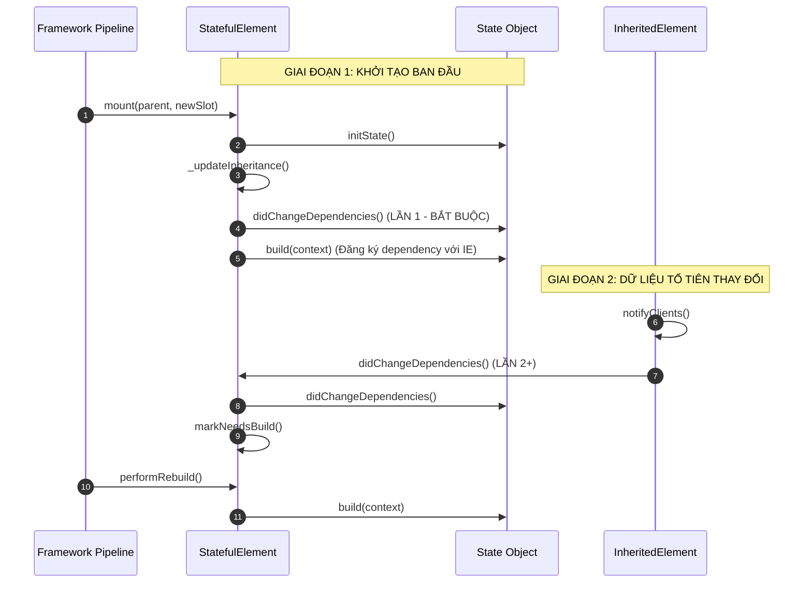

# Bài 5.2 — dependOnInheritedWidgetOfExactType & Dependency Registration Architecture

## Phần 1 — Khái Niệm & Ràng Buộc Kiến Trúc (Architecture & Design Philosophy)

### 1.1 — Bản chất của Hợp đồng Đăng ký Phụ thuộc Phản ứng (Reactive Dependency Contract)

Trong kiến trúc Flutter, `BuildContext` chính là giao diện điều khiển đại diện cho một `Element` trên Element Tree. Khi một widget cần đọc dữ liệu từ một `InheritedWidget` tổ tiên, framework cung cấp hai phương thức với bản chất hình học và hành vi hoàn toàn khác biệt:

```
┌────────────────────────────────────────────────────────────────────────┐
│ PHƯƠNG THỨC 1: dependOnInheritedWidgetOfExactType<T>()                 │
│   • Cơ chế:  Tra cứu O(1) + ĐĂNG KÝ PHỤ THUỘC HAI CHIỀU (Subscribe)    │
│   • Hành vi: Khi dữ liệu của T thay đổi, Element này tự động bị đánh   │
│              dấu bẩn và kích hoạt rebuild trong khung hình tiếp theo.  │
│   • Vị trí:  Chỉ hợp lệ trong didChangeDependencies() và build().      │
├────────────────────────────────────────────────────────────────────────┤
│ PHƯƠNG THỨC 2: getInheritedWidgetOfExactType<T>()                      │
│   • Cơ chế:  Tra cứu O(1) ĐƠN THUẦN (Read-only Lookup / Không đăng ký) │
│   • Hành vi: Đọc giá trị hiện tại của T tại thời điểm gọi. Khi T thay  │
│              đổi, Element này HOÀN TOÀN KHÔNG bị đánh dấu rebuild.     │
│   • Vị trí:  Hợp lệ trong các callback sự kiện (onTap), initState().   │
└────────────────────────────────────────────────────────────────────────┘
```

---

### 1.2 — Bất biến vòng đời: Quy tắc cấm gọi trong `initState()`

Một trong những lỗi phổ biến nhất của lập trình viên là gọi `dependOnInheritedWidgetOfExactType` (hoặc các phương thức tiện ích bọc nó như `Theme.of(context)`, `MediaQuery.of(context)`) bên trong phương thức `initState()` của `StatefulWidget`:

```
dependOnInheritedWidgetOfExactType<_InheritedTheme>() was called before _MyWidgetState.initState() completed.
When an inherited widget changes, any widgets that depend on it will be rebuilt...
```

#### Nguyên nhân kiến trúc:
1. **Trạng thái máy trạng thái `_StateLifecycle`:** Khi `initState()` đang chạy, trạng thái nội bộ của đối tượng State đang là `_StateLifecycle.created` chuyển sang `initialized`. Tại thời điểm này, `StatefulElement` vẫn đang trong quá trình mount ban đầu, liên kết cây chưa được ổn định hóa.
2. **Quy trình đảm bảo bất biến:** Flutter thiết kế một pha riêng biệt ngay sau `initState()` là **`didChangeDependencies()`**. Nếu cho phép đăng ký dependency ngay trong `initState()`, khi một `InheritedWidget` thay đổi cấu hình trong cùng frame, framework sẽ rơi vào tình thế xung đột: hoặc phải triệu hồi `didChangeDependencies()` khi state chưa khởi tạo xong, hoặc phải bỏ qua thông báo làm sai lệch dữ liệu.
3. **Quy tắc:** Mọi thao tác đọc dữ liệu phụ thuộc phản ứng từ tổ tiên bắt buộc phải dời vào phương thức `didChangeDependencies()` hoặc `build()`.

---

## Phần 2 — Cơ Chế Hoạt Động & Mã Nguồn Đối Chiếu (Under the Hood / Deep-Dive)

### 2.1 — Mổ xẻ mã nguồn `Element.dependOnInheritedElement()`

Cơ chế đăng ký phụ thuộc diễn ra tại lớp cơ sở `Element` trong mã nguồn `packages/flutter/lib/src/widgets/framework.dart`:

```dart
@override
T? dependOnInheritedWidgetOfExactType<T extends InheritedWidget>({ Object? aspect }) {
  assert(_lifecycleState == _ElementLifecycle.active);
  final InheritedElement? ancestor = _inheritedElements?[T];
  if (ancestor != null) {
    return dependOnInheritedElement(ancestor, aspect: aspect) as T;
  }
  _hadUnsatisfiedDependencies = true;
  return null;
}

@override
InheritedWidget dependOnInheritedElement(InheritedElement ancestor, { Object? aspect }) {
  assert(ancestor != null);
  assert(_lifecycleState == _ElementLifecycle.active);

  // 1. Phía Consumer: Ghi nhận con trỏ của tổ tiên vào Set _dependencies
  _dependencies ??= HashSet<InheritedElement>();
  _dependencies!.add(ancestor);

  // 2. Phía Provider: Báo cho tổ tiên biết Element này đang lắng nghe
  ancestor.updateDependencies(this, aspect);
  return ancestor.widget as InheritedWidget;
}
```

```
[Consumer Element]                           [InheritedElement (Provider)]
   _dependencies:                                  _dependents:
   Set<InheritedElement>                           Map<Element, Object?>
 ┌───────────────────────┐                       ┌───────────────────────┐
 │ • ThemeInheritedElem  │ ────────────────────► │ • ConsumerElement: null
 └───────────────────────┘ ◄──────────────────── └───────────────────────┘
                              Liên kết 2 chiều
```

#### Cơ chế dọn dẹp liên kết hai chiều (Teardown & Cleanup):
Khi Consumer Element bị hủy hoặc chuyển sang trạng thái ngưng hoạt động (`deactivate()` và `unmount()`):
```dart
// Trích đoạn mã nguồn dọn dẹp trong Element.cleanUpDependencies()
void _cleanUpDependencies() {
  if (_dependencies != null) {
    for (final InheritedElement ancestor in _dependencies!) {
      ancestor.removeDependent(this);
    }
    _dependencies = null;
  }
}
```
Nhờ cơ chế dọn dẹp này, `InheritedElement` giải phóng hoàn toàn tham chiếu tới Consumer Element, triệt tiêu nguy cơ rò rỉ bộ nhớ (Memory Leak) ngay cả khi hàng nghìn widget tạm thời được tạo ra và tiêu hủy trong quá trình cuộn danh sách.

---

### 2.2 — Kiến trúc `InheritedModel` và Cơ chế lọc khía cạnh (Aspect-based Filtering)

Nhược điểm lớn nhất của `InheritedWidget` tiêu chuẩn là: **Tính hạt thô (Coarse-grained Invalidation)**. Nếu một `InheritedWidget` lưu trữ một đối tượng lớn (ví dụ: `UserSession` gồm `userName`, `avatarUrl`, `userPermissions`), thì mỗi khi `userPermissions` thay đổi, toàn bộ các widget chỉ cần đọc `userName` cũng bị ép buộc phải rebuild.

Để khắc phục điều này, Flutter cung cấp lớp trừu tượng `InheritedModel<T>`:

```dart
abstract class InheritedModel<T> extends InheritedWidget {
  const InheritedModel({ super.key, required super.child });

  @override
  InheritedModelElement<T> createElement() => InheritedModelElement<T>(this);

  // Kiểm tra xem một khía cạnh cụ thể có bị ảnh hưởng bởi thay đổi hay không
  bool isSupportedAspect(Object aspect);

  // So sánh dữ liệu cũ và mới dựa trên tập hợp các khía cạnh mà consumer đăng ký
  bool updateShouldNotifyDependent(covariant InheritedModel<T> oldWidget, Set<T> dependencies);
}
```

#### Thuật toán thông báo có chọn lọc trong `InheritedModelElement`:
```dart
@override
void notifyDependent(InheritedModel<T> oldWidget, Element dependent) {
  final Set<T>? dependencies = getDependencies(dependent) as Set<T>?;
  if (dependencies == null || dependencies.isEmpty) {
    return;
  }
  // Chỉ kích hoạt rebuild nếu ít nhất một aspect mà widget con đăng ký bị thay đổi
  if (widget.updateShouldNotifyDependent(oldWidget, dependencies)) {
    dependent.didChangeDependencies();
  }
}
```
Đây chính là nền tảng kỹ thuật mà Flutter sử dụng để xây dựng API tối ưu hóa `MediaQuery.sizeOf(context)` và `MediaQuery.viewInsetsOf(context)`.

---

### 2.3 — Sơ đồ vòng đời triệu hồi của `didChangeDependencies()`



---

## Phần 3 — Hướng Dẫn Thực Hành Chuẩn (Production-Ready Implementations)

### 3.1 — Triển khai Custom `InheritedModel` đa khía cạnh

Mẫu thiết kế một Model quản trị thông tin người dùng tách biệt hoàn toàn giữa Khía cạnh Giao diện (`theme`) và Khía cạnh Danh tính (`profile`), đảm bảo widget đổi avatar không bao giờ bị rebuild khi người dùng chuyển chế độ Dark Mode:

```dart
import 'package:flutter/material.dart';

enum UserAspect { profile, theme }

class UserSessionModel {
  final String displayName;
  final String avatarUrl;
  final ThemeMode themeMode;

  const UserSessionModel({
    required this.displayName,
    required this.avatarUrl,
    required this.themeMode,
  });
}

class UserSessionScope extends InheritedModel<UserAspect> {
  final UserSessionModel session;

  const UserSessionScope({
    super.key,
    required this.session,
    required super.child,
  });

  /// Phương thức tiện ích đăng ký lắng nghe có chọn lọc theo Aspect
  static UserSessionModel of(BuildContext context, [UserAspect? aspect]) {
    final UserSessionScope? scope =
        InheritedModel.inheritFrom<UserSessionScope>(context, aspect: aspect);
    assert(scope != null, 'Không tìm thấy UserSessionScope trong cây tổ tiên');
    return scope!.session;
  }

  @override
  bool isSupportedAspect(Object aspect) {
    return aspect is UserAspect;
  }

  @override
  bool updateShouldNotify(covariant UserSessionScope oldWidget) {
    return session != oldWidget.session;
  }

  @override
  bool updateShouldNotifyDependent(
    covariant UserSessionScope oldWidget,
    Set<UserAspect> dependencies,
  ) {
    // Chỉ kích hoạt rebuild nếu khía cạnh mà consumer quan tâm có sự thay đổi thực tế
    if (dependencies.contains(UserAspect.profile)) {
      if (session.displayName != oldWidget.session.displayName ||
          session.avatarUrl != oldWidget.session.avatarUrl) {
        return true;
      }
    }

    if (dependencies.contains(UserAspect.theme)) {
      if (session.themeMode != oldWidget.session.themeMode) {
        return true;
      }
    }

    return false;
  }
}
```

#### Consumer chỉ lắng nghe đúng khía cạnh quan tâm:
```dart
// Widget này CHỈ rebuild khi themeMode thay đổi, MIỄN NHIỄM khi đổi avatar/tên
class ThemeAwareContainer extends StatelessWidget {
  const ThemeAwareContainer({super.key});

  @override
  Widget build(BuildContext context) {
    final session = UserSessionScope.of(context, UserAspect.theme);
    return Container(
      color: session.themeMode == ThemeMode.dark ? Colors.black : Colors.white,
      child: const UserAvatarWidget(), // const widget không bị ảnh hưởng
    );
  }
}

// Widget này CHỈ rebuild khi displayName hoặc avatarUrl thay đổi
class UserProfileHeader extends StatelessWidget {
  const UserProfileHeader({super.key});

  @override
  Widget build(BuildContext context) {
    final session = UserSessionScope.of(context, UserAspect.profile);
    return Row(
      children: [
        CircleAvatar(backgroundImage: NetworkImage(session.avatarUrl)),
        const SizedBox(width: 8.0),
        Text(session.displayName),
      ],
    );
  }
}
```

---

### 3.2 — Kỹ thuật bọc Guard Condition bên trong `didChangeDependencies()`

Khi cần khởi tạo các tác vụ tính toán hoặc tải dữ liệu phụ thuộc vào `InheritedWidget`, luôn sử dụng kỹ thuật kiểm tra lính canh (Guard Condition) để tránh lãng phí tài nguyên mạng/CPU khi phương thức này bị triệu hồi nhiều lần:

```dart
class LocalizedDataFetcher extends StatefulWidget {
  const LocalizedDataFetcher({super.key});

  @override
  State<LocalizedDataFetcher> createState() => _LocalizedDataFetcherState();
}

class _LocalizedDataFetcherState extends State<LocalizedDataFetcher> {
  Locale? _cachedLocale;
  String _localizedData = '';

  @override
  void didChangeDependencies() {
    super.didChangeDependencies();

    // 1. Đọc locale an toàn thông qua context đã mount hoàn tất
    final Locale currentLocale = Localizations.localeOf(context);

    // 2. Guard Condition: Chỉ thực thi nếu locale THỰC SỰ thay đổi
    if (_cachedLocale == currentLocale) {
      return; // Không làm gì cả nếu didChangeDependencies bị gọi do InheritedWidget khác
    }

    _cachedLocale = currentLocale;
    _fetchLocalizedContent(currentLocale);
  }

  void _fetchLocalizedContent(Locale locale) {
    // Tải dữ liệu hoặc khởi tạo bộ phân giải ngôn ngữ
    setState(() {
      _localizedData = 'Dữ liệu cho ngôn ngữ: ${locale.languageCode}';
    });
  }

  @override
  Widget build(BuildContext context) {
    return Text(_localizedData);
  }
}
```

---

## Phần 4 — Lỗi Thường Gặp & Giải Pháp Khắc Phục (Anti-Patterns & Pitfalls)

### 4.1 — Gọi `dependOnInheritedWidgetOfExactType` bên trong callback sự kiện

#### Mô tả lỗi:
Gọi `Theme.of(context)` hoặc `MediaQuery.of(context)` bên trong một hàm callback như `onPressed`:

```dart
// PHẢN MẪU KIẾN TRÚC
ElevatedButton(
  onPressed: () {
    // LỖI NGUY HIỂM: Đăng ký dependency trong một hàm bất đồng bộ/callback
    final theme = Theme.of(context);
    performAction(theme.primaryColor);
  },
  child: const Text('Thực thi'),
)
```

#### Nguyên nhân kỹ thuật:
Khi `Theme.of(context)` được thực thi bên trong `onPressed`, nó kích hoạt `context.dependOnInheritedWidgetOfExactType()`. Lệnh này ghi nhận Element của nút bấm vào danh sách `_dependents`. Nếu sau này Theme thay đổi, nút bấm sẽ bị ép rebuild dù mục đích ban đầu của bạn chỉ là đọc giá trị một lần duy nhất tại thời điểm click chuột.

#### Giải pháp:
Sử dụng các phương thức đọc một lần (`getInheritedWidgetOfExactType`) hoặc đọc trực tiếp trong hàm `build()` và lưu vào biến cục bộ để sử dụng trong callback.

---

### 4.2 — Lạm dụng `didChangeDependencies` để khởi tạo logic bất đồng bộ không kiểm soát

#### Mô tả lỗi:
Khai báo gọi API hoặc đăng ký `StreamSubscription` bên trong `didChangeDependencies` mà không có cơ chế hủy bỏ instance cũ, dẫn đến việc tạo ra nhiều kết nối mạng song song gây memory leak và race condition.

#### Giải pháp:
Luôn lưu trữ tham chiếu tác vụ cũ, thực hiện hủy bỏ (`cancel()`) trước khi khởi tạo tác vụ mới, và luôn kiểm tra điều kiện `if (!mounted) return;` sau khi hoàn tất tác vụ bất đồng bộ.

---

## Phần 5 — Câu Hỏi Kiểm Tra Kiến Thức Chuyên Sâu & Bài Tập Phân Tích Mã Nguồn (Technical Assessment & Code Tracing)

### 5.1 — Câu hỏi khảo sát kiến trúc

#### Câu 1: Cơ chế dọn dẹp hai chiều khi Element bị unmount
*Đề bài:* Phân tích chi tiết quy trình dọn dẹp liên kết giữa `_dependencies` của Consumer và `_dependents` của `InheritedElement`. Điều gì sẽ xảy ra nếu Flutter chỉ lưu trữ một chiều `_dependents` tại `InheritedElement` mà không lưu `_dependencies` tại Consumer Element?

*Phân tích kỹ thuật:*
1. Nếu chỉ lưu một chiều tại `InheritedElement`: Khi một Consumer Element bị hủy (ví dụ: màn hình bị pop), `InheritedElement` không thể biết được thời điểm phần tử con đó bị unmount trừ khi nó thực hiện duyệt toàn bộ map để kiểm tra thuộc tính `_lifecycleState == _ElementLifecycle.defunct`.
2. Bằng cách lưu trữ hai chiều (`Element._dependencies` dạng `Set<InheritedElement>`):
   - Ngay khi Consumer Element bước vào phương thức `unmount()`, nó lập tức duyệt qua tập hợp `_dependencies` cục bộ của chính nó.
   - Với mỗi `InheritedElement` tổ tiên, nó gọi lệnh xóa:
     ```dart
     ancestor.removeDependent(this);
     ```
   - Nhờ đó, việc hủy bỏ liên kết đạt độ phức tạp $O(k)$ với $k$ là số lượng tổ tiên mà node đó phụ thuộc (thông thường $k \le 3$), triệt tiêu hoàn toàn nguy cơ rò rỉ bộ nhớ và đảm bảo `notifyClients()` không bao giờ kích hoạt trên các node đã chết.

---

#### Câu 2: Tính tất yếu của lần gọi đầu tiên trong `didChangeDependencies()`
*Đề bài:* Tại sao `didChangeDependencies()` luôn được triệu hồi đúng một lần ngay sau `initState()`, bất kể cây tổ tiên có `InheritedWidget` nào thay đổi hay không?

*Phân tích kỹ thuật:*
1. `didChangeDependencies()` đóng vai trò là pha chuyển tiếp vòng đời giữa **Khởi tạo nội bộ thuần túy (`initState`)** và **Kết nối với thế giới bên ngoài (`build`)**.
2. Trong `initState()`, đối tượng `BuildContext` chưa được coi là an toàn để truy xuất cây tổ tiên. Lần gọi đầu tiên của `didChangeDependencies()` cung cấp một điểm neo bảo đảm: Tại thời điểm này, `Element` đã được mount hoàn tất, cấu trúc bảng băm `_inheritedElements` đã được nạp đầy đủ.
3. Đây là vị trí đầu tiên và duy nhất trong vòng đời của State mà lập trình viên có thể thực thi các logic thiết lập ban đầu dựa trên các đối tượng môi trường (`Theme`, `MediaQuery`, `Localizations`).

---

### 5.2 — Bài tập phân tích luồng thực thi (Code Tracing)

#### Đề bài:
Cho cấu trúc chương trình sau:

```dart
class MultiConsumerWidget extends StatefulWidget {
  const MultiConsumerWidget({super.key});
  @override
  State<MultiConsumerWidget> createState() => _MultiConsumerWidgetState();
}

class _MultiConsumerWidgetState extends State<MultiConsumerWidget> {
  int _didChangeDepCount = 0;
  int _buildCount = 0;

  @override
  void initState() {
    super.initState();
    debugPrint('1. initState');
  }

  @override
  void didChangeDependencies() {
    super.didChangeDependencies();
    _didChangeDepCount++;
    debugPrint('2. didChangeDependencies: call #$_didChangeDepCount');
  }

  @override
  Widget build(BuildContext context) {
    _buildCount++;
    // Đăng ký phụ thuộc vào 2 InheritedWidget độc lập
    final theme = Theme.of(context);
    final media = MediaQuery.sizeOf(context);
    debugPrint('3. build: call #$_buildCount (PrimaryColor: ${theme.primaryColor}, Size: $media)');
    return const SizedBox();
  }
}
```

Giả sử widget trên được mount lên màn hình. Sau đó, trong 3 khung hình liên tiếp xảy ra các sự kiện sau:
- **Khung hình 1 (t = 1s):** Người dùng chuyển đổi Theme (làm `ThemeData` thay đổi).
- **Khung hình 2 (t = 2s):** Bàn phím ảo xuất hiện làm thay đổi `MediaQuery.viewInsets` (kích thước `MediaQuery.size` không đổi).
- **Khung hình 3 (t = 3s):** Người dùng xoay ngang màn hình (làm `MediaQuery.size` thay đổi).

Hãy xác định chính xác:
1. Chuỗi thông báo log xuất hiện từ lúc widget được mount cho đến hết Khung hình 3.
2. Giá trị cuối cùng của `_didChangeDepCount` và `_buildCount`.

---

#### Đáp án phân tích:

**1. Chuỗi thông báo log theo trình tự thời gian:**

* **Pha khởi tạo ban đầu (Mount):**
  ```
  1. initState
  2. didChangeDependencies: call #1
  3. build: call #1 (PrimaryColor: ..., Size: ...)
  ```
  *(Lần gọi didChangeDependencies đầu tiên là bắt buộc).*

* **Khung hình 1 (Theme thay đổi):**
  - `_InheritedTheme` kích hoạt `updateShouldNotify` $\to$ `true`.
  - Consumer Element nhận thông báo:
  ```
  2. didChangeDependencies: call #2
  3. build: call #2 (PrimaryColor: ..., Size: ...)
  ```

* **Khung hình 2 (Bàn phím ảo xuất hiện - chỉ đổi `viewInsets`):**
  - Widget sử dụng `MediaQuery.sizeOf(context)` (đăng ký Aspect `_MediaQueryAspect.size`).
  - Khi bàn phím xuất hiện, chỉ `viewInsets` thay đổi, trường `size` hoàn toàn giữ nguyên.
  - `InheritedModel` lọc bỏ thông báo này $\longrightarrow$ **Hoàn toàn KHÔNG có log nào được in ra**.

* **Khung hình 3 (Xoay ngang màn hình - đổi `size`):**
  - Aspect `_MediaQueryAspect.size` bị kích hoạt thay đổi.
  - Consumer Element nhận thông báo:
  ```
  2. didChangeDependencies: call #3
  3. build: call #3 (PrimaryColor: ..., Size: ...)
  ```

**2. Giá trị tích lũy cuối cùng:**
- `_didChangeDepCount` = **`3`**
- `_buildCount` = **`3`**
