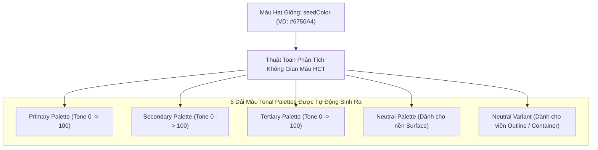
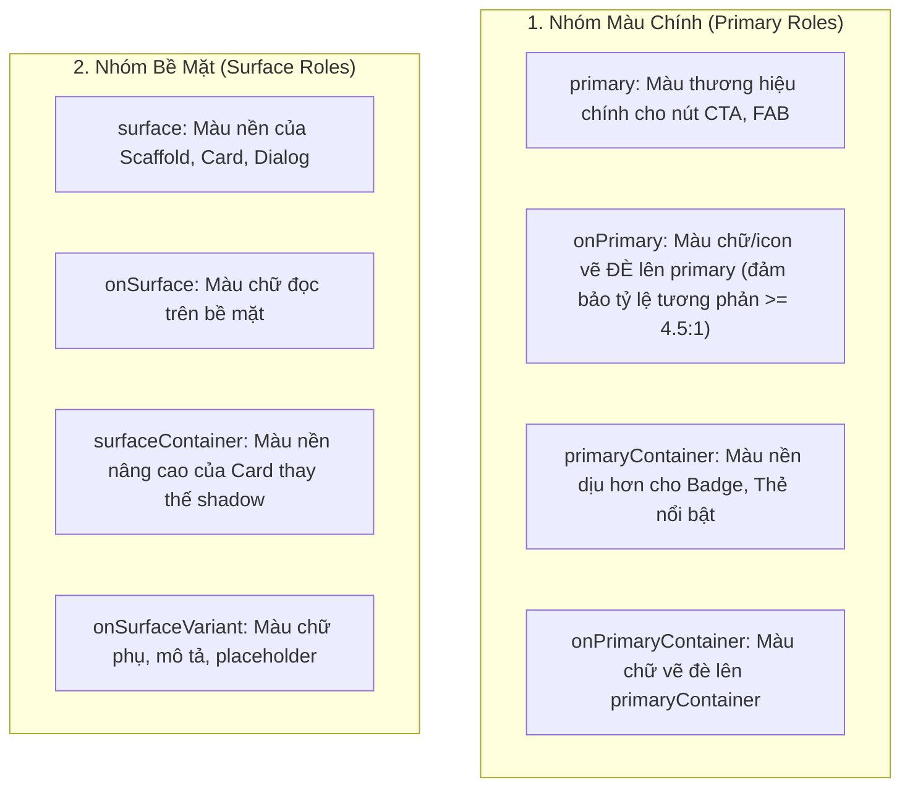
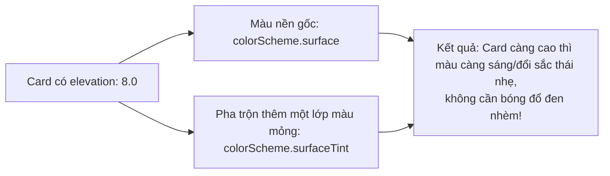

# Chuyên Đề 05 - Bài 01: Material 3 & Hệ Thống Bảng Màu Tự Động (ColorScheme.fromSeed)

> **Trọng tâm**: Cuộc cách mạng Material 3 (Material You), Không gian màu HCT (Hue - Chroma - Tone), Cơ chế sinh bảng màu Tonal Palettes từ `ColorScheme.fromSeed`, Bản chất của Surface Tonal Elevation (`surfaceTint`) thay thế Drop Shadow, và bộ câu hỏi phỏng vấn tuyển dụng top tech.

---

## 1. Cuộc Cách Mạng Material 3: Không Gian Màu HCT & Tonal Palettes

Trong Material 2 trước đây, lập trình viên thường tự phối màu theo hệ RGB/HSV. Điều này dẫn đến vấn đề: Hai màu có cùng giá trị "Value" trong HSV nhưng mắt người lại cảm nhận độ sáng hoàn toàn khác nhau (ví dụ: Màu vàng trông sáng chói mắt trong khi màu xanh lam lại trông rất tối).

Để khắc phục triệt để, Google đã phát minh ra không gian màu **HCT (Hue, Chroma, Tone)** cho Material 3:
- **Hue (0 - 360)**: Sắc thái màu (Đỏ, Vàng, Xanh...).
- **Chroma (0 - 120+)**: Độ tinh khiết, rực rỡ của màu.
- **Tone (0 - 100)**: **Độ chói quang học thực tế mà mắt người cảm nhận (Perceptual Luminance)**. Điểm độc nhất vô nhị: Ở Tone 90, mọi màu sắc đều có độ tương phản và độ sáng nhận biết y hệt nhau đối với mắt người!



---

## 2. Hệ Thống Vai Trò Màu Sắc (Color Roles) Chuẩn Google

Thay vì gán màu cứng như `Colors.blue` hay `Colors.grey[200]`, Material 3 phân chia màu theo **vai trò ngữ nghĩa (Semantic Roles)** để tự động thích ứng với Dark/Light mode và độ tương phản trợ năng (Accessibility Contrast):



### Bảng Tra Cứu Toàn Diện Các Vai Trò Màu Sắc:

| Nhóm Màu | Thuộc Tính Trong `colorScheme` | Ý Nghĩa Thiết Kế & Ứng Dụng |
| :--- | :--- | :--- |
| **Primary** | `primary` / `onPrimary` | Màu đại diện thương hiệu chính. Dùng cho nút bấm quan trọng nhất, thanh chỉ mục đang chọn. |
| **Primary Container** | `primaryContainer` / `onPrimaryContainer` | Khối nền nhạt cùng họ với primary. Dùng cho Chip được chọn, Badge thông báo. |
| **Secondary** | `secondary` / `onSecondary` | Màu phụ bổ trợ, ít gây chú ý hơn. Dùng cho Filter Chips, Switch, Slider. |
| **Tertiary** | `tertiary` / `onTertiary` | Màu thứ ba tạo sự cân bằng và tương phản nghệ thuật (Accent color). |
| **Surface** | `surface` / `onSurface` | Nền chính của ứng dụng và màu chữ văn bản chính. |
| **Surface Container** | `surfaceContainer` (Low/High/Highest) | Các mức độ nền của Card và Dialog khi xếp lớp lên trên Scaffold. |
| **Outline** | `outline` / `outlineVariant` | Màu đường viền chia tách các phần tử (Divider, Border của TextField). |
| **Error** | `error` / `onError` | Màu cảnh báo nguy hiểm, xóa dữ liệu, validate lỗi. |

---

## 3. Bản Chất Của Surface Tonal Elevation (`surfaceTint`)

Trong Material 2, độ cao (Elevation) của một widget được biểu diễn bằng **đổ bóng (Drop Shadow)**: `elevation: 4.0` làm bóng đen đậm hơn.  
Trong Material 3, Google đã **loại bỏ bóng đổ thô cứng** và thay thế bằng **Tonal Elevation (Nâng Tông Màu Bề Mặt)**:



> [!TIP]
> Nếu bạn muốn tắt hiệu ứng phủ màu này và quay về màu trắng tinh khôi:  
> `CardTheme(surfaceTintColor: Colors.transparent)`

---

## 4. Cấu Hình Theme Chuẩn & Hỗ Trợ Dynamic Color (Android 12+)

```dart
import 'package:flutter/material.dart';

class AppTheme {
  static ThemeData light() {
    return ThemeData(
      useMaterial3: true,
      colorScheme: ColorScheme.fromSeed(
        seedColor: const Color(0xFF1E88E5), // Xanh dương thương hiệu
        brightness: Brightness.light,
      ),
    );
  }

  static ThemeData dark() {
    return ThemeData(
      useMaterial3: true,
      colorScheme: ColorScheme.fromSeed(
        seedColor: const Color(0xFF1E88E5),
        brightness: Brightness.dark, // Tự động đảo Tone để chữ luôn tương phản đọc được!
      ),
    );
  }
}
```

---

## 🎯 Góc Phỏng Vấn Tuyển Dụng (Google & Top Tech Interview Q&A)

### Câu hỏi 1: Tại sao Google lại thay thế không gian màu RGB/HSV truyền thống bằng không gian màu HCT (Hue, Chroma, Tone) trong Material 3? Không gian màu này giải quyết bài toán gì cho khả năng tiếp cận (Accessibility - a11y)?

#### 🎯 Điểm Đánh Giá Benchmark 10/10:
1. **Hạn chế của RGB/HSV (Perceptual Non-uniformity)**:
   - Trong không gian màu toán học (sRGB, HSV), giá trị "Lightness" hay "Value" không tương đồng với độ sáng mà mắt người thực sự cảm nhận (Perceived Luminance).
   - Ví dụ: Màu vàng thuần túy (`#FFFF00`) và màu xanh lam thuần túy (`#0000FF`) đều có Value = 100% trong HSV, nhưng mắt người cảm nhận màu vàng sáng chói gấp nhiều lần màu xanh lam do cấu trúc tế bào nón của võng mạc nhạy cảm với bước sóng xanh lục/vàng hơn. Do đó, việc chọn màu tương phản cho chữ vẽ đè lên trong hệ RGB thường xuyên bị sai lệch.
2. **Ưu điểm vượt trội của HCT trong Material 3**:
   - Trục **Tone** (từ 0 đến 100) trong HCT đo lường chính xác độ chói nhận thức của mắt người dựa trên mô hình màu CAM16.
   - Bất kỳ hai màu nào có cùng chỉ số Tone thì mắt người sẽ cảm nhận chúng có độ sáng tương đương nhau 100%.
   - **Giải quyết bài toán Accessibility**: Tiêu chuẩn WCAG đòi hỏi tỷ lệ tương phản giữa chữ và nền tối thiểu là $4.5:1$ (chuẩn AA) hoặc $7:1$ (chuẩn AAA). Với HCT, thuật toán của Google đảm bảo toán học: Chỉ cần độ lệch Tone giữa `color` và `onColor` chênh lệch nhau từ $\ge 40$ đơn vị, tỷ lệ tương phản $4.5:1$ luôn luôn được đảm bảo tuyệt đối trên mọi màu sắc mà lập trình viên không cần phải đo đạc thủ công!

---

### Câu hỏi 2: Phân tích sự khác biệt cốt lõi giữa cơ chế Elevation của Material 2 (Shadow-based) và Material 3 (Surface Tonal Elevation với `surfaceTint`). Làm thế nào để điều khiển hoặc tắt hiệu ứng này khi dự án yêu cầu màu nền phẳng (Flat Design)?

#### 🎯 Điểm Đánh Giá Benchmark 10/10:
1. **Material 2 (Shadow-based Elevation)**:
   - Thể hiện độ cao của các lớp giao diện bằng cách vẽ đổ bóng đen (Drop Shadow) bên dưới widget.
   - Giá trị `elevation` càng cao thì bán kính mờ (blur radius) và độ lệch bóng (offset) càng lớn.
   - Nhược điểm: Trên màn hình Dark Mode, nền ứng dụng vốn đã có màu đen/xám tối, việc vẽ bóng đen đổ lên nền đen gần như vô hình, khiến người dùng không thể nhận biết được độ nổi của Card hay Dialog.
2. **Material 3 (Surface Tonal Elevation)**:
   - Loại bỏ hoặc giảm thiểu tối đa bóng đổ. Thay vào đó, độ cao được biểu diễn bằng cách **pha trộn một tỷ lệ màu mỏng của `colorScheme.surfaceTint` lên trên màu nền `colorScheme.surface`**.
   - Widget có `elevation` càng cao (VD: Dialog = 6.0, Card = 1.0) thì tỷ lệ phần trăm màu `surfaceTint` phủ lên càng đậm.
   - Nhờ vậy, trên cả Light Mode lẫn Dark Mode, các phần tử nổi lên trên luôn có sắc thái màu sáng hơn nền một cách tự nhiên và tinh tế.
3. **Cách tùy biến hoặc tắt hiệu ứng để làm Flat Design**:
   - Nếu dự án yêu cầu màu nền Card hoặc NavigationBar hoàn toàn đồng nhất không bị đổi màu theo elevation:
     ```dart
     ThemeData(
       useMaterial3: true,
       // Tắt toàn cục: Đặt surfaceTintColor về trong suốt
       cardTheme: const CardTheme(surfaceTintColor: Colors.transparent),
       navigationBarTheme: const NavigationBarThemeData(surfaceTintColor: Colors.transparent),
     )
     ```

---

### Câu hỏi 3: Khái niệm "Color Roles" trong Material 3 khác biệt như thế nào so với cách khai báo màu tĩnh thông thường (`Colors.blue`, `Colors.grey`)? Tại sao việc sử dụng Color Roles lại là điều kiện tiên quyết để hỗ trợ chế độ màu động (Dynamic Color - Material You)?

#### 🎯 Điểm Đánh Giá Benchmark 10/10:
1. **Bản chất của Color Roles (Tính trừu tượng ngữ nghĩa)**:
   - Thay vì gắn chặt một thành phần UI với một mã màu hex cụ thể (`#2196F3`), Color Roles gán thành phần đó với một **vai trò chức năng** trong hệ thống thiết kế: "Đây là phần tử chính cần chú ý nhất (`primary`)", "Đây là chữ nằm trên nền chính (`onPrimary`)", "Đây là khối nền phụ trợ (`secondaryContainer`)".
   - Tính trừu tượng này giúp tách biệt hoàn toàn giữa cấu trúc Widget và Bảng màu hiển thị.
2. **Mối quan hệ với Dynamic Color (Material You)**:
   - Trên Android 12+, tính năng Dynamic Color trích xuất các màu chủ đạo từ hình nền (Wallpaper) của người dùng để sinh ra bảng màu cá nhân hóa theo thời gian thực.
   - Nếu bạn viết màu cứng (`Colors.blue`), giao diện của bạn sẽ đứng ngoài hệ sinh thái cá nhân hóa này.
   - Nếu bạn tuân thủ Color Roles và lấy màu qua `Theme.of(context).colorScheme`: Khi hệ điều hành thay đổi hình nền, toàn bộ ứng dụng của bạn sẽ tự động khoác lên một bảng màu hài hòa mới đồng bộ với thiết bị mà không cần sửa bất kỳ dòng code UI nào!
