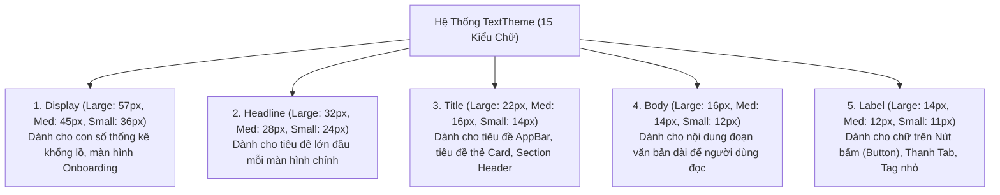

# Chuyên Đề 05 - Bài 02: Hệ Thống Kiểu Chữ (Typography & TextTheme) Chuẩn Google

> **Trọng tâm**: 15 kiểu chữ phân cấp trong Material 3 `TextTheme`, Bản chất tham số chiều cao dòng `height`, Sự thay thế mang tính cách mạng của `TextScaler` (Flutter 3.16+) thay thế `textScaleFactor`, Đối chiếu nhúng Font cục bộ vs `google_fonts`, và bộ câu hỏi phỏng vấn tuyển dụng top tech.

---

## 1. 15 Kiểu Chữ Phân Cấp Chuẩn Material 3

Material 3 chuẩn hóa toàn bộ hệ thống Typography thành **5 nhóm ngữ nghĩa**, mỗi nhóm chia làm 3 cấp độ (**Large, Medium, Small**):



---

## 2. Giải Mã Tham Số `height` Trong `TextStyle`

Một trong những sai lầm phổ biến nhất của lập trình viên là nghĩ rằng `height` trong `TextStyle` nhận giá trị bằng pixel (như trong CSS `line-height: 24px`):

```dart
// ❌ SAI LẦM TAI HẠI:
TextStyle(fontSize: 16, height: 24.0) // 💥 Chiều cao dòng sẽ thành: 16 * 24 = 384px!

// ✅ CÁCH TÍNH CHUẨN XÁC:
// height trong Flutter là HỆ SỐ NHÂN (Multiplier) với fontSize:
// Chiều cao dòng thực tế (px) = fontSize * height
TextStyle(
  fontSize: 16,
  height: 1.5, // 16 * 1.5 = 24.0px chiều cao dòng!
)
```

> [!TIP]
> **Căn giữa quang học (Vertical Centering)**:  
> Đôi khi các phông chữ có phần đệm trên và dưới không đều (font glyph padding). Để chữ nằm chính giữa nút bấm hoặc badge hoàn hảo, hãy sử dụng:  
> `leadingDistribution: TextLeadingDistribution.even`.

---

## 3. Cuộc Cách Mạng `TextScaler` (Flutter 3.16+)

Trước phiên bản Flutter 3.16, hệ thống sử dụng:
```dart
// ❌ CÁCH CŨ (Linear Scaling):
final scaleFactor = MediaQuery.of(context).textScaleFactor;
```

### Hạn chế của Linear Scaling:
Nếu người lớn tuổi bật phóng to chữ 200% (`scaleFactor = 2.0`):
- Chữ nội dung `14px` $\rightarrow$ Phóng to thành `28px` (Rất tốt, dễ đọc).
- Nhưng chữ tiêu đề `32px` $\rightarrow$ Phóng to thành **`64px` khổng lồ**, chiếm trọn màn hình làm tràn vạch vàng đen và phá vỡ nát toàn bộ giao diện!

### ✅ Giải Pháp Mới: Non-linear Font Scaling (`TextScaler`)
Flutter 3.16 thay thế bằng đối tượng `TextScaler` áp dụng thuật toán phóng to phi tuyến tính: Chữ nhỏ phóng to nhiều hơn, chữ to phóng to ít hơn:

```dart
// Đọc TextScaler từ context
final textScaler = MediaQuery.textScalerOf(context);

// Tính toán kích thước chữ sau khi scale:
final actualSize = textScaler.scale(16.0);

// Nếu muốn chặn trần để giao diện không bị vỡ trên các màn hình đặc thù:
MediaQuery(
  data: MediaQuery.of(context).copyWith(
    textScaler: MediaQuery.textScalerOf(context).clamp(
      minScaleFactor: 0.8,
      maxScaleFactor: 1.4, // Chặn tối đa không cho phóng to quá 1.4 lần
    ),
  ),
  child: const MyScreen(),
)
```

---

## 4. Đối Chiếu: Local Font Assets vs `google_fonts`

| Tiêu Chí Đánh Giá | Nhúng Font Cục Bộ (Local Assets) | Thư Viện `google_fonts` |
| :--- | :--- | :--- |
| **Cách triển khai** | Tải file `.ttf`/`.otf` về đặt trong thư mục `assets/fonts/` và khai báo `pubspec.yaml`. | Gọi trực tiếp qua code Dart: `GoogleFonts.inter()`. |
| **Hoạt động Offline** | **100% Ổn định**. Không bao giờ lo mất mạng hoặc trễ tải font. | Tải font từ Internet ở lần đầu mở app, lưu vào cache. Nếu mất mạng lần đầu, fallback về font hệ thống. |
| **Dung lượng App** | Làm tăng kích thước file `.apk`/`.ipa` (mỗi file font tốn khoảng 500KB - 2MB). | Tối ưu dung lượng app ban đầu. Có thể cấu hình đóng gói kèm asset nếu muốn. |
| **Khuyến nghị sử dụng** | **Bắt buộc cho dự án Ngân hàng, Doanh nghiệp lớn** cần đảm bảo tính bảo mật và trải nghiệm offline đồng nhất. | Thích hợp cho MVP, Prototype, ứng dụng cần thử nghiệm nhiều phong cách thiết kế nhanh chóng. |

---

## 🎯 Góc Phỏng Vấn Tuyển Dụng (Google & Top Tech Interview Q&A)

### Câu hỏi 1: Trong `TextStyle`, tham số `height` có đơn vị tính là gì? Tại sao việc đặt `height: 24.0` cho một đoạn chữ có `fontSize: 16.0` lại gây ra lỗi hiển thị khoảng trống khổng lồ?

#### 🎯 Điểm Đánh Giá Benchmark 10/10:
1. **Bản chất của tham số `height` trong Flutter**:
   - Trong Flutter, `height` không phải là một kích thước tuyệt đối theo pixel hay điểm logic (dp) như thuộc tính `line-height` của CSS.
   - `height` là một **hệ số tỷ lệ không thứ nguyên (Unitless Multiplier)** so với `fontSize`.
   - Công thức tính khoảng cách dòng thực tế bên dưới tầng RenderParagraph của Flutter là:
     $$\text{Line Height (px)} = \text{fontSize} \times \text{height}$$
2. **Giải thích hiện tượng lỗi**:
   - Nếu khai báo `fontSize: 16.0` và `height: 24.0`, chiều cao của một dòng văn bản sẽ bị thổi phồng lên thành:
     $$16.0 \times 24.0 = \mathbf{384.0 \text{ px!}}$$
   - Mỗi dòng chữ đơn lẻ sẽ chiếm một khoảng không gian cao tới 384px trên màn hình, khiến các dòng cách xa nhau thăm thẳm và làm tràn màn hình nghiêm trọng.
   - Để đạt được khoảng cách dòng $24\text{px}$ tương đương thiết kế Figma, công thức đúng là lấy $\text{lineHeight} / \text{fontSize} = 24 / 16 = \mathbf{1.5}$.

---

### Câu hỏi 2: Tại sao từ Flutter 3.16, Google lại khai tử (deprecate) thuộc tính `textScaleFactor` trên `MediaQueryData` và thay thế bằng `TextScaler`? Cơ chế Non-linear font scaling giải quyết vấn đề gì?

#### 🎯 Điểm Đánh Giá Benchmark 10/10:
1. **Hạn chế của `textScaleFactor` (Linear Scaling)**:
   - `textScaleFactor` là một số thực đơn giản (double). Khi người dùng thay đổi kích thước chữ trong cài đặt hệ thống (Accessibility Settings), Flutter nhân số thực này đồng loạt lên toàn bộ mọi kích thước chữ.
   - Phép nhân tuyến tính gây ra vấn đề nghiêm trọng: Một đoạn chữ nhỏ (12px) nhân 2 lên 24px thì đọc rất tốt; nhưng tiêu đề màn hình vốn đã to (36px) bị nhân 2 thành 72px sẽ làm vỡ nát toàn bộ hệ thống layout (Row, AppBar, Dialog), gây ra dải sọc vàng đen Overflow không thể cứu vãn.
2. **Cơ chế phi tuyến tính của `TextScaler`**:
   - `TextScaler` là một lớp trừu tượng định nghĩa phương thức `scale(double fontSize)`.
   - Trên Android 14+ và iOS hiện đại, hệ điều hành hỗ trợ **Non-linear Font Scaling**: Chữ nhỏ được phóng to với tỷ lệ cao hơn nhiều, trong khi chữ tiêu đề lớn chỉ được phóng to nhẹ hoặc giữ nguyên kích thước.
   - `TextScaler` cho phép Flutter bắt kịp chuẩn công nghệ này của hệ điều hành, đồng thời cung cấp API tiện dụng `TextScaler.clamp()` giúp nhà phát triển dễ dàng đặt chặn giới hạn trần và sàn để bảo vệ độ ổn định của giao diện.

---

### Câu hỏi 3: So sánh việc nhúng Font cục bộ (Local Font Assets) và sử dụng thư viện `google_fonts` trong ứng dụng Flutter quy mô Production. Những rủi ro nào cần cân nhắc (Network latency, App size, Offline mode, Font licensing)?

#### 🎯 Điểm Đánh Giá Benchmark 10/10:
1. **Phân tích phương án `google_fonts`**:
   - *Ưu điểm*: Cực kỳ nhanh chóng, không tốn công tải font thủ công, không làm tăng dung lượng file cài đặt ứng dụng (IPA/APK ban đầu nhẹ hơn).
   - *Rủi ro*:
     - **Hiện tượng nhảy phông (FOUT - Flash of Unstyled Text)**: Lần đầu tiên mở app khi chưa có mạng, ứng dụng sẽ render bằng font mặc định của máy, vài giây sau khi tải xong font từ server Google mới giật một cái để đổi sang font mới, tạo cảm giác thiếu chuyên nghiệp.
     - **Rủi ro mạng và quy định doanh nghiệp**: Trong môi trường mạng nội bộ hoặc các quốc gia chặn dịch vụ của Google, font có thể không bao giờ tải về được.
2. **Phân tích phương án Nhúng Font Cục Bộ (Local Assets)**:
   - *Ưu điểm*: Hoạt động ổn định 100% trong mọi điều kiện mạng (Offline-ready), không có độ trễ tải, hiển thị đồng nhất tuyệt đối trên mọi thiết bị.
   - *Rủi ro*: Mỗi biến thể font (Regular, Bold, Italic) chiếm khoảng vài trăm KB đến hàng MB, làm tăng kích thước bundle của ứng dụng.
3. **Vấn đề Bản quyền (Font Licensing)**:
   - Khi nhúng font vào ứng dụng thương mại, lập trình viên phải kiểm tra kỹ giấy phép (OFL - Open Font License hay Commercial License). Sử dụng font không có bản quyền hợp lệ có thể dẫn đến rủi ro pháp lý và bị gỡ app khỏi App Store / Google Play Store.
