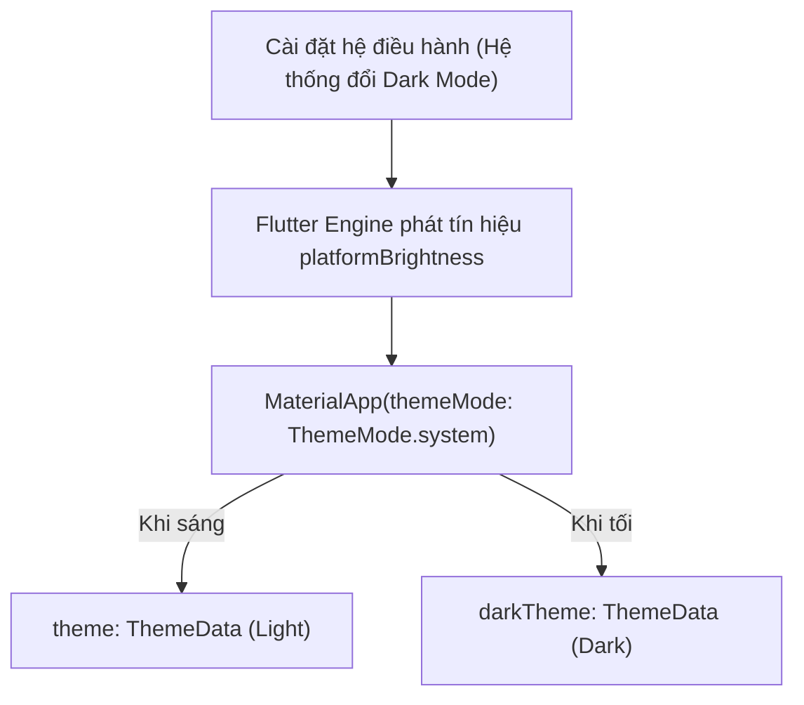
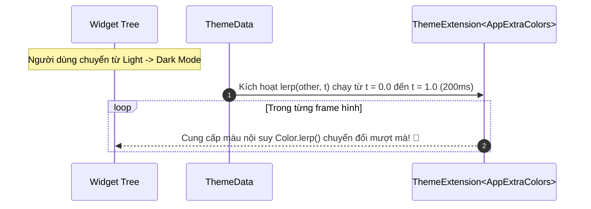

# Chuyên Đề 05 - Bài 03: Chế Độ Dark / Light Mode & Mở Rộng Theme Với ThemeExtension

> **Trọng tâm**: Đồng bộ Dark/Light Mode với hệ điều hành (`ThemeMode.system`), Nhược điểm chết người của việc dùng hằng số màu tĩnh (`AppColors`), Làm chủ `ThemeExtension<T>` với phương thức nội suy `lerp()`, Kiến trúc lưu trữ bền vững trạng thái Theme, và bộ câu hỏi phỏng vấn tuyển dụng top tech.

---

## 1. Cơ Chế Chuyển Đổi Dark / Light Mode Trong Flutter

Flutter cung cấp cơ chế chuyển đổi Theme tích hợp sẵn thông qua `MaterialApp`:



- **`ThemeMode.system`**: Tự động chuyển đổi theo cài đặt của điện thoại (iOS / Android).
- **`ThemeMode.light`**: Khóa cứng chế độ sáng.
- **`ThemeMode.dark`**: Khóa cứng chế độ tối.

---

## 2. Thảm Họa Dùng Hằng Số Tĩnh: Tại Sao `AppColors` Lại Là Anti-Pattern?

Rất nhiều lập trình viên tổ chức màu sắc như sau:

```dart
// ❌ ANTI-PATTERN KINH ĐIỂN:
class AppColors {
  static const Color success = Colors.green;
  static const Color warning = Colors.orange;
}
```

### Tại sao cách này phá vỡ hệ thống?
1. **Không thích ứng Dark Mode**: Màu `Colors.green` chói lọi trông rất đẹp trên nền trắng, nhưng khi người dùng chuyển sang nền đen, màu xanh này sẽ bị chói mắt và phá vỡ độ tương phản thị giác.
2. **Triệt tiêu Animation chuyển Theme**: Khi người dùng gạt cần chuyển Theme, Flutter thực hiện một hiệu ứng chuyển màu mượt mà trong $200\text{ms}$. Màu tĩnh trong class `AppColors` sẽ giật cục một phát ăn ngay mà không có bất kỳ chuyển động mềm mại nào!

---

## 3. Giải Pháp Doanh Nghiệp Chuẩn Google: `ThemeExtension<T>`

Từ Flutter 3.0, Google giới thiệu **`ThemeExtension<T>`** cho phép bạn gắn thêm bất kỳ Design Token tùy biến nào (Màu cảnh báo, Gradient, Bóng đổ) vào thẳng `ThemeData`:



### Bước 1: Khởi Tạo Lớp Mở Rộng Kế Thừa `ThemeExtension`

```dart
import 'package:flutter/material.dart';

@immutable
class AppExtraColors extends ThemeExtension<AppExtraColors> {
  final Color success;
  final Color warning;
  final Gradient brandGradient;

  const AppExtraColors({
    required this.success,
    required this.warning,
    required this.brandGradient,
  });

  // 1. Phương thức copyWith
  @override
  AppExtraColors copyWith({
    Color? success,
    Color? warning,
    Gradient? brandGradient,
  }) {
    return AppExtraColors(
      success: success ?? this.success,
      warning: warning ?? this.warning,
      brandGradient: brandGradient ?? this.brandGradient,
    );
  }

  // 2. Phương thức lerp: Tạo hoạt họa biến đổi màu mượt mà theo hệ số t (0.0 -> 1.0)
  @override
  AppExtraColors lerp(ThemeExtension<AppExtraColors>? other, double t) {
    if (other is! AppExtraColors) return this;
    return AppExtraColors(
      success: Color.lerp(success, other.success, t)!,
      warning: Color.lerp(warning, other.warning, t)!,
      brandGradient: Gradient.lerp(brandGradient, other.brandGradient, t)!,
    );
  }
}
```

### Bước 2: Đăng Ký Vào `ThemeData`

```dart
// Theme Sáng
final lightTheme = ThemeData(
  useMaterial3: true,
  brightness: Brightness.light,
  extensions: const [
    AppExtraColors(
      success: Color(0xFF2E7D32), // Xanh lá đậm
      warning: Color(0xFFED6C02), // Cam sáng
      brandGradient: LinearGradient(colors: [Colors.blue, Colors.purple]),
    ),
  ],
);

// Theme Tối
final darkTheme = ThemeData(
  useMaterial3: true,
  brightness: Brightness.dark,
  extensions: const [
    AppExtraColors(
      success: Color(0xFF81C784), // Xanh lá pastel dịu mắt trên nền đen
      warning: Color(0xFFFFB74D), // Cam dịu
      brandGradient: LinearGradient(colors: [Colors.indigo, Colors.deepPurple]),
    ),
  ],
);
```

### Bước 3: Viết Extension Method Trên `BuildContext` Để Truy Xuất Cực Tiện

```dart
extension ThemeContextExtension on BuildContext {
  AppExtraColors get extraColors => 
      Theme.of(this).extension<AppExtraColors>()!;
}

// Sử dụng trong bất kỳ đâu:
class OrderSuccessBadge extends StatelessWidget {
  const OrderSuccessBadge({super.key});

  @override
  Widget build(BuildContext context) {
    return Container(
      // ✅ Tự động đổi sắc thái màu hoàn hảo giữa Light và Dark Mode!
      color: context.extraColors.success,
      padding: const EdgeInsets.all(8),
      child: const Text('Thanh toán thành công'),
    );
  }
}
```

---

## 4. Kiến Trúc Lưu Trữ Bền Vững (Theme Persistence)

Để lưu lại lựa chọn của người dùng khi khởi động lại app:

```dart
class ThemeController extends ValueNotifier<ThemeMode> {
  ThemeController() : super(ThemeMode.system) {
    _loadThemeFromPrefs();
  }

  static const _prefKey = 'user_theme_mode';

  Future<void> _loadThemeFromPrefs() async {
    // Đọc từ SharedPreferences...
    // value = ThemeMode.values[savedIndex];
  }

  Future<void> changeTheme(ThemeMode mode) async {
    value = mode;
    // Lưu vào SharedPreferences...
  }
}
```

---

## 🎯 Góc Phỏng Vấn Tuyển Dụng (Google & Top Tech Interview Q&A)

### Câu hỏi 1: Tại sao việc sử dụng một class hằng số tĩnh (`static const Color success = Colors.orange`) lại bị coi là một Anti-Pattern khi xây dựng Design System trong Flutter? `ThemeExtension<T>` giải quyết vấn đề này như thế nào?

#### 🎯 Điểm Đánh Giá Benchmark 10/10:
1. **Lý do class hằng số tĩnh là Anti-Pattern**:
   - **Mất khả năng thích ứng động theo ngữ cảnh (Context-Insensitive)**: Một mã màu cố định không thể nhận biết được màn hình hiện tại đang ở chế độ Light hay Dark Mode. Một màu cam rực rỡ có thể hợp chuẩn trên nền sáng nhưng lại gây chói mắt và phá vỡ tiêu chuẩn tương phản trên nền tối.
   - **Triệt tiêu cơ chế kế thừa (Inherited Scope)**: Bạn không thể override màu sắc cục bộ cho một nhánh widget con (Sub-tree theming).
   - **Phá vỡ hoạt họa chuyển theme**: Flutter hỗ trợ chuyển đổi mượt mà giữa các ThemeData trong 200ms. Dùng biến `static const` khiến màu sắc bị giật cục, không có khả năng nội suy màu trung gian.
2. **Cách `ThemeExtension<T>` giải quyết triệt để**:
   - Tích hợp trực tiếp vào đối tượng `ThemeData` và trở thành một phần của cây `InheritedTheme`.
   - Cho phép định nghĩa hai bộ giá trị độc lập cho Light và Dark mode.
   - Khi `Theme.of(context)` thay đổi, widget tự động nhận được màu sắc tương ứng mà không cần viết các câu lệnh điều kiện `if (isDark) ...` thủ công.

---

### Câu hỏi 2: Hãy giải thích vai trò của phương thức `lerp(ThemeExtension<T>? other, double t)` trong `ThemeExtension`. Tham số `t` biểu diễn điều gì và điều gì xảy ra nếu hàm này trả về giá trị cố định thay vì nội suy?

#### 🎯 Điểm Đánh Giá Benchmark 10/10:
1. **Vai trò của phương thức `lerp` (Linear Interpolation - Nội suy tuyến tính)**:
   - Khi thuộc tính `theme` của `MaterialApp` thay đổi, Flutter kích hoạt một hiệu ứng chuyển cảnh ngầm định thông qua `ThemeData.lerp(a, b, t)`.
   - Phương thức `lerp` trên `ThemeExtension` có nhiệm vụ tính toán giá trị trung gian giữa cấu hình Theme cũ (`this`) và cấu hình Theme mới (`other`).
2. **Ý nghĩa của tham số `t`**:
   - `t` là một số thực chạy từ `0.0` đến `1.0`, đại diện cho tiến trình thời gian của hoạt họa chuyển Theme (thường diễn ra trong 200ms với đường cong `Curves.linear`).
   - Tại `t = 0.0`: Giá trị là của Theme cũ 100%.
   - Tại `t = 0.5`: Giá trị là sự pha trộn hoàn hảo 50-50 giữa màu cũ và màu mới.
   - Tại `t = 1.0`: Giá trị đạt tới Theme mới 100%.
3. **Hậu quả nếu không thực hiện nội suy (Trả về giá trị cố định)**:
   - Nếu bạn viết `return other ?? this;` mà không dùng `Color.lerp()`, hiệu ứng chuyển đổi mềm mại sẽ biến mất. Toàn bộ các thành phần sử dụng extension này sẽ bị giật khung hình (snapping) đổi màu tức thì ngay giữa quá trình các thành phần Material khác đang đổi màu từ từ, tạo cảm giác UI bị lỗi nhấp nháy.

---

### Câu hỏi 3: Làm thế nào để xây dựng một kiến trúc quản lý Dark / Light Mode hoàn chỉnh trong Flutter cho phép: (1) Đồng bộ theo hệ thống, (2) Cho phép người dùng chuyển đổi thủ công trong App, và (3) Lưu trữ bền vững (Persist) qua các lần khởi động lại?

#### 🎯 Điểm Đánh Giá Benchmark 10/10:
1. **Mô hình State Management (Ví dụ với `ChangeNotifier` hoặc `ValueNotifier`)**:
   - Tạo một `ThemeController` nắm giữ trạng thái `ThemeMode` (gồm 3 giá trị: `system`, `light`, `dark`).
   - Cung cấp phương thức `setThemeMode(ThemeMode mode)` để cập nhật trạng thái và phát tín hiệu `notifyListeners()`.
2. **Cơ chế Lưu trữ bền vững (Persistence Layer)**:
   - Khi khởi động ứng dụng (trước hoặc trong `runApp`), đọc giá trị đã lưu trong `SharedPreferences` (lưu dưới dạng string như `'system'`, `'light'`, `'dark'`).
   - Khi người dùng chọn chế độ mới qua UI Setting, lưu ngay giá trị đó xuống local storage.
3. **Kết nối vào gốc cây Widget (`MaterialApp`)**:
   - Lắng nghe `ThemeController` ở gốc ứng dụng thông qua `ListenableBuilder` (hoặc `BlocBuilder` / `watch`):
     ```dart
     ListenableBuilder(
       listenable: themeController,
       builder: (context, _) {
         return MaterialApp(
           themeMode: themeController.value,
           theme: AppTheme.lightTheme,
           darkTheme: AppTheme.darkTheme,
           // ...
         );
       },
     )
     ```
   - Khi `themeMode: ThemeMode.system`, Flutter sẽ tự động đăng ký với `Window/PlatformDispatcher` để lắng nghe sự kiện đổi màu của hệ điều hành mà không cần viết thêm bất kỳ logic lắng nghe native nào!
