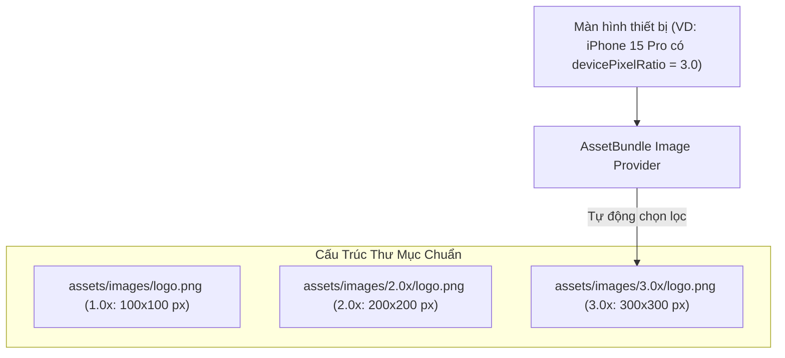
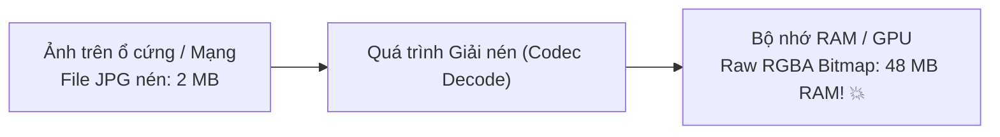

# Chuyên Đề 05 - Bài 04: Quản Lý Assets, Vector SVG & Tối Ưu Hóa Bộ Nhớ Ảnh

> **Trọng tâm**: Cơ chế chọn lọc mật độ điểm ảnh (`1.0x`, `2.0x`, `3.0x`), Tích hợp Vector SVG và đổi màu linh hoạt với `ColorFilter`, Bản chất toán học của thảm họa tràn RAM khi giải nén ảnh, Bí quyết tối ưu 95% bộ nhớ với `cacheWidth`/`cacheHeight`, Cơ chế `ImageCache` & kỹ thuật `precacheImage()`, và bộ câu hỏi thẩm định năng lực kỹ thuật chuyên sâu.

---

## 1. Cơ Chế Lựa Chọn Mật Độ Điểm Ảnh (Resolution-Aware Assets)

Màn hình các thiết bị có tỷ lệ điểm ảnh vật lý so với điểm logic khác nhau (`devicePixelRatio`):
- Màn hình thông thường: `1.0x`
- Màn hình Retina / Full HD: `2.0x`
- Màn hình Super Retina / 2K / 4K: `3.0x`



Trong `pubspec.yaml`, bạn chỉ cần khai báo file gốc ở thư mục `1.0x`:
```yaml
flutter:
  assets:
    - assets/images/logo.png # Flutter tự động tìm các biến thể 2.0x và 3.0x!
```

---

## 2. Vector SVG & Đổi Màu Linh Hoạt Theo Theme

Đối với Icons, Huy hiệu và Logo, đồ họa vector SVG là lựa chọn số một vì không bị vỡ hạt khi phóng to và có dung lượng file siêu nhẹ:

```yaml
dependencies:
  flutter_svg: ^2.0.10+1
```

### Kỹ thuật đổi màu SVG theo Design Token:
Không bao giờ tạo 2 file SVG riêng biệt cho chế độ sáng và tối! Hãy dùng `ColorFilter`:

```dart
import 'package:flutter_svg/flutter_svg.dart';

SvgPicture.asset(
  'assets/icons/ic_notification.svg',
  width: 24,
  height: 24,
  // 🌟 Tự động đổi màu icon theo ColorScheme hiện tại!
  colorFilter: ColorFilter.mode(
    Theme.of(context).colorScheme.primary,
    BlendMode.srcIn,
  ),
)
```

---

## 3. Bản Chất Toán Học Của Thảm Họa Tràn RAM (OOM) Khi Load Ảnh

Nhiều lập trình viên lầm tưởng: *"Ảnh JPG tải về máy chỉ nặng 2MB, nên nó chỉ chiếm 2MB RAM"*.  
👉 **ĐÂY LÀ HIỂU LẦM TAI HẠI NHẤT TRONG LẬP TRÌNH MOBILE!**

### Công thức giải nén Bitmap của Skia / Impeller:
Một file JPG 2MB có thể có kích thước hình ảnh là **`4000 x 3000` pixels**. Khi đưa lên màn hình, Engine bắt buộc phải giải nén (decode) file nén đó thành một mảng điểm ảnh thô (Raw Uncompressed Bitmap) định dạng RGBA_8888 (mỗi pixel chiếm 4 bytes):

$$\text{RAM Tiêu Thụ} = \text{Width} \times \text{Height} \times 4 \text{ bytes}$$
$$\text{RAM Tiêu Thụ} = 4000 \times 3000 \times 4 = 48,000,000 \text{ bytes} \approx \mathbf{48 \text{ MB RAM / 1 bức ảnh!}}$$



> [!CAUTION]
> Nếu bạn hiển thị 20 bức ảnh như vậy trong một `ListView` mà không tối ưu, ứng dụng sẽ tiêu tốn **gần 1 GB RAM**, kích hoạt trình dọn rác OOM Killer của hệ điều hành và bị tắt ứng dụng ngay lập tức!

---

## 4. Cứu Tinh: `cacheWidth` & `cacheHeight`

Nhiều người sửa lỗi bằng cách: `Image.asset('...', width: 50, height: 50)`.  
⚠️ **Cách này HOÀN TOÀN KHÔNG GIẢM RAM!** Thuộc tính `width` và `height` trên widget `Image` chỉ đơn thuần là co nhỏ hình vẽ trên màn hình sau khi toàn bộ 48MB RAM đã bị nạp vào bộ nhớ!

### ✅ Giải pháp triệt để: Ra lệnh cho Codec giải nén thu nhỏ
Bằng cách chỉ định `cacheWidth` hoặc `cacheHeight`:

```dart
Image.asset(
  'assets/images/heavy_photo.jpg',
  // 🌟 Ra lệnh cho Skia/Impeller chỉ giải nén ở độ phân giải 100px:
  cacheWidth: 100, 
  width: 50, // Hiển thị 50dp trên màn hình 2x
  height: 50,
  fit: BoxFit.cover,
)
```

$$\text{RAM Mới} = 100 \times 75 \times 4 = 30,000 \text{ bytes} \approx \mathbf{0.03 \text{ MB RAM!}}$$
$\rightarrow$ **Tiết kiệm tới 99.9% bộ nhớ RAM!**

*(Đối với ảnh mạng, sử dụng `CachedNetworkImage` với tham số `memCacheWidth: 100`).*

---

## 5. Làm Chủ `ImageCache` & Kỹ Thuật `precacheImage()`

Flutter tích hợp sẵn một bộ nhớ đệm `ImageCache` toàn cục (nằm trong `PaintingBinding.instance.imageCache`):
- Giới hạn mặc định: Tối đa **1,000 bức ảnh** hoặc **100 MB**.

### Kỹ thuật Pre-warming Cache (Tải trước ảnh chống nhấp nháy trắng):
Khi người dùng chuẩn bị chuyển sang màn hình Thanh toán hoặc xem Banner quảng cáo, hãy gọi `precacheImage` trước để ảnh được nạp sẵn vào RAM:

```dart
@override
void didChangeDependencies() {
  super.didChangeDependencies();
  // Nạp sẵn ảnh vào RAM trước khi người dùng kịp bấm vào xem
  precacheImage(
    const AssetImage('assets/images/big_banner.png'),
    context,
  );
}
```

---

## 🎯 Thẩm Định Năng Lực & Phân Tích Chuyên Sâu (Technical Competency & Deep Dive)

### Câu hỏi 1: Phân biệt sự khác nhau giữa dung lượng file ảnh nén (Disk Storage: PNG, JPG) và dung lượng ảnh khi giải nén vào bộ nhớ RAM trong Flutter. Tại sao một bức ảnh JPG chỉ 2MB lại có thể làm ứng dụng bị Out-Of-Memory (OOM)?

#### 🎯 Điểm Đánh Giá Benchmark 10/10:
1. **Bản chất của file nén trên đĩa (Compressed Storage)**:
   - Các định dạng như JPG, PNG, WebP sử dụng các thuật toán nén dữ liệu (Discrete Cosine Transform, Huffman coding, Deflate) để giảm thiểu số byte lưu trữ trên ổ đĩa hoặc truyền qua mạng. Một bức ảnh độ phân giải cao 4K có thể được nén xuống chỉ còn 2MB.
2. **Bản chất khi giải nén vào RAM (Decoded Bitmap)**:
   - GPU và các tập lệnh vẽ đồ họa (Skia / Impeller / OpenGL / Metal) không thể vẽ trực tiếp từ định dạng JPG/PNG nén. Chúng bắt buộc phải giải nén (decode) bức ảnh đó thành một mảng ma trận pixel thô hai chiều (Raw RGBA Bitmap).
   - Mỗi pixel trong không gian màu 32-bit gồm 4 kênh màu: Đỏ (R), Xanh lục (G), Xanh lam (B), Độ trong suốt (A). Mỗi kênh chiếm 1 byte (8 bits) $\rightarrow$ Tổng cộng là 4 bytes cho mỗi pixel.
   - Dung lượng RAM tiêu thụ độc lập hoàn toàn với dung lượng file nén trên đĩa mà phụ thuộc duy nhất vào kích thước pixel:
     $$\text{Dung lượng RAM} = \text{Pixel Width} \times \text{Pixel Height} \times 4 \text{ bytes}$$
3. **Tại sao gây ra lỗi OOM**:
   - Ảnh chụp điện thoại thông thường có kích thước khoảng $4000 \times 3000$ pixels. Khi nạp vào RAM, bức ảnh 2MB trên ổ đĩa sẽ biến thành một khối bộ nhớ thô nặng tới $4000 \times 3000 \times 4 \approx \mathbf{48 \text{ MB}}$.
   - Nếu hiển thị một danh sách sản phẩm hoặc bộ sưu tập ảnh mà không giới hạn kích thước decode, RAM sẽ tăng vọt hàng trăm MB trong vài giây, kích hoạt cơ chế Low Memory Killer của hệ điều hành và văng app ngay lập tức.

---

### Câu hỏi 2: Tham số `cacheWidth` và `cacheHeight` trong Flutter hoạt động như thế nào bên dưới Skia / Impeller Engine? Chúng khác gì so với việc chỉ đặt thuộc tính `width` và `height` trên widget `Image`?

#### 🎯 Điểm Đánh Giá Benchmark 10/10:
1. **Thuộc tính `width` và `height` trên widget `Image`**:
   - Chỉ là ràng buộc không gian hiển thị của tầng Layout (RenderImage / RenderBox).
   - Quá trình decode ảnh ban đầu vẫn diễn ra ở độ phân giải gốc của bức ảnh (Full Resolution: ví dụ 4000x3000 $\rightarrow$ chiếm trọn 48MB RAM). Sau khi đã chiếm trọn 48MB trong bộ nhớ, Engine mới thực hiện thu nhỏ hình vẽ (down-scale) để vừa vặn với kích thước hộp 50x50 trên màn hình.
   - Do đó, việc đặt `width` và `height` trên widget **hoàn toàn không giúp tiết kiệm một byte RAM nào** trong quá trình giải nén!
2. **Tham số `cacheWidth` và `cacheHeight`**:
   - Can thiệp trực tiếp vào tầng cấp thấp `instantiateImageCodecWithSize` của Engine trước khi quá trình giải nén diễn ra.
   - Nó ra lệnh cho bộ giải mã hình ảnh (Image Codec) chỉ giải nén và nội suy bức ảnh ra một mảng bitmap có kích thước đúng bằng `cacheWidth` (ví dụ: 100px thay vì 4000px).
   - Bộ nhớ RAM cấp phát chỉ tương ứng với kích thước 100x75 (chưa đến 0.03MB). Điều này giảm tải áp lực bộ nhớ tới hàng trăm lần và tăng tốc độ giải nén đáng kể.

---

### Câu hỏi 3: Cơ chế hoạt động của `ImageCache` trong Flutter là gì? Khi nào bạn nên sử dụng hàm `precacheImage()` và làm thế nào để dọn dẹp bộ nhớ đệm ảnh khi nhận cảnh báo thiếu RAM từ hệ điều hành?

#### 🎯 Điểm Đánh Giá Benchmark 10/10:
1. **Cơ chế hoạt động của `ImageCache`**:
   - Là một singleton quản lý bộ nhớ đệm hình ảnh theo thuật toán LRU (Least Recently Used).
   - Duy trì 3 cấu trúc dữ liệu chính:
     - `_pendingImages`: Các ảnh đang trong quá trình tải hoặc giải nén.
     - `_cache`: Các ảnh đã giải nén xong và đang được lưu giữ trong RAM (giới hạn mặc định: 1000 ảnh và 100MB).
     - `_liveImages`: Các ảnh đang có ít nhất một widget trên màn hình tham chiếu tới.
2. **Khi nào nên dùng `precacheImage()`**:
   - Dùng khi bạn muốn loại bỏ hiện tượng nhấp nháy khung hình trắng (Flash of blank screen) khi mở màn hình mới hoặc khi chuyển đổi ảnh Banner.
   - `precacheImage()` kích hoạt quá trình fetch và decode ảnh bất đồng bộ ngay trong nền và lưu sẵn kết quả Bitmap vào `ImageCache`. Khi widget `Image` thực sự xuất hiện trên giao diện, nó lấy ngay Bitmap từ RAM ra vẽ trong $0\text{ms}$.
3. **Cách dọn dẹp bộ nhớ đệm khi nhận cảnh báo Low Memory**:
   - Lắng nghe sự kiện `WidgetsBindingObserver.didHaveMemoryPressure()`:
     ```dart
     @override
     void didHaveMemoryPressure() {
       super.didHaveMemoryPressure();
       // Dọn sạch toàn bộ các bức ảnh đang không hiển thị trên màn hình khỏi RAM:
       PaintingBinding.instance.imageCache.clear();
       PaintingBinding.instance.imageCache.clearLiveImages();
     }
     ```
