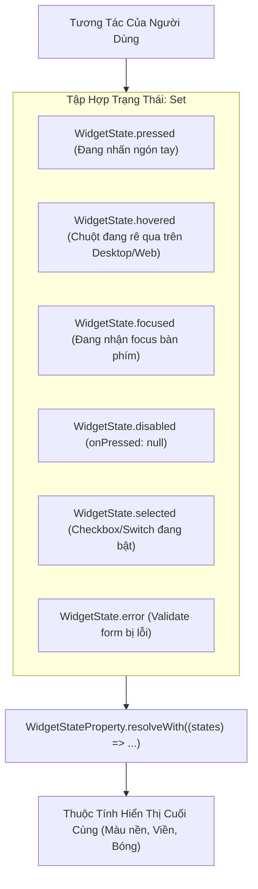

# Chuyên Đề 05 - Bài 05: Tùy Biến Giao Diện Linh Kiện & Làm Chủ WidgetStateProperty

> **Trọng tâm**: Chuẩn hóa Design System toàn cục với Component Themes trong `ThemeData` (`elevatedButtonTheme`, `inputDecorationTheme`, `cardTheme`), Làm chủ `WidgetStateProperty` (thay thế cho `MaterialStateProperty`), Xử lý các trạng thái tương tác đa tầng (`pressed`, `hovered`, `focused`, `disabled`), và bộ câu hỏi thẩm định năng lực kỹ thuật chuyên sâu.

---

## 1. Triết Lý Design System Của Google: Global Component Theming

Trong các dự án nghiệp dư, lập trình viên thường tự viết kiểu dáng cho từng nút bấm hoặc ô nhập liệu:

```dart
// ❌ CÁCH VIẾT THỦ CÔNG RẢI RÁC KHẮP APP:
ElevatedButton(
  style: ElevatedButton.styleFrom(
    backgroundColor: Colors.blue,
    shape: RoundedRectangleBorder(borderRadius: BorderRadius.circular(12)),
  ),
  onPressed: () {},
  child: const Text('Xác nhận'),
)
```

### Hậu quả tai hại:
Khi khách hàng hoặc UI Designer yêu cầu: *"Đổi toàn bộ bo góc nút bấm từ 12px thành 8px"* $\rightarrow$ Bạn phải tìm và sửa thủ công ở hàng trăm màn hình khác nhau!

### ✅ Chuẩn Google: Định Nghĩa 1 Lần Duy Nhất Trong `ThemeData`
Tất cả các widget con trong toàn bộ ứng dụng sẽ **tự động thừa hưởng** kiểu dáng này mà không cần viết lại một dòng code `style:` nào:

```dart
ThemeData(
  useMaterial3: true,
  elevatedButtonTheme: ElevatedButtonThemeData(
    style: ElevatedButton.styleFrom(
      elevation: 0,
      padding: const EdgeInsets.symmetric(horizontal: 24, vertical: 14),
      shape: RoundedRectangleBorder(borderRadius: BorderRadius.circular(12)),
    ),
  ),
  inputDecorationTheme: InputDecorationTheme(
    filled: true,
    fillColor: Colors.grey.shade100,
    border: OutlineInputBorder(
      borderRadius: BorderRadius.circular(12),
      borderSide: BorderSide.none,
    ),
    focusedBorder: OutlineInputBorder(
      borderRadius: BorderRadius.circular(12),
      borderSide: const BorderSide(color: Colors.blueAccent, width: 2),
    ),
  ),
)
```

---

## 2. Bản Chất Của `WidgetStateProperty` (MaterialStateProperty)

Trong Material 3, các nút bấm, công tắc switch hay ô input không chỉ có 1 màu tĩnh duy nhất mà màu sắc của chúng biến đổi linh hoạt theo **các trạng thái tương tác của người dùng**:



> [!NOTE]
> **Lưu ý cập nhật Flutter 3.22+**:  
> Google đã tổng quát hóa `MaterialState` thành **`WidgetState`** và `MaterialStateProperty` thành **`WidgetStateProperty`** để dùng chung cho cả Cupertino và các widget độc lập khác ngoài Material!

---

## 3. Thực Chiến: Xử Lý Đa Trạng Thái Với `resolveWith`

Giả sử bạn cần tạo một nút bấm có hành vi màu sắc đặc thù cho doanh nghiệp:
- Khi bị khóa (`disabled`): Màu xám nhạt `Colors.grey[300]`.
- Khi người dùng đang nhấn giữ ngón tay (`pressed`): Màu xanh biển đậm `Colors.blue[900]`.
- Khi rê chuột trên Desktop (`hovered`): Màu xanh biển vừa `Colors.blue[700]`.
- Mặc định: Màu xanh chuẩn thương hiệu `Colors.blue[600]`.

```dart
ElevatedButton(
  style: ButtonStyle(
    // 🌟 Kiểm soát màu nền dựa trên tập hợp trạng thái tương tác:
    backgroundColor: WidgetStateProperty.resolveWith<Color>(
      (Set<WidgetState> states) {
        if (states.contains(WidgetState.disabled)) {
          return Colors.grey.shade300;
        }
        if (states.contains(WidgetState.pressed)) {
          return Colors.blue.shade900;
        }
        if (states.contains(WidgetState.hovered)) {
          return Colors.blue.shade700;
        }
        return Colors.blue.shade600; // Mặc định bình thường
      },
    ),
    // Màu chữ và icon:
    foregroundColor: WidgetStateProperty.resolveWith<Color>(
      (Set<WidgetState> states) {
        if (states.contains(WidgetState.disabled)) {
          return Colors.grey.shade500;
        }
        return Colors.white;
      },
    ),
  ),
  onPressed: isFormValid ? () => submitData() : null, // null sẽ kích hoạt WidgetState.disabled
  child: const Text('TIẾP TỤC'),
)
```

### Khi nào dùng `WidgetStatePropertyAll`?
Nếu thuộc tính đó **luôn cố định trong mọi trạng thái** (ví dụ bo góc luôn là 12px dù có nhấn hay không), bạn không cần viết hàm `resolveWith` rườm rà:

```dart
shape: WidgetStatePropertyAll(
  RoundedRectangleBorder(borderRadius: BorderRadius.circular(12)),
)
```

---

## 4. Chuẩn Hóa Toàn Bộ Form Nhập Liệu Với `InputDecorationTheme`

Trong ứng dụng doanh nghiệp, việc cấu hình `InputDecorationTheme` tập trung giúp tất cả các ô `TextFormField` tự động có viền đẹp, màu nền đồng bộ và thông báo lỗi rõ ràng:

```dart
final appInputTheme = InputDecorationTheme(
  filled: true,
  fillColor: Colors.grey[50],
  contentPadding: const EdgeInsets.symmetric(horizontal: 16, vertical: 16),
  
  // Viền mặc định khi chưa bấm vào
  enabledBorder: OutlineInputBorder(
    borderRadius: BorderRadius.circular(12),
    borderSide: BorderSide(color: Colors.grey.shade300, width: 1.5),
  ),
  
  // Viền khi người dùng chạm vào gõ chữ
  focusedBorder: OutlineInputBorder(
    borderRadius: BorderRadius.circular(12),
    borderSide: const BorderSide(color: Colors.blueAccent, width: 2),
  ),
  
  // Viền khi nhập sai định dạng (Validate Error)
  errorBorder: OutlineInputBorder(
    borderRadius: BorderRadius.circular(12),
    borderSide: const BorderSide(color: Colors.redAccent, width: 1.5),
  ),
  
  // Kiểu dáng của nhãn hướng dẫn (Floating Label)
  floatingLabelStyle: const TextStyle(
    color: Colors.blueAccent,
    fontWeight: FontWeight.bold,
  ),
);
```

---

## 🎯 Thẩm Định Năng Lực & Phân Tích Chuyên Sâu (Technical Competency & Deep Dive)

### Câu hỏi 1: Tại sao Flutter lại thay thế các thuộc tính màu tĩnh đơn lẻ (như `primaryColor`, `disabledColor`, `highlightColor`) trong `ThemeData` bằng cơ chế `WidgetStateProperty`? Cơ chế `resolveWith((Set<WidgetState> states))` hoạt động như thế nào?

#### 🎯 Điểm Đánh Giá Benchmark 10/10:
1. **Hạn chế của các thuộc tính màu tĩnh trong kiến trúc cũ**:
   - Trước đây, `ThemeData` có hàng tá thuộc tính màu lẻ tẻ (`disabledColor`, `focusColor`, `hoverColor`, `splashColor`). Cách tiếp cận này bộc lộ sự thiếu hụt nghiêm trọng khi các trạng thái tương tác xảy ra đồng thời.
   - Ví dụ: Một nút bấm đang ở trạng thái `disabled` nhưng người dùng vẫn rê chuột qua trên Desktop (`hovered`). Thuộc tính màu nào sẽ được ưu tiên áp dụng? Cách tiếp cận cũ không thể mô tả được sự kết hợp đa chiều giữa các trạng thái này.
2. **Sức mạnh của `WidgetStateProperty`**:
   - `WidgetStateProperty` là một mẫu thiết kế dạng hàm (Functional Pattern) cho phép chuyển đổi một tập hợp trạng thái tương tác (`Set<WidgetState>`) thành một giá trị kiểu dáng cụ thể tại thời điểm render.
   - Khi Flutter vẽ nút bấm, widget con sẽ truyền danh sách các trạng thái hiện tại (ví dụ: `{WidgetState.hovered, WidgetState.focused}`) vào hàm callback của `resolveWith(states)`.
   - Lập trình viên có toàn quyền kiểm soát thứ tự ưu tiên bằng câu lệnh điều kiện `if`:
     ```dart
     if (states.contains(WidgetState.disabled)) return grayColor;
     if (states.contains(WidgetState.pressed)) return darkBlue;
     ```
   - Điều này tạo ra sự nhất quán và linh hoạt tuyệt đối cho mọi nền tảng (Mobile Touch, Desktop Mouse, Keyboard Navigation).

---

### Câu hỏi 2: Hãy phân tích cách thiết kế một hệ sinh thái Component Themes toàn cục trong `ThemeData`. Sự khác biệt giữa việc override kiểu dáng bằng `ThemeData` so với việc tạo các Custom Wrapper Widgets (ví dụ: `MyCustomButton`) là gì?

#### 🎯 Điểm Đánh Giá Benchmark 10/10:
1. **Cơ chế hoạt động của Component Themes trong `ThemeData`**:
   - Flutter tích hợp sẵn hàng chục class cấu hình như `ElevatedButtonThemeData`, `CardThemeData`, `DialogThemeData`, `InputDecorationTheme`.
   - Các widget tiêu chuẩn của framework (`ElevatedButton`, `Card`, `TextField`) trong phương thức `build()` của chúng luôn đọc cấu hình mặc định từ `Theme.of(context)` trước khi áp dụng kiểu dáng riêng của mình.
2. **So sánh với Custom Wrapper Widget (`MyCustomButton`)**:
   - **Cách tiếp cận Wrapper Widget (`MyCustomButton`)**:
     - *Nhược điểm*: Phá vỡ tính tương thích với các thư viện bên thứ ba (Third-party packages). Khi bạn dùng một thư viện dialog hoặc date picker có chứa sẵn `ElevatedButton`, các nút đó sẽ không sử dụng `MyCustomButton` của bạn và làm giao diện bị lệch chuẩn thiết kế!
   - **Cách tiếp cận `ThemeData` (Chuẩn Google)**:
     - *Ưu điểm*: Bất kỳ nơi nào có sự xuất hiện của widget Material chuẩn (kể cả trong code của bạn, trong Codelabs, hay bên trong các package cộng đồng), chúng đều tự động thừa hưởng đúng bo góc, màu sắc, font chữ của thương hiệu mà không cần sửa code.
     - Giữ cho cây Widget sạch sẽ, không bị lồng quá nhiều tầng widget trung gian vô nghĩa.

---

### Câu hỏi 3: Khi nào bạn nên sử dụng `WidgetStatePropertyAll<T>(value)` thay vì `WidgetStateProperty.resolveWith(...)`? Sự khác biệt về mặt hiệu năng và độ phức tạp mã nguồn giữa 2 phương pháp này là gì?

#### 🎯 Điểm Đánh Giá Benchmark 10/10:
1. **Bản chất của `WidgetStatePropertyAll<T>`**:
   - Là một triển khai đơn giản của `WidgetStateProperty`. Phương thức `resolve(Set<WidgetState> states)` của nó luôn luôn trả về một giá trị hằng số `value` duy nhất bất kể tập hợp `states` đầu vào chứa những trạng thái nào.
2. **Khi nào nên dùng `WidgetStatePropertyAll`**:
   - Khi bạn muốn áp dụng một thuộc tính bất biến trên mọi trạng thái tương tác.
   - Ví dụ: Bo góc của nút bấm luôn là hình chữ nhật bo 8px (`BorderRadius.circular(8)`), chiều cao cố định của nút, hoặc độ dày viền viền không thay đổi khi nhấn ngón tay.
   - Sử dụng `WidgetStatePropertyAll` giúp code ngắn gọn, dễ đọc và loại bỏ các đoạn code kiểm tra điều kiện dư thừa.
3. **Hiệu năng và độ phức tạp**:
   - `WidgetStatePropertyAll` có thể được khởi tạo với từ khóa `const` (Compile-time Constant), giúp tiết kiệm việc cấp phát bộ nhớ và giảm thiểu chi phí Garbage Collector.
   - `WidgetStateProperty.resolveWith` nhận một con trỏ hàm (Function Closure). Mỗi lần vẽ lại, closure này được gọi để duyệt mảng `Set<WidgetState>`. Do đó, chỉ nên dùng `resolveWith` khi giá trị thực sự có sự biến thiên khác nhau giữa các trạng thái (như màu sắc, độ bóng đổ, hiệu ứng viền).
