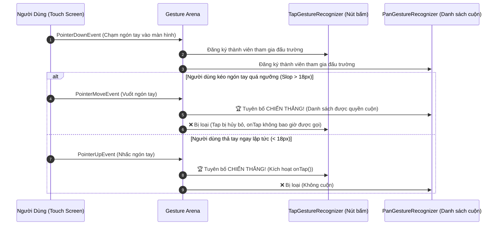
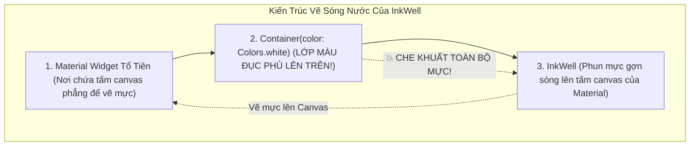

# Chuyên Đề 06 - Bài 01: Cử Chỉ Người Dùng, Hit-Testing & InkWell Chuyên Sâu

> **Trọng tâm**: Bản chất đấu trường cử chỉ (Gesture Arena), Giải phẫu 3 chế độ `HitTestBehavior` (`deferToChild`, `opaque`, `translucent`), Cơ chế vẽ gợn sóng nước của `InkWell` trên `MaterialInkController`, Khắc phục triệt để lỗi mất hiệu ứng Ripple, và bộ câu hỏi phỏng vấn tuyển dụng top tech.

---

## 1. Cơ Chế Đấu Trường Cử Chỉ (The Gesture Arena)

Khi ngón tay người dùng chạm vào màn hình và bắt đầu di chuyển, có thể có nhiều widget khác nhau cùng muốn nhận tương tác (ví dụ: `ListView` muốn cuộn trang, `Dismissible` muốn vuốt xóa, và `GestureDetector` muốn bắt sự kiện chạm `onTap`).

Flutter giải quyết xung đột này bằng cơ chế **Gesture Arena (Đấu trường cử chỉ)**:



---

## 2. Giải Phẫu `HitTestBehavior`: Bản Chất Khi Chạm Vào Vùng Trong Suốt

Khi bạn bọc một hàng `Row` bằng `GestureDetector`:

```dart
GestureDetector(
  onTap: () => print('Click!'),
  child: Container(
    height: 56,
    // Không khai báo màu nền (color = null)
    child: Row(
      children: const [
        Icon(Icons.star),
        SizedBox(width: 8),
        Text('Yêu thích'),
      ],
    ),
  ),
)
```

- Bấm vào Icon hoặc chữ Text $\rightarrow$ Nhận `onTap`.
- **Bấm vào khoảng trống trắng bên phải $\rightarrow$ Hoàn toàn im lặng!**

### Bản chất của 3 chế độ trong `RenderBox.hitTest()`:

```mermaid
graph TD
    Tap["Sự kiện chạm tại điểm (x, y) trên Container trong suốt"]
    Behavior{"Chế độ HitTestBehavior?"}

    Tap --> Behavior

    Behavior -->|deferToChild (Mặc định)| D["Chỉ hỏi các widget con. Con không vẽ pixel nào tại (x,y)<br/>➡️ hitTest trả về false! Bỏ qua! ❌"]
    Behavior -->|opaque| O["Coi toàn bộ khung 56px là một tấm kính mờ đặc.<br/>➡️ Nhận sự kiện, chặn không cho xuyên xuống dưới! 🛡️"]
    Behavior -->|translucent| T["Nhận sự kiện tại khoảng trống, ĐỒNG THỜI cho phép<br/>sự kiện xuyên thấu xuống các widget ở lớp dưới (Z-axis)! 🪟"]
```

| Giá Trị | Cơ Chế Phản Hồi | Giải Quyết Lỗi Bấm Khoảng Trống |
| :--- | :--- | :--- |
| **`HitTestBehavior.deferToChild` (Mặc định)** | Chỉ nhận diện cú chạm nếu trúng trực tiếp vào các điểm ảnh thực tế do widget con vẽ ra. | Nguyên nhân gây ra lỗi. |
| **`HitTestBehavior.opaque`** | Chiếm trọn toàn bộ diện tích hình hộp của widget. Ngăn chặn triệt để sự kiện chạm xuyên xuống các widget phía sau nó. | **Giải pháp chuẩn**: Thêm `behavior: HitTestBehavior.opaque`. |
| **`HitTestBehavior.translucent`** | Vừa nhận diện cú chạm tại các vùng trong suốt, vừa cho phép sự kiện chạm tiếp tục xuyên xuống các widget nằm bên dưới nó trong cùng hệ trục tọa độ. | Thích hợp khi làm các lớp phủ Overlay đa tầng. |

---

## 3. Bản Chất Của `InkWell` & Cạm Bẫy Mất Sóng Nước (Ripple Effect)

### 3.1. `GestureDetector` vs `InkWell`:
- **`GestureDetector`**: Cung cấp các sự kiện cử chỉ thuần túy (`onTap`, `onLongPress`, `onScaleUpdate`). Nó **hoàn toàn không có giao diện thị giác** (không đổ bóng, không sóng nước).
- **`InkWell`**: Là một widget Material. Khi người dùng chạm vào, nó kích hoạt **`MaterialInkController`** để vẽ một hiệu ứng gợn sóng nước (Ripple Effect) tỏa dần từ điểm chạm ngón tay.



### 3.2. Tại sao `InkWell` hay bị mất hiệu ứng sóng nước?
Khi bạn bọc một `Container(color: Colors.white)` bên dưới `InkWell`, `InkWell` sẽ tìm kiếm widget `Material` tổ tiên gần nhất và vẽ các giọt mực gợn sóng lên bề mặt của `Material` đó.  
Tuy nhiên, lớp màu trắng của `Container` nằm đè lên trên `Material` $\rightarrow$ **Màu trắng đục che khuất hoàn toàn các giọt mực đang tỏa ra bên dưới nó!**

---

### 🛠️ 2 Cách Khắc Phục Chuẩn Google:

#### Cách 1: Sử dụng widget `Ink` (Khuyến nghị)
Widget `Ink` được thiết kế riêng để vẽ màu nền và hình ảnh trang trí trực tiếp lên canvas của `Material`, cho phép mực của `InkWell` vẽ đè lên trên nó:

```dart
Ink(
  decoration: BoxDecoration(
    color: Colors.blueAccent,
    borderRadius: BorderRadius.circular(12),
  ),
  child: InkWell(
    borderRadius: BorderRadius.circular(12), // Bo góc cho gợn sóng nước
    onTap: () => print('Bấm thành công!'),
    child: const Padding(
      padding: EdgeInsets.symmetric(horizontal: 24, vertical: 14),
      child: Text('NÚT BẤM CÓ SÓNG NƯỚC', style: TextStyle(color: Colors.white)),
    ),
  ),
)
```

#### Cách 2: Sử dụng widget `Material`
```dart
Material(
  color: Colors.blueAccent,
  borderRadius: BorderRadius.circular(12),
  child: InkWell(
    borderRadius: BorderRadius.circular(12),
    onTap: () {},
    child: const Padding(
      padding: EdgeInsets.symmetric(horizontal: 24, vertical: 14),
      child: Text('NÚT BẤM CÓ SÓNG NƯỚC', style: TextStyle(color: Colors.white)),
    ),
  ),
)
```

---

## 🎯 Góc Phỏng Vấn Tuyển Dụng (Google & Top Tech Interview Q&A)

### Câu hỏi 1: Hãy giải thích chi tiết cơ chế hoạt động của Đấu trường cử chỉ (Gesture Arena) trong Flutter. Làm thế nào Flutter phân định người thắng cuộc khi xảy ra xung đột giữa thao tác cuộn (`ListView`) và thao tác vuốt ngang (`Dismissible`)?

#### 🎯 Điểm Đánh Giá Benchmark 10/10:
1. **Quy trình hoạt động của Gesture Arena**:
   - Khi có sự kiện chạm (`PointerDownEvent`), Flutter thực hiện Hit Test để tìm tất cả các RenderBox có khả năng nhận tương tác.
   - Các `GestureRecognizer` gắn trên các RenderBox này (ví dụ: `VerticalDragGestureRecognizer` của ListView, `HorizontalDragGestureRecognizer` của Dismissible) sẽ tự đăng ký vào đối tượng `GestureArenaManager`.
   - Đấu trường giữ các recognizer ở trạng thái mở (Hold/Pending) trong khi chờ thêm thông tin từ các sự kiện `PointerMoveEvent`.
2. **Cơ chế phân định người thắng (Victory Resolution)**:
   - Mỗi recognizer theo dõi delta di chuyển của con trỏ ngón tay:
     - Nếu ngón tay di chuyển theo trục ngang vượt quá ngưỡng slop (`kTouchSlop`, khoảng 18px), `HorizontalDragGestureRecognizer` sẽ gửi tín hiệu yêu cầu chiến thắng (`resolve(GestureDisposition.accepted)`).
     - Đấu trường lập tức trao quyền cho nó và gửi thông điệp từ chối (`rejectGesture`) cho `VerticalDragGestureRecognizer` của ListView.
     - Ngược lại, nếu ngón tay di chuyển theo trục dọc vượt ngưỡng, `ListView` sẽ thắng và `Dismissible` bị loại bỏ.
   - Nếu cử chỉ kết thúc bằng `PointerUpEvent` trước khi vượt bất kỳ ngưỡng kéo nào, recognizer của sự kiện chạm đơn (`TapGestureRecognizer`) sẽ được tuyên bố chiến thắng.

---

### Câu hỏi 2: Phân biệt sự khác nhau căn bản giữa 3 giá trị của `HitTestBehavior`: `deferToChild`, `opaque`, và `translucent`. Trong trường hợp bạn tạo một màn hình Custom Bottom Sheet có lớp phủ mờ (Backdrop Scrim), bạn sẽ chọn giá trị nào để khi người dùng chạm vào lớp mờ thì đóng Bottom Sheet?

#### 🎯 Điểm Đánh Giá Benchmark 10/10:
1. **Phân tích 3 chế độ `HitTestBehavior`**:
   - `deferToChild`: Là hành vi mặc định. Nó ủy quyền hoàn toàn cho các widget con. Nếu tại tọa độ chạm, các widget con trả về `false` (vì là khoảng trống hoặc không có RenderBox con vẽ tại đó), bản thân widget cũng trả về `false`.
   - `opaque`: Widget tự nhận mình là một vật thể đặc kín phủ trọn toàn bộ kích thước của nó. Bất kể các con có nhận hay không, phương thức `hitTestSelf` luôn trả về `true` và chặn không cho sự kiện xuyên qua các lớp bên dưới.
   - `translucent`: Widget nhận diện cú chạm tại các vùng trong suốt của nó, nhưng **cho phép sự kiện tiếp tục truyền xuyên thấu xuống các widget bên dưới** trong cây phân cấp trục Z.
2. **Áp dụng cho Custom Bottom Sheet Backdrop**:
   - Bắt buộc phải sử dụng **`HitTestBehavior.opaque`**.
   - Lý do: Lớp phủ mờ (Scrim) phải hoạt động như một tấm khiên chắn đặc kín toàn màn hình. Khi người dùng chạm vào vùng mờ bên ngoài hộp thoại, ta muốn bắt sự kiện `onTap` để gọi lệnh `Navigator.pop(context)`, đồng thời **ngăn chặn tuyệt đối** việc cú chạm đó vô tình xuyên thấu kích hoạt các nút bấm nằm ở màn hình bên dưới!

---

### Câu hỏi 3: Tại sao hiệu ứng gợn sóng nước (Ripple Effect) của `InkWell` lại biến mất khi nó được đặt bên trong một `Container` có `color` hoặc `decoration`? Cơ chế vẽ bên dưới của `MaterialInkController` hoạt động như thế nào?

#### 🎯 Điểm Đánh Giá Benchmark 10/10:
1. **Cơ chế vẽ của `MaterialInkController`**:
   - `InkWell` không tự mình vẽ các giọt mực gợn sóng lên canvas riêng của nó.
   - Khi được kích hoạt, `InkWell` tìm kiếm tổ tiên gần nhất kế thừa từ `Material` và sử dụng `MaterialInkController` của `Material` đó để tạo một đối tượng `InkFeature` (chẳng hạn như `InkSplash` hoặc `InkRipple`).
   - `Material` sẽ thực hiện vẽ các giọt mực này trực tiếp trên `RenderObject` của nó.
2. **Nguyên nhân mất hiệu ứng khi dùng `Container(color: ...)`**:
   - `Container(color: Colors.white)` thực chất tạo ra một `RenderDecoratedBox` nằm xen giữa `Material` và `InkWell`.
   - Thứ tự vẽ trên Canvas (Painting Order):
     1. `RenderMaterial` vẽ nền cơ sở và bắt đầu vẽ các giọt mực `InkRipple`.
     2. `RenderDecoratedBox` (của Container) được vẽ ngay sau đó đè lên trên `RenderMaterial` với một lớp sơn màu trắng đục 100%.
     3. `InkWell` thực hiện bắt sự kiện chạm nhưng mực của nó nằm ở lớp bên dưới đã bị màu trắng đục của Container che phủ hoàn toàn, mắt người dùng không thể nhìn thấy!
3. **Giải pháp chuẩn**:
   - Thay thế `Container` bằng widget **`Ink`**: `Ink` nhận diện được nó đang nằm trong ngữ cảnh của `Material` và yêu cầu `Material` vẽ lớp trang trí của nó trước các hiệu ứng mực, đảm bảo gợn sóng nước luôn hiển thị nổi bật trên bề mặt.
