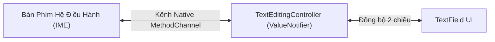

# Chuyên Đề 06 - Bài 02: Ô Nhập Liệu (TextField), Controllers & FocusNode Chuyên Sâu

> **Trọng tâm**: Vòng đời và cơ chế đồng bộ của `TextEditingController`, Đối chiếu sâu sắc `onChanged` vs `controller.addListener`, Điều khiển con trỏ văn bản (`TextSelection`) chống nhảy ngược vị trí, Làm chủ cây tiêu điểm với `FocusNode` & `FocusScope`, và bộ câu hỏi phỏng vấn tuyển dụng top tech.

---

## 1. Vòng Đời Của `TextEditingController` & Cạm Bẫy Rò Rỉ Bộ Nhớ

`TextEditingController` là đối tượng cầu nối hai chiều giữa giao diện người dùng và bàn phím phần mềm của hệ điều hành:



> [!CAUTION]
> **Rò rỉ bộ nhớ (Memory Leak) khi quên `dispose()`**:  
> `TextEditingController` đăng ký một kênh giao tiếp nền với hệ thống quản lý văn bản của hệ điều hành. Nếu bạn thoát màn hình mà không gọi `_controller.dispose()`, đối tượng này sẽ bị giữ lại vĩnh viễn trong RAM, tiếp tục lắng nghe các sự kiện và gây tiêu tốn bộ nhớ nghiêm trọng!

---

## 2. Đối Chiếu: `TextField(onChanged: ...)` vs `controller.addListener()`

| Tiêu Chí Đánh Giá | `TextField(onChanged: ...)` | `controller.addListener(...)` |
| :--- | :--- | :--- |
| **Nguồn phát sinh sự kiện** | **CHỈ kích hoạt khi người dùng trực tiếp gõ phím** hoặc dán văn bản từ bàn phím. | Kích hoạt trong **MỌI trường hợp**: Người dùng gõ phím, code can thiệp (`_controller.text = ...`), hoặc **khi người dùng chỉ di chuyển con trỏ chuột / bôi đen chữ**! |
| **Giá trị nhận được** | Chuỗi văn bản thuần túy `String value`. | Đối tượng toàn diện `TextEditingValue` (gồm `text`, `selection`, và `composing`). |
| **Ứng dụng phù hợp** | Tìm kiếm tức thì (Search as you type), lọc danh sách theo từ khóa. | Kiểm soát vị trí con trỏ chuột, đếm số ký tự bôi đen, định dạng văn bản nâng cao. |

---

## 3. Điều Khiển Con Trỏ Văn Bản (`Selection`): Trị Lỗi Nhảy Về Đầu Dòng

Khi bạn viết logic tự động định dạng số tiền (ví dụ người dùng gõ `10000` $\rightarrow$ tự động đổi thành `10,000`):

```dart
// ❌ CÁCH LÀM SAI THƯỜNG GẶP:
void _onAmountChanged(String text) {
  final formatted = formatCurrency(text);
  _controller.text = formatted; // 💥 CON TRỎ BỊ NHẢY NGƯỢC VỀ VỊ TRÍ ĐẦU TIÊN (Index 0)!
}
```

### Tại sao lại bị nhảy về đầu dòng?
Khi bạn gán qua setter `_controller.text = ...`, Flutter mặc định tạo một `TextEditingValue` mới với `selection: TextSelection.collapsed(offset: -1)` hoặc `offset: 0` $\rightarrow$ Con trỏ bị đưa về đầu dòng, người dùng gõ tiếp sẽ bị ngược số!

### ✅ Cách Làm Chuẩn Google: Sử dụng `TextEditingValue`
Ép vị trí con trỏ chuột (`offset`) luôn luôn nằm ở cuối chuỗi văn bản mới:

```dart
void updateTextAndKeepCursor(String newText) {
  _controller.value = TextEditingValue(
    text: newText,
    selection: TextSelection.collapsed(offset: newText.length), // ✅ Ghim con trỏ ở cuối chữ!
  );
}
```

---

## 4. Làm Chủ `FocusNode` & Chuyển Tiêu Điểm Tự Động (Focus Traversal)

Khi người dùng nhập xong ô Email và nhấn nút "Next" trên bàn phím ảo, việc tự động chuyển con trỏ sang ô Mật Khẩu mang lại trải nghiệm cực kỳ chuyên nghiệp:

```dart
class AutoFocusFormScreen extends StatefulWidget {
  const AutoFocusFormScreen({super.key});

  @override
  State<AutoFocusFormScreen> createState() => _AutoFocusFormScreenState();
}

class _AutoFocusFormScreenState extends State<AutoFocusFormScreen> {
  late final TextEditingController _emailController;
  late final TextEditingController _passwordController;
  
  late final FocusNode _emailFocus;
  late final FocusNode _passwordFocus;

  @override
  void initState() {
    super.initState();
    _emailController = TextEditingController();
    _passwordController = TextEditingController();
    _emailFocus = FocusNode();
    _passwordFocus = FocusNode();
  }

  @override
  void dispose() {
    // ⚠️ BẮT BUỘC dispose toàn bộ Controllers và FocusNodes
    _emailController.dispose();
    _passwordController.dispose();
    _emailFocus.dispose();
    _passwordFocus.dispose();
    super.dispose();
  }

  @override
  Widget build(BuildContext context) {
    return Column(
      children: [
        TextField(
          controller: _emailController,
          focusNode: _emailFocus,
          keyboardType: TextInputType.emailAddress,
          textInputAction: TextInputAction.next, // Biểu tượng mũi tên Tiếp theo trên bàn phím
          decoration: const InputDecoration(labelText: 'Email'),
          onSubmitted: (_) {
            // ✅ Chuyển tiêu điểm sang ô Mật khẩu:
            FocusScope.of(context).requestFocus(_passwordFocus);
            // Hoặc chuyển theo thứ tự cây: FocusScope.of(context).nextFocus();
          },
        ),
        const SizedBox(height: 16),
        TextField(
          controller: _passwordController,
          focusNode: _passwordFocus,
          obscureText: true,
          textInputAction: TextInputAction.done, // Biểu tượng Xong trên bàn phím
          decoration: const InputDecoration(labelText: 'Mật khẩu'),
          onSubmitted: (_) {
            // Ẩn bàn phím khi hoàn tất
            _passwordFocus.unfocus();
          },
        ),
      ],
    );
  }
}
```

---

## 🎯 Góc Phỏng Vấn Tuyển Dụng (Google & Top Tech Interview Q&A)

### Câu hỏi 1: Phân biệt sự khác nhau giữa việc lắng nghe thay đổi văn bản qua `onChanged: (value) => ...` trên `TextField` và gọi `_controller.addListener(...)`. Khi nào một sự kiện làm kích hoạt listener nhưng lại KHÔNG kích hoạt `onChanged`?

#### 🎯 Điểm Đánh Giá Benchmark 10/10:
1. **Nguồn gốc phát sinh sự kiện**:
   - `onChanged`: Là một callback mức cao trên widget `TextField`. Nó được kích hoạt độc quyền thông qua hành động nhập liệu của người dùng từ bàn phím phần mềm (hoặc khi người dùng chọn một từ gợi ý từ IME).
   - `_controller.addListener`: Lắng nghe sự biến thiên của đối tượng trạng thái `TextEditingValue` bên dưới tầng controller (kế thừa từ `ValueNotifier`).
2. **Các tình huống kích hoạt `addListener` nhưng KHÔNG kích hoạt `onChanged`**:
   - **Tình huống 1 (Can thiệp bằng mã nguồn)**: Khi bạn gán nội dung mới bằng code, ví dụ: `_controller.text = 'New Text';` hoặc nút "Xóa nhanh" gọi `_controller.clear()`. Callback `onChanged` hoàn toàn không chạy, nhưng `addListener` sẽ được kích hoạt ngay lập tức!
   - **Tình huống 2 (Thay đổi vị trí con trỏ chuột hoặc bôi đen)**: Khi người dùng chạm ngón tay để di chuyển con trỏ chuột sang vị trí khác hoặc bôi đen một đoạn văn bản (`selection` thay đổi nhưng `text` giữ nguyên), `onChanged` không chạy vì nội dung chữ không đổi, trong khi `addListener` được kích hoạt liên tục vì đối tượng `TextEditingValue` đã thay đổi trường `selection`.

---

### Câu hỏi 2: Tại sao việc gán trực tiếp `_controller.text = newString` trong một hàm định dạng số tiền hoặc thẻ ngân hàng lại khiến con trỏ chuột nhảy ngược về đầu dòng (vị trí index 0)? Cách khắc phục chuẩn xác bằng `TextEditingValue` là gì?

#### 🎯 Điểm Đánh Giá Benchmark 10/10:
1. **Nguyên nhân gốc rễ**:
   - Mã nguồn của setter `text` trong `TextEditingController` được định nghĩa như sau:
     ```dart
     set text(String newText) {
       value = value.copyWith(
         text: newText,
         selection: const TextSelection.collapsed(offset: -1),
         composing: TextRange.empty,
       );
     }
     ```
   - Giá trị `offset: -1` ra lệnh cho RenderEditable đưa con trỏ về vị trí mặc định ban đầu (vị trí index 0) nếu văn bản bị thay thế toàn bộ.
   - Do đó, mỗi khi người dùng gõ thêm 1 ký tự và hàm định dạng chạy gán lại `_controller.text`, con trỏ chuột lập tức bị giật ngược về phía trước số đầu tiên, khiến người dùng gõ các ký tự tiếp theo bị đảo lộn thứ tự.
2. **Cách khắc phục chuẩn xác**:
   - Không gán qua thuộc tính `.text` mà gán trực tiếp thông qua đối tượng **`_controller.value`**:
     ```dart
     _controller.value = TextEditingValue(
       text: formattedString,
       selection: TextSelection.collapsed(offset: formattedString.length),
     );
     ```
   - Bằng cách chỉ định rõ ràng `offset: formattedString.length`, ta ép buộc con trỏ luôn luôn bám sát ký tự cuối cùng của chuỗi vừa định dạng.

---

### Câu hỏi 3: Trình bày cơ chế quản lý tiêu điểm bàn phím với `FocusNode` và `FocusScope`. Sự khác biệt giữa `FocusScope.of(context).nextFocus()` và việc gọi thủ công `FocusScope.of(context).requestFocus(specificNode)` là gì?

#### 🎯 Điểm Đánh Giá Benchmark 10/10:
1. **Cơ chế của Focus Tree trong Flutter**:
   - Quản lý tiêu điểm trong Flutter được tổ chức theo cấu trúc cây (Focus Tree), chạy song song với Widget Tree.
   - `FocusNode`: Đại diện cho một node đơn lẻ có khả năng nhận tương tác bàn phím (ví dụ: một `TextField` hoặc một nút bấm có thể nhận phím Tab).
   - `FocusScopeNode`: Là một node đặc biệt quản lý một phạm vi tiêu điểm (Scope), chịu trách nhiệm điều phối thứ tự duyệt tiêu điểm (Focus Traversal Policy) giữa các con bên trong phạm vi đó.
2. **So sánh `nextFocus()` vs `requestFocus(node)`**:
   - **`FocusScope.of(context).nextFocus()`**:
     - Hoạt động tự động dựa trên vị trí hình học của các widget trên màn hình theo `FocusTraversalPolicy` (mặc định: duyệt từ trên xuống dưới, từ trái sang phải theo hướng đọc).
     - *Ưu điểm*: Tiện lợi, không cần khai báo và quản lý nhiều biến `FocusNode` thủ công trong các form đơn giản.
     - *Nhược điểm*: Kém linh hoạt nếu thứ tự nhập liệu trên UI không tuân theo thứ tự hình học tự nhiên (ví dụ: form chia 2 cột nhưng muốn nhảy zíc-zắc).
   - **`FocusScope.of(context).requestFocus(specificNode)`**:
     - Chỉ định rõ ràng và tường minh tiêu điểm tiếp theo phải chuyển đến đúng `specificNode`.
     - *Ưu điểm*: Kiểm soát tuyệt đối luồng nghiệp vụ (ví dụ: nhập sai ô 1 thì lập tức nhảy tiêu điểm về ô lỗi, hoặc nhảy cóc qua các ô bị vô hiệu hóa).
     - *Nhược điểm*: Đòi hỏi khởi tạo, kết nối và gọi `dispose()` thủ công cho từng node trong `StatefulWidget`.
