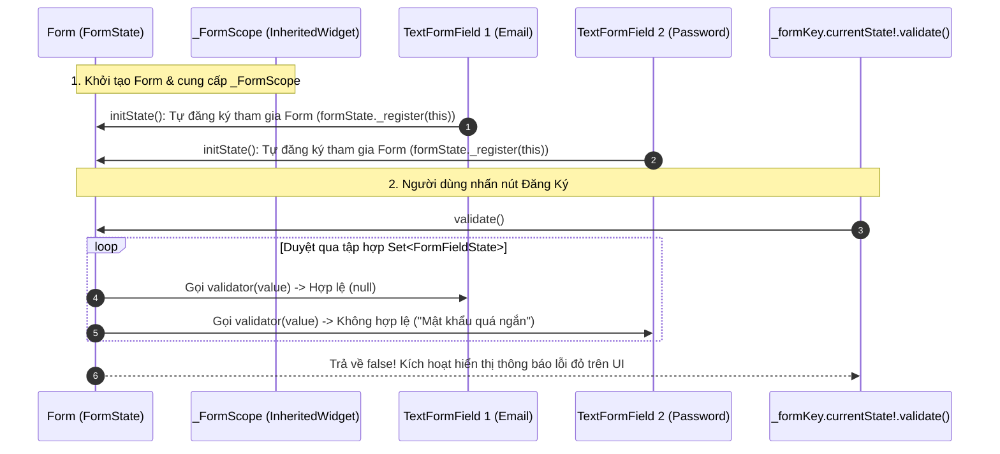

# Chuyên Đề 06 - Bài 03: Xác Thực Biểu Mẫu Với Form & TextFormField Chuyên Sâu

> **Trọng tâm**: Kiến trúc nội bộ của `Form` (`_FormScope` & `InheritedWidget`), Cơ chế đăng ký tự động của `FormFieldState`, Tối ưu UX với các chế độ `AutovalidateMode`, Giải pháp chuẩn cho bài toán kiểm tra bất đồng bộ (Async Validation qua API), và bộ câu hỏi phỏng vấn tuyển dụng top tech.

---

## 1. Kiến Trúc Nội Bộ Của `Form`: Cơ Chế Điều Phối Không Tập Trung

Làm thế nào mà chỉ một dòng lệnh duy nhất `_formKey.currentState!.validate()` lại có thể kích hoạt hàm kiểm tra của hàng chục ô nhập liệu nằm sâu trong các tầng widget con cháu?



### Chi tiết kiến trúc:
1. `Form` là một StatefulWidget chứa `_FormScope` (kế thừa từ `InheritedWidget`).
2. Mọi `TextFormField` (kế thừa từ `FormField<String>`) khi khởi tạo trong `initState()` sẽ tự động tìm kiếm `_FormScope` tổ tiên và gọi:  
   `formState._register(this)`.
3. Khi bị hủy (`dispose()`), trường đó tự động gọi `formState._unregister(this)` để không bị rò rỉ bộ nhớ.
4. Khi bạn gọi `validate()`, `FormState` chỉ đơn giản là duyệt qua danh sách `Set<FormFieldState>` đã đăng ký và gọi hàm `validate()` cục bộ của từng trường.

---

## 2. Các Chế Độ Tự Động Xác Thực (`AutovalidateMode`)

| Chế Độ | Thời Điểm Kích Hoạt Kiểm Tra | Đánh Giá Trải Nghiệm Người Dùng (UX) |
| :--- | :--- | :--- |
| **`AutovalidateMode.disabled` (Mặc định)** | Chỉ kiểm tra khi có lệnh tường minh từ code: `_formKey.currentState!.validate()`. | Tốt cho màn hình đầu tiên, nhưng người dùng phải bấm nút mới biết mình sai ở đâu. |
| **`AutovalidateMode.always`** | Tự động kiểm tra ngay từ **frame hình đầu tiên khi vừa mở màn hình**. | ❌ **Rất tệ (Bad UX)**: Người dùng chưa kịp gõ chữ nào đã bị hù dọa bởi hàng loạt dòng chữ đỏ báo lỗi! |
| **`AutovalidateMode.onUserInteraction`** | **CHỈ bắt đầu kiểm tra sau khi người dùng thực sự chạm vào ô và gõ ký tự đầu tiên**. | 🌟 **Chuẩn UX Google**: Không hiện lỗi trước, nhưng khi đã bắt đầu nhập thì phản hồi đúng/sai tức thì theo thời gian thực! |

---

## 3. Bài Toán Hóc Búa: Xác Thực Bất Đồng Bộ (Async Validation Qua API)

Trong Flutter, hàm `validator` bắt buộc phải là một hàm **đồng bộ (Synchronous)**:

```dart
// ❌ KHÔNG THỂ LÀM NHƯ THẾ NÀY:
validator: (value) async { // 💥 Báo lỗi biên dịch: validator không nhận Future!
  final isAvailable = await checkEmailOnServer(value);
  return isAvailable ? null : 'Email đã tồn tại';
}
```

### Tại sao Flutter không cho phép `validator` là hàm `async`?
Vì hàm `build()` và quá trình render khung hình của Flutter diễn ra ở tốc độ 60/120 FPS ($16.6\text{ms}$). Một lệnh gọi API qua mạng tốn từ 200ms đến hàng giây $\rightarrow$ Nếu `validate()` là `async`, toàn bộ luồng xử lý UI sẽ bị treo đứng!

---

### ✅ Giải Pháp Chuẩn Doanh Nghiệp (Debounce + Async State):

```dart
class AsyncValidationScreen extends StatefulWidget {
  const AsyncValidationScreen({super.key});

  @override
  State<AsyncValidationScreen> createState() => _AsyncValidationScreenState();
}

class _AsyncValidationScreenState extends State<AsyncValidationScreen> {
  final _emailController = TextEditingController();
  String? _serverEmailError; // Chứa lỗi trả về từ API
  bool _isChecking = false;
  Timer? _debounceTimer;

  void _onEmailChanged(String text) {
    // Xóa lỗi cũ khi người dùng bắt đầu gõ ký tự mới
    if (_serverEmailError != null) {
      setState(() => _serverEmailError = null);
    }

    // 🌟 Kỹ thuật Debounce: Chờ người dùng ngừng gõ 500ms mới gọi API
    _debounceTimer?.cancel();
    _debounceTimer = Timer(const Duration(milliseconds: 500), () async {
      if (text.contains('@') && text.length > 5) {
        setState(() => _isChecking = true);
        
        final isTaken = await _fakeApiCheckEmailExists(text);
        
        if (mounted) {
          setState(() {
            _isChecking = false;
            _serverEmailError = isTaken ? 'Email này đã có người đăng ký!' : null;
          });
        }
      }
    });
  }

  Future<bool> _fakeApiCheckEmailExists(String email) async {
    await Future.delayed(const Duration(milliseconds: 400));
    return email == 'admin@gmail.com'; // Giả lập email đã tồn tại
  }

  @override
  void dispose() {
    _debounceTimer?.cancel();
    _emailController.dispose();
    super.dispose();
  }

  @override
  Widget build(BuildContext context) {
    return TextFormField(
      controller: _emailController,
      onChanged: _onEmailChanged,
      decoration: InputDecoration(
        labelText: 'Email',
        // Hiển thị lỗi từ server hoặc spinner đang tải:
        errorText: _serverEmailError,
        suffixIcon: _isChecking
            ? const SizedBox(
                width: 20,
                height: 20,
                child: Padding(
                  padding: EdgeInsets.all(12.0),
                  child: CircularProgressIndicator(strokeWidth: 2),
                ),
              )
            : null,
      ),
      // Kiểm tra định dạng cục bộ (Local Sync Validation)
      validator: (val) {
        if (val == null || !val.contains('@')) return 'Định dạng email không hợp lệ';
        return null;
      },
    );
  }
}
```

---

## 🎯 Góc Phỏng Vấn Tuyển Dụng (Google & Top Tech Interview Q&A)

### Câu hỏi 1: Hãy giải thích cơ chế nội bộ mà widget `Form` quản lý các `TextFormField` con cháu bên dưới. Tại sao `_formKey.currentState!.validate()` lại có thể kích hoạt hàm kiểm tra của từng trường dù chúng nằm ở các tầng sâu trong cây widget?

#### 🎯 Điểm Đánh Giá Benchmark 10/10:
1. **Kiến trúc đăng ký quan hệ (Observer Pattern qua InheritedWidget)**:
   - `Form` sử dụng `_FormScope` (kế thừa từ `InheritedWidget`) để truyền thể hiện của `FormState` xuống cây con.
   - Khi một `FormField` (hoặc `TextFormField`) được đưa vào cây widget, phương thức `initState()` của nó tra cứu `FormState` thông qua `context.findAncestorStateOfType<FormState>()`.
   - Sau khi tìm thấy, nó thực hiện phương thức nội bộ `formState._register(this)`, lưu trữ tham chiếu của `FormFieldState` vào một tập hợp riêng: `final Set<FormFieldState<dynamic>> _fields = <FormFieldState<dynamic>>{};`.
2. **Cơ chế kích hoạt của `validate()`**:
   - Khi gọi `_formKey.currentState!.validate()`, `FormState` duyệt qua mảng `_fields` bằng vòng lặp.
   - Với mỗi field, nó gọi phương thức `field.validate()`. Hàm này thực thi callback `validator(value)`.
   - Nếu có lỗi trả về (khác `null`), `FormFieldState` tự gán thông báo lỗi vào biến `_errorText` và kích hoạt `setState()` cục bộ của trường đó để render chuỗi lỗi màu đỏ.
   - Phương thức trả về `true` khi và chỉ khi mọi field trong tập hợp đều vượt qua kiểm tra (tất cả đều trả về `null`).

---

### Câu hỏi 2: Tại sao hàm `validator` trong `TextFormField` lại là một hàm đồng bộ (`String? Function(T?)`) thay vì cho phép trả về `Future<String?>`? Làm thế nào để thực hiện kiểm tra bất đồng bộ (Async Validation) một cách chuẩn mực?

#### 🎯 Điểm Đánh Giá Benchmark 10/10:
1. **Lý do kiến trúc Flutter giữ `validator` là Synchronous**:
   - `validate()` được thiết kế để phục vụ tương tác tức thì khi người dùng nhấn nút Submit hoặc khi re-render frame hình.
   - Nếu `validator` hỗ trợ `async`, phương thức `validate()` sẽ phải trả về `Future<bool>`. Điều này mở ra hàng loạt vấn đề phức tạp: Race conditions (người dùng gõ liên tục gửi hàng chục request chồng chéo), State synchronization (widget bị unmount trong khi request mạng đang bay), và làm gián đoạn luồng phản hồi xúc giác của nút bấm.
2. **Giải pháp chuẩn mực cho Async Validation**:
   - Tách biệt rõ ràng 2 tầng xác thực:
     - **Tầng 1 (Local Sync Validation)**: Giữ trong hàm `validator` để kiểm tra các quy tắc tức thì (không để trống, độ dài tối thiểu, regex định dạng email/mật khẩu).
     - **Tầng 2 (Remote Async Validation)**: Xử lý thông qua `onChanged` kết hợp với kỹ thuật **Debouncing** (trì hoãn 300ms - 500ms sau khi người dùng ngừng gõ).
   - Khi debounce kích hoạt, gọi API kiểm tra tính duy nhất (Unique check). Nếu server báo lỗi, lưu chuỗi lỗi vào State và gán vào thuộc tính `decoration: InputDecoration(errorText: _serverError)`. Cách làm này đảm bảo giao diện luôn mượt mà và không bao giờ nghẽn luồng UI.

---

### Câu hỏi 3: Phân biệt sự khác nhau giữa 3 chế độ `AutovalidateMode` (`disabled`, `always`, `onUserInteraction`). Trong một form nhập liệu thực tế của ứng dụng thương mại, chế độ nào mang lại trải nghiệm người dùng (UX) tối ưu nhất và tại sao?

#### 🎯 Điểm Đánh Giá Benchmark 10/10:
1. **Phân tích 3 chế độ**:
   - `disabled`: Hoàn toàn thụ động. Lỗi chỉ được vẽ ra khi có sự kích hoạt chủ động từ code (như bấm nút "Xác nhận").
   - `always`: Tự động kiểm tra liên tục ở mọi frame hình ngay từ lúc form vừa xuất hiện trên màn hình.
   - `onUserInteraction`: Chỉ bắt đầu kiểm tra và cập nhật lỗi cho một trường sau khi trường đó đã nhận được tương tác đầu tiên của người dùng (chạm vào, gõ phím, hoặc mất focus).
2. **Đánh giá UX và lựa chọn tối ưu**:
   - **`always` là Anti-pattern về UX**: Việc người dùng vừa mở một màn hình Đăng ký tài khoản đã thấy một loạt viền đỏ và thông báo "Vui lòng nhập tên", "Vui lòng nhập email" tạo cảm giác ức chế và bị thúc ép.
   - **`onUserInteraction` là lựa chọn tối ưu nhất (Best Practice)**:
     - Trước khi người dùng tương tác: Form hiển thị sạch sẽ, trang nhã.
     - Khi người dùng bắt đầu gõ: Lỗi được phản hồi theo thời gian thực (Real-time feedback), giúp người dùng sửa sai ngay lập tức mà không cần đợi đến lúc bấm nút Đăng ký ở cuối trang mới phát hiện lỗi.
