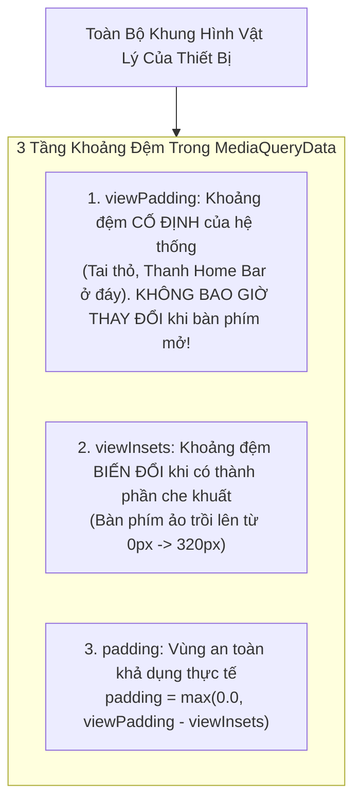
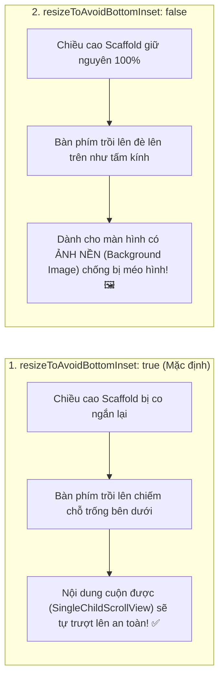

# Chuyên Đề 06 - Bài 04: Xử Lý Bàn Phím Ảo & Khoảng Đệm An Toàn (Keyboard Insets)

> **Trọng tâm**: Phân biệt bản chất 3 loại Insets (`viewInsets`, `viewPadding`, `padding`), Cơ chế co giãn màn hình của `Scaffold.resizeToAvoidBottomInset`, Làm chủ widget `TapRegion` (Flutter 3.7+) thay thế `GestureDetector` truyền thống để ẩn phím, và bộ câu hỏi thẩm định năng lực kỹ thuật chuyên sâu.

---

## 1. Giải Phẫu 3 Loại Khoảng Đệm: `viewInsets` vs `viewPadding` vs `padding`

Khi lập trình viên gặp các bài toán liên quan đến bàn phím ảo và tai thỏ (Notch), `MediaQueryData` cung cấp 3 thuộc tính rất dễ nhầm lẫn:



### Bảng So Sánh Chi Tiết:

| Thuộc Tính | Bản Chất Kỹ Thuật | Trạng Thái Khi Bàn Phím Mở Lên |
| :--- | :--- | :--- |
| **`viewInsets.bottom`** | Đo lường phần diện tích bị **bàn phím phần mềm che khuất hoàn toàn**. | Tăng vọt từ `0.0` lên khoảng `250px - 350px`. |
| **`viewPadding.bottom`** | Khoảng đệm vật lý cố định của thiết bị (ví dụ: Thanh vạch trắng vuốt Home trên iPhone). | **GIỮ NGUYÊN BẤT BIẾN** (Ví dụ luôn là `34px` trên iPhone). |
| **`padding.bottom`** | Khoảng đệm an toàn còn lại mà nội dung cần thụt vào để không bị che. | Tự động tụt về `0.0` vì bàn phím đã che lấp toàn bộ thanh Home Bar! |

---

## 2. Làm Chủ `Scaffold.resizeToAvoidBottomInset`

Mặc định, `Scaffold` luôn bật `resizeToAvoidBottomInset: true`:



> [!TIP]
> **Kịch bản dùng `resizeToAvoidBottomInset: false`**:  
> Màn hình Đăng nhập có một bức ảnh nền phong cảnh toàn màn hình tuyệt đẹp. Nếu để `true`, khi mở bàn phím, bức ảnh nền sẽ bị co rúm lại hoặc méo tỷ lệ. Khi đặt `false`, ảnh nền giữ nguyên kích thước hoàn hảo, nhưng bạn cần bọc các ô nhập liệu bên trong bằng `Padding(padding: EdgeInsets.only(bottom: MediaQuery.viewInsetsOf(context).bottom))` để các ô này tự nâng lên trên bàn phím!

---

## 3. Cách Mạng Ẩn Bàn Phím: `GestureDetector` vs `TapRegion` (Flutter 3.7+)

### 3.1. Cách truyền thống (Dễ gây xung đột cử chỉ):
Trước đây, để chạm ra ngoài tắt bàn phím, lập trình viên bọc toàn bộ Scaffold bằng `GestureDetector`:

```dart
// Cách cũ:
GestureDetector(
  behavior: HitTestBehavior.opaque,
  onTap: () => FocusManager.instance.primaryFocus?.unfocus(),
  child: Scaffold(...),
)
```
*Nhược điểm*: Dễ gây tranh chấp cử chỉ với các widget cuộn (`ListView`) hoặc nút bấm con.

---

### 3.2. ✅ Chuẩn Google Mới Nhất: `TapRegion`
Từ Flutter 3.7, framework bổ sung hệ sinh thái `TapRegion` tích hợp trực tiếp vào hệ thống Hit Test mà không tạo thêm `GestureRecognizer`:

```dart
TextFieldTapRegion(
  child: TextField(
    focusNode: _myFocusNode,
    decoration: const InputDecoration(labelText: 'Tự động đóng phím khi chạm ngoài'),
  ),
  // 🌟 Tự động kích hoạt khi người dùng chạm vào bất kỳ điểm nào bên ngoài vùng này:
  onTapOutside: (PointerDownEvent event) {
    _myFocusNode.unfocus();
  },
)
```

Hoặc sử dụng thuộc tính có sẵn trên chính `TextField` (Flutter 3.7+):

```dart
TextField(
  focusNode: _myFocusNode,
  // ✅ Chuẩn Material 3: Tự động đóng phím cực kỳ thanh lịch
  onTapOutside: (event) => _myFocusNode.unfocus(),
)
```

---

## 🎯 Thẩm Định Năng Lực & Phân Tích Chuyên Sâu (Technical Competency & Deep Dive)

### Câu hỏi 1: Phân biệt sự khác nhau giữa 3 thuộc tính: `viewInsets`, `viewPadding`, và `padding` trong `MediaQueryData`. Khi bàn phím ảo xuất hiện trên màn hình, giá trị của 3 thuộc tính này biến thiên như thế nào?

#### 🎯 Điểm Đánh Giá Benchmark 10/10:
1. **Định nghĩa bản chất 3 thuộc tính**:
   - `viewInsets`: Khoảng cách bị che khuất hoàn toàn bởi các thành phần giao diện hệ thống có tính chất tạm thời (System UI overlays), chủ yếu là bàn phím phần mềm (IME).
   - `viewPadding`: Khoảng cách bị cản trở bởi các đặc điểm phần cứng cố định của thiết bị (tai thỏ Notch, Dynamic Island, góc bo tròn màn hình, vạch Home Bar). Giá trị này là hằng số vật lý độc lập với bàn phím.
   - `padding`: Khoảng đệm an toàn khả dụng (Safe Area Padding). Nó được tính toán động theo công thức:
     $$\text{padding} = \max(0.0, \text{viewPadding} - \text{viewInsets})$$
2. **Sự biến thiên khi bàn phím ảo trồi lên (ví dụ cao 300px trên iPhone)**:
   - `viewInsets.bottom`: Tăng từ `0.0` lên `300.0`.
   - `viewPadding.bottom`: **Giữ nguyên 100% không đổi** (ví dụ vẫn là `34.0` của Home Bar).
   - `padding.bottom`: Giảm từ `34.0` về đúng `0.0`. Lý do: Vì bàn phím đã cao tới 300px và đè lên toàn bộ thanh Home Bar 34px, nên các widget bên trong Scaffold không cần phải thụt lề 34px nữa mà chỉ cần dựa vào chiều cao 300px của bàn phím.

---

### Câu hỏi 2: Khi nào bạn bắt buộc phải đặt `resizeToAvoidBottomInset: false` trên `Scaffold`? Trong tình huống đó, làm thế nào để đảm bảo ô nhập liệu không bị bàn phím che khuất?

#### 🎯 Điểm Đánh Giá Benchmark 10/10:
1. **Trường hợp bắt buộc đặt `resizeToAvoidBottomInset: false`**:
   - Khi màn hình chứa một hình nền cố định (Background Image) phủ tràn toàn màn hình (`BoxFit.cover`), hoặc chứa một bản đồ toàn cảnh Google Maps / Camera Preview.
   - Nếu giữ `true`, khi bàn phím trồi lên, chiều cao của Scaffold bị bóp nghẹt đột ngột từ 800px xuống còn 500px trong 250ms, khiến hình nền hoặc Camera Preview bị méo mó, giật khung hình và render lại rất xấu.
2. **Cách giải quyết để ô nhập liệu không bị che**:
   - Tách biệt lớp nền và lớp nội dung bằng `Stack`. Lớp nền đặt ở dưới cùng với kích thước cố định.
   - Lớp nội dung bên trên được đặt bên trong một container lắng nghe `MediaQuery.viewInsetsOf(context).bottom` để chủ động gán `padding` hoặc sử dụng `SingleChildScrollView` kết hợp `Scrollable.ensureVisible()` để đưa ô nhập liệu lên trên lớp kính của bàn phím mà không cần làm co lại toàn bộ Scaffold.

---

### Câu hỏi 3: Cơ chế hoạt động của widget `TapRegion` (hoặc callback `onTapOutside` trên `TextField`) là gì? Tại sao nó lại ưu việt hơn cách làm truyền thống là bọc `GestureDetector` toàn bộ màn hình để gọi `unfocus()`?

#### 🎯 Điểm Đánh Giá Benchmark 10/10:
1. **Cơ chế của `TapRegion`**:
   - Hoạt động dựa trên `TapRegionRegistry`. Mỗi khi một `TapRegion` được gắn vào cây widget, nó tự đăng ký ranh giới hình học (Bounding Box) của nó với hệ thống quản lý vùng chạm toàn cục.
   - Khi người dùng chạm ngón tay vào màn hình (`PointerDownEvent`), hệ thống duyệt qua danh sách các vùng đã đăng ký. Nếu điểm chạm nằm bên ngoài ranh giới của vùng đó, callback `onTapOutside` được kích hoạt ngay lập tức.
2. **Tính ưu việt so với bọc `GestureDetector` toàn màn hình**:
   - **Không tham gia tranh chấp Gesture Arena**: `GestureDetector` toàn màn hình phải đăng ký một `TapGestureRecognizer`. Điều này có thể làm gián đoạn hoặc gây trễ các cử chỉ khác (như cuộn danh sách, kéo thanh trượt Slider, hoặc bấm các nút bấm khác). `TapRegion` lắng nghe trực tiếp từ luồng sự kiện con trỏ cấp thấp (Raw Pointer Events) nên hoàn toàn không xung đột với các cử chỉ khác.
   - **Tính đóng gói cao (Encapsulation)**: Cho phép từng ô TextField tự chịu trách nhiệm đóng chính mình khi người dùng chạm ra ngoài, thay vì phải can thiệp cấu trúc của toàn bộ màn hình Scaffold ở cấp độ cha.
