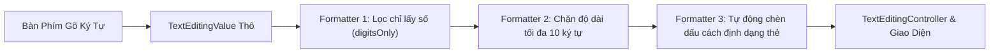
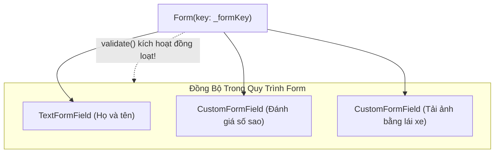

# Chuyên Đề 06 - Bài 05: Bộ Lọc Dữ Liệu TextInputFormatter & Xây Dựng Custom FormField

> **Trọng tâm**: Cơ chế tiền xử lý chuỗi nhập liệu với `TextInputFormatter`, Viết Custom Masking Formatter (Số điện thoại, Thẻ ngân hàng, Tiền tệ VND), Kỹ thuật điều khiển con trỏ văn bản trong Formatter, Xây dựng `CustomFormField<T>` cho các thành phần phi văn bản (Chọn ảnh, Đánh giá sao, Dropdown Chips), và bộ câu hỏi thẩm định năng lực kỹ thuật chuyên sâu.

---

## 1. Cơ Chế Hoạt Động Của `TextInputFormatter`

Trong Flutter, trước khi các ký tự người dùng gõ từ bàn phím chạm tới `TextEditingController`, chúng bắt buộc phải đi qua một chuỗi các bộ lọc **`inputFormatters`**:



### Các Formatter Tích Hợp Sẵn Của Flutter:
- `FilteringTextInputFormatter.digitsOnly`: Chỉ cho phép nhập số `0 - 9`.
- `FilteringTextInputFormatter.allow(RegExp(r'[a-zA-Z]'))`: Chỉ cho phép nhập chữ cái tiếng Anh.
- `FilteringTextInputFormatter.deny(RegExp(r'\s'))`: Chặn tuyệt đối khoảng trắng (Space).
- `LengthLimitingTextInputFormatter(10)`: Giới hạn tối đa 10 ký tự.

---

## 2. Viết Custom Formatter: Tự Động Định Dạng Thẻ Ngân Hàng

Bài toán: Người dùng gõ `1234567812345678` $\rightarrow$ Tự động ngắt dấu cách thành `1234 5678 1234 5678`:

```dart
import 'package:flutter/services.dart';

class CreditCardInputFormatter extends TextInputFormatter {
  @override
  TextEditingValue formatEditUpdate(
    TextEditingValue oldValue,
    TextEditingValue newValue,
  ) {
    // 1. Nếu người dùng đang xóa lùi (Backspace), cho phép xóa tự nhiên
    if (newValue.text.length < oldValue.text.length) {
      return newValue;
    }

    // 2. Lọc bỏ toàn bộ dấu cách cũ chỉ giữ lại số
    final cleanText = newValue.text.replaceAll(' ', '');
    final buffer = StringBuffer();

    // 3. Cứ 4 số chèn thêm 1 dấu cách
    for (int i = 0; i < cleanText.length; i++) {
      buffer.write(cleanText[i]);
      final nonZeroIndex = i + 1;
      if (nonZeroIndex % 4 == 0 && nonZeroIndex != cleanText.length) {
        buffer.write(' ');
      }
    }

    final formatted = buffer.toString();

    // 4. Trả về TextEditingValue mới và ghim con trỏ ở cuối chuỗi
    return TextEditingValue(
      text: formatted,
      selection: TextSelection.collapsed(offset: formatted.length),
    );
  }
}
```

---

## 3. Xây Dựng `CustomFormField<T>`: Vượt Xa Khỏi Giới Hạn Của Text

Trong các ứng dụng thực tế, biểu mẫu không chỉ chứa các ô gõ chữ (`TextFormField`), mà còn chứa:
- Chọn ảnh đại diện (Bắt buộc phải tải lên ảnh trước khi nộp Form).
- Đánh giá chất lượng dịch vụ (Đánh giá từ 1 đến 5 sao).
- Checkbox đồng ý với điều khoản sử dụng.

Nếu bạn viết các widget này tách rời ngoài `Form`, bạn sẽ không thể tận dụng được sức mạnh của `_formKey.currentState!.validate()`.



---

### Code Triển Khai Thực Chiến: `StarRatingFormField`

Xây dựng một trường đánh giá số sao (từ 1 đến 5 sao) tích hợp đầy đủ khả năng validate báo lỗi đỏ nếu người dùng quên chọn sao:

```dart
import 'package:flutter/material.dart';

class StarRatingFormField extends FormField<int> {
  StarRatingFormField({
    super.key,
    super.initialValue = 0,
    super.onSaved,
    super.validator,
    AutovalidateMode super.autovalidateMode = AutovalidateMode.onUserInteraction,
  }) : super(
          builder: (FormFieldState<int> state) {
            final currentValue = state.value ?? 0;

            return Column(
              crossAxisAlignment: CrossAxisAlignment.start,
              children: [
                Row(
                  mainAxisSize: MainAxisSize.min,
                  children: List.generate(5, (index) {
                    final starNumber = index + 1;
                    return IconButton(
                      icon: Icon(
                        starNumber <= currentValue ? Icons.star : Icons.star_border,
                        color: Colors.amber,
                        size: 32,
                      ),
                      onPressed: () {
                        // 🌟 Gọi didChange để cập nhật giá trị mới và tự động kích hoạt validate!
                        state.didChange(starNumber);
                      },
                    );
                  }),
                ),

                // Hiển thị thông báo lỗi màu đỏ nếu vi phạm validator
                if (state.hasError)
                  Padding(
                    padding: const EdgeInsets.only(left: 12.0, top: 4.0),
                    child: Text(
                      state.errorText!,
                      style: const TextStyle(color: Colors.red, fontSize: 12),
                    ),
                  ),
              ],
            );
          },
        );
}
```

### Sử dụng bên trong `Form` cực kỳ thanh lịch:

```dart
Form(
  key: _formKey,
  child: Column(
    children: [
      TextFormField(decoration: const InputDecoration(labelText: 'Họ và tên')),
      const SizedBox(height: 16),
      
      // ✅ Tham gia vào FormState như một trường bình thường!
      StarRatingFormField(
        validator: (value) {
          if (value == null || value == 0) {
            return 'Vui lòng đánh giá ít nhất 1 sao!';
          }
          return null;
        },
        onSaved: (rating) {
          print('Lưu số sao: $rating');
        },
      ),
      const SizedBox(height: 24),

      ElevatedButton(
        onPressed: () {
          // Kiểm tra đồng loạt cả ô Text lẫn số sao chỉ bằng 1 lệnh!
          if (_formKey.currentState!.validate()) {
            _formKey.currentState!.save();
          }
        },
        child: const Text('GỬI ĐÁNH GIÁ'),
      ),
    ],
  ),
)
```

---

## 🎯 Thẩm Định Năng Lực & Phân Tích Chuyên Sâu (Technical Competency & Deep Dive)

### Câu hỏi 1: Phân tích cơ chế hoạt động của `TextInputFormatter` trong Flutter. Phương thức `formatEditUpdate(TextEditingValue oldValue, TextEditingValue newValue)` nhận vào hai đối tượng này để làm gì? Làm thế nào để giữ đúng vị trí con trỏ khi tự động chèn thêm ký tự?

#### 🎯 Điểm Đánh Giá Benchmark 10/10:
1. **Cơ chế tiền xử lý của `TextInputFormatter`**:
   - Hoạt động như một Middleware chặn ở giữa kênh giao tiếp IME của hệ điều hành và `TextEditingController`.
   - Mỗi khi người dùng gõ hoặc xóa ký tự, hệ thống sinh ra `newValue` (văn bản sau khi áp dụng thao tác) và lưu giữ `oldValue` (văn bản trước khi thao tác).
2. **Vai trò của `oldValue` và `newValue`**:
   - So sánh độ dài `newValue.text.length < oldValue.text.length` cho phép phát hiện người dùng đang thực hiện thao tác **Xóa lùi (Backspace / Delete)**. Điều này cực kỳ quan trọng đối với các Mask Formatter (như số điện thoại `(123) 456`), tránh hiện tượng người dùng vừa xóa một dấu ngoặc thì formatter lại lập tức chèn ngược trở lại!
   - Cho phép kiểm tra xem người dùng đang gõ tiếp ở cuối hay đang chèn ký tự vào giữa đoạn văn bản.
3. **Kỹ thuật duy trì vị trí con trỏ chuột**:
   - Khi formatter chèn thêm các ký tự định dạng (như dấu cách hoặc dấu gạch ngang), số lượng ký tự tăng lên.
   - Để con trỏ không bị nhảy lung tung, lập trình viên phải tính toán số lượng ký tự đệm vừa được chèn vào phía trước con trỏ và cập nhật lại `selection`:
     ```dart
     return TextEditingValue(
       text: newFormattedText,
       selection: TextSelection.collapsed(offset: computedCursorOffset),
     );
     ```

---

### Câu hỏi 2: Tại sao việc tạo một `CustomFormField<T>` kế thừa từ `FormField<T>` lại vượt trội hơn việc tự viết logic kiểm tra (Validation) thủ công trong `StatefulWidget`? Cơ chế giao tiếp giữa `FormFieldState<T>` và `FormState` tổ tiên hoạt động ra sao?

#### 🎯 Điểm Đánh Giá Benchmark 10/10:
1. **Sự vượt trội của kiến trúc `FormField<T>`**:
   - **Tính nhất quán và Đóng gói (Encapsulation)**: Đóng gói toàn bộ logic hiển thị lỗi, cập nhật giá trị và validate vào trong một linh kiện độc lập.
   - **Tích hợp liền mạch với hệ sinh thái Form của Flutter**: Cho phép widget tùy biến tham gia 100% vào vòng đời điều phối của `FormState`: `validate()`, `save()`, `reset()`.
   - **Đồng nhất trải nghiệm**: Thông báo lỗi, cơ chế `autovalidateMode` (như `onUserInteraction`) hoạt động đồng bộ với tất cả các trường `TextFormField` khác trong form mà không cần viết code kiểm tra rải rác.
2. **Cơ chế giao tiếp bên dưới Framework**:
   - `FormField<T>` tạo ra một `FormFieldState<T>`.
   - Trong phương thức `initState()`, `FormFieldState` tìm kiếm `_FormScope` gần nhất và gọi `formState._register(this)`.
   - Khi giá trị bên trong thay đổi, lập trình viên gọi `state.didChange(newValue)`. Hàm này sẽ:
     1. Cập nhật trường `_value`.
     2. Đánh dấu `_hasInteractedByUser = true`.
     3. Tự động kích hoạt lại hàm `validator` nếu đang ở chế độ `AutovalidateMode.onUserInteraction`.
     4. Kích hoạt `setState()` cục bộ của trường để vẽ lại giao diện mà không làm rebuild toàn bộ Form!

---

### Câu hỏi 3: Hãy trình bày các bước xây dựng một `ImagePickerFormField` (ô chọn ảnh đại diện) cho phép người dùng chọn ảnh từ thư viện, hiển thị ảnh xem trước (preview), và tự động báo lỗi đỏ "Bắt buộc phải chọn ảnh đại diện" khi bấm nút Submit Form.

#### 🎯 Điểm Đánh Giá Benchmark 10/10:
1. **Định nghĩa kiểu dữ liệu Generic**:
   - Kế thừa từ `FormField<File?>` (hoặc `FormField<XFile?>` nếu dùng `image_picker`):
     ```dart
     class ImagePickerFormField extends FormField<File?>
     ```
2. **Cấu hình Constructor chuẩn mực**:
   - Chuyển tiếp các tham số cốt lõi: `initialValue`, `onSaved`, `validator`, `autovalidateMode` lên `super`.
3. **Triển khai phương thức `builder(FormFieldState<File?> state)`**:
   - Sử dụng `state.value` để hiển thị ảnh xem trước nếu đã chọn (`Image.file(state.value!)`) hoặc hiển thị nút bấm icon tải ảnh lên nếu chưa chọn.
   - Khi người dùng bấm vào và chọn ảnh thành công từ thư viện, gọi:
     ```dart
     state.didChange(pickedFile);
     ```
   - Kiểm tra `state.hasError`: Nếu `true`, hiển thị dòng văn bản thông báo lỗi `state.errorText!` màu đỏ ngay bên dưới khung ảnh với kiểu chữ `theme.textTheme.bodySmall`.
4. **Tích hợp vào Form nghiệp vụ**:
   - Khi người dùng nhấn nút Đăng ký, gọi `_formKey.currentState!.validate()`. Form sẽ tự động kích hoạt validator của `ImagePickerFormField`:
     ```dart
     validator: (file) => file == null ? 'Vui lòng tải lên ảnh CCCD/Avatar!' : null,
     ```
   - Nếu chưa chọn ảnh, khung chọn ảnh sẽ lập tức đổi viền đỏ và hiển thị thông báo lỗi đồng bộ với toàn bộ các trường khác trong Form!
