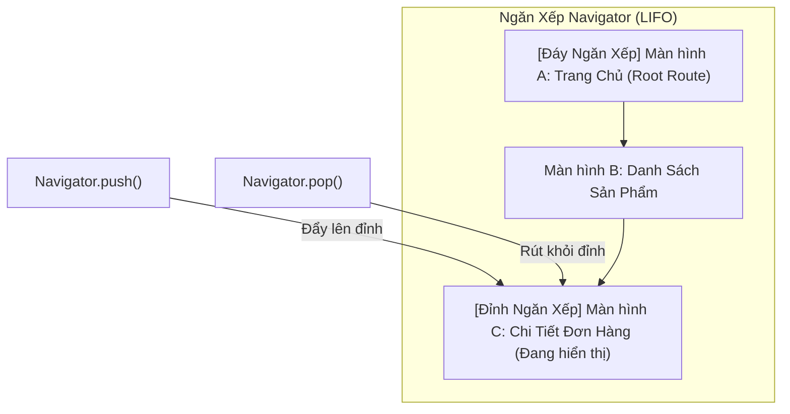

# Chuyên Đề 07 - Bài 01: Điều Hướng Mệnh Lệnh (Navigator 1.0 & Chuyển Trang)

> **Trọng tâm**: Cơ chế ngăn xếp LIFO (`NavigatorState`), Chuyển trang có kiểu an toàn (`Navigator.push<T>`), Quản lý lịch sử ngăn xếp với `pushAndRemoveUntil`, Tạo hoạt họa chuyển cảnh mượt mà với `PageRouteBuilder`, và bộ câu hỏi thẩm định năng lực kỹ thuật chuyên sâu.

---

## 1. Cơ Chế Ngăn Xếp (Stack LIFO) Của `Navigator`

Trong kiến trúc điều hướng mệnh lệnh (Imperative Navigation), `Navigator` hoạt động như một ngăn xếp đĩa (Last In, First Out):



- **`Navigator.push`**: Đẩy một `Route` mới lên đỉnh ngăn xếp, che khuất màn hình hiện tại.
- **`Navigator.pop`**: Gỡ bỏ route ở đỉnh ngăn xếp, giải phóng bộ nhớ và lộ lại màn hình ngay bên dưới.
- **`ModalRoute.of(context)`**: Cho phép màn hình con đọc các thông tin cấu hình của route hiện tại (ví dụ: `settings.arguments`).

---

## 2. Các Thao Tác Điều Hướng Thiết Yếu & An Toàn Kiểu (Type-Safe)

### 2.1. Đẩy Trang & Nhận Dữ Liệu Trả Về Với `Navigator.push<T>`
Khai báo kiểu generic `<T>` rõ ràng giúp trình biên dịch kiểm tra tính đúng đắn của dữ liệu trả về từ màn hình sau:

```dart
// 1. Tại Màn hình Giỏ hàng:
Future<void> _pickShippingAddress(BuildContext context) async {
  // await dừng lại cho tới khi màn hình chọn địa chỉ gọi Navigator.pop(context, selectedAddress)
  final String? result = await Navigator.push<String>(
    context,
    MaterialPageRoute(builder: (context) => const AddressPickerScreen()),
  );

  // ⚠️ Luôn kiểm tra context.mounted sau các thao tác await bất đồng bộ!
  if (result != null && context.mounted) {
    ScaffoldMessenger.of(context).showSnackBar(
      SnackBar(content: Text('Đã chọn địa chỉ: $result')),
    );
  }
}

// 2. Tại Màn hình AddressPickerScreen:
void _onAddressSelected(BuildContext context, String address) {
  // Trả kết quả về cho màn hình trước:
  Navigator.pop<String>(context, address);
}
```

---

### 2.2. `Navigator.pushReplacement`: Thay Thế Màn Hình (Splash / Login)
Dùng khi bạn muốn mở màn hình mới và **hủy bỏ hoàn toàn màn hình hiện tại** khỏi ngăn xếp, người dùng không thể bấm Back quay lại màn hình cũ:

```dart
Navigator.pushReplacement(
  context,
  MaterialPageRoute(builder: (context) => const HomeScreen()),
);
```

---

### 2.3. `Navigator.pushAndRemoveUntil`: Đăng Xuất Hoặc Hoàn Tất Đơn Hàng
Khi người dùng bấm "Đăng Xuất", bạn cần dọn sạch 100% tất cả các màn hình bảo mật trong lịch sử và đưa người dùng về màn hình Login ở đáy ngăn xếp:

```dart
Navigator.pushAndRemoveUntil(
  context,
  MaterialPageRoute(builder: (context) => const LoginScreen()),
  // Predicate trả về false: Xóa sạch toàn bộ các route cũ trước đó!
  (Route<dynamic> route) => false,
);
```

---

## 3. Tùy Biến Hoạt Họa Chuyển Cảnh Với `PageRouteBuilder`

Mặc định, `MaterialPageRoute` áp dụng hiệu ứng trượt ngang trên iOS và trượt từ dưới lên kèm fade trên Android.  
Để tạo hoạt họa chuyển cảnh riêng biệt (ví dụ: Trượt mượt từ phải sang trái hoặc phóng to dần):

```dart
Route createSlideRoute(Widget destination) {
  return PageRouteBuilder(
    pageBuilder: (context, animation, secondaryAnimation) => destination,
    transitionDuration: const Duration(milliseconds: 350),
    reverseTransitionDuration: const Duration(milliseconds: 300),
    transitionsBuilder: (context, animation, secondaryAnimation, child) {
      // Hoạt họa trượt từ mép phải (x = 1.0) vào giữa màn hình (x = 0.0)
      const begin = Offset(1.0, 0.0);
      const end = Offset.zero;
      final curve = CurvedAnimation(parent: animation, curve: Curves.easeInOutCubic);
      
      final tween = Tween(begin: begin, end: end);
      final offsetAnimation = tween.animate(curve);

      return SlideTransition(
        position: offsetAnimation,
        child: child,
      );
    },
  );
}

// Sử dụng:
Navigator.push(context, createSlideRoute(const ProductDetailScreen()));
```

---

## 🎯 Thẩm Định Năng Lực & Phân Tích Chuyên Sâu (Technical Competency & Deep Dive)

### Câu hỏi 1: Tại sao trong Navigator 1.0, việc sử dụng các Route được định danh bằng chuỗi văn bản (`Navigator.pushNamed(context, '/detail')`) lại bị Google Flutter Team khuyến cáo hạn chế sử dụng trong các ứng dụng quy mô lớn?

#### 🎯 Điểm Đánh Giá Benchmark 10/10:
1. **Thiếu an toàn kiểu dữ liệu (Lack of Type Safety)**:
   - Các tham số truyền vào qua `arguments: Object?` phải ép kiểu thủ công (`as MyArgumentClass`) ở màn hình đích. Nếu truyền nhầm kiểu dữ liệu hoặc thiếu tham số, lỗi chỉ bùng phát ở Runtime khi người dùng chuyển trang thay vì phát hiện ở Compile-time.
2. **Khó khăn trong việc tích hợp Deep Linking và Web URL**:
   - `pushNamed` không hỗ trợ phân tích các tham số dạng Path Parameter (ví dụ: `/products/:id`) hoặc Query Parameter (`?filter=active`) một cách tự nhiên.
   - Khi người dùng nhập một đường link sâu trên trình duyệt Web hoặc mở từ một liên kết thông báo (Push Notification), `Navigator 1.0` không thể khôi phục lại cấu trúc ngăn xếp cha con tương ứng một cách khai báo (Declarative).
3. **Giải pháp chuẩn hiện đại**:
   - Thay thế bằng **`go_router`** (khuyến nghị chính thức của Google) hoặc sử dụng các giải pháp định tuyến sinh code an toàn kiểu (Type-safe routing).

---

### Câu hỏi 2: Phân tích sự khác biệt cốt lõi giữa `Navigator.pushReplacement` và `Navigator.pushAndRemoveUntil`. Cho ví dụ thực tế về ngữ cảnh sử dụng chuẩn mực của từng phương thức trong một ứng dụng thương mại điện tử.

#### 🎯 Điểm Đánh Giá Benchmark 10/10:
1. **`Navigator.pushReplacement`**:
   - **Hành vi**: Chỉ gỡ bỏ duy nhất **một route đang nằm ở đỉnh ngăn xếp hiện tại** và thay thế nó bằng route mới. Các route nằm bên dưới trong ngăn xếp vẫn được giữ nguyên vẹn.
   - **Ngữ cảnh thực tế**: Chuyển từ màn hình `SplashScreen` sang `HomeScreen` (hoặc `LoginScreen`). Ta chỉ muốn loại bỏ màn hình Splash để người dùng bấm Back không quay lại màn hình Splash.
2. **`Navigator.pushAndRemoveUntil`**:
   - **Hành vi**: Duyệt lùi lại toàn bộ ngăn xếp và gỡ bỏ các route cho đến khi hàm điều kiện `RoutePredicate` trả về `true`. Nếu predicate là `(route) => false`, nó sẽ **xóa sạch 100% tất cả các route trước đó**.
   - **Ngữ cảnh thực tế**:
     - **Trường hợp 1 (Đăng xuất)**: Xóa sạch toàn bộ lịch sử các màn hình cá nhân, ví điện tử, cài đặt và đưa người dùng về `LoginScreen`.
     - **Trường hợp 2 (Thanh toán thành công)**: Người dùng đi qua chuỗi: `Giỏ hàng` $\rightarrow$ `Chọn địa chỉ` $\rightarrow$ `Chọn thanh toán` $\rightarrow$ `Xác nhận OTP`. Khi hoàn tất, ta mở màn hình `OrderSuccessScreen` và xóa sạch chuỗi màn hình thanh toán cũ, chỉ giữ lại màn hình `HomeScreen` ở đáy (`(route) => route.isFirst`).

---

### Câu hỏi 3: Trong phương thức `transitionsBuilder` của `PageRouteBuilder`, tham số `secondaryAnimation` có ý nghĩa gì? Làm thế nào để sử dụng nó để tạo hiệu ứng màn hình cũ co lại khi màn hình mới trượt lên đè lên nó?

#### 🎯 Điểm Đánh Giá Benchmark 10/10:
1. **Ý nghĩa của 2 đối tượng Animation**:
   - `animation`: Điều khiển tiến trình xuất hiện của **chính màn hình hiện tại** (Primary Animation, chạy từ $0.0 \rightarrow 1.0$ khi màn hình này được push vào).
   - `secondaryAnimation`: Kích hoạt khi **có một màn hình tiếp theo khác được push đè lên trên màn hình hiện tại**! Nó chạy từ $0.0 \rightarrow 1.0$ khi màn hình mới bước vào, và chạy ngược từ $1.0 \rightarrow 0.0$ khi màn hình mới bị pop đi.
2. **Kỹ thuật phối hợp tạo hiệu ứng Chiều sâu (Parallax Depth)**:
   - Sử dụng `secondaryAnimation` để tác động lên chính widget con:
     ```dart
     transitionsBuilder: (context, animation, secondaryAnimation, child) {
       // Hoạt họa xuất hiện của trang mới:
       final inAnimation = Tween(begin: const Offset(1, 0), end: Offset.zero)
           .animate(animation);
       
       // Hoạt họa của trang này khi bị trang khác đè lên (thu nhỏ 90% và làm mờ):
       final outAnimation = Tween(begin: 1.0, end: 0.9)
           .animate(secondaryAnimation);

       return SlideTransition(
         position: inAnimation,
         child: ScaleTransition(
           scale: outAnimation,
           child: child,
         ),
       );
     }
     ```
   - Khi có màn hình mới đè lên, màn hình này sẽ tự động co nhẹ về phía sau tạo chiều sâu không gian 3D ấn tượng như giao diện của iOS.
