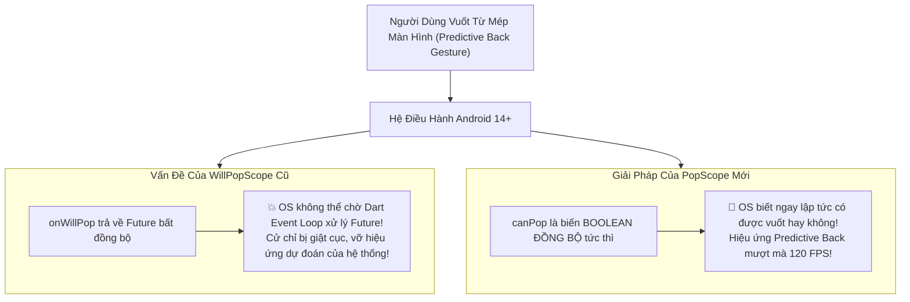

# Chuyên Đề 07 - Bài 02: Làm Chủ Nút Back Với PopScope (Thay Thế WillPopScope)

> **Trọng tâm**: Tại sao `WillPopScope` bị khai tử, Cơ chế cử chỉ quay lại dự đoán (Predictive Back Gesture) của Android 14+, Làm chủ API mới `PopScope` (`canPop`, `onPopInvokedWithResult`), Mẫu thiết kế "Nhấn Back lần nữa để thoát", và bộ câu hỏi phỏng vấn tuyển dụng top tech.

---

## 1. Tại Sao `WillPopScope` Bị Khai Tử Trong Flutter Hiện Đại?

Trong các phiên bản Flutter cũ, để chặn nút Back, lập trình viên sử dụng:

```dart
// ❌ CÁCH CŨ (Đã bị khai tử):
WillPopScope(
  onWillPop: () async => false, // Trả về Future<bool>
  child: Scaffold(...),
)
```

### Cuộc cách mạng Predictive Back Gesture của Android 14+:
Từ Android 14, Google giới thiệu cử chỉ **Quay lại dự đoán (Predictive Back)**: Khi người dùng vuốt từ cạnh màn hình vào trong, hệ điều hành Android sẽ **hé lộ trước một phần của màn hình phía sau** ngay khi ngón tay đang di chuyển, giúp người dùng quyết định nên vuốt tiếp để thoát hay thả tay ra để ở lại.



👉 Vì `onWillPop` là bất đồng bộ (`async`), nó không thể đồng bộ kịp thời với luồng dựng hình native của Android Window Manager. Do đó, **Google buộc phải khai tử `WillPopScope` và thay bằng `PopScope`**.

---

## 2. Giải Phẫu 2 Thuộc Tính Của `PopScope`

1. **`canPop` (Biến Boolean đồng bộ)**:
   - Báo cáo ngay lập tức cho hệ điều hành:
     - `true`: Cho phép thoát màn hình bình thường.
     - `false`: Chặn đứng thao tác thoát (Hệ thống không cho pop).
2. **`onPopInvokedWithResult(bool didPop, Object? result)` (Callback)**:
   - Được gọi khi người dùng thực hiện cử chỉ Back hoặc bấm nút quay lại:
     - `didPop == true`: Thao tác thoát đã diễn ra thành công (khi `canPop: true`).
     - `didPop == false`: Thao tác thoát vừa bị chặn lại (khi `canPop: false`). Đây chính là thời điểm bạn mở Dialog cảnh báo hoặc hiển thị SnackBar!

---

## 3. Hai Mẫu Thiết Kế Kinh Điển Trong Thực Tế

### 3.1. Mẫu 1: Cảnh Báo "Dữ Liệu Chưa Được Lưu"
Khi người dùng đang nhập Form, nếu có thay đổi chưa lưu $\rightarrow$ chặn thoát và mở AlertDialog:

```dart
class FormEditorScreen extends StatefulWidget {
  const FormEditorScreen({super.key});

  @override
  State<FormEditorScreen> createState() => _FormEditorScreenState();
}

class _FormEditorScreenState extends State<FormEditorScreen> {
  bool _hasUnsavedChanges = false;

  Future<bool> _confirmDiscard() async {
    final shouldDiscard = await showDialog<bool>(
      context: context,
      builder: (ctx) => AlertDialog(
        title: const Text('Rời khỏi trang?'),
        content: const Text('Các thay đổi chưa lưu sẽ bị mất.'),
        actions: [
          TextButton(onPressed: () => Navigator.pop(ctx, false), child: const Text('Ở lại')),
          FilledButton(onPressed: () => Navigator.pop(ctx, true), child: const Text('Rời đi')),
        ],
      ),
    );
    return shouldDiscard ?? false;
  }

  @override
  Widget build(BuildContext context) {
    return PopScope(
      // 🌟 Nếu KHÔNG có thay đổi -> canPop = true (cho thoát ngay)
      // Nếu CÓ thay đổi -> canPop = false (chặn lại để hỏi)
      canPop: !_hasUnsavedChanges,
      onPopInvokedWithResult: (bool didPop, Object? result) async {
        if (didPop) return; // Đã thoát rồi thì không làm gì cả

        // Khi didPop == false (bị chặn): Mở Dialog xác nhận
        final discard = await _confirmDiscard();
        if (discard && context.mounted) {
          // Người dùng chấp nhận bỏ thay đổi -> Chủ động pop bằng code:
          Navigator.of(context).pop();
        }
      },
      child: Scaffold(
        appBar: AppBar(title: const Text('Chỉnh Sửa Hồ Sơ')),
        body: Center(
          child: SwitchListTile(
            title: const Text('Có dữ liệu chưa lưu?'),
            value: _hasUnsavedChanges,
            onChanged: (val) => setState(() => _hasUnsavedChanges = val),
          ),
        ),
      ),
    );
  }
}
```

---

### 3.2. Mẫu 2: "Nhấn Back Lần Nữa Để Thoát Ứng Dụng" (Double-Tap to Exit)

Rất phổ biến trên màn hình chính (`HomeScreen`):

```dart
class HomeScreen extends StatefulWidget {
  const HomeScreen({super.key});

  @override
  State<HomeScreen> createState() => _HomeScreenState();
}

class _HomeScreenState extends State<HomeScreen> {
  DateTime? _lastPressedTime;

  @override
  Widget build(BuildContext context) {
    return PopScope(
      canPop: false, // Luôn chặn pop mặc định của HomeScreen
      onPopInvokedWithResult: (bool didPop, Object? result) {
        if (didPop) return;

        final now = DateTime.now();
        // Nếu 2 lần bấm cách nhau dưới 2 giây -> Cho phép thoát app!
        if (_lastPressedTime != null && 
            now.difference(_lastPressedTime!) < const Duration(seconds: 2)) {
          // Thoát ứng dụng
          Navigator.of(context).pop();
        } else {
          _lastPressedTime = now;
          ScaffoldMessenger.of(context).showSnackBar(
            const SnackBar(
              content: Text('Nhấn Back lần nữa để thoát ứng dụng'),
              duration: Duration(seconds: 2),
            ),
          );
        }
      },
      child: const Scaffold(
        body: Center(child: Text('Trang Chủ Ứng Dụng')),
      ),
    );
  }
}
```

---

## 🎯 Góc Phỏng Vấn Tuyển Dụng (Google & Top Tech Interview Q&A)

### Câu hỏi 1: Tại sao Google lại khai tử `WillPopScope` từ Flutter 3.12+ và thay thế hoàn toàn bằng `PopScope`? Cơ chế Predictive Back Gesture của Android 14+ ảnh hưởng như thế nào đến quyết định kiến trúc này?

#### 🎯 Điểm Đánh Giá Benchmark 10/10:
1. **Sự bế tắc kiến trúc của `WillPopScope`**:
   - `WillPopScope` sử dụng hàm callback `onWillPop` trả về một `Future<bool>`.
   - Trong kiến trúc hệ điều hành Android 14+, cử chỉ Predictive Back đòi hỏi một cam kết đồng bộ (Synchronous Contract). Khi người dùng bắt đầu vuốt ngón tay từ mép màn hình, Window Manager của hệ điều hành phải biết **ngay tại frame đầu tiên** là ứng dụng có cho phép hiển thị hoạt họa thu nhỏ cửa sổ hay không.
   - Vì `onWillPop` là một Task bất đồng bộ phải xếp hàng trong Dart Event Loop, hệ điều hành không thể đứng chờ Dart thread trả lời trong khi cử chỉ vật lý của người dùng đang vuốt trên màn hình. Điều này phá vỡ hoàn toàn cử chỉ Predictive Back của Android.
2. **Cải tiến của `PopScope`**:
   - `PopScope` chuyển quyền kiểm soát sang một thuộc tính **đồng bộ thuần túy**: `canPop: bool`.
   - Bất cứ khi nào cây widget build lại, giá trị boolean này được truyền trực tiếp xuống tầng Engine và báo cho hệ điều hành biết trước trạng thái. Nhờ đó, Android OS có thể chủ động render hoạt họa quay lại dự đoán mượt mà 120 FPS mà không có bất kỳ độ trễ nào.

---

### Câu hỏi 2: Phân tích chi tiết 2 tham số của callback `onPopInvokedWithResult(bool didPop, Object? result)`. Tại sao bạn luôn phải kiểm tra điều kiện `if (didPop) return;` trước khi thực hiện logic nghiệp vụ bên trong hàm này?

#### 🎯 Điểm Đánh Giá Benchmark 10/10:
1. **Ý nghĩa của 2 tham số**:
   - `didPop`: Biến boolean cho biết trạng thái thực tế của route:
     - `true`: Màn hình đã thực sự được pop khỏi cây điều hướng (xảy ra khi `canPop: true`).
     - `false`: Màn hình vừa bị ngăn chặn không cho pop (xảy ra khi `canPop: false`).
   - `result`: Dữ liệu trả về (Return Value) được đính kèm trong thao tác pop (ví dụ: `Navigator.pop(context, 'saved_data')`).
2. **Tại sao luôn phải kiểm tra `if (didPop) return;`**:
   - Khi `canPop: true`, người dùng bấm Back $\rightarrow$ Màn hình đã được pop thành công và đang trong quá trình unmount khỏi cây widget. Lúc này `onPopInvokedWithResult` vẫn được kích hoạt với `didPop == true`.
   - Nếu bạn quên kiểm tra `if (didPop) return;` và viết code mở một `showDialog()`, thì ngay sau khi màn hình vừa biến mất, dialog sẽ bất ngờ bật lên trên màn hình phía sau một cách vô lý!
   - Vì vậy, việc kiểm tra `if (didPop) return;` là điều kiện tiên quyết để đảm bảo logic cảnh báo (hiển thị Dialog hoặc SnackBar) **chỉ được kích hoạt khi thao tác pop thực sự bị chặn lại**.

---

### Câu hỏi 3: Trong trường hợp một màn hình có nhiều widget con cùng lồng các `PopScope` khác nhau (Nested PopScopes), Flutter giải quyết quyền quyết định `canPop` như thế nào?

#### 🎯 Điểm Đánh Giá Benchmark 10/10:
1. **Cơ chế tổng hợp (Logical AND)**:
   - Trong một `ModalRoute`, có thể có nhiều widget `PopScope` được khai báo ở các nhánh con khác nhau (ví dụ: một `PopScope` ở cấp độ trang và một `PopScope` khác bên trong một tab hoặc một Form con).
   - Flutter tổng hợp tất cả các `PopScope` đang active trên Route hiện tại thông qua logic toán học:
     $$\text{Route CanPop} = \text{PopScope}_1.\text{canPop} \land \text{PopScope}_2.\text{canPop} \land \dots \land \text{PopScope}_n.\text{canPop}$$
2. **Quy tắc thực thi**:
   - Chỉ cần **có ít nhất một `PopScope`** có giá trị `canPop == false`, toàn bộ màn hình sẽ bị chặn lại không thể thoát.
   - Tất cả các `PopScope` trên route đó sẽ cùng nhận được callback `onPopInvokedWithResult(didPop: false, result)` để tự xử lý logic tương ứng của nhánh mình.
