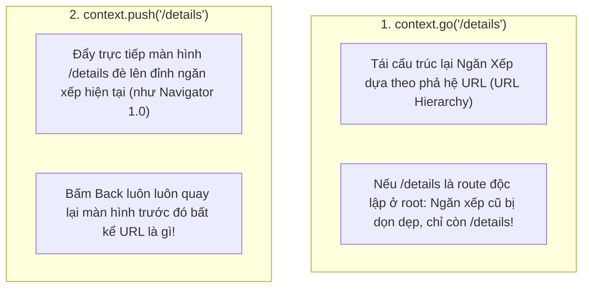

# Chuyên Đề 07 - Bài 03: Điều Hướng Khai Báo Với GoRouter (Chuẩn Google)

> **Trọng tâm**: Bản chất điều hướng khai báo (Declarative Routing), Phân biệt kinh điển `context.go()` vs `context.push()`, Bảo tồn trạng thái đa nhánh với `StatefulShellRoute.indexedStack`, Hệ thống Route Guards phản ứng tự động với `refreshListenable`, và bộ câu hỏi phỏng vấn tuyển dụng top tech.

---

## 1. Cuộc Cách Mạng Điều Hướng Khai Báo (Declarative Routing)

Trước đây, `Navigator 1.0` điều hướng theo phong cách mệnh lệnh (Imperative): Bạn ra lệnh "Đẩy màn hình B lên trên màn hình A".  
Trong khi đó, **`go_router`** (thư viện chính thức được Google Flutter Team bảo trợ) hoạt động theo mô hình **Khai Báo (Declarative)**:
- **URL chính là Chân Lý Duy Nhất (Single Source of Truth)**.
- Ngăn xếp màn hình là hình chiếu tự nhiên của cấu trúc URL.
- Dù người dùng mở app qua Deep Link, click link trên Web, hay bấm nút trong app, chỉ cần cung cấp URL `/users/12/orders/45`, Flutter sẽ tự động dựng đúng cây màn hình tương ứng!

---

## 2. Trọng Tâm Phỏng Vấn: `context.go()` vs `context.push()`

Đây là câu hỏi xuất hiện trong 90% các buổi phỏng vấn tuyển dụng Flutter Senior:



| Tiêu Chí Đánh Giá | `context.go(location)` | `context.push(location)` |
| :--- | :--- | :--- |
| **Bản chất hoạt động** | **Khai báo (Declarative)**: Dựng lại ngăn xếp theo cấu trúc cây URL đã định nghĩa trong `routes`. | **Mệnh lệnh (Imperative)**: Đẩy thẳng một Route mới đè lên đỉnh ngăn xếp hiện tại. |
| **Hành vi nút Back** | Nút Back trên AppBar chỉ xuất hiện nếu route đó là **route con (Sub-route)** của route cha trong cấu trúc `GoRoute`. | Nút Back **luôn luôn xuất hiện** để pop về màn hình vừa gọi lệnh push. |
| **Ứng dụng chuẩn** | Điều hướng luồng chính của app (Đăng nhập $\rightarrow$ Trang chủ, Chuyển các Tab chính). | Mở các màn hình phụ trợ tạm thời (Xem ảnh phóng to, Mở trang cài đặt từ một popup). |

---

## 3. Duy Trì Bottom Navigation Bar Với `StatefulShellRoute`

Trong các ứng dụng lớn (Shopee, Spotify), người dùng chuyển qua lại giữa các tab ở BottomBar không bao giờ muốn bị mất vị trí cuộn trang hay dữ liệu form đang nhập dở.

### So sánh: `ShellRoute` vs `StatefulShellRoute`
- **`ShellRoute` (Thông thường)**: Mỗi khi đổi URL sang tab khác, nội dung tab cũ bị `dispose()` và tab mới bị build lại từ đầu.
- **`StatefulShellRoute.indexedStack` (Chuẩn Google)**: Lưu giữ toàn bộ các nhánh (`StatefulShellBranch`) trong một `IndexedStack`. Mỗi nhánh sở hữu một ngăn xếp lịch sử điều hướng hoàn toàn độc lập!

```dart
final GoRouter appRouter = GoRouter(
  initialLocation: '/home',
  routes: [
    StatefulShellRoute.indexedStack(
      builder: (context, state, navigationShell) {
        return Scaffold(
          body: navigationShell, // Tự động hoán đổi giữa các nhánh mà không mất State
          bottomNavigationBar: NavigationBar(
            selectedIndex: navigationShell.currentIndex,
            onDestinationSelected: (index) {
              // 🌟 Chuyển nhánh mượt mà
              navigationShell.goBranch(
                index,
                // Nếu bấm lại vào tab đang đứng -> tự động cuộn về đầu trang (initialLocation)
                initialLocation: index == navigationShell.currentIndex,
              );
            },
            destinations: const [
              NavigationDestination(icon: Icon(Icons.home), label: 'Trang chủ'),
              NavigationDestination(icon: Icon(Icons.shopping_cart), label: 'Giỏ hàng'),
              NavigationDestination(icon: Icon(Icons.person), label: 'Cá nhân'),
            ],
          ),
        );
      },
      branches: [
        // Nhánh 1: Trang Chủ (có thể chứa các sub-routes con của Trang Chủ)
        StatefulShellBranch(
          routes: [
            GoRoute(
              path: '/home',
              builder: (context, state) => const HomeFeedView(),
              routes: [
                GoRoute(
                  path: 'detail/:id',
                  builder: (context, state) => ItemDetailView(id: state.pathParameters['id']!),
                ),
              ],
            ),
          ],
        ),
        // Nhánh 2: Giỏ Hàng
        StatefulShellBranch(
          routes: [
            GoRoute(path: '/cart', builder: (context, state) => const CartView()),
          ],
        ),
        // Nhánh 3: Cá Nhân
        StatefulShellBranch(
          routes: [
            GoRoute(path: '/profile', builder: (context, state) => const ProfileView()),
          ],
        ),
      ],
    ),
  ],
);
```

---

## 4. Route Guards Phản Ứng Tự Động Với `refreshListenable`

Để bảo vệ các màn hình nhạy cảm mà không cần phải viết code kiểm tra đăng nhập rải rác:

```dart
class AuthService extends ChangeNotifier {
  bool _isLoggedIn = false;
  bool get isLoggedIn => _isLoggedIn;

  void login() {
    _isLoggedIn = true;
    notifyListeners(); // 🌟 Báo cho GoRouter biết để tự động chuyển trang!
  }

  void logout() {
    _isLoggedIn = false;
    notifyListeners();
  }
}

final authService = AuthService();

final GoRouter protectedRouter = GoRouter(
  // 🌟 Lắng nghe sự thay đổi trạng thái đăng nhập:
  refreshListenable: authService,
  initialLocation: '/home',
  
  // Hàm redirect tự động chạy lại mỗi khi authService phát tín hiệu:
  redirect: (BuildContext context, GoRouterState state) {
    final loggedIn = authService.isLoggedIn;
    final isGoingToLogin = state.matchedLocation == '/login';

    // 1. Chưa đăng nhập mà cố vào bất kỳ trang nào khác -> Ép về /login
    if (!loggedIn && !isGoingToLogin) {
      return '/login';
    }

    // 2. Đã đăng nhập rồi mà vẫn đứng ở /login -> Đẩy vào /home
    if (loggedIn && isGoingToLogin) {
      return '/home';
    }

    return null; // Tuyến đường hợp lệ
  },
  routes: [
    GoRoute(path: '/login', builder: (context, state) => const LoginView()),
    GoRoute(path: '/home', builder: (context, state) => const HomeView()),
  ],
);
```

---

## 🎯 Góc Phỏng Vấn Tuyển Dụng (Google & Top Tech Interview Q&A)

### Câu hỏi 1: Phân tích sự khác biệt cốt lõi giữa `context.go()` và `context.push()` trong `go_router`. Điều gì xảy ra với ngăn xếp Route (Navigation Stack) và nút Back trong từng trường hợp?

#### 🎯 Điểm Đánh Giá Benchmark 10/10:
1. **`context.go(location)` (Mô hình Khai báo - Declarative)**:
   - **Hành vi ngăn xếp**: Phân tích đường dẫn `location` dựa trên cây phả hệ route đã khai báo trong `routes`. Nó thay thế toàn bộ ngăn xếp hiện tại bằng chuỗi các màn hình từ gốc (`/`) đến `location`.
   - **Nút Back**: Chỉ xuất hiện nếu route đích được định nghĩa là **route con lồng bên trong (Sub-route)** của route cha trong cấu hình `GoRoute`. Nếu bạn nhảy giữa 2 route ngang hàng (ví dụ từ `/feed` sang `/profile`), nút Back sẽ không xuất hiện vì `/feed` đã bị gỡ khỏi ngăn xếp.
2. **`context.push(location)` (Mô hình Mệnh lệnh - Imperative)**:
   - **Hành vi ngăn xếp**: Giữ nguyên toàn bộ ngăn xếp hiện tại và đẩy thẳng route mới lên đỉnh ngăn xếp (tương đương `Navigator.push` của Navigator 1.0).
   - **Nút Back**: Luôn luôn xuất hiện trên AppBar để cho phép người dùng pop màn hình vừa được push và quay lại đúng màn hình trước đó, bất kể 2 route này có mối quan hệ cha con trong URL hay không.
3. **Kết luận kiến trúc**:
   - Dùng `go()` cho các luồng điều hướng chính, chuyển tab, deep link.
   - Dùng `push()` khi muốn mở các màn hình tạm thời dạng modal hoặc chi tiết mà bắt buộc người dùng bấm Back phải quay lại đúng vị trí đang đứng.

---

### Câu hỏi 2: `StatefulShellRoute` trong `go_router` giải quyết bài toán Bottom Navigation Bar tốt hơn `ShellRoute` thông thường như thế nào? Cơ chế quản lý trạng thái của các `StatefulShellBranch` hoạt động ra sao?

#### 🎯 Điểm Đánh Giá Benchmark 10/10:
1. **Hạn chế của `ShellRoute` thông thường**:
   - `ShellRoute` chỉ đơn giản là bọc một widget khung (UI Shell) quanh các route con.
   - Khi người dùng đổi đường dẫn từ `/tab1` sang `/tab2`, route con cũ bị tiêu hủy (unmounted/disposed). Khi quay lại `/tab1`, toàn bộ State, dữ liệu đang nhập và vị trí cuộn của danh sách trong Tab 1 bị mất sạch và phải tải lại từ đầu.
2. **Cơ chế vượt trội của `StatefulShellRoute`**:
   - `StatefulShellRoute` chia các tuyến đường thành các nhánh độc lập (**`StatefulShellBranch`**).
   - Mỗi branch sở hữu một `Navigator` riêng biệt với ngăn xếp lịch sử điều hướng riêng.
   - Khi sử dụng biến thể `StatefulShellRoute.indexedStack`, tất cả các nhánh được giữ song song trong một `IndexedStack`. Khi người dùng chuyển tab:
     - Các tab ẩn chỉ bị tắt hiển thị nhưng vẫn tồn tại trọn vẹn trong bộ nhớ.
     - Vị trí cuộn trang, dữ liệu form nhập dở được bảo tồn 100%.
     - Thậm chí, nếu trong Tab 1 người dùng đã điều hướng sâu tới màn hình con thứ 3 (`/tab1/sub1/sub2`), thì khi chuyển sang Tab 2 rồi quay lại Tab 1, họ vẫn đứng ở đúng màn hình con thứ 3 đó!

---

### Câu hỏi 3: Làm thế nào để xây dựng một hệ thống Route Guard (bảo vệ màn hình yêu cầu đăng nhập) hoàn toàn phản ứng (Reactive) với `go_router` bằng thuộc tính `refreshListenable` mà không cần gọi lệnh chuyển trang thủ công?

#### 🎯 Điểm Đánh Giá Benchmark 10/10:
1. **Nguyên lý của `refreshListenable`**:
   - `GoRouter` chấp nhận một đối tượng `Listenable` (chẳng hạn như `ChangeNotifier`, `ValueNotifier`, hoặc stream controller được bọc lại).
   - Bất kỳ khi nào `Listenable` này phát tín hiệu (`notifyListeners()`), `GoRouter` sẽ tự động kích hoạt lại hàm `redirect(context, state)` trên toàn bộ hệ thống.
2. **Triển khai kiến trúc Reactive Route Guard**:
   - Quản lý trạng thái xác thực trong một `AuthNotifier extends ChangeNotifier` (chứa các biến: `isLoggedIn`, `isTokenExpired`).
   - Truyền `refreshListenable: authNotifier` vào constructor của `GoRouter`.
   - Trong hàm `redirect`:
     ```dart
     redirect: (context, state) {
       final isAuth = authNotifier.isLoggedIn;
       final isLoggingIn = state.matchedLocation == '/login';
       if (!isAuth && !isLoggingIn) return '/login';
       if (isAuth && isLoggingIn) return '/home';
       return null;
     }
     ```
3. **Lợi ích kiến trúc**:
   - **Loại bỏ hoàn toàn việc gọi `context.go('/login')` rải rác**: Khi token hết hạn (ví dụ từ một Dio Interceptor bắt lỗi 401), bạn chỉ cần gọi `authNotifier.logout()`. `GoRouter` sẽ tự động phản ứng và đá người dùng về trang Đăng nhập ngay lập tức một cách thanh lịch và tập trung.
