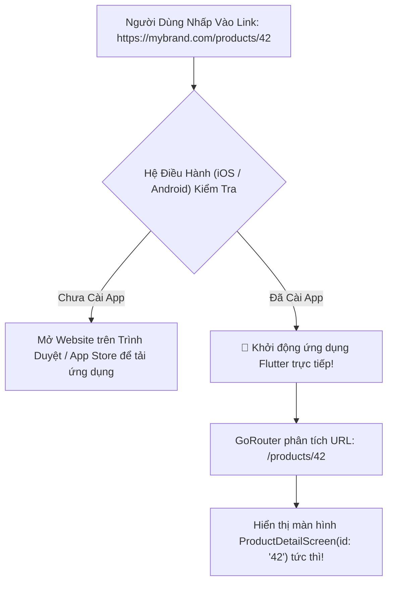

# Chuyên Đề 07 - Bài 04: Deep Linking (App Links / Universal Links) & Xử Lý URL Web

> **Trọng tâm**: Bản chất của Deep Linking, So sánh Custom URL Scheme vs App Links (Android) & Universal Links (iOS), Cạm bẫy truyền dữ liệu qua tham số `extra` trong GoRouter, Tối ưu URL Web với `usePathUrlStrategy()`, Cấu hình máy chủ chống lỗi 404, và bộ câu hỏi thẩm định năng lực kỹ thuật chuyên sâu.

---

## 1. Bản Chất Của Deep Linking: Mở Thẳng Màn Hình Con Từ Bên Ngoài

Deep Linking là kỹ thuật cho phép một đường liên kết (URL) từ bên ngoài ứng dụng (từ Email, Tin nhắn SMS, Bài viết Facebook, hoặc Website) có thể:
1. Đánh thức ứng dụng Flutter đang đóng hoặc đang chạy ngầm.
2. Tự động điều hướng người dùng thẳng tới màn hình đích tương ứng (ví dụ: Trang chi tiết sản phẩm `#42`).



---

## 2. Đối Chiếu: Custom URL Scheme vs App Links / Universal Links

| Tiêu Chí Đánh Giá | Custom URL Scheme (`myapp://...`) | App Links (Android) & Universal Links (iOS) |
| :--- | :--- | :--- |
| **Cú pháp liên kết** | `tiki://products/123`, `fb://profile` | Chuẩn HTTPS: `https://tiki.vn/products/123` |
| **Tính bảo mật** | ❌ **Rất kém (Dễ bị tấn công giả mạo App Hijacking)**: Bất kỳ ứng dụng độc hại nào trên máy cũng có thể đăng ký cùng scheme `myapp://` để cướp link! | 🛡️ **Bảo mật tuyệt đối**: Xác thực thông qua chứng chỉ số liên kết hai chiều giữa App và Tên miền Website. |
| **Hành vi khi chưa cài App** | Báo lỗi đường link không hợp lệ trên trình duyệt. | Tự động mở trang Web mua sắm bình thường mà không hề báo lỗi! |
| **Hộp thoại xác nhận** | Android thường hiện hộp thoại: "Mở bằng Chrome hay App?". | Mở thẳng ứng dụng ngay lập tức mà **không hỏi hộp thoại nào**. |

---

## 3. Cấu Hình Xác Thực Hai Chiều Chuẩn Google & Apple

Để hệ điều hành cho phép mở link HTTPS thẳng vào app:

### 3.1. Phía Android (App Links):
Đặt file xác thực chứng chỉ SHA-256 tại địa chỉ:  
`https://yourdomain.com/.well-known/assetlinks.json`

```json
[
  {
    "relation": ["delegate_permission/common.handle_all_urls"],
    "target": {
      "namespace": "android_app",
      "package_name": "com.example.myapp",
      "sha256_cert_fingerprints": [
        "14:6D:E9:7D:0F:52:CC:54:1E:EF:4A:22:53:72:B2:CC:25:05:4E:0D:37:90:3B:05:EB:42:00:14:4E:18:24:E8"
      ]
    }
  }
]
```

### 3.2. Phía iOS (Universal Links):
Đặt file định danh App ID tại địa chỉ:  
`https://yourdomain.com/.well-known/apple-app-site-association`

```json
{
  "applinks": {
    "apps": [],
    "details": [
      {
        "appID": "TEAM_ID.com.example.myapp",
        "paths": ["/products/*", "/orders/*"]
      }
    ]
  }
}
```

---

## 4. Cạm Bẫy Chết Người: Lạm Dụng Tham Số `extra` Trong GoRouter

Rất nhiều bạn truyền cả đối tượng dữ liệu phức tạp qua `extra`:

```dart
// ❌ CẠM BẪY NGUY HIỂM:
context.go('/detail', extra: productObject);
```

### Tại sao đây là lỗi thiết kế nghiêm trọng?
- Khi điều hướng nội bộ trong app: Code chạy rất mượt.
- **NHƯNG**: Khi người dùng nhấn **F5 F5 Reload trang trên Web**, hoặc khi người dùng **mở app từ một Deep Link**:
  $$\text{state.extra} == \mathbf{null} \rightarrow \mathbf{CRASH!}$$
- Lý do: Một đường link Deep Link chỉ là một chuỗi văn bản (`https://mybrand.com/detail/42`), nó **hoàn toàn không thể chứa một đối tượng Dart Object trong bộ nhớ RAM**!

### ✅ Chuẩn Kiến Trúc Google:
Chỉ truyền mã định danh duy nhất (ID) trên URL Path Parameter, và nạp dữ liệu từ Local Cache hoặc API:

```dart
GoRoute(
  path: '/products/:id',
  builder: (context, state) {
    final productId = state.pathParameters['id']!;
    // Nạp dữ liệu từ Repository (có cache sẵn trong RAM):
    return ProductDetailScreen(productId: productId);
  },
)
```

---

## 5. Tối Ưu Hóa URL Web: Loại Bỏ Dấu Thăng `#` (`usePathUrlStrategy`)

Mặc định, Flutter Web sử dụng chiến lược băm URL dạng `myapp.com/#/home`.  
Để có đường link chuẩn SEO và chuyên nghiệp như các website hiện đại:

```dart
import 'package:flutter_web_plugins/url_strategy.dart';

void main() {
  // 🌟 Loại bỏ dấu thăng '#' khỏi URL: myapp.com/#/home -> myapp.com/home
  usePathUrlStrategy();
  runApp(const MyApp());
}
```

> [!CAUTION]
> **Cấu hình máy chủ Web (Server Rewrite Rule chống lỗi 404)**:  
> Khi bỏ dấu `#`, nếu người dùng truy cập trực tiếp `myapp.com/products/42`, máy chủ web (Nginx/Firebase) sẽ tìm thư mục vật lý `products/42` và trả về lỗi **404 Not Found**!  
> Bạn bắt buộc phải cấu hình máy chủ điều hướng mọi request về file **`index.html`** để Flutter Engine tự đảm nhận việc routing:
> ```nginx
> # Cấu hình mẫu trên Nginx:
> location / {
>   try_files $uri $uri/ /index.html;
> }
> ```

---

## 6. Lệnh Kiểm Thử Deep Link Qua CLI (Dành Cho Tester & CI/CD)

### Kiểm thử trên Android (ADB):
```bash
adb shell am start -W -a android.intent.action.VIEW \
  -d "https://yourdomain.com/products/105" com.example.myapp
```

### Kiểm thử trên iOS Simulator:
```bash
xcrun simctl openurl booted "https://yourdomain.com/products/105"
```

---

## 🎯 Thẩm Định Năng Lực & Phân Tích Chuyên Sâu (Technical Competency & Deep Dive)

### Câu hỏi 1: Phân biệt Custom URL Scheme (`myapp://...`) và App Links (Android) / Universal Links (iOS). Tại sao các ứng dụng tài chính và thương mại điện tử hiện đại bắt buộc phải dùng App Links / Universal Links?

#### 🎯 Điểm Đánh Giá Benchmark 10/10:
1. **Bản chất của Custom URL Scheme**:
   - Khai báo một giao thức tùy biến trong file Manifest/Info.plist (ví dụ: `mybank://transfer`).
   - Nhược điểm chí mạng: **Không có cơ chế xác minh quyền sở hữu (Lack of Verification)**. Bất kỳ một app giả mạo nào khác trên cùng thiết bị cũng có thể đăng ký cùng scheme `mybank://`. Khi đó, hệ điều hành sẽ hiển thị hộp thoại phân vân hoặc nguy hiểm hơn là chuyển tiếp link chứa thông tin giao dịch nhạy cảm sang app độc hại (App Hijacking).
2. **Bản chất của App Links (Android) và Universal Links (iOS)**:
   - Sử dụng định dạng URL web chuẩn giao thức HTTPS bảo mật (`https://mybank.com/transfer`).
   - **Xác thực mật mã học 2 chiều**: Khi cài đặt app, hệ điều hành sẽ tự động tải file cấu hình `assetlinks.json` hoặc `apple-app-site-association` từ domain của máy chủ web về để đối chiếu mã vân tay chứng chỉ ký app (Certificate Fingerprint / Team ID).
   - Chỉ khi nào chứng chỉ trên thiết bị khớp 100% với chữ ký trên máy chủ, hệ điều hành mới cho phép app mở link trực tiếp. Điều này loại bỏ hoàn toàn nguy cơ giả mạo liên kết, bảo vệ an toàn tuyệt đối cho người dùng ngân hàng và sàn thương mại điện tử.

---

### Câu hỏi 2: Tại sao việc lạm dụng thuộc tính `extra` trong `GoRouter` để truyền các đối tượng dữ liệu phức tạp (Complex Objects) lại bị coi là một cạm bẫy thiết kế nguy hiểm khi hỗ trợ Web và Deep Linking? Giải pháp thay thế chuẩn kiến trúc là gì?

#### 🎯 Điểm Đánh Giá Benchmark 10/10:
1. **Bản chất của tham số `extra`**:
   - `extra` là một trường tạm thời lưu trữ đối tượng Dart trong bộ nhớ heap của tiến trình ứng dụng.
   - Nó chỉ hoạt động trơn tru trong kịch bản điều hướng nội bộ trong một phiên chạy duy nhất (Single Session in-app navigation).
2. **Cạm bẫy khi ứng dụng mở rộng sang Web và Deep Linking**:
   - **Kịch bản Web**: Người dùng nhấn Reload (F5) hoặc sao chép URL gửi cho bạn bè. Toàn bộ bộ nhớ heap của JavaScript/Wasm bị reset. `state.extra` trở thành `null` $\rightarrow$ Màn hình đích gọi `state.extra as Product` sẽ ném ngoại lệ Null Pointer Exception và sập trang trắng xóa.
   - **Kịch bản Deep Linking / Notification**: Ứng dụng được đánh thức từ một URL bên ngoài. URL chỉ là một chuỗi ký tự, hoàn toàn không có đối tượng `extra` nào đi kèm.
3. **Giải pháp kiến trúc chuẩn Google**:
   - Tuân thủ nguyên lý **"URL is the Single Source of Truth"**.
   - Chỉ truyền các định danh nguyên thủy (ID/Slug) thông qua `pathParameters` hoặc `queryParameters` (ví dụ: `/products/:id`).
   - Màn hình đích sẽ sử dụng `id` này để truy xuất dữ liệu từ Local Database, Repository Cache, hoặc gọi API nếu chưa có sẵn trong bộ nhớ.

---

### Câu hỏi 3: Làm thế nào để loại bỏ dấu thăng (`#`) trên thanh địa chỉ URL của Flutter Web bằng `usePathUrlStrategy()`? Phía máy chủ Web (Nginx, Firebase Hosting, Cloudflare) cần cấu hình những gì để người dùng khi F5 lại trang không bị lỗi 404 Not Found?

#### 🎯 Điểm Đánh Giá Benchmark 10/10:
1. **Loại bỏ dấu `#` bằng `usePathUrlStrategy()`**:
   - Mặc định, Flutter Web dùng `HashUrlStrategy` (sử dụng URL hash dạng `domain.com/#/path`) vì cơ chế này không đòi hỏi bất kỳ cấu hình nào ở phía máy chủ web.
   - Để chuyển sang đường dẫn chuẩn HTML5 History API (`domain.com/path`), gọi hàm `usePathUrlStrategy()` trong hàm `main()` trước khi chạy `runApp()`.
2. **Nguyên nhân sinh ra lỗi 404 khi người dùng F5**:
   - Khi có dấu `#`, trình duyệt gửi request về server chỉ với domain gốc `domain.com/`, phần phía sau dấu `#` được trình duyệt giữ lại cho phía client xử lý.
   - Khi bỏ dấu `#`, người dùng F5 tại trang `domain.com/profile`, trình duyệt sẽ gửi thẳng HTTP GET request lên máy chủ yêu cầu tài nguyên `/profile`. Máy chủ web tìm kiếm thư mục vật lý hoặc tệp `/profile` không thấy, dẫn đến mã lỗi `404 Not Found`.
3. **Cấu hình máy chủ chuẩn (Single Page Application - SPA Rewrite Rule)**:
   - Cấu hình máy chủ web để **chuyển hướng tất cả các request không phải là tệp tĩnh (static files: js, css, png) quay trở về `index.html`**:
     - **Trên Nginx**:
       ```nginx
       location / {
         try_files $uri $uri/ /index.html;
       }
       ```
     - **Trên Firebase Hosting (`firebase.json`)**:
       ```json
       "hosting": {
         "rewrites": [ { "source": "**", "destination": "/index.html" } ]
       }
       ```
   - Khi máy chủ trả về `index.html`, mã nguồn Flutter Engine sẽ khởi chạy, đọc đường dẫn `/profile` từ thanh địa chỉ và dựng đúng màn hình tương ứng.
